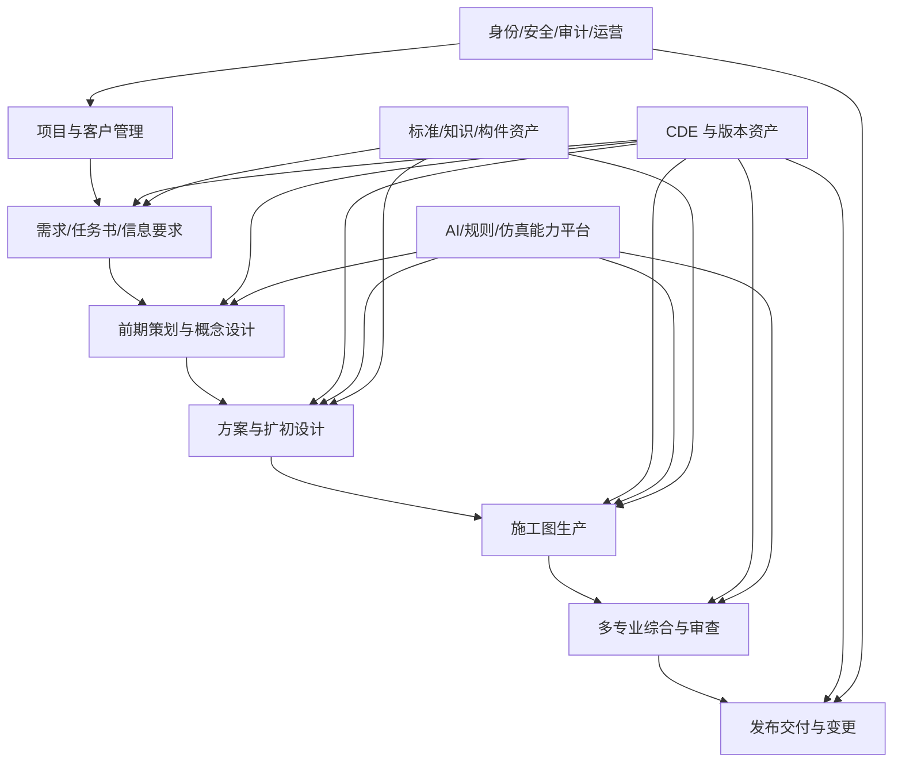
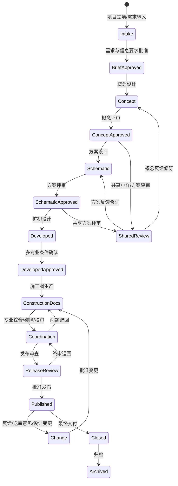

# D00 执行摘要与初稿保留区

> 来源：@design/INDEX.md | 创建：2026-07-22 | 更新：2026-07-22
> 原始行范围：1–998
> 引用约定：同文件内引用使用 §编号，跨文件引用使用 @design/文件名.md

# 文档权威性说明

本文是“施工图全流程 AI 平台”的唯一设计正文。开篇“初稿保留区”记录原始方案的形成背景；自“需求澄清”起的总体设计以及 D01–D46 详细设计是当前权威基线。若初稿措辞与详细设计冲突，以编号更高、依赖更后的 Dxx 决策为准；任何实现期 OpenAPI、Schema、代码或测试产物均不得成为第二份产品设计正文。

# 执行摘要（初稿保留区）

本方案建设覆盖前期策划、概念、方案、扩初、施工图、多专业协同、审查、发布交付、变更与归档的**施工图全流程 AI 平台**，利用 AI 提升效率和质量但不替代专业审签。原始“境外主创草图到 CAD/BIM/分析/PPT”流程是第一条验证切片，不是平台范围上限。平台采用 CDE、持久化工作流、AI 能力网关、专业规则/分析和 CAD/BIM 连接器组成的云原生架构，支持 SaaS、私有化与混合部署；IFC、IDS、BCF 分别承担模型交换、信息要求验证和问题协同。详细设计已在本文 D01–D46 中统一定义能力、流程、数据、接口、界面、安全、运维和验收，不创建附属设计正文。

# 项目目标与范围

- **建筑类型与场景**：由于题目未指定具体建筑类别，可考虑典型场景：如**住宅建筑**（公寓楼、别墅）、**办公楼/商业建筑**、**工业厂房/仓库**、**学校/医院等公共建筑**。不同类型对功能需求（居住、办公、生产、教育、医疗）、结构形式（框架、筒体、钢结构）、机电系统要求（暖通、消防、电力）等差异很大，需要在方案中予以区分。例如医疗建筑需严格按无障碍和净化等级设计，工业建筑则需考虑大跨度结构和厂房物流通道等。 

- **规模与复杂度**：规模从小型单体（几千平米）到大型综合体（上百万平米）不等。大规模项目数据量大、专业协同需求高，对系统的**扩展性**、**多专业协同**以及**版本控制**提出更高要求。小规模项目可以简化流程，快速原型验证。

- **法规区域**：针对不同**法规区域**（如中国、美国、欧盟、澳大利亚、中东等），建筑规范和审批流程差异显著。需支持多语种（中文/英文等）和多套规范（如中国《建筑规范》、美国IBC/ADA、欧盟标准等），并在AI能力中集成不同规范检查。建议在需求分析阶段识别项目所在地法规，并配置对应的合规模块。不同气候带的能耗模拟参数也不同，应在仿真阶段灵活切换。  
   
- **影响分析**：以上场景的不同会影响技术方案选型。例如欧美项目可能更依赖Revit/BIM规范，中国项目可能使用天正、广联达等国产软件。法规差异要求在语义理解和自动审核阶段分别加载不同的规则集。复杂公共建筑需细化到机电深化阶段，而简单住宅可以在方案设计阶段输出较完整构件模型。  

总之，本方案将保持参数化设计，可根据项目类型、规模和地域需求灵活调整，同时文档中明确标注所有未指定参数（如建筑类型、地区、预算）并提出可选建议。

# 技术架构

为支持多变的业务需求和高并发的AI推理，建议采用**微服务架构+云原生部署**，并结合按需扩缩容的策略。架构示例如下：  

```mermaid
flowchart LR
    subgraph 前端用户
        Designer[设计师界面]
        Client[客户界面]
    end
    subgraph AI服务集群
        Auth[认证/权限服务]
        LLM(LLM问答服务)
        ImgGen(文本-图像生成)
        FloorPlan(平面图识别)
        ParamDesign(参数化设计)
        Clash(碰撞检测服务)
        SimEngine(仿真引擎)
        ModelStore[模型存储与管理]
    end
    subgraph 数据平台
        CDE[云端CDE (BIM模型库)]
        DWGRepo[CAD图纸仓库]
        GISData[GIS数据存储]
        LogDB[日志/审计数据库]
    end
    Designer -->|提交需求| LLM
    Designer -->|上传草图| FloorPlan
    LLM --> ModelStore
    FloorPlan --> ModelStore
    ParamDesign --> ModelStore
    SimEngine --> ModelStore
    ModelStore --> CDE
    CDE --> Designer
    CDE -->|触发模拟| SimEngine
    Auth --> LLM
    Auth --> SimEngine
    LogDB --> Auth
    LogDB --> ModelStore
```

- **微服务 vs 单体**：微服务将系统拆分为独立服务（如LLM问答、图像生成、碰撞检测等），每个服务可独立部署和扩容，避免单体应用难以扩展和维护的问题。服务间通过轻量级REST/gRPC等接口通信，有助于跨团队并行开发和快速迭代。  
- **云端/边缘**：主要计算密集型任务（模型训练、复杂仿真、批量推理）部署在云端集群（如Kubernetes托管GPU节点），以保证高算力和可扩展性。可在局部提供Web前端或移动端应用实现边缘预览（如现场AR视图），但设计计算主服务仍在云端。  
- **数据存储**：采用**集中式数据环境 (CDE)** 管理项目模型和文档。所有BIM/CAD文件、设计输入（草图、法规文本）和输出（图纸、报告）存储在云数据库或对象存储中。使用版本控制（如Git或BIM 360）记录变更历史，确保多专业协同和回退追溯。  
- **模型托管与推理**：AI模型（如深度学习模型）采用容器化部署，可使用平台服务（如Kubeflow、SageMaker、Azure ML）进行模型管理。推理服务单独部署，以保证低延迟响应。根据负载使用自动伸缩（HPA）策略。  
- **CI/CD**：建立CI/CD流水线，对代码、模型和基础设施配置（Terraform/Helm）进行自动化测试和部署。利用模型注册中心和A/B测试框架逐步上线新模型，确保系统稳定。  
- **权限与审计**：集成统一身份认证（OAuth2/SAML），不同角色（客户、设计师、工程师）拥有不同访问权限。关键操作（如模型训练、代码生成）记录审计日志，满足责任追溯。  
- **可扩展性与高可用性**：通过Kubernetes集群跨可用区部署微服务，实现弹性伸缩和故障自愈。核心服务冗余部署，数据库和模型存储使用高可用配置（如分布式存储、主备模式），以提供企业级可靠性。

# 设计工具选型与对接方案

| 工具/平台 | 主要用途 | 文件格式 / API | 对接方案 |
|---|---|---|---|
| **Revit (BIM)** | 建筑信息模型构建、施工图生成 | RVT原生、IFC、Revit API (C#/.NET) | 通过IFC与其他BIM软件交换数据；支持Dynamo脚本自动化；可开发Revit插件接入AI服务。 |
| **ArchiCAD (BIM)** | 建模、协同设计 | PLN原生、IFC、ArchiCAD API (C++) | 使用Graphisoft提供的IFC Exchange插件与Revit互联；通过IFC同步数据到CDE。 |
| **Rhino + Grasshopper** | 参数化形态设计、几何处理 | 3DM、GH脚本（Python/C#）、Rhino.Inside (Revit集成) | Rhino.Inside工具可将Grasshopper嵌入Revit，实现异构联动；Grasshopper脚本可直接驱动几何生成。 |
| **AutoCAD** | 传统CAD绘图 | DWG/DXF、AutoLISP/.NET API | 可通过导出DWG或DXF在其他软件中打开；通过IFC或Revit链接生成BIM模型。支持自动标注插件和批量处理脚本。 |
| **SketchUp** | 快速3D建模 | SKP、OBJ、GLTF（Web视图） | 提供Ruby API插件，可导出OBJ/GLTF用于Web可视化；与CDE无缝对接，可将SketchUp模型转换为BIM初稿。 |
| **GIS平台**<br>(如Esri ArcGIS) | 地理信息和场地分析 | Shapefile、GeoJSON、CityGML | 将场地边界、地形等GIS数据导入设计平台；使用Planary等工具实现GIS与BIM协同。 |
| **结构/MEP软件**<br>(ETABS、Tekla、Dynamo等) | 结构/设备分析与配合 | 各自原生格式、IFC | 利用IFC或XML接口，实现结构/机电模型与建筑模型互操作；自动碰撞检测通常在Navisworks或Solibri中执行。 |

- **文件格式**：核心采用开放标准**IFC**进行数据交换和存档。施工图采用DWG/DXF/PDF格式输出；可视化成果可输出OBJ/GLTF等轻量格式。  
- **双向同步策略**：在BIM工具间建立“热链接”机制。例如Rhino.Inside实现Grasshopper与Revit双向数据流；Revit-Archicad使用IFC实时交换模型。版本控制的CDE确保多人同时编辑时文件一致性。  
- **插件/中间件**：可开发自定义插件（Revit API、ArchiCAD API、Rhino插件等）将AI引擎集成进设计软件。例如，一个Revit插件可调用AI服务自动布局房间；中间件可将SketchUp模型自动转换并上传至BIM平台。  
- **对接示例**：使用Grasshopper脚本触发平台生成方案；用Python脚本控制Rhino几何；通过Rest API让CAD文件作为AI输入，生成注释后的DWG输出。所有关键系统间的数据互通尽可能使用标准格式（IFC、BCF）以降低兼容性风险。

# AI 能力清单与实现方式

- **生成式设计 (参数化拓扑优化)**：利用算法探索多种设计方案。可采用Rhino+Grasshopper实现参数化体量演变；或使用拓扑优化工具（如开源FreeCAD拓扑优化模块、OpenMDAO；商用则有Autodesk Forma、Dassault Generative Components等）。生成式设计能够快速生成数百至上千个方案，并通过算法筛选最优（如目标函数可包括日照最大化、结构自重最小化等）。需要**设计约束数据**（场地边界、高度限制、功能需求）作为输入。推理性能上，对复杂模拟优化需GPU/集群运算，交互式体验则可使用轻量化参数迭代（每个方案生成通常耗时数秒至十几秒）。  

- **图像/点云处理**：针对手绘草图、照片和激光扫描数据。**平面图识别**：结合计算机视觉与OCR，将扫描的平面图转换为结构化模型。CV模型可检测墙体、门窗、家具等对象并进行语义分割，OCR模型则识别标注文字和尺寸。**点云/三维重建**：使用多视角摄影测量、NeRF等技术将照片或无人机航拍生成3D模型；也可对激光雷达点云进行分类和拟合。所需模型包括深度学习物体检测（YOLO、Detectron2）和NeRF网络，训练数据需含建筑场景图片/点云。推理时一般在云端GPU执行，以支持大规模点云/图像处理。

- **语义理解（规范解析）**：采用大语言模型（如GPT-4、Claude、百度“文心一言”等）通过**检索+提示**或微调对话系统，实现建筑规范、合同和任务书的解析。LLM-QA可自动回答设计规范问题并标注风险点。例如，美国ICC Codes推出的AI规范问答系统就是自定义建筑规范的LLM。所选模型需预训练和微调在相关法规、标准和项目文档上。推理需求偏向文本，响应时延可容许在秒级以外。

- **自动标注与批注**：在CAD/BIM图纸中自动生成尺寸标注、房间名称、构件标签等。结合前述平面识别结果，可自动为识别出的房间和构件标注属性（如面积、编号）。Rhino/Grasshopper或Dynamo脚本可根据AI输出自动布置注释。此功能要求处理二维图形语义，可采用图像分割模型并结合规则引擎实现。

- **构造细化**：从概念体量模型自动生成典型构件细节，如窗门标准化族、屋顶构造剖面等。可以建立**参数化构件库**，并在生成式方案基础上自动替换成具体构件。举例：将自由形式体量分解为标准“窗+墙”组合，利用AI判断开间，自动匹配可用门窗模型。此过程需要结构和机电预留数据，部分可通过规则匹配（如Beam/Girder布局AI）。

- **碰撞检测**：对多专业模型执行自动碰撞检查，传统工具包括Navisworks、Solibri等。也可开发基于向量空间的算法，对BIM模型进行几何检测。与BIM平台集成后，在每次方案更新后自动运行碰撞检查，并生成可视化的报告。

- **能耗/日照/结构仿真集成**：在方案阶段集成能耗与日照仿真（如Ladybug/Honeybee、Ecotect），以及结构分析（如OpenSees、ETABS）。这些工具多为开源或商用CAE系统，可通过API调用。模型输入包括建筑体量、材料信息和场地气象数据。输出为性能指标（如能耗kWh/m²、峰值负荷、光照小时数），作为优化目标。推理通常离线批量运行，要求高算力；结果用于反馈给生成式设计模块。

- **可选模型**：常见开源模型包括Stable Diffusion（文生图）、OpenAI Codex（代码生成）、Llama/Wenxin类开源大模型、Matterport FloorPlan的卷积网络、OpenMDAO拓扑优化框架等；商用模型如GPT-4、Midjourney、Revit Generative Design等。训练数据需求涵盖建筑平面图库、BIM模型、施工图文本、法规标准文档、仿真数据库等。推理性能要求依据任务不同：实时交互（<1s响应）用于概念生成；批量优化则可接受秒级乃至分级延迟。

# 流程规划细节

初稿流程先聚焦**概念设计 → 方案设计 → 施工图深化**三个生产阶段；当前平台权威阶段体系已在 D05 扩展为 P0–P8（策划、概念、方案、扩初、施工图、综合校审、发布交付、反馈变更、关闭归档）：

- **概念设计阶段**  
  - *输入*：客户需求文档（程序书）、场地调研资料（地形图、卫星影像）、初步草图或参考案例。  
  - *输出*：概念方案模型（可为低精度BIM体量模型IFC格式）、草图或CG效果（PNG/PDF）及初步分析图（占用面积分析、日照分析图）。  
  - *交付格式*：IFC模型、PDF报告（含平面/鸟瞰效果图）、Excel/CSV形式的基本参数（面积、朝向）。  
  - *验收标准*：符合客户功能需求、满足初步法规限制（如退界距离、高度限值）检查。概念方案需经建筑师和客户评审确认后进入下一阶段。  

- **方案设计阶段**  
  - *输入*：经确认的概念模型（BIM体量模型）、详细设计任务书、专业要求（结构/机电预留）。  
  - *输出*：详细方案BIM模型（含楼层平面、结构体、机电管线等信息）、完整二维设计图纸（平面、立面、剖面；格式DWG/PDF）、性能分析报告（能耗模拟、结构验算结果）。  
  - *交付格式*：RVT/BIM模型、DWG施工图、PDF方案说明及分析图。可选提供SketchUp/3DM等用于可视化的文件。  
  - *验收标准*：图纸符号规范（图层、线型、标注符合标准），模型与图纸一致，无重大碰撞；核心性能指标（如采光、通风指标）满足设计要求。需进行人工审查并通过项目负责人验收。

- **施工图深化阶段**  
  - *输入*：经批准的方案BIM模型、最新规范标准。  
  - *输出*：最终施工图集（完整的平面图、立面图、详图和总说明；格式DWG、PDF）、施工模型（细化到构件和节点的BIM模型IFC/RVT）及工程量清单。  
  - *交付格式*：DWG、RVT/IFC及相应的标注图层、PDF说明书。可附带GlTF模型用于业主审查和可视化。  
  - *验收标准*：施工图满足规范要求，节点细部符合构造标准，机电系统接口与结构协调。需由结构、机电工程师进行复核，并通过合规审查（例如生成式校核报告）。  

**迭代策略与版本管理**：各阶段均允许若干轮快速迭代（AI辅助方案修改），并通过CDE进行版本管理。每轮迭代后生成审阅报告，人工反馈后再触发下一轮自动修改。所有输出文件均记录版本号，关键决策由日志记录，实现可追溯性。人为复核点设置在阶段交付前，确保安全和创意的正确性。

# 输出物质量保障

- **自动化校验规则**：对模型和图纸进行规则校验，如IFC格式合法性（使用buildingSMART IFC验证服务）、制图规范检查（图层命名、标注字体尺寸等）以及专业冲突检查。碰撞检测自动列出冲突列表，确保不同专业模型无冲突。对规范要求进行自动检查，如最小净高、出入口尺寸等是否合规。  
- **可视化报告**：系统自动生成设计报告，包括方案参数对比表（各备选方案的得分指标），性能仿真结果图表（能耗曲线、日照时长图）以及碰撞/规范检查结果摘要。通过Dashboard呈现，方便项目负责人快速审核。  
- **测试集/基准**：准备一套基准测试集，包括典型平面图样本、标准结构系统示例、已知规范案例。每次模型迭代后在测试集上回归测试，验证AI分析和生成的正确性。  
- **回归测试**：对于AI组件（如图像识别、LMM问答），持续集成时使用自动化测试脚本，在已标注的数据集上评估精度。重要模型升级后在历史项目数据上进行回归对比，确保未引入错误。  
- **合规性检查**：集成建筑法规数据库，自动审核输出是否符合当地规范（如建筑高度、消防疏散、无障碍等要求）。使用专门的合规AI工具（如部分项目已使用的Codex AI合规检查器）进行辅助。  
- **可追溯性与审计日志**：每次AI辅助设计操作（如方案生成、标注修改）都记录在审计日志中，包括用户ID、时间戳和操作内容。设计决策如参数选择、方案变更均附带AI生成依据，确保在纠纷时能够还原过程。

# 部署与运维

- **部署模板**：采用容器化部署策略，可使用Kubernetes集群（AKS/GKE/EKS等）托管微服务，并结合Helm Charts或Kustomize管理配置。对于低延迟需求的服务，可考虑Serverless（如Lambda/FaaS）快速响应。推荐分环境部署（开发/测试/生产），并在各集群间配置CI/CD流水线。  
- **监控**：使用Prometheus+Grafana监控系统健康和性能（CPU/GPU使用率、响应时延、错误率等）。对关键AI服务设置SLO监控，发生异常时触发告警。日志集中使用ELK或CloudWatch，以便故障排查。  
- **模型更新策略**：建立模型注册中心（Model Registry），对每个AI模型版本进行标记管理。采用滚动更新方式逐步替换线上模型，或使用蓝绿部署、金丝雀发布降低风险。定期进行再训练，依据新数据和项目反馈提升模型精度。  
- **数据备份与隐私合规**：定期备份CDE中的BIM数据和训练数据集，使用加密存储保障安全。对于含有敏感信息（如客户资料、地理隐私）的数据，按照法规（GDPR/中国网络安全法等）进行脱敏或仅在本地化环境处理。运维中需确保访问控制和安全审计，防止数据泄露。

# 团队与角色

- **架构师/系统工程师**：负责技术整体方案设计，包括微服务架构、云部署、DevOps流程。设计高可用、高扩展性系统，搭建CI/CD和监控平台。  
- **后端开发工程师**：实现各模块微服务（如BIM服务、识图服务、仿真服务等），开发API和插件，与第三方平台（Revit/Grasshopper）对接。负责数据库、存储和安全机制实现。  
- **AI/数据科学家**：开发和优化AI模型（包括训练/微调），管理数据集。负责图像识别、生成模型、LLM集成等核心技术实现，评估模型性能，编写数据标注与验证流程。  
- **建筑设计师/领域专家**：提供建筑专业知识，定义设计参数和评价标准。负责审查AI输出的设计方案、标注和构件细节，进行人工微调与验收。协调多专业团队（结构、机电、法规）反馈，保证技术方案符合行业规范。  
- **产品经理/项目经理**：制定产品功能需求和发布计划，与业务方（建筑师团队、客户）沟通需求。组织进度和任务分配，跟踪里程碑，管理风险。确保各团队协作顺畅。  
- **法规/合规专家**：编写或维护建筑规范和标准的结构化表达，指导语义理解模块设计法规解析逻辑。审查设计输出，确保符合当地法规。  
- **DevOps/运维工程师**：负责部署自动化、监控告警配置和故障响应。管理云资源和容器平台，保证平台稳定运行。处理安全和网络隔离等运维工作。  

上述角色应组成跨学科团队，定期召开评审会，确保AI功能与建筑需求同步迭代。设计师和工程师应紧密协作，AI专家及时根据反馈调整模型。

# 估算

- **里程碑与时间线**：  
  1. **需求与架构设计 (1–2个月)**：调研选型、场景分析、确定功能优先级，完成高层架构设计。  
  2. **原型开发 (3–6个月)**：实现核心模块（如平面图识别、BIM导入/导出、中台服务），搭建基础平台与CDE；同时开发最小可用产品（MVP），验证关键功能。  
  3. **能力扩展 (6–12个月)**：集成更多AI功能（生成式设计、性能仿真、规范检查），完善用户界面和协作流程，进行迭代优化。  
  4. **测试与优化 (3–6个月)**：进行全面测试、性能调优和安全加固，准备上线发布。  
  5. **试点应用与部署 (1–3个月)**：在实际项目中试用，收集反馈，修复问题后正式推广。  

- **关键风险与缓解**：  
  - *AI准确率不达预期*：风险缓解包括使用多模型融合、持续标注增强数据集；同时保留人工复核环节，避免误用。  
  - *法规/标准更新*：法规条款变化可能影响合规检查的有效性。建立法规库更新机制并快速迭代AI合规模块。  
  - *数据质量与隐私*：项目数据不足或质量低会影响模型训练；应建立统一数据采集规范，并使用合规数据脱敏方案。  
  - *平台集成复杂度*：不同设计工具间兼容性问题。通过采用开放标准（IFC、openBIM）和定制插件规避兼容风险。  

- **粗略成本估算**：  
  - *人力成本*：假设3名软件工程师、1名AI工程师、1名建筑师/领域专家、1名产品经理，项目周期1年，则人力总成本（国内行情）约在**100–200万人民币**。  
  - *云资源成本*：开发与训练期使用GPU云服务器，预计每月约1–2万元（取决于使用量）；生产环境根据并发用户数自动伸缩，月均预计**5千–1万**元。  
  - *其他费用*：软件授权（如Revit/Azure）、培训、数据购买等可忽略或另行预算。  

# 交付物

> **版本 2.0 约束：** 下列多文件结构是初稿设想，现已被“唯一设计正文”约束覆盖，不再创建这些独立设计文件；其内容均在本文相应章节内细化。

**初稿曾建议的文件结构（不再执行，仅作历史记录）**：  
- 总体方案文件：执行摘要、架构设计、工具集成、AI能力、流程细节、保障措施、部署运维、团队角色和估算。  
- `architecture.md`：详细技术架构和微服务设计（可附网络拓扑图、组件图）。  
- `tools_integration.md`：设计工具与数据格式对接方案详情（包括插件示例和接口说明）。  
- `ai_components.md`：各AI能力模块说明（模型选型、数据需求、训练策略、性能要求）。  
- `workflow.md`：自动化设计流程分阶段说明与示意图。  
- `quality_assurance.md`：质量保障与测试方案。  
- `devops.md`：部署方案、CI/CD、运维策略。  
- `team_and_cost.md`：团队构成、里程碑时间表、成本与风险评估。  

上述拆分方案已废止；所有设计内容统一维护在本文，协作通过章节 Owner、稳定标识和版本历史完成。

**初稿正文（历史输入）**：以下内容保留用于追溯，权威结论见后续总体设计和 D01–D46。

# AI 辅助建筑设计方案说明书

## 执行摘要
本方案旨在构建一套**施工图全流程 AI 平台**，从项目策划与需求、概念/方案/扩初、施工图和多专业协调，延伸至校审、发布交付、变更与归档。技术上采用**云原生领域服务+CDE+持久化工作流+专业连接器**以确保弹性、可追溯和工具互操作；AI 能力覆盖感知、知识、生成、计算、Agent 编排和治理，并按风险进入人工复核。流程、质量、安全、部署和验收的当前结论以 D01–D46 为准；本段仅保留初稿演进背景。

## 项目目标与范围
- 建筑类型（**未指定**）：建议考虑典型用途，如公寓/别墅（住宅）、写字楼/商场（商业）、学校/医院（公共）、厂房/仓库（工业）等。不同建筑类型对功能分区、结构形式和机电要求差别较大，需在参数化设计中体现。  
- 规模（**未指定**）：从小型单体到大型综合体均需覆盖。大型项目数据规模大，对系统扩展性和多专业协同提出更高要求；小型项目可简化流程，快速生成初步方案。  
- 法规区域（**未指定**）：支持不同国家/地区（中国、美国、欧洲、澳大利亚等）以及不同法规（如IBC、GB500、Eurocode等）。需在需求分析阶段识别项目所在地法规，并配置相应的规范检查规则；多语种支持（中文/英文）确保文档和模型中说明一致。  
- 影响分析：上述参数将影响设计过程和AI模块。例如不同气候带需加载相应气象数据进行能耗与日照分析；不同规范要求模型检查器加载不同规则；项目规模影响数据存储与处理性能；类型差异影响生成式设计的约束条件等。未指定参数在文中标注并给出可选方案以供决策参考。

## 技术架构
采用**云原生微服务+容器**架构，典型组件如下图所示（以Kubernetes部署为例）：  

```mermaid
flowchart LR
    subgraph 前端界面
        User(设计师/客户界面)
    end
    subgraph 系统服务
        Auth(认证服务)
        LLM(大语言模型问答)
        ImgGen(文本→图像生成)
        PlanRec(平面图识别)
        ParamGen(生成式设计服务)
        Clash(碰撞检测服务)
        Simulation(仿真分析服务)
        BIMServer[BIM模型服务]
    end
    subgraph 数据存储
        CDE[云端CDE(Common Data Environment)]
        Database[元数据数据库]
        LogDB[日志存储]
    end
    User -->|提交需求| LLM
    User -->|上传草图| PlanRec
    LLM --> BIMServer
    PlanRec --> BIMServer
    ParamGen --> BIMServer
    Simulation --> BIMServer
    BIMServer --> CDE
    CDE --> User
    BIMServer -->|触发模拟| Simulation
    Auth --> LLM
    Auth --> Simulation
    LogDB --> Auth
    LogDB --> BIMServer
```

- **微服务架构**：如上图所示，将需求分析（LLM）、方案生成（生成式设计服务）、图像识别、仿真分析等拆分为独立微服务，运行在容器中。每个服务可独立扩容，支持异步并行开发和快速迭代。  
- **数据平台**：所有BIM模型、图纸、文档集中存储在云端的**公共数据环境 (CDE)**中，并通过数据库记录元数据。采用版本控制系统管理变更，支持多角色并行协同。  
- **模型托管与推理**：使用Kubernetes中的部署（Deployment）管理AI模型容器，可配置GPU节点。推理服务开启自动伸缩（根据CPU/GPU使用率调整容器数量）以满足峰值请求。  
- **CI/CD与容器管理**：利用CI/CD流水线自动化部署微服务和模型更新。基础设施即代码（如Terraform、Helm）保证环境一致性。自动化测试确保每个版本质量。  
- **权限与审计**：统一身份验证确保不同角色（建筑师、工程师、客户）权限隔离。所有关键操作（如模型训练、生成方案）记录日志并存档。  
- **可扩展性与高可用性**：通过集群跨可用区部署服务，实现自愈恢复和负载均衡。数据库和存储采用冗余配置，定期备份以防止数据丢失。  

## 设计工具选型与对接

不同专业使用不同工具，本方案通过开放标准和定制接口实现互联互通：

| 工具/平台       | 用途         | 文件格式 / API         | 集成对接方案                                       |
|--------------|------------|------------------|---------------------------------------------|
| **Revit (BIM)**     | 建筑/结构/机电模型构建 | RVT原生、IFC、Revit API (C#/.NET) | 通过IFC文件与其他BIM工具交换模型；可用Dynamo脚本驱动自动布局或标注；可开发Revit插件调用AI服务。  |
| **ArchiCAD (BIM)**  | 建筑建模与协同     | PLN原生、IFC、ArchiCAD API    | 使用Graphisoft IFC插件与Revit双向同步数据；IFC作为中介格式导入/导出模型。         |
| **Rhino+Grasshopper** | 参数化形态设计    | 3DM、GH脚本、Rhino.Inside     | Rhino.Inside工具将Grasshopper嵌入Revit，实现参数化设计与BIM的联动；Grasshopper脚本可自动生成方案几何。 |
| **AutoCAD**        | 二维CAD绘图      | DWG/DXF、AutoLISP/.NET API  | 导出DWG后可由AI服务识别生成BIM模型，或通过IFC导入Revit；也可编写AutoLISP脚本进行自动标注。 |
| **SketchUp**       | 快速建筑模型     | SKP、OBJ、GLTF             | 提供Ruby API插件，可将SketchUp模型导出为OBJ/GLTF做可视化；SketchUp模型也可转入BIM平台进行深化。 |
| **GIS (ArcGIS)**   | 场地和地理信息   | Shapefile、GeoJSON、CityGML | GIS数据（地形、管线）导出后加载到BIM环境；Planary等工具支持GIS与建筑模型融合。 |
| **结构/MEP工具** (ETABS、Tekla等) | 专业计算与深化 | 各自格式、IFC             | 结构/机电模型通过IFC与建筑模型交换；利用BIM协同平台（Navisworks/Solibri）执行碰撞检测。       |

- **IFC与openBIM**：采用IFC作为全流程数据交换标准。施工图交付格式为DWG/PDF，概念可视化为OBJ/GLTF等。  
- **双向同步**：例如使用Graphisoft提供的“IFC Model Exchange”插件实现Revit↔ArchiCAD模型的双向同步。Rhino.Inside实现Grasshopper⇄Revit数据流通。SketchUp可以通过中转格式导入Revit、Archicad。  
- **插件与中间件**：针对核心设计软件开发插件。比如Revit插件调用AI接口，Grasshopper组件调用优化算法，SketchUp扩展模块导出模型到AI引擎。也可使用中间件（如FME、openCDE工具集）将各种格式数据转化并统一管理。

## AI 能力清单与实现

- **生成式设计**：应用参数化算法和拓扑优化生成多方案。可选开源工具如FreeCAD的拓扑优化模块、OpenMDAO；商业工具如Autodesk Forma、Parametric Solutions等。输入参数包括空间边界、功能需求和性能目标。AI模型需结合数值优化，可使用遗传算法或梯度法。输出为一组最优方案，并将其BIM化供人工筛选。

- **图像/点云处理**：利用**平面图识别**模型将扫描的手绘草图或PDF转换为结构化数据。使用深度学习进行语义分割（墙体、房间等）和目标检测（门窗等），以及AI-OCR识别房间名称、尺寸标注。**三维重建**方面，使用NeRF、多视角立体（Structure from Motion）等技术从照片生成场地或建筑体量模型。所需数据为图像/点云库及对应标签；推理在GPU上完成，一般需秒级延迟。

- **语义理解（规范解析）**：采用大语言模型对建筑规范、合同、任务书等文本进行问答与信息抽取。参考项目如ICC的规范问答工具。通过将规范条文与任务书上下文一起输入LLM，实现需求的自动确认和违规提示。需要准备法规文本的结构化语料和问答对，用于微调或向量检索辅助回答。

- **自动标注**：结合前述平面识别结果，自动为BIM模型添加房间名称、面积标注及注释。利用Grasshopper/Dynamo脚本根据AI识别的几何对象批量生成标注。目标是减少人工在CAD/BIM中标注的工作量。

- **构造细化**：在概念体量基础上自动细化建筑构造，如自动插入标准门窗、屋顶形式、楼梯剖面等。实现手段可采用规则库或AI模型判断开间尺寸并映射到具体构件。构件数据来源于预定义族库，AI模型辅助选择最合适的产品类型和规格。

- **碰撞检测**：将结构、机电等专业模型与建筑模型自动进行冲突检查。可利用Navisworks或Solibri的API，也可编写自有算法遍历BIM构件的三维边界框。输出碰撞报告供工程师快速修正设计。

- **能耗/日照/结构仿真**：集成Ladybug/Honeybee（能源与环境模拟）、OpenFOAM（CFD）、结构分析软件（如OpenSees、SAP2000）等工具。输入BIM体量模型和场地气象参数，自动运行能耗负荷、日照时长、风环境和结构抗震等模拟。将仿真结果反馈给生成式设计模块作为目标函数，或形成报告供决策参考。

- **模型选型**：推荐使用开源模型（Stable Diffusion、Midjourney、OpenAI Codex、Wenxin大模型等）和商业平台（OpenAI GPT4、Azure AI等）结合。生成式设计可使用Python/CAD库（OCC、RhinoCommon），语义采用LLM。所需训练数据包括建筑平面图集、工程规范文本、BIM模型库和仿真数据。推理资源建议配备多GPU服务器，响应时延视场景而定：方案生成可允许秒级至分钟级延迟，平面识别等应尽量做到交互级。

## 流程规划细节

- **阶段划分**：流程分为**概念设计（Schematic）**、**方案设计（Design Development）**和**施工图深化（Construction Documents）**三大阶段，对应AIA标准流程。  
- **输入/输出物**：  
  - *概念设计*：输入客户草图/要求、场地信息；输出初步场地平面图、体量模型、概念效果图（PDF/PNG）。  
  - *方案设计*：输入经审核的概念模型；输出详细平面、立面、剖面图（DWG）、结构预留模型（IFC）、分析报告（PDF/Excel）。  
  - *施工图*：输入确定的方案模型；输出完整施工图集（DWG/PDF）、深化BIM模型(IFC/RVT)、施工说明书。  
- **交付格式**：沿用行业标准：Revit/ArchiCAD模型（RVT/PLN/IFC）、AutoCAD图纸（DWG）、三维可视化（OBJ/GLTF）、报告文档（PDF/Word）。参照AIA最佳实践，每阶段交付物示例如表：  
  - 概念设计交付：总体布局平面图、关键剖面、鸟瞰图。  
  - 方案设计交付：带标注的平面、剖面、立面图，以及材质/结构说明。  
  - 施工图交付：全套施工图纸及技术说明。  
- **验收标准**：依据设计合同要求和规范进行检查。概念方案注重空间功能满足度；方案设计阶段要求图纸尺寸标注和规范符号正确；施工图需满足规范（如最小结构梁深、节点详图）并通过冲突检测。每阶段均需要架构师/专业工程师人工审查批准。  
- **迭代与版本管理**：采用敏捷迭代，每轮AI自动生成后由设计师审核反馈，再进行二次优化。所有设计文件通过CDE版本控制，保证可回滚和并行协作。严重变更（如功能变更）进行专门的迭代计划和费用结算。

## 输出物质量保障

- **自动校验规则**：每次生成的模型和图纸自动触发质量检查，包括：IFC完整性验证（使用buildingSMART IFC验证服务）、图纸制图规范检查（图层/标注规则）、基本物理正确性（无悬浮墙体、尺寸异常等）以及碰撞报告。  
- **可视化报告**：系统生成各阶段报告汇总，包括方案参数对比表、性能仿真结果图表（能耗曲线、照度分布图）、冲突清单等，方便项目成员评审。  
- **测试集与回归测试**：维护一套标准测试集（典型平面图、常见法规案例等），在模型更新时执行回归测试，确保新模型在老场景上表现不退步。对AI模块（识别、问答等）设置自动化测试，定期评估准确率。  
- **合规性检查**：结合AI问答与规则引擎自动验证设计输出是否符合所在地区法规（防火疏散、节能、无障碍等）。利用工具快速识别违规风险，并生成整改建议。  
- **可追溯性**：详细记录AI生成过程和用户反馈，每次迭代都有日志记录输入和输出。确保任何设计决策都可追溯到生成方案和人工审阅结果，满足审计需求。

## 部署与运维

- **部署方案**：所有服务容器化运行于Kubernetes平台。基础设施采用基础镜像定制，配置自动化脚本（Helm/Terraform）。各环境（开发/测试/生产）采用相同架构，便于部署和监控。服务可按需伸缩或配置自动扩展组。  
- **监控与日志**：使用Prometheus采集监控指标，Grafana展示系统健康状况。关键服务配置警报（如响应时间、错误率）。集中式日志系统收集服务日志和审计日志，进行长期保存和查询。  
- **模型更新**：建立模型注册中心版本化管理，支持回滚。更新流程通过CI/CD控制（触发训练、验证、部署），并在发布前进行A/B测试或灰度发布。  
- **数据备份与安全**：CDE数据库和对象存储周期性备份，多副本分布式存储。敏感数据（客户资料、场地隐私）加密存储，并在数据传输过程中使用SSL/TLS加密。符合行业法规（如GDPR、中国网络安全要求）进行数据隔离与脱敏处理。

## 团队与角色

- **系统架构师**：设计整体技术方案和架构，制定技术规范和标准，确保系统可扩展与高可用。  
- **后端工程师**：开发微服务组件和API，负责CDE、数据库和集成，对接Revit/Grasshopper等平台。  
- **AI工程师/数据科学家**：负责训练与部署AI模型（图像处理、LLM等），构建数据流水线和测试集，持续优化算法性能。  
- **建筑设计师/工程师**：提供建筑专业知识，定义设计需求和评价指标，参与方案评审与人工校验，保证结果符合建筑逻辑。  
- **法规与合规专家**：维护建筑规范库，指导AI审核模块的规则设计，复核设计输出的合规性。  
- **产品/项目经理**：协调各角色，制定开发计划和里程碑，控制进度和成本，沟通需求和反馈。  
- **运维/DevOps工程师**：负责平台部署、监控、维护和安全，确保系统稳定运行并及时响应故障。

## 里程碑、成本与风险

- **时间线**（共约12个月）：  
  1. **需求分析与设计 (1–2月)**：完成方案评审、技术选型、架构设计。  
  2. **核心模块开发 (3–6月)**：实现平面识别、BIM中台、CDE框架和基础服务。  
  3. **AI功能扩展 (7–9月)**：集成生成设计、规范解析、仿真服务，并进行跨模块协同开发。  
  4. **测试与优化 (10–11月)**：全面测试、性能优化和界面完善。  
  5. **试点与上线 (12月)**：在实际项目中试运行，根据反馈修正并正式发布。  

- **风险与缓解**：如AI准确度不足（通过强化学习、数据增强降低风险并保留人工复核）、法规更新（建立动态规则库及时更新）、项目协调难度（采用敏捷迭代、持续沟通减少误差）等。  

- **成本估算**：粗略估算**人力成本**约100–200万人民币（5人团队1年）；**云资源**费用约每月1–2万元（研发阶段）至5千–1万元（运营阶段）；软硬件及其他费用适中。实际成本随项目复杂度和地域而变化。


---

# 总体补充设计（版本 2.0）

> 本章节是在上述“施工图全流程 AI 平台”初稿上的增量细化，不替换原有方向。原始《AI 辅助设计全流程工作流》作为首个落地场景，用于验证平台从需求输入到交付反馈的闭环；平台总体范围仍覆盖概念设计、方案设计、扩初设计、施工图设计、多专业协同、审查、交付与变更。

## 一、需求澄清

### 1. 产品定位

施工图全流程 AI 平台是面向建筑设计企业、境内外设计协作团队和专业工程师的设计生产与质量协同平台。平台以 CDE（公共数据环境）为统一信息底座，以阶段门和专业工作流为主线，以 CAD/BIM/GIS/仿真工具连接器承载专业生产，以 AI 能力平台提供识别、生成、校核、检索、预测和自动化辅助。

平台不是单一绘图工具，也不是用生成式 AI 替代设计责任主体；它负责连接“需求—设计—协同—审查—交付—变更”的信息链和证据链。

### 2. 业务目标与成功对齐物

| 目标 | 用户最终可执行结果 | 总体衡量方式 |
|---|---|---|
| 缩短设计周期 | 项目负责人能按阶段快速生成、分派、审查和交付成果 | 各阶段周期、等待时间、返工时间 |
| 提高自动化率 | 设计师将重复制图、建模、标注、检查和排版交给系统 | 自动完成工时占比、人工接受率 |
| 提升施工图质量 | 专业负责人能在发布前发现一致性、碰撞和规范风险 | 严重问题逃逸率、审查一次通过率 |
| 强化多专业协同 | 建筑、结构、机电等专业围绕统一版本和问题闭环协作 | 冲突关闭周期、版本误用事件数 |
| 沉淀企业知识资产 | 企业可复用标准、族库、节点、规则、提示和历史案例 | 资产复用率、知识命中率 |
| 保证责任可追溯 | 任一发布成果可还原来源、工具、AI、人员和审批链 | 发布资产审计覆盖率 100% |

指标阈值不能凭设计阶段臆定，须用历史项目和试点项目建立基线后冻结。

### 3. 全流程范围

| 阶段 | 主要工作 | 关键输出 | AI 重点能力 |
|---|---|---|---|
| 前期策划/需求 | 任务书、场地、法规、交付要求和团队策划 | 需求基线、信息要求、执行计划 | 文档解析、缺项识别、法规检索、相似案例 |
| 概念设计 | 场地、体量、功能与风格探索 | 概念模型、草图、分析图、比选报告 | 草图识别、生成式设计、性能快速评估 |
| 方案设计 | 平立剖、空间、立面和系统预留深化 | 方案 BIM、图纸、分析报告 | 参数化生成、自动标注、模型检查 |
| 扩初设计 | 构造、结构和机电系统协同 | 扩初模型、主要节点、专业条件 | 构件匹配、专业推理、碰撞预检 |
| 施工图设计 | 建筑、结构、给排水、暖通、电气等专业出图 | 模型、图纸、说明、计算与明细 | 自动制图、详图/节点推荐、一致性校核 |
| 综合审查 | 校审、碰撞、规范、出图和交付完整性检查 | 问题单、审查报告、签审记录 | 规则检查、差异分析、风险排序 |
| 交付与变更 | 发布、送审、反馈、设计变更和归档 | 交付包、变更单、竣工设计资料 | 影响分析、批量修改建议、版本追溯 |

### 4. 首个落地场景与总体平台的关系

原始需求中的“境外主创草图 → CAD → 初步模型 → 分析图 → PPT → 质控 → 两轮修改”对应平台能力的纵向切片：

- 前期策划：境外地区、语言、单位制、图层和交付模板配置。
- 概念/方案：草图识别、CAD/模型生成、分析图和汇报材料。
- 质量协同：双级审校、命名/图层/字体检查和交付完整性检查。
- 交付变更：客户反馈、修改轮次、重大变更和版本追踪。

该场景用于验证通用底座和 AI 编排，但不删除施工图、多专业、规范审查、工程量和深度交付能力。

### 5. 角色与责任边界

| 角色 | 平台职责 | 不可由 AI 替代的责任 |
|---|---|---|
| 客户/主创 | 提交需求、确认阶段成果、提出反馈 | 设计意图和商业确认 |
| 项目经理 | 建立项目、团队、计划、交付和变更 | 范围、进度、资源和合同责任 |
| 建筑/结构/机电设计师 | 使用 AI 生产并修正专业成果 | 专业设计正确性 |
| 专业负责人 | 校核本专业模型、图纸和计算 | 专业签审责任 |
| 项目总负责人 | 跨专业协调和阶段放行 | 最终技术决策 |
| BIM/CAD 经理 | 标准、模型拆分、坐标、交换和出图规则 | 企业制图/BIM 标准治理 |
| 法规专家 | 维护规则来源、解释适用性、复核风险 | 法规适用和专业解释 |
| 平台/AI 管理员 | 模型、工具、模板、权限和运行配置 | 不得代替专业审批 |
| 审计/运营人员 | 查看质量、效率、成本和审计数据 | 只读，不修改设计成果 |

### 6. 当前必须澄清的决策

以下问题不阻止总体设计，但会影响详细设计默认值：

1. 首批地区是中国、欧美、澳洲还是中东；规范、语言、单位制和数据驻留优先级不同。
2. 首批建筑类型是住宅、办公、商业、工业、学校还是医院；构件库和规则集差异显著。
3. 首批专业是否建筑优先，再接结构与 MEP，还是首期即要求完整多专业闭环。
4. 原生生产链以 Revit 为主还是 AutoCAD 为主；ArchiCAD、Rhino 和 SketchUp 是主工具还是交换工具。
5. 企业是否已有 Autodesk Construction Cloud、BIM 360 或其他 CDE，决定“自建 CDE”与“联邦接入”的边界。
6. AI 服务是否允许公有云调用，是否要求私有化，以及项目文件能否跨境处理。
7. 施工图自动化目标是“辅助生成和校核”还是“达到特定比例的自动成图”；必须按图纸类型分别定义。
8. 规范检查输出是风险提示、内部校审依据还是正式报审辅助；三者责任和证据要求不同。

## 二、总体设计完善

### 1. 设计原则

- **全流程目标不收缩：** 施工图和多专业能力保持在总体蓝图中，实施按价值、依赖和风险分期。
- **模型与图纸双主线：** BIM 模型不能替代全部二维图纸；DWG/PDF 与 RVT/IFC 均是一等资产并建立派生关系。
- **开放标准优先：** IFC 承载开放模型交换，IDS 表达机器可读信息要求，BCF 承载跨工具问题协同，原生格式负责保真生产。
- **AI 与规则分工：** 确定性要求优先使用规则/几何算法；模糊识别、语义理解和方案推荐使用 AI；高风险结论由专业人员批准。
- **供应商可替换：** 业务模块依赖能力接口，不直接依赖具体模型、AI 产品或 CAD/BIM 厂商字段。
- **证据链完整：** 每次生成、转换、检查、人工修改和发布都绑定输入版本、工具/模型版本、参数、结果和责任人。

### 2. 行业标杆采用结论

| 标杆实践 | 采用内容 | 在本平台的落点 |
|---|---|---|
| ISO 19650 信息管理 | 信息容器、状态、版本、批准用途和 CDE 工作流 | 项目空间、WIP/Shared/Published/Archived、阶段门 |
| buildingSMART openBIM | IFC、IDS、BCF、bSDD、openCDE API | 模型交换、信息要求、问题协同、字典和 CDE 互联 |
| Autodesk APS | AutoCAD/Revit 云自动化、模型转换、数据与 Viewer | Autodesk 主链路的批量制图、模型处理和 Web 审阅 |
| IfcOpenShell/IfcTester | IFC 读写、几何、校验、IDS 验证和报告 | 开放模型服务与自动质量检查 |
| 持久化工作流 | 长任务恢复、重试、人工等待和补偿 | 跨小时/跨天 AI、仿真、校审和交付流程 |
| MLflow | 模型/提示版本、追踪、评测和发布治理 | AI 资产、离线评测、在线质量和回归比较 |
| OpenTelemetry | Trace、Metric、Log 的统一上下文 | 跨微服务、Worker 和外部工具的运行追踪 |

### 3. 业务能力架构



一级能力域包括：

1. 项目与组合管理。
2. 需求与信息要求管理。
3. CDE 与设计资产管理。
4. 概念与生成式设计。
5. 方案、扩初与施工图生产。
6. 建筑/结构/给排水/暖通/电气/景观专业模块。
7. 多专业协调、碰撞和问题闭环。
8. 规范、标准和质量校审。
9. 工程量、材料与成本辅助。
10. 汇报、发布、交付、送审与变更。
11. AI 模型、知识、规则、构件和模板资产。
12. 平台治理、可观测性和运营分析。

### 4. 应用架构与组件边界

```mermaid
flowchart LR
  subgraph UX[体验层]
    Portal[Web 项目工作台]
    Review[2D/3D 审阅器]
    Desktop[桌面工具连接器]
    External[客户/审查方门户]
  end
  subgraph Domain[业务服务层]
    PM[项目与需求]
    CDE[CDE/资产/版本]
    WF[流程与任务]
    Design[设计生产]
    Coord[多专业协调]
    QA[规则/质量/审批]
    Delivery[发布/交付/变更]
    Knowledge[标准/知识/资产库]
  end
  subgraph Intelligence[智能能力层]
    Gateway[AI 能力网关]
    RAG[规范与知识 RAG]
    Vision[视觉/OCR/图纸理解]
    Gen[生成式/参数化设计]
    Check[几何/规则/一致性校验]
    Sim[仿真与优化]
    MLOps[模型/提示/评测]
  end
  subgraph Integration[专业集成层]
    Autodesk[AutoCAD/Revit/APS]
    OpenBIM[IFC/IDS/BCF]
    Rhino[Rhino/Grasshopper]
    SU[SketchUp/ArchiCAD]
    Eng[结构/MEP/GIS/能耗工具]
  end
  subgraph Platform[平台底座]
    IAM[身份权限]
    DB[(业务数据库)]
    Obj[(对象存储)]
    Search[(检索/向量)]
    Event[事件/工作流]
    Obs[观测/审计]
  end
  UX --> Domain
  Domain --> Intelligence
  Domain --> Integration
  Domain --> Platform
  Intelligence --> Integration
  Intelligence --> Platform
```



组件边界规则：

- CDE 管资产和版本，不承载专业设计逻辑。
- 工作流管理状态、人工任务、超时和补偿，不实现图纸算法。
- AI 网关管理供应商调用，不拥有项目业务状态。
- 规则引擎输出可复现的检查结果；LLM 只提供解释和建议，不改写规则结论。
- 桌面连接器只处理本地工具交互、文件和选中对象，不长期保存业务事实。
- 审计记录与技术日志分离；审计不可更新删除，技术日志按运维周期保留。

### 5. 全流程阶段门



每个阶段门必须定义输入基线、应交付成果、信息深度、检查规则、角色签审、允许用途和退回路径。未经批准的 AI 输出只存在于 WIP，不得直接进入 Published。

### 6. CDE 与设计资产总体模型

| 概念 | 设计含义 |
|---|---|
| Project | 项目边界、地区、类型、合同、标准、团队和数据策略 |
| InformationRequirement | 什么信息、何时、由谁、以何格式和质量交付 |
| InformationContainer | 模型、图纸、说明、计算书、报告或结构化数据的受管容器 |
| AssetVersion | 不可变文件版本及其哈希、格式、工具版本和派生关系 |
| ModelFederation | 各专业模型在指定坐标和版本下的组合快照 |
| DrawingSet | 图纸目录、图号、图名、版本、比例、专业和发布用途 |
| Issue | 锚定模型构件/图纸坐标/文件版本的问题及闭环记录 |
| CheckRun | 规则版本、输入版本、结果、证据和严重度 |
| Approval | 评审对象、角色、结论、意见、签审时间和条件 |
| Transmittal | 对外交付清单、接收方、用途、版本和签收证据 |
| Change | 变更来源、影响范围、批准、执行和关闭链路 |

CDE 状态采用 WIP（在制）、Shared（共享）、Published（发布）、Archived（归档）；状态和版本是两个维度，不能用文件名中的 `V1.0` 代替系统版本控制。

### 7. AI 能力分层

| 层级 | 能力 | 典型任务 | 控制方式 |
|---|---|---|---|
| 感知层 | OCR、图像分割、对象检测、点云识别 | 识别墙门窗、尺寸、文字、构件 | 置信度、样本评测、人工纠错 |
| 知识层 | RAG、规范解析、案例检索、属性映射 | 任务书提取、规范问答、节点推荐 | 引用来源、有效期、权限过滤 |
| 生成层 | 图像、文本、几何、参数和图纸辅助生成 | 概念方案、说明、详图候选、自动标注 | 约束输入、差异预览、人工接受 |
| 计算层 | 规则、几何、优化和仿真 | 净高、疏散、碰撞、日照、能耗、结构 | 确定性引擎、版本化参数和可复现结果 |
| 编排层 | Agent/工作流/工具调用 | 跨步骤准备数据、运行检查、生成报告 | 工具白名单、权限、预算、超时、审批 |
| 治理层 | 模型、提示、数据集、评测和监控 | 版本发布、回归、漂移和成本监控 | MLflow、金样集、门禁、回滚 |

AI 风险等级：格式转换/缩略图为低风险；识别和文本草拟为中风险；几何生成、专业推理和施工图修改为高风险；法规、消防、结构安全结论为关键风险，只能辅助，必须由对应专业人员复核签审。

### 8. 组件技术栈总体方案

版本策略：详细设计阶段锁定“受支持稳定大版本 + 精确小版本”，同时维护 CAD/BIM 工具兼容矩阵。下表先确定组件族、职责和替代路径。

| 板块/组件 | 推荐技术栈 | 选择理由 | 备选方案 | 关键约束 |
|---|---|---|---|---|
| Web 项目工作台 | Next.js + React + TypeScript + Ant Design + TanStack Query | 企业表单、看板、权限和复杂状态生态成熟 | Vue 3 + TypeScript | 禁止 `any`；大文件直传对象存储 |
| 2D 图纸/PDF 审阅 | PDF.js + OpenSeadragon + Konva | PDF、超大图像、缩放和矢量批注可组合 | 商用文档审阅 SDK | 坐标映射、批注锚点、图纸版本差异 |
| 3D/BIM 审阅 | Autodesk Viewer（Autodesk 链路）+ xeokit（IFC 链路） | 同时覆盖原生衍生格式和 openBIM | three.js 自研轻量场景 | 授权、模型转换成本和构件 ID 稳定性 |
| 桌面壳/本地代理 | 宿主兼容的 .NET；独立 Windows Agent 默认 .NET 10 LTS + gRPC/HTTPS | 兼顾当前 LTS 与 CAD/BIM 宿主强制运行时 | Tauri（仅非宿主嵌入壳） | Revit/AutoCAD 插件按厂商 Support Matrix 使用 .NET 8/Framework 等指定运行时，不为统一版本破坏宿主兼容 |
| API 网关/BFF | Envoy Gateway + NestJS BFF | 认证、限流、路由与前端聚合分离 | 合格私有化画像可替换企业 API 网关 | 大文件流量不穿透业务服务 |
| 核心业务服务 | Java 21 + Spring Boot 4.1 | 企业级事务、领域模型、长期维护和治理能力 | 企业 Profile 可整体采用 .NET，不按模块混用 | 金额使用 Decimal；OpenAPI 契约优先 |
| Python AI 服务 | Python 3.12 + FastAPI + Pydantic | AI/几何/数据科学库生态成熟 | BentoML/KServe 服务封装 | 与核心服务通过契约隔离，不共享数据库 |
| 持久化工作流 | Temporal | 长任务、人工等待、重试、超时、补偿和恢复 | Camunda 8（BPMN 治理优先） | Workflow 确定性；外部调用放 Activity |
| 事件总线 | Kafka | 跨域事件、审计流、模型处理流水线和可回放 | RabbitMQ（规模较小时） | 事件 Schema、幂等消费、顺序和死信 |
| 业务数据库 | PostgreSQL + Flyway | 强事务、JSONB、地理扩展和成熟生态 | 企业既有关系数据库 | 服务拥有数据；禁止跨服务直接写表 |
| 缓存/分布式锁 | Valkey 8.x | 缓存、限流、短期锁和会话辅助 | Redis 仅经法务/许可与 Profile 资格批准 | 不作为业务事实源 |
| 对象存储 | S3 API：云 OSS/S3/COS 或 MinIO | 大文件分片、版本、生命周期和签名 URL | 企业 CDE/网盘连接器 | WORM、加密、驻留、恶意文件隔离区 |
| 文本/元数据检索 | OpenSearch | 项目、文档、OCR、日志和多字段检索 | PostgreSQL FTS 起步 | 索引可重建，不是事实源 |
| 向量检索 | pgvector 起步；规模后 Milvus | 初期简化运维，后续支持大规模专业知识库 | OpenSearch Vector | 项目 ACL 必须进入检索过滤 |
| 知识图谱 | Neo4j（按场景引入） | 规范条文、构件、空间、专业关系和影响分析 | PostgreSQL 图模型 | 有明确查询价值后引入，避免为图而图 |
| IFC 服务 | IfcOpenShell/IfcConvert/IfcTester | IFC 读写、几何、差异、IDS 验证与报告 | xBIM（.NET） | IFC2x3/IFC4/IFC4.3 兼容矩阵 |
| BCF/问题协同 | BCF API + 平台 Issue 服务 | 跨 BIM 工具的问题、视点和构件引用 | 平台私有 JSON + 导入导出 | 避免构件 GUID/版本变化导致悬空 |
| CAD 云自动化 | Autodesk APS Automation API for AutoCAD/Revit | 云端运行脚本、插件、批量制图和数据提取 | 本地 Windows Worker；ODA 需许可评估 | CPU 时长成本、插件版本、数据驻留 |
| Revit 插件 | C#/.NET + Revit API + WebView2 | 模型对象、视图、图纸、族和参数深度集成 | Dynamo 处理局部自动化 | Revit 支持版本、事务模型、主线程限制 |
| AutoCAD 插件 | C#/.NET + AutoCAD API + AutoLISP | 图层、块、标注、出图和批量修订 | APS AutoCAD Automation | DWG 版本、字体/外部参照、许可 |
| Rhino/Grasshopper | RhinoCommon C# + Python 3 + Rhino.Compute | 参数化几何、优化和性能分析连接 | 本地 Grasshopper 组件 | Rhino/GH 插件版本和单位/坐标 |
| ArchiCAD | C++ Add-On API + Python API + IFC | ArchiCAD 用户链路和 openBIM 交换 | 人工交换模式 | Add-On 版本兼容与签名 |
| SketchUp | Ruby API Extension + 本地代理 | 快速体块、场景和材质处理 | 标准格式人工交换 | 扩展签名、版本与模型精度 |
| GIS | PostGIS + GDAL + GeoServer/Cesium | 场地、地形、坐标、城市级数据和 Web 地球 | ArcGIS Enterprise | 坐标参考系、测绘数据授权 |
| 规则引擎 | Drools/自研 DSL + JSON Schema；IFC 使用 IDS | 业务规则、制图规则、模型信息要求可版本化 | OPA 处理平台策略 | 规则来源、适用范围、有效期和可解释证据 |
| 几何/碰撞 | IfcClash + OpenCascade；Navisworks/Solibri 连接器 | 开放碰撞与商业工具互补 | 自研 BVH 加速 | 容差、软/硬碰撞、坐标和误报治理 |
| 能耗/日照 | Ladybug Tools/Honeybee + EnergyPlus/Radiance | 建筑性能开源生态和可复现计算 | IES VE、Autodesk Insight | 天气文件、模型简化和参数责任 |
| CFD | OpenFOAM | 风环境和流体模拟能力完整 | 商用 CFD | 网格质量、算力、结果验证 |
| 结构分析连接 | OpenSees + ETABS/SAP2000 API | 开源验证与商用主流工具连接 | 企业既有结构软件 | 不用 LLM 替代结构求解器 |
| LLM/多模态网关 | Provider Adapter + OpenAI-compatible 协议 + 策略路由 | 多供应商、私有模型、成本和数据策略统一 | LiteLLM 经评审后采用 | 提示注入、数据外发、模型版本漂移 |
| 模型推理服务 | KServe + Triton Inference Server | Kubernetes 上 GPU 推理、伸缩和模型协议 | BentoML | GPU 调度、冷启动、显存隔离 |
| AI/ML 治理 | MLflow Tracking/Registry/Prompt/Evaluation | 实验、模型、提示、追踪、评测和发布门禁 | Kubeflow + 专用评测平台 | 生产追踪脱敏，评测集版本化 |
| 身份与权限 | Keycloak + OIDC/SAML + RBAC/ABAC | 企业 SSO、外部身份、项目级授权 | 企业现有 IAM | 项目/专业/文件级授权和外链撤销 |
| 密钥与证书 | Vault 或云 Secret Manager + KMS | 密钥轮换、动态凭证和审计 | Kubernetes Secrets 仅开发环境 | 密钥不得进入代码、日志和文件 |
| 可观测性 | OpenTelemetry + Prometheus + Grafana + Loki + Tempo | 指标、日志和调用链统一关联 | 企业 APM | 技术日志与业务审计分离 |
| 审计 | 追加写审计库 + 对象存储 WORM | 设计责任、AI 运行和发布证据长期保留 | 企业审计平台 | 防篡改、脱敏、保留和合法访问 |
| 容器与编排 | Docker + Kubernetes + Helm | 微服务、GPU/CPU/Windows 节点和弹性治理 | 企业 PaaS | 不把桌面 GUI 应用直接塞入 Linux 容器 |
| 基础设施即代码 | Terraform + Argo CD | 环境一致、GitOps 和可审计发布 | Pulumi | 当前阶段只设计，不修改 CI/CD |

### 9. 关键模块清单

| 模块 | 子模块 | 核心职责 |
|---|---|---|
| 项目中心 | 客户、项目、团队、阶段、计划、合同范围 | 建立全流程业务边界 |
| 需求中心 | 任务书、资料清单、澄清、信息要求、需求基线 | 将模糊输入变为可检查约束 |
| CDE | 文件、模型、图纸、版本、状态、共享、发布、归档 | 统一设计信息事实源 |
| 设计编排 | 阶段门、生产单、自动任务、人工任务、SLA | 驱动端到端流程 |
| 概念设计 | 草图、场地、体量、生成、方案比选 | 支撑早期探索和确认 |
| 方案/扩初 | 平立剖、构件、系统条件、分析 | 从概念向可施工信息深化 |
| 施工图生产 | 图纸目录、视图、标注、详图、说明、出图 | 建筑及各专业施工图生成与维护 |
| 专业协同 | 模型联邦、坐标、交换、碰撞、问题 | 跨专业一致性和闭环 |
| 规范与质量 | 规则、检查、校审、签审、报告 | 发布前质量门禁 |
| 工程量/材料 | 构件数量、材料、清单、变更差异 | 设计阶段量价辅助，不替代造价审定 |
| 知识资产 | 规范、标准、族库、节点、模板、案例、提示 | 企业可复用资产治理 |
| 交付变更 | Transmittal、送审、反馈、变更、归档 | 对外交付和变更证据链 |
| AI 平台 | 网关、RAG、视觉、生成、Agent、评测 | 智能能力统一治理 |
| 平台治理 | IAM、安全、审计、配置、通知、运营 | 可靠运行和治理 |

### 10. 界面总体清单

| 界面 | 核心使用者 | 核心任务 | 必须覆盖的状态 |
|---|---|---|---|
| 首页/我的工作台 | 全部内部用户 | 待办、风险、里程碑、最近资产 | 空、加载、逾期、权限不足 |
| 项目组合看板 | 管理层/项目经理 | 项目阶段、进度、质量、成本和风险 | 筛选、对比、异常 |
| 项目驾驶舱 | 项目团队 | 阶段门、交付、专业状态和关键问题 | 正常、阻塞、延期、变更中 |
| 需求与任务书工作台 | 项目经理/主创 | 收集、解析、澄清、确认需求 | 缺项、冲突、待确认、已冻结 |
| CDE 文件与模型空间 | 全部项目成员 | 上传、版本、共享、发布、归档 | WIP/Shared/Published/Archived |
| 2D 图纸审阅器 | 设计/校审/客户 | 批注、测量、叠图、版本对比 | 大文件、离线转换失败、权限限制 |
| 3D/BIM 审阅器 | 各专业/BIM | 构件选择、剖切、属性、联邦和问题 | 模型加载、坐标异常、构件失配 |
| 设计任务中心 | 设计师/负责人 | 接收任务、运行 AI、提交成果 | 排队、执行、人工介入、失败、取消 |
| AI 生成与复核台 | 设计师 | 查看输入、候选、置信度、差异并接受/拒绝 | 低置信、越权、超预算、模型不可用 |
| 专业协同与碰撞台 | BIM/专业负责人 | 模型组合、冲突筛选、指派和关闭 | 新建、确认、误报、已解决、复开 |
| 规范/质量检查台 | 校审/法规专家 | 选择规则、查看证据、豁免和签审 | 通过、警告、阻断、例外审批 |
| 图纸目录与发布台 | 项目负责人 | 图号、版本、批量出图、签审和发布 | 缺图、版本不一致、未签审、发布完成 |
| 交付与变更中心 | 项目经理/客户 | 交付清单、签收、意见、变更和影响 | 待签收、退回、变更评估、关闭 |
| 标准与资产库 | BIM/CAD/AI 管理员 | 管理模板、族、节点、规则、提示和案例 | 草稿、评审、发布、废止 |
| 模型与 AI 治理台 | AI 管理员/专家 | 模型版本、评测、成本、漂移和回滚 | 候选、验证、灰度、生产、停用 |
| 系统管理与审计 | 管理员/审计 | 租户、角色、工具、密钥引用和审计查询 | 授权、撤销、异常登录、导出审批 |

### 11. 接口总体分类

| 接口类别 | 协议/格式 | 典型接口 | 设计要求 |
|---|---|---|---|
| 前端业务 API | REST/JSON + OpenAPI | 项目、需求、任务、问题、审批、交付 | OAuth2、分页、错误码、乐观锁 |
| 大文件接口 | S3 Multipart + 签名 URL | 上传、下载、派生物和交付包 | 分片、断点、哈希、病毒隔离 |
| 异步任务接口 | REST 提交 + Webhook/事件查询 | AI、转换、仿真、出图和检查 | 幂等键、状态机、超时、取消、回调验签 |
| 内部服务接口 | gRPC/REST | 资产、规则、模型、AI 和工作流 | 契约版本、超时、重试边界、Trace ID |
| 事件接口 | Kafka + Schema Registry | 资产上传、版本发布、检查完成、问题关闭 | 事件不可变、幂等消费、可回放 |
| BIM 开放接口 | IFC/IDS/BCF/openCDE API | 模型、信息要求、问题、CDE 互联 | 标准版本、MVD/视图、GUID 映射 |
| Autodesk 接口 | APS REST + Webhook + Add-in | Automation、Viewer、Data Management、AEC Data | 授权范围、限流、计费、引擎版本 |
| 桌面连接器接口 | HTTPS/gRPC + 本地插件 SDK | 拉取任务、锁定资产、上传结果、定位问题 | 设备证书、用户授权、离线队列、升级签名 |
| AI Provider 接口 | 统一 Capability Contract | 文本、视觉、向量、几何和 Agent 调用 | 模型路由、数据策略、成本、审计、回退 |

统一异步能力契约至少包含：`capability`、`inputAssetVersionIds`、`parameters`、`idempotencyKey`、`providerPolicy`；返回 `runId`、状态、进度、结果资产、结构化结果、置信度、警告、工具/模型版本、成本和证据引用。

错误处理：4xx 输入或权限错误不自动重试；429 和可恢复 5xx 按退避策略重试；不确定的超时先查询运行状态；重复请求以幂等键返回原运行；专业工具失败不得覆盖原资产版本。

### 12. 安全、质量与 AI 治理

#### 12.1 安全基线

- 租户、项目、专业、资产和操作五级授权；RBAC 管角色，ABAC 管项目/阶段/专业条件。
- 文件先进入隔离区，完成病毒、真实 MIME、文件结构和宏风险检查后才能进入 WIP。
- 项目数据在传输和存储中加密；跨境、驻留、供应商训练使用和删除证明按项目策略执行。
- 插件和本地代理使用设备证书、签名发布、最小权限和自动撤销机制。
- 规范文档、客户模型和历史项目进入 RAG 前执行访问控制、脱敏和授权核验。
- 防御提示注入：外部文档视为不可信数据，工具调用采用白名单、参数校验、预算和人工批准。

#### 12.2 质量门禁

| 门禁 | 核心检查 | 放行责任 |
|---|---|---|
| 输入门禁 | 完整性、格式、坐标、单位、资料版本和信息要求 | 项目经理/BIM 经理 |
| 阶段成果门禁 | 阶段交付物、信息深度、需求覆盖和性能指标 | 主创/专业负责人 |
| 专业校审门禁 | 模型、图纸、计算、说明和专业一致性 | 专业负责人 |
| 综合协调门禁 | 联邦模型、硬/软碰撞、净高、洞口和条件闭环 | BIM 经理/项目总负责人 |
| 规范门禁 | 规则检查、证据、例外和专家复核 | 法规专家/专业负责人 |
| 发布门禁 | 图纸目录、版本、签审、命名、交付包和用途 | 项目总负责人 |

#### 12.3 AI 运行证据

每次 AI 运行记录：输入资产版本、提示/参数版本、知识库快照、供应商和模型版本、工具调用、开始结束时间、输出资产版本、置信度/评价、人工接受/修改/拒绝、成本与异常。禁止只保存最终输出而丢失生成上下文。

### 13. 非功能目标框架

| 维度 | 总体设计要求 |
|---|---|
| 可用性 | 核心 CDE、身份、任务和发布服务按企业级高可用设计；外部 AI 故障不影响历史资产访问 |
| 性能 | 普通业务操作秒级；大文件直传；模型转换、仿真和 AI 采用异步进度与通知 |
| 扩展性 | CPU、GPU、Windows CAD Worker 分池伸缩；专业模块和工具适配器可独立部署 |
| 可靠性 | 业务侧幂等、工作流持久化、事件至少一次、可补偿、结果不覆盖原版本 |
| 恢复 | 数据库、对象存储、模型注册和审计分别定义 RPO/RTO 并定期演练 |
| 兼容性 | 维护操作系统、浏览器、Revit/AutoCAD/Rhino/SU/ArchiCAD 和 IFC 版本矩阵 |
| 可访问性 | Web 核心流程按 WCAG 2.2 AA 设计；键盘、对比度和错误提示可用 |
| 可观测性 | 项目 ID、资产版本 ID、Workflow Run ID、AI Run ID 和 Trace ID 可关联 |
| 成本 | 记录每项目的存储、转换、Automation CPU、GPU、LLM Token 和人工复核成本 |

具体 SLO、文件上限、并发、吞吐和 RPO/RTO 在容量详细设计中以历史样本和试点数据确定。

### 14. EARS 总体验收条件

- When 项目经理创建项目, the 平台 shall 要求选择地区、建筑类型、专业范围、单位制、标准配置和数据策略后才能冻结项目基线。
- When 任一设计资产上传, the CDE shall 生成不可变资产版本、内容哈希、预览派生任务和安全扫描记录。
- While 资产处于 WIP, when 外部用户请求访问, the 平台 shall 拒绝访问并记录授权失败事件。
- When AI 或专业工具生成成果, the 平台 shall 将结果保存为新资产版本并记录输入、工具/模型版本、参数和运行证据。
- While 高风险 AI 成果未被专业人员接受, when 用户尝试合并或发布, the 平台 shall 阻止操作。
- When 专业模型进入综合协调, the 平台 shall 固定各专业输入版本、坐标基准、容差和检查规则版本。
- When 规则检查发现阻断级问题, the 发布服务 shall 阻止阶段放行，除非具备授权角色的例外审批及理由。
- When 图纸或模型版本发生变更, the 平台 shall 计算并展示受影响图纸、问题、检查、交付和下游专业任务。
- When 项目负责人发布施工图, the 平台 shall 校验图纸目录、签审、版本、交付用途和完整性后生成不可变 Transmittal。
- When 外部工具超时, the 工作流 shall 保留已完成步骤并提供状态查询、受控重试、替代工具或人工接力路径。

## 三、详细设计细化任务计划表

> 该表规划的是“后续设计细化工作”，不是开发实施计划。每个任务完成后直接更新本设计文档，并同步 `design/BEACON.md`；不创建新的设计正文。

| ID | 详细设计任务 | 直接产出 | 主要细化内容 | 前置依赖 | 完成标准 |
|---|---|---|---|---|---|
| D01 | 产品目标、范围与术语基线 | 统一需求基线 | 角色、场景、地区、建筑类型、专业范围、阶段定义、术语、指标、假设与不做范围 | 无 | 原始需求和初稿全部映射，无方向冲突 |
| D02 | 版本路线与场景优先级 | 全平台能力分期矩阵 | 首个境外方案场景、建筑施工图、结构/MEP、审查、工程量等阶段关系 | D01 | 总体目标不缩减，每项能力有进入条件 |
| D03 | 企业级业务能力地图 | L1-L3 能力分解 | 项目、需求、设计、专业、质量、交付、知识和治理能力 | D01,D02 | 能力无遗漏、无重叠并有业务所有者 |
| D04 | 角色、组织与权限模型 | 角色职责和授权矩阵 | 租户、企业、项目、专业、外部方、代理、审批、离职回收 | D01,D03 | 每项关键操作明确允许/拒绝条件 |
| D05 | 全流程阶段与阶段门 | BPMN/状态机和门禁表 | 策划、概念、方案、扩初、施工图、审查、发布、变更、归档 | D01-D04 | 每阶段输入、输出、责任、规则、退回完整 |
| D06 | 需求与信息要求模块 | 字段、流程、界面和规则 | 任务书、资料清单、澄清、需求追踪、EIR/OIR/AIR、IDS 映射 | D01,D05 | 需求可追踪到资产、规则和验收 |
| D07 | CDE 领域与版本模型 | CDE 状态、数据和接口设计 | 信息容器、版本、状态、锁、分支/合并、派生、共享、发布、归档 | D04-D06 | 任一交付可还原完整来源链 |
| D08 | 项目、计划与任务编排 | 工作包、任务和 SLA 设计 | WBS、专业计划、自动/人工任务、依赖、优先级、超时、取消和补偿 | D05,D07 | 跨小时/跨天流程可恢复、可追踪 |
| D09 | 概念设计模块 | 概念设计详细规格 | 草图、场地、体量、生成式设计、方案比选、性能快评和小样确认 | D06-D08 | 首个原始场景全部覆盖并可验收 |
| D10 | 方案设计模块 | 方案设计详细规格 | 平立剖、空间、立面、材料、参数化、分析图、汇报材料和评审 | D09 | 输入输出、工具、AI、人审和异常明确 |
| D11 | 扩初设计模块 | 扩初详细规格 | 构件深化、系统条件、主要节点、预留洞口和专业交换 | D10 | 建筑到各专业的条件接口完整 |
| D12 | 建筑施工图模块 | 建筑施工图详细规格 | 图纸目录、视图、标注、详图、说明、门窗表、材料和批量出图 | D11 | 每类图纸有自动化策略和人工责任 |
| D13 | 结构专业模块 | 结构设计/出图规格 | 结构模型、荷载、分析软件交换、构件、配筋/节点、图纸和校核 | D11 | 不用生成模型替代求解器，证据链完整 |
| D14 | 给排水专业模块 | 给排水设计/出图规格 | 系统图、平面、设备、管径、坡度、计算和碰撞 | D11 | 专业输入输出、规则和接口明确 |
| D15 | 暖通专业模块 | 暖通设计/出图规格 | 负荷、风水系统、设备、管线、控制、图纸和计算 | D11 | 专业算法、AI 辅助和审签边界明确 |
| D16 | 电气专业模块 | 电气设计/出图规格 | 负荷、系统图、照明、动力、弱电、防雷接地和图纸 | D11 | 回路、设备、空间和建筑条件可追踪 |
| D17 | 景观/室内/专项扩展模型 | 扩展专业接入规范 | 专业插件、数据交换、标准、成果和阶段门扩展机制 | D03,D07,D08 | 新专业无需修改核心领域模型 |
| D18 | 多专业模型联邦 | 联邦模型与坐标设计 | 模型拆分、坐标、单位、版本快照、链接、合并和发布 | D07,D11-D17 | 任一协调会话输入版本固定可复现 |
| D19 | 碰撞检测与问题闭环 | Clash/Issue/BCF 详细设计 | 硬碰撞、软碰撞、容差、分组、误报、指派、复核、关闭和复开 | D18 | 问题锚定模型/图纸版本并可跨工具交换 |
| D20 | 规范知识与 RAG | 规范库和检索设计 | 来源、版本、地域、有效期、切分、引用、权限、更新和失效 | D06,D07 | 回答有来源，过期/越权内容不返回 |
| D21 | 规则与合规检查 | 规则 DSL、IDS 和证据设计 | 几何、属性、空间、疏散、无障碍、节能、消防及例外审批 | D04,D06,D08,D18-D20 | 每条规则可复现、可解释、可版本化 |
| D22 | 图纸与模型一致性校验 | 跨表示检查设计 | 图号/视图/标注/构件/明细/说明与模型属性一致性 | D07,D12-D21 | 差异定位到资产和对象，严重度可配置 |
| D23 | 工程量、材料与成本辅助 | 量价数据和差异设计 | 构件提量、分类、材料、清单、版本差异和造价接口 | D07,D12-D18,D21,D22 | 金额精度、来源、口径和非审定声明明确 |
| D24 | AI 能力目录与网关 | Capability API 详细契约 | 模型路由、供应商、数据策略、预算、限流、幂等、超时、回退 | D07-D23 | 业务流程不依赖具体供应商字段 |
| D25 | 视觉/OCR/图纸理解 | 感知流水线设计 | 图像矫正、线条、OCR、对象、拓扑、比例、坐标和置信度复核 | D24 | 金样集、指标和低置信人工修正完整 |
| D26 | 生成式/参数化设计 | 约束生成与优化设计 | 约束模型、候选、目标函数、Pareto 比选、几何输出和可编辑性 | D09-D11,D24 | 生成结果可追溯、可编辑、可比较 |
| D27 | Agent 与工具调用治理 | Agent 编排详细设计 | 工具白名单、权限、上下文、记忆、预算、审批、循环限制和停止条件 | D20,D24-D26 | Agent 不可绕过业务权限和专业门禁 |
| D28 | AI/ML 生命周期与评测 | 模型、提示、数据集和发布设计 | MLflow、离线评测、在线监测、漂移、红队、灰度和回滚 | D20,D24-D27 | 每项 AI 能力有指标、阈值和回退版本 |
| D29 | CAD/BIM 桌面连接器框架 | 插件 SDK 与本地代理规范 | 设备注册、任务、文件锁、对象选择、回传、离线、升级和诊断 | D07,D08,D24 | 插件可独立适配且不保存业务事实 |
| D30 | Revit/APS 集成 | Revit 与 Autodesk 云详细设计 | Add-in、Automation、Viewer、Data/AEC Model、RVT/RFA/RTE 处理 | D29 | 引擎/插件版本、计费、限流和失败路径明确 |
| D31 | AutoCAD/DWG 集成 | AutoCAD 详细设计 | 图层、块、外参、字体、标注、批量出图、标准检查和云/本地模式 | D29 | DWG 兼容、字体、外参和回滚有方案 |
| D32 | Rhino/SU/ArchiCAD 集成 | 参数化与其他设计工具规范 | RhinoCommon、Grasshopper、Rhino.Compute、Ruby/C++/Python 插件、IFC | D29 | 版本矩阵、坐标单位和交换损失明确 |
| D33 | GIS、仿真与工程软件集成 | 工程计算连接器规范 | GIS、日照、能耗、CFD、结构、MEP 软件的输入输出和任务状态 | D18,D29 | 仿真输入假设和结果验证责任明确 |
| D34 | 数据模型与数据库设计 | 逻辑/物理数据模型 | 聚合、表、索引、约束、事件、审计、分区、归档和数据字典 | D03-D33 | 数据可支撑事务、追踪、查询和恢复 |
| D35 | API 与事件契约 | OpenAPI/gRPC/Event 总清单 | 资源、命令、事件、上传、Webhook、错误码、幂等、版本和兼容 | D03-D34 | 所有跨组件交互均有责任方和契约 |
| D36 | 界面信息架构 | 导航、页面地图和角色入口 | 全局导航、项目空间、专业工作台、治理台和外部门户 | D03-D35 | 每个业务任务均有界面入口或明确无界面 |
| D37 | 关键界面与交互状态 | 页面级详细规格和线框 | 表单、看板、审阅器、AI 复核、碰撞、校审、发布、变更 | D36 | 正常、空、加载、错误、权限、冲突状态齐全 |
| D38 | 通知与协作 | 消息、订阅和升级设计 | 站内、邮件、Webhook、即时通讯、时区、去重、偏好和 SLA 升级 | D08,D19,D37 | 关键任务不因通知失败丢失 |
| D39 | 身份、多租户与授权 | IAM 详细设计 | OIDC/SAML、SSO、SCIM、RBAC/ABAC、外部用户、分享链接和撤权 | D04,D07,D35 | 横向越权、链接滥用和离职回收有控制 |
| D40 | 安全、隐私与威胁模型 | STRIDE 与控制矩阵 | 文件攻击、插件供应链、提示注入、密钥、跨境、驻留、保留和删除 | D20,D24,D29,D34-D39 | 高风险均有预防、检测、响应和责任人 |
| D41 | 审计与电子证据 | 审计事件和保留设计 | 操作、AI、审批、发布、导出、防篡改、WORM、查询和脱敏 | D34,D35,D39,D40 | 任一发布成果可还原责任与工具链 |
| D42 | 非功能与容量模型 | SLO、容量公式和压测场景 | 并发、文件、模型、Worker、GPU、队列、吞吐、成本、RPO/RTO | D08,D24,D29,D34-D41 | 指标可测，假设、公式和扩容阈值明确 |
| D43 | 可观测性与运营分析 | 指标、追踪、日志和仪表盘 | OTel、项目/资产/运行关联、质量、效率、成本、告警和升级 | D35,D41,D42 | 故障、质量和成本可从数据定位 |
| D44 | 部署、网络与环境拓扑 | 云/私有化/混合部署设计 | Kubernetes、GPU、Windows Worker、网络区、存储、密钥、IaC、容灾 | D30-D33,D39-D43 | 每组件有部署位置、依赖、伸缩和恢复方案 |
| D45 | 测试与验收体系 | 分层测试和试点验收设计 | 单元、契约、集成、E2E、金样、规则、AI、安全、性能、UAT | D01-D44 | 每项需求和风险映射到测试及责任人 |
| D46 | 设计追踪与一致性总审 | 唯一文档完整性报告 | 需求—模块—流程—界面—接口—数据—安全—测试追踪，重复与冲突清理 | D01-D45 | 无孤立需求、重复职责、模糊占位和方向偏移 |

### 计划执行规则

1. 依赖优先：按 D01 至 D46 的依赖推进；可并行任务不得同时修改同一设计章节。
2. 单一正文：所有产出写入本文；BEACON 只记录目标、决策、状态和索引。
3. 每项任务开始前明确“产出、成功对齐物、不做范围”，完成后回查所有受影响的已设计任务。
4. 每个关键决策至少比较两个方案，说明推荐、适用条件、许可、版本、成本、风险和退出路径。
5. 每个模块最终必须具备职责、角色、输入、输出、状态、流程、规则、数据、接口、界面、异常、安全、指标和 EARS 验收。
6. KISS/YAGNI 用于控制单个版本的实现复杂度；SOLID 用于组件和适配器边界；DRY 用于统一标准、模板、规则和状态定义。不得用这些原则删除既定平台目标。

## 四、总体风险与优先验证

| 优先级 | 风险 | 设计阶段验证 | 处置原则 |
|---|---|---|---|
| P0 | AI 自动成图能力被高估 | 用真实项目按图纸类型建立金样和人工工时基线 | 分图种定义自动化等级，不承诺一键施工图 |
| P0 | 外部 AI 工具无正式接口或商用授权 | 获取 API、SLA、数据和训练使用条款 | 无正式接口则采用人工接力，不绕过产品限制 |
| P0 | 规范自动检查被误用为正式审查 | 区分确定性规则、AI 提示和专家结论 | AI 只辅助，阻断级结论需专业审批 |
| P0 | RVT/DWG/IFC 多版本互操作损失 | 建立版本/格式/构件/属性转换矩阵和金样 | 原生格式保真，开放格式交换，差异显式呈现 |
| P1 | 多专业范围过大导致设计失焦 | 先统一跨专业框架，再逐专业细化 | 总体不裁剪，详细设计按依赖推进 |
| P1 | 客户数据跨境与第三方模型冲突 | 项目级数据策略、供应商路由和私有化选项 | 不满足策略的数据不离开批准边界 |
| P1 | 微服务和平台组件过度复杂 | 以服务边界、负载和团队所有权验证拆分 | 逻辑架构完整，物理拆分按证据实施 |

## 五、参考依据补充

- [buildingSMART 标准体系：IFC、IDS、BCF 与开放 API](https://www.buildingsmart.org/standards/bsi-standards/)
- [IfcOpenShell：IFC 读写、几何与验证工具集](https://docs.ifcopenshell.org/)
- [IfcTester：使用 IDS 验证 IFC 并生成报告](https://docs.ifcopenshell.org/ifctester.html)
- [Autodesk APS Automation API：AutoCAD/Revit 等设计自动化](https://aps.autodesk.com/developer/overview/automation-api)
- [Autodesk APS 开发文档：Viewer、数据、AEC Data Model 等能力](https://aps.autodesk.com/developer/documentation)
- [Keycloak：OIDC/SAML 身份代理与企业身份集成](https://www.keycloak.org/docs/latest/server_admin/)
- [MLflow：模型、提示、追踪与评测](https://mlflow.org/docs/latest/genai/prompt-registry/evaluate-prompts/)
- [OpenTelemetry：Trace、Metric、Log 可观测标准](https://opentelemetry.io/docs/)

## 六、工程原则检查

- **KISS：** 统一 CDE、工作流、能力网关和连接器框架，避免每个专业重复建设底座。
- **YAGNI：** 总体蓝图保留完整能力；具体版本仅实现已验证的业务场景，不提前实现无数据支撑的高级 Agent 自治。
- **SOLID：** 领域服务、AI Provider、CAD/BIM 插件、仿真连接器和规则执行器通过稳定接口隔离。
- **DRY：** 地区标准、图层、单位、族库、节点、规则、提示和交付模板作为版本化资产统一复用。

潜在违背点：微服务、Kafka、KServe、Neo4j、Milvus 等组件如果在首期同时落地会造成过度复杂。总体设计保留其目标位置；详细实施时依据数据规模、团队边界和负载选择 PostgreSQL/pgvector、RabbitMQ 或模块化服务等简化形态，且不得改变对外能力契约。

---

# 详细设计执行记录

## 快速导航（业界对标审计补充）

**按角色阅读指引：**

| 角色 | 优先阅读 | 可跳过 |
|---|---|---|
| **V0 开发团队** | 附录 B → 7.1–7.3 → D34.8.1 → D35.15.1 → D46.7.1 | 初稿保留区、D11–D19、D26–D33、D42–D44 |
| **架构师** | D34 → D35 → D44 → D46.7.1 → 附录 B.7 | D36/D37 界面细节 |
| **AI 工程师** | D24 → D24.21.1 → D25 → D20 → D28.23.1 | D13–D19、D29–D33 |
| **产品经理** | 需求澄清(1–7节) → D01 → D02 → D46.13.1 | D34–D45 技术细节 |
| **安全/合规** | D39 → D40 → D40.26.1 → D41 | D09–D19 业务细节 |
| **BIM/专业顾问** | D05 → D07 → D12 → D12.23.1 → D18–D19 | D34–D45 技术细节 |

**按开发阶段阅读指引：**

| 阶段 | 必读章节 |
|---|---|
| V0 Sprint 1–2（基础） | 附录 B → D34.8.1(iam/portfolio) → D39 → D04 |
| V0 Sprint 3–4（CDE） | D07 → D34.8.1(cde) → D35.15.1(示例 2) |
| V0 Sprint 5–6（工作流） | D05 → D08 → D34.8.1(workflow) → D35.15.1(示例 4) |
| V0 Sprint 7–8（AI） | D24.21.1 → D25 → D34.8.1(ai) → D35.15.1(示例 3) |
| V0 Sprint 9–10（发布） | D07(Transmittal) → D41 → D35.15.1(示例 5) |
| V1 规划 | 7.2(不实现清单) → D46.7.1(升级触发) → 附录 B.7(演进路线) |

**D01–D46 首切片相关性标记：**

| 标记 | 含义 | Dxx 模块 |
|---|---|---|
| ★ 必要 | V0 必须实现 | D01, D04, D05, D06, D07, D08, D09, D24, D25, D34, D35, D36/D37, D39, D40, D41 |
| ○ 参考 | V0 边界判断参考 | D02, D03, D10, D20 |
| △ 延后 | V0 不实现，设计保留 | D11–D19, D21–D23, D26–D33, D42–D44 |


### 7. V0/V1 最小可开发范围裁剪（业界对标审计补充）

 **审计依据：** ISO 19650-2 信息交付里程碑、Lean/Agile 最小可行产品原则、INCOSE 需求分层。本节不删除 D01–D46 任何总体能力，仅为开发团队标注首切片（V0）和次切片（V1）的实施聚焦，避免将完整平台蓝图误读为 Day-1 交付需求。

#### 7.1 V0 开发聚焦（对应 D02 V0 基线验证版）

V0 的用户闭环是 SC-01（境外主创方案深化）+ 最小 SC-06（发布）+ 最小 SC-08（AI 运行治理）。开发团队应优先实现以下 Dxx 子集：
| 优先级 | Dxx 模块 | V0 实现范围 | 说明 |
|---|---|---|---|
| 必要 | D01 | 术语、角色、阶段、成果和自动化等级 | 全部术语和枚举是编码基础 |
| 必要 | D04 | 基础角色（项目经理、建筑师、审校人、客户）和简单 RBAC | 不需要完整 ABAC/SCIM/委托 |
| 必要 | D05 | P0/G0、P1/G1、P2/G2 轻量链路 + P5–P7 最小审校/发布/反馈 | 不需要 P3/P4/P8 完整实现 |
| 必要 | D06 | 资料上传、需求结构化、缺项识别、需求冻结 | 不需要完整 IDS/EIR/OIR/AIR 体系 |
| 必要 | D07 | Asset/AssetVersion/WIP/Shared/Published 基本状态机、版本和哈希 | 不需要完整联邦、DrawingSet、RetentionDisposition |
| 必要 | D08 | 简单任务编排（人工任务+异步AI任务+超时） | 不需要完整 Saga/补偿/跨天复杂流程 |
| 必要 | D09 | 草图输入、预处理、识别候选、小样确认、概念比选 | V0 核心场景 |
| 必要 | D25 | 图像矫正、线条检测、OCR、对象识别、置信度 | V0 核心 AI 能力 |
| 必要 | D24 | AI 能力网关最小实现：Provider 路由、运行记录、人工复核 | 不需要完整预算/限流/多供应商切换 |
| 必要 | D34 | iam/portfolio/requirement/workflow/cde/ai 六个 Schema 的核心表 | 不需要 coordination/rule/quantity/analysis/governance 完整实现 |
| 必要 | D35 | 项目/资产/任务/AI运行/发布核心 REST API | 不需要 gRPC/Webhook/完整事件体系 |
| 必要 | D36/D37 | 项目工作台、资料上传、AI 复核、审校、发布 5 个核心页面 | 不需要完整治理台/运营分析 |
| 必要 | D39 | 单租户+基础 RBAC+项目隔离 | 不需要多租户/SSO/SCIM/ABAC |
| 必要 | D40 | 文件上传安全、基础加密、权限控制 | 不需要完整 STRIDE/供应链/跨境 |
| 必要 | D41 | 关键操作审计日志（创建/修改/发布/AI运行） | 不需要 WORM/Merkle/TSA |
| 参考 | D02 | 版本路线和能力矩阵 | 指导边界判断 |
| 参考 | D10 | 方案设计最小衔接 | V0 只到方案初步，不深入扩初 |
| 参考 | D20 | 规范 RAG 基础检索（A1 建议辅助） | 可选，不阻塞 V0 主链 |

#### 7.2 V0 明确不实现（设计预留、不写代码）

以下模块在 D01–D46 中有完整设计，但 V0 不进入开发：

- D11–D17（扩初/建筑施工图/结构/给排水/暖通/电气/景观室内）：V0 场景不涉及施工图生产和多专业。
- D18–D19（模型联邦/碰撞检测）：V0 无多专业协调需求。
- D21–D23（规则合规/图模一致性/工程量）：V0 只做基础企业标准提示，不做正式规则引擎。
- D26（生成式/参数化设计）：V0 的 AI 重点是识别和理解，不是生成。
- D27–D28（Agent 治理/ML 生命周期）：V0 只需轻量 AI 运行记录+人工复核。
- D30–D33（Revit/AutoCAD/Rhino/GIS 完整集成）：V0 验证最小工具链（一条即可），不全面铺开。
- D42–D44（容量模型/可观测性/部署拓扑完整设计）：V0 用简化部署，不做生产级容量规划。

#### 7.3 V0 简化技术栈建议（对标 CNCF 云原生成熟度 Level 1-2）

 审计发现：D34/D35/D44 的技术栈面向完整平台设计（Kafka、Temporal、KServe、OpenSearch 等），对 V0 的 3–6 人团队过度。以下为首切片简化建议，不改变对外能力契约。

| 完整平台设计 | V0 简化替代 | 升级触发条件 |
|---|---|---|
| Kafka + Outbox/Inbox | Spring ApplicationEvent + PostgreSQL 轮询 Outbox | 异步消费者 >3 或需跨服务事件时引入 Kafka |
| Temporal 工作流引擎 | Spring StateMachine + 数据库状态 + 定时任务 | 跨天/多步补偿/人工等待 >5 种流程时引入 Temporal |
| OpenSearch 全文检索 | PostgreSQL `tsvector` + `pg_trgm` | 全文搜索 QPS >50 或需 facet/聚合时引入 OpenSearch |
| KServe/Triton 模型服务 | 直接调用外部 AI API（OpenAI/Claude/供应商） | 自托管模型或需 A/B/灰度时引入模型服务 |
| Valkey/Redis 缓存 | 应用内存缓存（Caffeine）+ 数据库 | 并发 >100 或需分布式锁/限流时引入 Valkey |
| Kubernetes + Cilium + Argo CD | 单 Docker Compose 或云托管容器（ECS/Cloud Run） | 多环境/多服务/自动扩缩需求时引入 K8s |
| 多 Schema 独立部署 | 单 PostgreSQL 实例 + Schema 隔离 | 独立扩缩/故障域/合规隔离需求时拆分 |

#### 7.4 ISO 19650 对标补充

 审计依据：ISO 19650-1:2018 信息管理框架、ISO 19650-2:2018 项目交付阶段信息要求。

D07 CDE 状态机（WIP/Shared/Published/Archived）已对齐 ISO 19650 信息容器状态。以下为需补充的 ISO 19650 概念映射：

| ISO 19650 概念 | 本平台对应 | 当前状态 | 补充要求 |
|---|---|---|---|
| Information Delivery Strategy (IDS) | D06 InformationRequirementSet + D05 阶段门交付要求 | 已覆盖语义，未显式引用 ISO 术语 | V1 在 D06 中增加 `InformationDeliveryStrategy` 对象，聚合项目级交付策略 |
| Master Information Delivery Plan (MIDP) | D08 WorkPackage + D05 阶段/专业计划 | 已覆盖核心功能 | V1 在 D08 中增加 MIDP 视图：按阶段/专业/容器汇总交付计划 |
| Task Information Delivery Plan (TIDP) | D08 Task + 工作包级交付清单 | 已覆盖 | 无需额外补充 |
| Assessment and Authorization | D05 门禁 + D04 角色签审 | 已覆盖 | 无需额外补充 |
| Information Model / Federation | D07 ModelFederation + D18 | V2 实现 | V0/V1 不需要 |
| Exchange Information Requirements (EIR) | D06 需求/信息要求 | 已覆盖语义 | V1 增加 EIR 模板和合同关联 |

#### 7.5 需求可验证性审计修正

 审计依据：INCOSE 需求质量标准（无歧义、可测试、可追踪、一致、必要）。

D01.13 北极星指标"有效设计工时释放率（EDTR）"当前缺乏基线定义方法，修正如下：

- **基线建立方法：** V0 试点项目启动前，由专业负责人记录同类型、同规模历史项目的人工工时分解（按任务类型：制图、建模、标注、查规范、修改、审校），形成 `BaselineWorkloadRecord`。
- **测量方法：** V0 完成后，对比同类任务在平台辅助下的实际人工工时（不含 AI 运行等待时间），计算释放比例。
- **V0 阶段目标：** 不设定具体百分比（缺乏基线），仅要求"可测量、可对比、可归因"。
- **V1 阶段目标：** 基于 V0 基线，设定分任务类型的释放率目标（如：标注类 A3 自动化目标释放 60%+ 人工时间）。

| 决策 ID | 决策问题 | 默认建议 | 选择影响 | 最迟决策任务 |
|---|---|---|---|---|
| Q-01 | 首次产品化地区 | 以已有客户和规范资产最多的地区为第一优先；境外场景保留试点 | 规则库、语言、单位、数据驻留 | D02 |
| Q-02 | 首批建筑类型 | 住宅+中小型办公二选一或并行小样验证 | 构件、规则、金样和自动化收益 | D02 |
| Q-03 | 首批专业深度 | 建筑主流程打通，同时预留结构/MEP 交换和协调接口 | 版本价值与专业闭环完整度 | D02 |
| Q-04 | 主生产工具链 | 依据企业现状在 Revit 主链与 AutoCAD 主链中选主、另一条保留 | 插件、CDE、自动化和团队技能 | D02/D29 |
| Q-05 | CDE 建设方式 | 采用“平台核心元数据+CDE 适配器”，兼容自建与既有 ACC/BIM 平台 | 数据所有权、成本和集成复杂度 | D07 |
| Q-06 | AI 部署策略 | 项目级路由：普通项目可用批准云模型，敏感项目走私有模型 | 成本、质量、跨境和运维 | D24/D40 |
| Q-07 | 施工图自动化目标 | 按图种/任务定义 A0–A4，不设全局一键成图承诺 | 产品宣传、验收和 ROI | D12–D16 |
| Q-08 | 规范检查用途 | 首期定位为内部风险提示和校审辅助 | 责任、证据和监管沟通 | D20/D21 |
| Q-09 | 客户直接访问范围 | 客户门户仅访问 Shared/Published 的授权快照 | 安全、体验和反馈效率 | D04/D39 |
| Q-10 | 免费修改与重大变更规则 | 以交付基线、意见批次和影响范围组合判定 | 工作流、计费、SLA 和争议 | D05/D08 |
| D01 决策 | D02 结果 | 状态 |
|---|---|---|
| Q-01 首次产品化地区 | 使用地区包 R1；V0 可用英文境外配置，V1 前冻结具体司法辖区 | 形成可执行默认值，具体地区待客户证据 |
| Q-02 首批建筑类型 | 使用 B1；住宅/中小办公按数据与客户评分二选一 | 形成候选和选择规则 |
| Q-03 首批专业深度 | V1 建筑完整闭环+结构/MEP 契约，V2 核心专业完整闭环 | 已决定 |
| Q-04 主生产工具链 | V0 双链最小验证，V1 只选一条生产主链 | 选择规则已定，主链待企业数据 |
| Q-05 CDE 建设方式 | 各版本均采用核心元数据+CDE 适配器；V1 完整化 | 原则已决定，产品选择留给 D07 |
| Q-06 AI 部署策略 | V0 起支持 Provider Policy，V3 完整多地区/私有路由 | 原则已决定，细节留给 D24/D40 |
| Q-07 自动成图目标 | 各版本按任务使用 A0–A4，禁止全局一键成图承诺 | 已决定 |
| Q-08 规范检查用途 | V1 企业标准，V3 地区规范辅助；不等同法定审查 | 已决定 |
| Q-09 客户直接访问 | V0 起仅授权 Shared/Published 快照 | 原则已决定，细节留给 D04/D39 |
| Q-10 修改与变更 | V0 验证两轮修改；V1 起纳入正式变更流程 | 原则已决定，判定规则留给 D05/D08 |
> **R1 冻结状态（2026-07-22）：** Q-01 至 Q-06 已由具责主体全部冻结（BEACON 决策 10–15），具体冻结值见 `r1-decision-package/r1-decision-package.html`。Q-01 冻结为"通用英文境外包"（ISO/EN 优先、英文、公制 SI、境外云 Region）；Q-02 冻结为"中小型办公建筑"（5–15 层，排除超高层/医疗/实验室）；Q-03 冻结为"建筑纵向闭环 + 结构/MEP 交换与协调"；Q-04 冻结为"采纳推荐基线 + 商用求解器延后"（5 类工具 10 版本，见 R2 Support Matrix）；Q-05 冻结为"A+B 并行 + W3 启动供应商接触"；Q-06 冻结为"Hybrid-Site + RPO≤4h/RTO≤8h"（见 R2 DeploymentProfile）。Q-07 至 Q-10 待 V1 详细规划时冻结。

