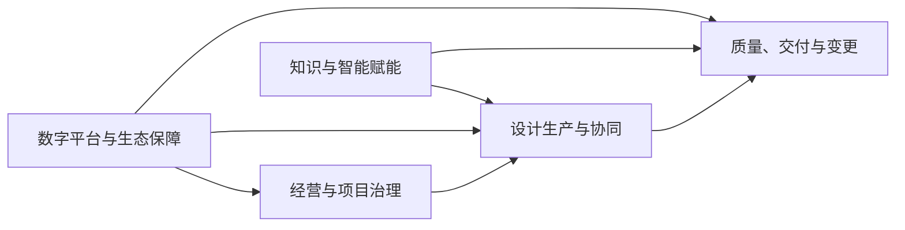
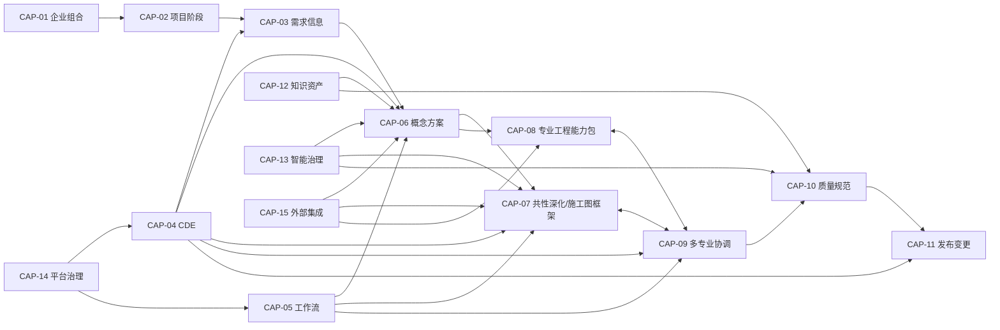

# D03 企业级业务能力地图

> 来源：@design/INDEX.md | 创建：2026-07-22 | 更新：2026-07-22
> 原始行范围：1714–2133
> 引用约定：同文件内引用使用 §编号，跨文件引用使用 @design/文件名.md

## D03 企业级业务能力地图

### D03.1 任务定义

| 项目 | 内容 |
|---|---|
| 任务目标 | 将 D01 场景和 D02 版本路线分解为稳定、无重叠、可分配业务所有者的 L1–L3 企业能力 |
| 直接产出 | 能力建模规则、L0/L1 地图、L2/L3 清单、专业扩展模型、能力依赖、场景/版本映射和治理规则 |
| 成功对齐物 | 后续模块、服务、界面、接口和数据均能归属于明确能力，避免按工具、部门或版本重复建设 |
| 本任务不做 | 不设计组织架构、RACI、服务拆分、接口字段、数据库表和页面；业务所有者仅指能力责任角色 |
| 上游约束 | D01 的 S0–S4、P0–P8、角色与范围；D02 的 V0–V4 和跨版本兼容原则 |

### D03.2 能力建模规则

#### D03.2.1 能力定义

业务能力描述企业“必须能够持续做什么”，不描述某次流程步骤、某个组织部门、某项软件产品或某个版本的实现方式。

每项能力具备：稳定能力 ID、名称、业务结果、服务对象、责任角色、输入/输出信息、支撑场景、首次完整版本、成熟度和依赖关系。

#### D03.2.2 分层规则

| 层级 | 定义 | 命名规则 | 示例 |
|---|---|---|---|
| L0 | 企业价值能力类别 | 价值导向名词 | 经营治理、设计生产、平台赋能 |
| L1 | 稳定业务能力域 | 独立业务结果 | CDE 与设计资产管理 |
| L2 | 可分配所有者的能力组 | 动宾或结果名词 | 资产版本管理 |
| L3 | 可被流程/模块实现的原子能力 | 明确业务动作 | 创建不可变资产版本 |

能力 ID 使用 `CAP-{L1两位}.{L2两位}.{L3两位}`；L1/L2 汇总节点省略后级。例如 `CAP-03.02.04` 表示 CDE 域中资产版本能力组的第 4 项原子能力。

#### D03.2.3 去重原则

1. 项目、用户、资产、版本、任务、问题、规则和审批等公共能力只定义一次。
2. 建筑、结构、MEP 等专业差异通过“专业能力包”扩展，不复制 CDE、任务、问题和发布能力。
3. Revit、AutoCAD、Rhino、EVAI 等是能力实现渠道或适配器，不作为 L1 业务能力。
4. V0–V4 是能力成熟路径，不为每个版本复制一套能力。
5. AI 是执行方式之一；“自动标注”归属设计生产能力，“模型路由和评测”归属智能能力治理。

### D03.3 L0 企业价值能力

| L0 ID | L0 能力类别 | 业务结果 |
|---|---|---|
| L0-1 | 经营与项目治理 | 项目范围、团队、阶段、资源和风险可规划、可控制 |
| L0-2 | 设计生产与协同 | 从需求到多专业施工图的成果可高效生产和协调 |
| L0-3 | 质量、交付与变更 | 成果经过受控检查、签审、发布、反馈和变更闭环 |
| L0-4 | 知识与智能赋能 | 企业知识、标准、算法和 AI 资产可治理、复用和持续改进 |
| L0-5 | 数字平台与生态保障 | 身份、安全、数据、集成、运行和外部生态稳定支撑业务 |

### D03.4 L1 业务能力地图

| L1 ID | 能力域 | 所属 L0 | 核心业务结果 | 主业务所有者 | 首次完整版本 |
|---|---|---|---|---|---|
| CAP-01 | 企业与项目组合治理 | L0-1 | 组织、客户和项目组合可统一治理 | 企业管理/PMO | V4 |
| CAP-02 | 项目与阶段管理 | L0-1 | 单项目范围、团队、计划、阶段和风险可控 | 项目经理 | V1 |
| CAP-03 | 需求与信息要求管理 | L0-1 | 需求从输入、澄清到基线和变更全程可追踪 | 项目经理/主创 | V1 |
| CAP-04 | CDE 与设计资产管理 | L0-5 | 所有设计信息具有统一版本、状态、权限和证据 | BIM/CAD 经理 | V1 |
| CAP-05 | 工作流、任务与协作 | L0-2 | 人工、规则、AI 和专业工具任务可编排和恢复 | 项目经理/平台运营 | V1 |
| CAP-06 | 概念与方案设计 | L0-2 | 场地、体量、功能和方案成果可生成、比较和确认 | 主创建筑师 | V0 |
| CAP-07 | 扩初与施工图生产 | L0-2 | 深化模型、图纸、说明和明细可受控生产 | 专业负责人 | V1 |
| CAP-08 | 专业工程设计 | L0-2 | 结构、给排水、暖通、电气及专项成果可计算、生产和校核 | 各专业负责人 | V2 |
| CAP-09 | 多专业协调与问题管理 | L0-2/L0-3 | 模型联邦、条件、碰撞和问题可闭环 | BIM 经理/项目总负责人 | V2 |
| CAP-10 | 质量、规范与签审 | L0-3 | 企业标准、规范风险和专业质量可检查、解释和批准 | 质量/法规/专业负责人 | 分子能力：企业标准/专业签审 V1；地区规范自动检查 V3 |
| CAP-11 | 发布、交付与设计变更 | L0-3 | 发布集、交付、反馈和变更具完整证据链 | 项目总负责人/项目经理 | V1 |
| CAP-12 | 企业知识与设计资产运营 | L0-4 | 规范、标准、模板、构件、节点和案例可复用 | 知识/BIM/CAD 管理者 | V3 |
| CAP-13 | AI、规则、仿真与自动化治理 | L0-4 | 智能能力可安全调用、评测、发布、监控和回退 | AI 负责人/专业专家 | V3 |
| CAP-14 | 身份、安全、审计与平台运营 | L0-5 | 平台在多组织、多项目环境中安全、可靠、可观测 | 平台/安全/运维负责人 | V4 |
| CAP-15 | 外部工具与生态集成 | L0-5 | CAD/BIM/GIS/工程软件及企业系统可受控互联 | 集成架构师/BIM 经理 | V4 |

“首次完整版本”不等于首次出现版本；例如 CAP-04 在 V0 提供最小能力，在 V1 达到正式 CDE 完整度。

### D03.5 L2/L3 能力清单

#### D03.5.1 CAP-01 企业与项目组合治理

| L2 ID | L2 能力 | 关键 L3 能力 | 业务结果 | 首次出现/完整 |
|---|---|---|---|---|
| CAP-01.01 | 企业组织治理 | 组织层级、部门、成员、委托管理、组织策略 | 明确业务和数据治理边界 | V0/V4 |
| CAP-01.02 | 客户与合作方治理 | 客户档案、联系人、合作方、外部组织准入 | 外部协作主体统一可识别 | V0/V4 |
| CAP-01.03 | 项目组合管理 | 组合分类、项目健康、优先级、风险聚合 | 管理层可比较和干预项目 | V1/V4 |
| CAP-01.04 | 企业资源视图 | 专业能力、负荷、关键资源、跨项目冲突 | 支撑资源配置决策 | V3/V4 |
| CAP-01.05 | 企业绩效治理 | 周期、质量、成本、AI、复用和风险指标 | 形成可追溯经营分析 | V0/V4 |

#### D03.5.2 CAP-02 项目与阶段管理

| L2 ID | L2 能力 | 关键 L3 能力 | 业务结果 | 首次出现/完整 |
|---|---|---|---|---|
| CAP-02.01 | 项目立项 | 建项目、项目分类、地区/建筑/专业配置、合同范围 | 建立项目业务边界 | V0/V1 |
| CAP-02.02 | 项目团队 | 成员、角色、专业组、外部方、入场/退场 | 责任主体可识别 | V0/V1 |
| CAP-02.03 | 阶段与里程碑 | P0–P8 映射、阶段基线、里程碑、阶段门状态 | 阶段推进受控 | V0/V1 |
| CAP-02.04 | 项目计划与工作包 | WBS、工作包、依赖、负责人、交付和验收 | 设计工作可计划 | V0/V1 |
| CAP-02.05 | 项目风险与决策 | 风险、假设、决策、阻塞、升级和关闭 | 项目风险透明可追踪 | V1/V1 |
| CAP-02.06 | 项目指标 | 周期、工时、质量、成本、AI 使用和目标 | 项目价值可量化 | V0/V1 |

#### D03.5.3 CAP-03 需求与信息要求管理

| L2 ID | L2 能力 | 关键 L3 能力 | 业务结果 | 首次出现/完整 |
|---|---|---|---|---|
| CAP-03.01 | 需求输入 | 多格式接收、来源登记、结构化提取、重复识别 | 原始意图不丢失 | V0/V1 |
| CAP-03.02 | 需求澄清 | 缺项、冲突、问题、回复、责任和时限 | 模糊需求可关闭 | V0/V1 |
| CAP-03.03 | 需求分类 | 功能、性能、法规、交付、数据、标准和合同分类 | 需求可分配与检查 | V0/V1 |
| CAP-03.04 | 信息要求 | 信息目的、对象、属性、阶段、格式、责任和质量 | 明确何时交付什么信息 | V1/V1 |
| CAP-03.05 | 需求基线 | 审查、批准、冻结、版本和生效 | 形成受控设计输入 | V0/V1 |
| CAP-03.06 | 需求追踪 | 关联阶段、工作包、资产、规则、问题和验收 | 需求实现可证明 | V1/V1 |
| CAP-03.07 | 需求变更 | 变更提出、影响、批准、合并和通知 | 输入变化受控 | V0/V1 |

#### D03.5.4 CAP-04 CDE 与设计资产管理

| L2 ID | L2 能力 | 关键 L3 能力 | 业务结果 | 首次出现/完整 |
|---|---|---|---|---|
| CAP-04.01 | 资产接入 | 上传、分片、哈希、安全检查、格式识别、元数据 | 资产安全进入平台 | V0/V1 |
| CAP-04.02 | 资产版本 | 创建不可变版本、派生关系、比较、回滚引用 | 每次变化可追溯 | V0/V1 |
| CAP-04.03 | CDE 状态 | WIP、Shared、Published、Archived 转换和用途 | 信息使用边界明确 | V0/V1 |
| CAP-04.04 | 资产组织 | 项目空间、专业、阶段、类型、分类和标签 | 资产可定位和检索 | V0/V1 |
| CAP-04.05 | 协同编辑控制 | 锁、签出、同步、冲突、分支/合并策略 | 降低并发覆盖风险 | V1/V1 |
| CAP-04.06 | 预览与派生 | 缩略图、PDF、2D/3D 预览、属性提取、轻量模型 | 无原生工具也可审阅 | V0/V1 |
| CAP-04.07 | 资产权限 | 项目/专业/状态/用途访问和受控分享 | 防止越权和误发 | V0/V2 |
| CAP-04.08 | 保留与归档 | 保留、冻结、归档、合法删除和恢复 | 满足合同和审计 | V1/V4 |

#### D03.5.5 CAP-05 工作流、任务与协作

| L2 ID | L2 能力 | 关键 L3 能力 | 业务结果 | 首次出现/完整 |
|---|---|---|---|---|
| CAP-05.01 | 流程模板 | 定义阶段/专业流程、版本、发布和废止 | 流程可复用治理 | V0/V1 |
| CAP-05.02 | 流程运行 | 启动、暂停、恢复、取消、重试、补偿 | 长流程可靠执行 | V0/V1 |
| CAP-05.03 | 人工任务 | 分派、认领、转派、委托、提交、退回和超时 | 人工工作可追踪 | V0/V1 |
| CAP-05.04 | 自动任务 | 脚本、AI、规则、转换、仿真任务及状态 | 自动化可编排 | V0/V1 |
| CAP-05.05 | SLA 与升级 | 截止、时区、提醒、升级、豁免和原因 | 延误可预警处理 | V0/V1 |
| CAP-05.06 | 协作沟通 | 评论、@、附件、订阅、通知和上下文 | 沟通锚定业务对象 | V0/V1 |
| CAP-05.07 | 人工接力 | 操作包、人员执行、结果回传和双重确认 | 无接口工具仍受控 | V0/V1 |

#### D03.5.6 CAP-06 概念与方案设计

| L2 ID | L2 能力 | 关键 L3 能力 | 业务结果 | 首次出现/完整 |
|---|---|---|---|---|
| CAP-06.01 | 场地与约束理解 | 场地、红线、地形、朝向、气候、法规约束 | 建立方案边界 | V0/V1 |
| CAP-06.02 | 草图与图纸理解 | 图像增强、OCR、墙/门窗/空间/轴线候选 | 原始意图结构化 | V0/V0 |
| CAP-06.03 | 体量与功能生成 | 参数、约束、功能、体量和候选方案 | 快速形成可编辑候选 | V0/V1 |
| CAP-06.04 | 方案分析 | 面积、流线、日照、通风、景观和性能快评 | 方案可比较 | V0/V1 |
| CAP-06.05 | 方案比选 | 指标、权重、Pareto、人工评价和推荐 | 决策依据可追溯 | V0/V1 |
| CAP-06.06 | 方案表达 | 分析图、效果表达、文本、PPT 和版式 | 形成沟通成果 | V0/V0 |
| CAP-06.07 | 方案确认 | 小样、评审、意见、修改、基线和批准 | 设计方向受控冻结 | V0/V1 |

#### D03.5.7 CAP-07 扩初与施工图生产

| L2 ID | L2 能力 | 关键 L3 能力 | 业务结果 | 首次出现/完整 |
|---|---|---|---|---|
| CAP-07.01 | 模型深化 | 体量转构件、类型/属性、空间、层级和设计深度 | 模型逐阶段可用 | V0/V1 |
| CAP-07.02 | 图纸体系 | 图纸目录、图号、图名、视图、比例和模板 | 图纸集结构统一 | V0/V1 |
| CAP-07.03 | 图形生成 | 平立剖、详图、系统图、示意图和大样 | 设计信息形成图形 | V0/V1 |
| CAP-07.04 | 标注与注释 | 尺寸、标高、轴网、标签、索引、符号和文字 | 图纸表达完整 | V0/V1 |
| CAP-07.05 | 表格与明细 | 门窗表、材料表、设备表、构件明细 | 模型信息形成清单 | V1/V1 |
| CAP-07.06 | 设计说明 | 总说明、专业说明、材料和做法说明 | 技术要求可交付 | V0/V1 |
| CAP-07.07 | 批量修订 | 参数、图签、文字、视图和受控批量修改 | 降低重复改图 | V0/V1 |
| CAP-07.08 | 出图与打包 | 打印集、PDF/DWG 导出、字体/外参、校验和 | 形成可审阅候选集 | V0/V1 |

#### D03.5.8 CAP-08 专业工程设计

| L2 ID | L2 能力 | 关键 L3 能力 | 业务结果 | 首次出现/完整 |
|---|---|---|---|---|
| CAP-08.01 | 专业包配置 | 专业对象、输入、输出、规则、工具和阶段门 | 新专业可标准接入 | V1/V2 |
| CAP-08.02 | 结构设计 | 荷载/体系/分析交换、构件、配筋/节点和出图 | 结构成果可计算交付 | V1/V2 |
| CAP-08.03 | 给排水设计 | 用水/排水计算、系统、设备、管线、坡度和出图 | 给排水成果可交付 | V1/V2 |
| CAP-08.04 | 暖通设计 | 负荷、系统、设备、风水管、控制和出图 | 暖通成果可交付 | V1/V2 |
| CAP-08.05 | 电气设计 | 负荷、供配电、照明、动力、弱电、防雷和出图 | 电气成果可交付 | V1/V2 |
| CAP-08.06 | 专项设计 | 景观、室内、幕墙、消防、人防、绿色和智能化扩展 | 专项专业可接入 | V2/V4 |
| CAP-08.07 | 专业校核 | 输入、计算、模型、图纸、说明和专业规则校核 | 专业正确性受控 | V1/V2 |

#### D03.5.9 CAP-09 多专业协调与问题管理

| L2 ID | L2 能力 | 关键 L3 能力 | 业务结果 | 首次出现/完整 |
|---|---|---|---|---|
| CAP-09.01 | 专业条件管理 | 条件提出、接收、确认、变更和关闭 | 专业输入输出可追踪 | V1/V2 |
| CAP-09.02 | 坐标与模型拆分 | 坐标基准、单位、原点、模型拆分和链接规则 | 模型可正确组合 | V1/V2 |
| CAP-09.03 | 模型联邦 | 固定专业版本、组合、轻量化和联邦快照 | 协调输入可重放 | V1/V2 |
| CAP-09.04 | 碰撞与空间检查 | 硬/软碰撞、净距、容差、分组和误报 | 冲突自动发现 | V1/V2 |
| CAP-09.05 | 问题管理 | 创建、锚定、指派、优先级、状态、证据和截止 | 问题有责任闭环 | V0/V2 |
| CAP-09.06 | BCF 交换 | 导入导出、视点、构件映射、版本和同步 | 问题可跨工具协同 | V1/V2 |
| CAP-09.07 | 协调会议 | 议题、快照、决议、任务和纪要 | 协调决策可追溯 | V1/V2 |

#### D03.5.10 CAP-10 质量、规范与签审

| L2 ID | L2 能力 | 关键 L3 能力 | 业务结果 | 首次出现/完整 |
|---|---|---|---|---|
| CAP-10.01 | 质量计划 | 检查范围、角色、规则包、抽样和门禁 | 项目质量活动可规划 | V0/V1 |
| CAP-10.02 | 企业标准检查 | 图层、命名、字体、图签、族/块和完整性 | 企业标准自动执行 | V0/V1 |
| CAP-10.03 | 模型信息检查 | IFC/原生属性、分类、关系、IDS 和数据质量 | 模型信息满足要求 | V1/V3 |
| CAP-10.04 | 几何与空间检查 | 尺寸、净高、净距、面积、连通和构造规则 | 几何风险可定位 | V1/V3 |
| CAP-10.05 | 地区规范辅助 | 法规知识、规则执行、条款引用和适用性 | 规范风险有证据 | V1/V3 |
| CAP-10.06 | 图模一致性 | 图纸、模型、明细、说明和计算输入一致性 | 跨表示差异可发现 | V1/V3 |
| CAP-10.07 | 例外与豁免 | 申请、依据、影响、授权、期限和复核 | 合理例外受控 | V1/V3 |
| CAP-10.08 | 校审签审 | 自校、校对、审核、审定、退回、批准和签审记录 | 专业责任可证明 | V0/V1 |
| CAP-10.09 | 质量报告 | 问题、严重度、趋势、逃逸和整改证据 | 质量状态可决策 | V0/V3 |

#### D03.5.11 CAP-11 发布、交付与设计变更

| L2 ID | L2 能力 | 关键 L3 能力 | 业务结果 | 首次出现/完整 |
|---|---|---|---|---|
| CAP-11.01 | 发布候选管理 | 选择资产版本、图纸目录、用途和候选集冻结 | 发布输入明确 | V0/V1 |
| CAP-11.02 | 发布门禁 | 完整性、签审、问题、规则、权限和例外检查 | 不合格成果无法发布 | V0/V1 |
| CAP-11.03 | 正式发布 | Published 状态、不可变集、编号和发布证据 | 建立正式成果基线 | V0/V1 |
| CAP-11.04 | Transmittal | 清单、接收方、用途、链接、发送和签收 | 交付过程可证明 | V0/V1 |
| CAP-11.05 | 外部审阅 | 受控访问、批注、回复、确认和到期撤销 | 外部意见锚定版本 | V0/V1 |
| CAP-11.06 | 变更识别与评估 | 来源、分类、影响、费用/周期和风险 | 变更决策有依据 | V0/V1 |
| CAP-11.07 | 变更执行 | 批准、任务、修订、复核、重发和关闭 | 新旧基线关联完整 | V0/V2 |
| CAP-11.08 | 项目归档 | 最终交付、关闭、权限回收、经验沉淀和保留 | 项目可长期追溯 | V1/V4 |

#### D03.5.12 CAP-12 企业知识与设计资产运营

| L2 ID | L2 能力 | 关键 L3 能力 | 业务结果 | 首次出现/完整 |
|---|---|---|---|---|
| CAP-12.01 | 标准资产 | 图层、图签、字体、命名、分类和交付模板 | 标准统一复用 | V0/V1 |
| CAP-12.02 | 构件与内容库 | 族、块、材质、设备、参数和兼容版本 | 设计内容可控复用 | V0/V3 |
| CAP-12.03 | 节点与做法库 | 详图、构造、适用条件、来源和批准状态 | 施工图节点可推荐 | V1/V3 |
| CAP-12.04 | 规范知识库 | 法源、条款、版本、地区、有效期和关联 | 规范知识可信检索 | V1/V3 |
| CAP-12.05 | 项目案例库 | 授权、脱敏、标签、指标、成果和经验 | 历史项目可复用 | V0/V3 |
| CAP-12.06 | 资产发布治理 | 草稿、评审、发布、废止、替代和通知 | 知识生命周期受控 | V0/V3 |
| CAP-12.07 | 使用反馈 | 引用、接受、问题、评分和改进 | 资产基于证据优化 | V0/V3 |

#### D03.5.13 CAP-13 AI、规则、仿真与自动化治理

| L2 ID | L2 能力 | 关键 L3 能力 | 业务结果 | 首次出现/完整 |
|---|---|---|---|---|
| CAP-13.01 | 能力目录 | AI/规则/脚本/转换/仿真能力、版本和约束 | 自动化能力可发现 | V0/V1 |
| CAP-13.02 | Provider 与工具路由 | 供应商、私有模型、策略、成本、地区和回退 | 调用符合项目策略 | V0/V3 |
| CAP-13.03 | AI 运行治理 | 输入、提示、知识快照、模型、输出、成本和证据 | 每次 AI 可追溯 | V0/V1 |
| CAP-13.04 | 规则生命周期 | DSL、来源、测试、批准、发布、例外和废止 | 规则可复现治理 | V0/V3 |
| CAP-13.05 | 仿真任务治理 | 输入假设、求解器、网格/参数、结果和验证 | 计算结果可复现 | V1/V3 |
| CAP-13.06 | 模型/提示/数据集治理 | 版本、注册、权限、血缘和发布状态 | AI 资产可控 | V0/V3 |
| CAP-13.07 | 评测与门禁 | 金样、指标、回归、红队、专家评审和阈值 | 不合格版本不发布 | V0/V3 |
| CAP-13.08 | 在线监测与回滚 | 质量、漂移、成本、异常、灰度和回退 | 生产 AI 可运营 | V0/V3 |
| CAP-13.09 | Agent 治理 | 工具白名单、权限、预算、循环、审批和停止 | Agent 不越权自治 | V1/V3 |

#### D03.5.14 CAP-14 身份、安全、审计与平台运营

| L2 ID | L2 能力 | 关键 L3 能力 | 业务结果 | 首次出现/完整 |
|---|---|---|---|---|
| CAP-14.01 | 身份生命周期 | 用户、外部身份、SSO、SCIM、设备、加入和撤销 | 主体身份可信 | V0/V4 |
| CAP-14.02 | 授权治理 | RBAC、ABAC、项目/专业/资产/动作策略和委托 | 最小权限可执行 | V0/V2 |
| CAP-14.03 | 数据安全与隐私 | 分类、加密、驻留、跨境、脱敏、保留和删除 | 项目数据合规受控 | V0/V4 |
| CAP-14.04 | 密钥与供应链安全 | 密钥、证书、插件签名、依赖和镜像治理 | 技术供应链可信 | V0/V4 |
| CAP-14.05 | 业务审计 | 用户、AI、规则、审批、发布和导出事件 | 责任证据防篡改 | V0/V4 |
| CAP-14.06 | 可观测性 | Trace、Metric、Log、业务 ID 关联和告警 | 故障可定位 | V0/V4 |
| CAP-14.07 | 可靠性与恢复 | 备份、RPO/RTO、容灾、演练和降级 | 平台可恢复 | V1/V4 |
| CAP-14.08 | 容量与成本运营 | 存储、队列、CPU/GPU、Automation、Token 和配额 | 成本与容量可控 | V0/V4 |
| CAP-14.09 | 平台配置与发布 | 环境、功能开关、配置、发布、回滚和变更审计 | 平台变更受控 | V0/V4 |

#### D03.5.15 CAP-15 外部工具与生态集成

| L2 ID | L2 能力 | 关键 L3 能力 | 业务结果 | 首次出现/完整 |
|---|---|---|---|---|
| CAP-15.01 | 桌面连接器框架 | 设备注册、插件会话、任务、对象定位、上传和升级 | 桌面工具统一接入 | V0/V2 |
| CAP-15.02 | Autodesk 工具链 | Revit/AutoCAD Add-in、APS Automation/Viewer/Data | Autodesk 生产链可自动化 | V0/V2 |
| CAP-15.03 | 参数化/其他 BIM | Rhino/GH、SketchUp、ArchiCAD 和连接器 | 多设计工具可协同 | V0/V3 |
| CAP-15.04 | openBIM 互操作 | IFC、IDS、BCF、bSDD、openCDE 和映射 | 厂商中立交换 | V1/V3 |
| CAP-15.05 | GIS 与场地数据 | 坐标、地形、城市数据、地图服务和授权 | 场地信息可复用 | V0/V3 |
| CAP-15.06 | 工程计算工具 | 结构、能耗、日照、CFD、MEP 求解器连接 | 专业计算可编排 | V1/V3 |
| CAP-15.07 | 企业系统集成 | ERP、PM、造价、采购、施工、运维和档案接口 | 设计数据进入企业生态 | V2/V4 |
| CAP-15.08 | 外部协作接口 | 客户、审查、合作方、Webhook 和生态 API | 外部流程受控连接 | V0/V4 |

### D03.6 专业能力包扩展模型

每个专业能力包 `DisciplineCapabilityPack` 必须声明以下内容：

| 维度 | 必填内容 |
|---|---|
| 身份 | 专业代码、名称、版本、适用地区/建筑类型/阶段 |
| 业务对象 | 构件、系统、空间、参数、计算对象和分类 |
| 输入条件 | 上游专业、资料、模型、规则和批准状态 |
| 输出成果 | 模型、图纸、计算、说明、明细、条件和报告 |
| 专业流程 | 工作包、任务、校核、阶段门和变更路径 |
| 工具能力 | 原生工具、连接器、求解器、AI/规则和人工接力 |
| 质量规则 | 企业标准、专业规则、规范、容差和例外 |
| 协同接口 | 坐标、交换格式、条件、碰撞组和 Issue 类型 |
| 责任角色 | 设计、校对、审核、审定和外部协作方 |
| 评测指标 | 自动化、准确性、质量、周期和成本护栏 |

专业包只能扩展 CAP-07/08/09/10/15 的专业内容，不得复制 Project、AssetVersion、Task、Issue、Approval、AIInvocationRun 和 Transmittal 等公共实体及能力。

### D03.7 关键能力依赖

依赖含义是“消费稳定业务能力”，不是要求所有上游完整成熟后才开始下游。V0 可使用 CAP-04/05 的最小形态支持 CAP-06；跨版本兼容由能力契约保持。

### D03.8 能力—场景映射

图例：`P` 主能力，`S` 支撑能力。

| 能力域 | SC-01 | SC-02 | SC-03 | SC-04 | SC-05 | SC-06 | SC-07 | SC-08 |
|---|:---:|:---:|:---:|:---:|:---:|:---:|:---:|:---:|
| CAP-01 企业组合 | S | S | S | — | — | S | S | P |
| CAP-02 项目阶段 | P | P | P | S | S | S | P | S |
| CAP-03 需求信息 | P | P | P | S | S | S | P | S |
| CAP-04 CDE 资产 | P | P | P | P | P | P | P | P |
| CAP-05 工作流协作 | P | P | P | P | P | P | P | P |
| CAP-06 概念方案 | P | P | P | S | S | S | S | S |
| CAP-07 扩初施工图 | S | P | P | P | P | P | P | S |
| CAP-08 专业工程 | — | P | P | P | P | P | P | S |
| CAP-09 多专业协调 | S | P | P | P | S | S | P | S |
| CAP-10 质量规范 | P | P | P | S | P | P | P | P |
| CAP-11 发布变更 | P | P | P | S | S | P | P | S |
| CAP-12 知识资产 | S | S | S | S | P | S | S | P |
| CAP-13 智能治理 | P | P | P | S | P | S | S | P |
| CAP-14 平台治理 | S | S | S | S | S | S | S | P |
| CAP-15 外部集成 | P | P | P | P | P | P | P | S |

CAP-07 与 CAP-08 共同消费方案/扩初基线并并行深化：CAP-07 提供共性施工图生产框架，CAP-08 提供结构/MEP/专项计算与成果；二者通过 CAP-09 持续双向协调，不表示“建筑施工图完成后专业才开始”。所有 SC-01–SC-08 至少具有一个主能力和公共 CDE/工作流支撑。

### D03.9 能力—版本成熟度

成熟度定义：M0 未建立；M1 人工可追踪；M2 标准化/部分自动；M3 可度量生产级；M4 企业规模治理。

| 能力域 | V0 | V1 | V2 | V3 | V4 |
|---|:---:|:---:|:---:|:---:|:---:|
| CAP-01 企业组合 | M1 | M2 | M2 | M3 | M4 |
| CAP-02 项目阶段 | M2 | M3 | M3 | M3 | M4 |
| CAP-03 需求信息 | M2 | M3 | M3 | M3 | M4 |
| CAP-04 CDE 资产 | M2 | M3 | M3 | M3 | M4 |
| CAP-05 工作流协作 | M2 | M3 | M3 | M3 | M4 |
| CAP-06 概念方案 | M3 | M3 | M3 | M3 | M4 |
| CAP-07 扩初施工图 | M1 | M3 | M3 | M4 | M4 |
| CAP-08 专业工程 | M0 | M1 | M3 | M4 | M4 |
| CAP-09 多专业协调 | M1 | M2 | M3 | M4 | M4 |
| CAP-10 质量规范 | M2 | M3 | M3 | M4 | M4 |
| CAP-11 发布变更 | M2 | M3 | M3 | M4 | M4 |
| CAP-12 知识资产 | M1 | M2 | M3 | M4 | M4 |
| CAP-13 智能治理 | M2 | M2 | M3 | M4 | M4 |
| CAP-14 平台治理 | M1 | M2 | M3 | M3 | M4 |
| CAP-15 外部集成 | M2 | M3 | M3 | M4 | M4 |

### D03.10 能力治理生命周期

| 状态 | 含义 | 允许动作 | 退出条件 |
|---|---|---|---|
| Proposed | 新能力建议，尚未进入地图 | 分析价值、重复、所有者和依赖 | 获批或拒绝 |
| Defined | 名称、边界、所有者和结果已定义 | 映射场景、版本和指标 | 进入版本路线 |
| Enabled | 具备人工或技术实现路径 | 试点、采集指标、修正边界 | 达到生产门禁 |
| Operational | 生产使用并受指标治理 | 运营、优化、扩展 | 被替代或退役 |
| Deprecated | 已有替代能力，不允许新消费 | 迁移存量、只读保留 | 存量清零且证据保留 |
| Retired | 不再运行 | 审计查询 | 按保留策略长期保存定义和证据 |

新增能力必须先检查是否能作为既有 L2/L3 的扩展；只有业务结果和所有者均独立时才新增 L1，避免能力地图随工具增加而膨胀。

### D03.11 能力所有权原则

1. 每个 L1 只有一个主业务所有者角色，可有多个共同参与角色。
2. 业务所有者负责能力目标、规则和指标，不等同于技术服务负责人。
3. 跨能力流程由流程所有者协调，不改变各能力的数据和规则责任。
4. 专业负责人拥有专业结果和校核能力；平台/AI 管理员不得批准专业成果。
5. CAP-13 管理 AI 的可用性与证据，不拥有 CAP-06–10 的业务验收标准。
6. CAP-14 可阻断违反安全策略的操作，但不能代替项目/专业放行。

### D03.12 D03 验收条件（EARS）

- When 新模块被提出, the 设计 shall 将其映射到一个主 L1/L2 能力和必要支撑能力后再定义边界。
- When 某专业接入平台, the 设计 shall 使用专业能力包扩展 CAP-07–10/15，不复制公共项目、资产、任务、问题和审批能力。
- When 新工具或 AI Provider 接入, the 能力地图 shall 保持稳定，并将其视为 CAP-13 或 CAP-15 的实现渠道。
- When 版本路线变化, the 能力 ID 和业务语义 shall 保持稳定，只调整成熟度和进入版本。
- When 能力有多个参与部门, the 设计 shall 仍指定一个主业务所有者角色。
- When CAP-13 执行 AI 自动化, the 平台 shall 使用 CAP-06–10 对应业务能力的验收标准，不由 AI 管理员自行定义专业正确性。
- When 任何 SC-01–SC-08 场景被执行, the 设计 shall 能映射到至少一个主能力及 CAP-04/05 支撑能力。
- When 能力被退役, the 平台 shall 先迁移消费者并保留历史定义、版本和审计证据。
- When D04–D46 设计模块、接口、页面或数据, the 文档 shall 引用稳定 CAP ID 以建立追踪关系。

### D03.13 D03 完成检查与下游约束

| 检查项 | 结果 |
|---|---|
| 是否建立 L0–L3 分层和稳定编号 | 是 |
| 是否覆盖经营、设计、质量、智能和平台保障 | 是，15 个 L1 |
| 是否区分业务能力、组织、工具和版本 | 是 |
| 是否定义专业扩展而避免公共能力重复 | 是 |
| 是否覆盖 SC-01–SC-08 | 是 |
| 是否映射 V0–V4 成熟度 | 是 |
| 是否明确业务所有者与技术负责人差异 | 是 |
| 是否进入服务、接口和数据库实现 | 否，符合 D03 边界 |

D03 对下游的强制约束：D04 为每个 L1 指定 RACI 和权限主体；D05 将 P0–P8 流程步骤映射到 CAP ID；D06–D23 的业务模块不得越过主能力边界直接写入其他能力事实；D24–D33 的 AI/工具仅作为能力实现渠道；D34–D37 的数据、接口和界面必须标注所属 CAP ID。

