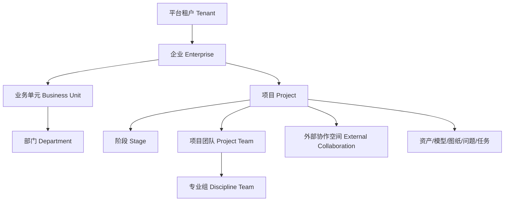
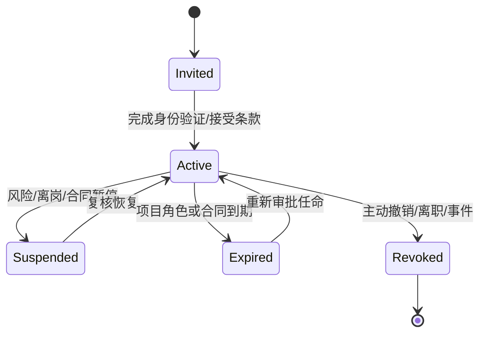

# D04 角色、组织与权限模型

> 来源：@design/INDEX.md | 创建：2026-07-22 | 更新：2026-07-22
> 原始行范围：2134–2408
> 引用约定：同文件内引用使用 §编号，跨文件引用使用 @design/文件名.md

## D04 角色、组织与权限模型

### D04.1 任务定义

| 项目 | 内容 |
|---|---|
| 任务目标 | 建立企业、项目、专业、外部方和平台运营的责任边界及可执行授权模型 |
| 直接产出 | 组织模型、身份类型、角色目录、RACI、RBAC 权限集、ABAC 条件、职责分离、外部访问和身份生命周期 |
| 成功对齐物 | 任一关键动作均能回答“谁可做、对什么资源、在什么条件下、是否需复核、如何撤销与审计” |
| 本任务不做 | 不选择 IAM 产品配置、不定义 API Token 字段、不设计权限管理页面和数据库表 |
| 上游约束 | D01 角色组与专业责任；D03 CAP-01/02/14 及各 L1 业务所有者 |

### D04.2 授权原则

1. 默认拒绝，显式授权；组织成员身份不自动获得项目数据访问权。
2. RBAC 定义可承担的职责，ABAC 使用租户、项目、专业、阶段、资产状态、数据级别、地区和时间限制具体访问。
3. 专业审批权来自有效专业任命，不来自平台管理员、AI 管理员或文件所有者身份。
4. 外部用户仅访问明确发布或共享给其组织的快照，不继承内部 WIP 权限。
5. 生成、校对、审核、审定和发布在高风险成果上实施职责分离；例外必须审批并审计。
6. 服务账号、桌面设备和 AI Agent 也是受管主体，仅拥有完成指定任务所需的最小权限。
7. 权限随项目、角色和合同关系结束自动到期；历史审批证据不因账号停用而丢失。

### D04.3 组织与资源边界

| 层级 | 边界定义 | 权限继承规则 |
|---|---|---|
| Tenant | 独立客户或私有化实例的最高隔离边界 | 禁止跨 Tenant 继承和查询 |
| Enterprise | 一个法人/集团业务边界 | 企业策略可向下成为默认值，不自动授予项目访问 |
| Business Unit | 分院、区域公司或事业部 | 可管理本单元成员和项目组合，不越过企业策略 |
| Department | 建筑、结构、机电、数字化等组织部门 | 提供人员与能力信息，不等同项目专业权限 |
| Project | 合同、数据、团队、阶段和审计的核心授权边界 | 项目成员必须显式加入并分配项目角色 |
| Stage | P0–P8 阶段及其批准基线 | 权限可受阶段状态限制，例如关闭后只读 |
| Discipline Team | 项目内建筑、结构、给排水、暖通、电气等专业组 | 仅访问职责所需专业资产和共享条件 |
| External Collaboration | 客户、主创、顾问、审查方、承包方的受控空间 | 仅访问被分享的 Shared/Published 快照 |

### D04.4 身份主体类型

| 主体类型 | 示例 | 认证方式基线 | 生命周期所有者 | 禁止事项 |
|---|---|---|---|---|
| 内部人员 | 设计师、负责人、管理员 | 企业 SSO/OIDC/SAML，强认证按策略 | 企业 IAM/组织管理员 | 共享账号 |
| 外部人员 | 客户、境外主创、顾问、审查人员 | 邀请+联合身份或受控本地身份 | 项目经理+外部组织管理员 | 默认访问项目全部内容 |
| 服务账号 | 转换、规则、通知、集成服务 | 工作负载身份、短期 Token、证书 | 平台管理员 | 交互登录、专业审批 |
| 桌面设备 | Revit/AutoCAD 插件设备 | 用户身份+设备证书 | 平台/设备管理员 | 脱离用户上下文批量下载 |
| AI Agent | 受控工具调用代理 | 委托 Token、工具白名单和运行上下文 | AI 管理员+业务能力所有者 | 获得高于委托人的权限、批准成果 |
| 临时分享接收者 | 无账号交付接收人 | 单用途短期链接+二次校验 | 交付发起人 | 浏览 WIP、继续转授权 |
| 紧急账号 | Break-glass 管理身份 | 独立强认证、双人启用 | 安全负责人 | 日常使用、隐藏审计 |

### D04.5 角色目录

角色分为企业角色、项目角色、专业角色、质量/发布角色、平台角色和外部角色。用户可具有多个角色，但最终权限仍受 ABAC 和职责分离约束。

| 角色 ID | 角色 | 作用域 | 核心职责 | 明确无权事项 |
|---|---|---|---|---|
| ER-01 | 企业负责人 | Enterprise | 企业策略、组合目标和重大风险 | 仅凭该角色读取全部项目技术文件 |
| ER-02 | PMO/组合经理 | Enterprise/BU | 项目组合、阶段和指标治理 | 修改专业成果、专业签审 |
| ER-03 | 部门负责人 | Department | 人员能力、资源和部门标准 | 自动获得未参与项目数据 |
| PR-01 | 项目总负责人 | Project | 技术统筹、阶段放行、综合发布批准 | 代替法定专业签审（若无对应任命） |
| PR-02 | 项目经理 | Project | 范围、计划、团队、沟通、交付和变更组织 | 修改专业计算结论、替代专业审核 |
| PR-03 | 主创建筑师 | Project/Architecture | 设计意图、概念/方案决策 | 结构/MEP 专业审批 |
| DR-01 | 专业负责人 | Project/Discipline | 本专业技术决策、审核和提交 | 其他专业审批、平台安全配置 |
| DR-02 | 专业设计师 | Project/Discipline | 生产和自校专业成果 | 审核/审定自己的高风险成果 |
| DR-03 | 专业校对人 | Project/Discipline | 校对指定成果和形成问题 | 修改后直接批准自己的修改 |
| DR-04 | 专业审核人 | Project/Discipline | 审核专业成果和风险 | 审核未经校对的阻断级成果（例外除外） |
| DR-05 | 专业审定人 | Project/Discipline | 审定关键/正式成果 | 跳过要求的前级签审 |
| BR-01 | BIM 经理 | Project | 执行计划、坐标、拆分、联邦、碰撞和模型发布条件 | 专业设计正确性审批 |
| BR-02 | CAD 经理 | Enterprise/Project | 图层、图签、字体、出图和 CAD 标准 | 专业技术审批 |
| QR-01 | 质量经理 | Enterprise/Project | 质量计划、抽检、门禁和质量报告 | 代替专业负责人修订成果 |
| QR-02 | 法规专家 | Region/Project | 规则适用、条款解释和例外复核 | 代替法定审查机构作最终结论 |
| KR-01 | 知识/标准管理员 | Enterprise | 模板、构件、节点、规则和知识生命周期 | 未经专家批准发布高风险规则 |
| AR-01 | AI 负责人 | Enterprise | AI 能力、模型、提示、评测和运行治理 | 定义专业正确性、批准施工图 |
| AR-02 | AI 评测专家 | Capability/Discipline | 金样、指标、专家标注和发布建议 | 单独发布生产模型 |
| SR-01 | 租户管理员 | Tenant | 租户配置、身份连接和最高级平台管理 | 读取项目内容除非另获审计授权 |
| SR-02 | 企业管理员 | Enterprise | 组织、成员、企业策略和角色委派 | 专业审批、默认读取全部项目 |
| SR-03 | 安全管理员 | Tenant/Enterprise | 安全策略、事件、密钥引用和紧急控制 | 修改设计成果 |
| SR-04 | 审计员 | Enterprise/Project | 只读审计查询和经批准导出 | 修改、批准、删除业务数据 |
| SR-05 | 运维人员 | Platform | 运行、监控、恢复和故障处置 | 查看明文项目内容和专业审批 |
| XR-01 | 客户/业主代表 | Project/External | 查看授权成果、评论、确认和签收 | 内部 WIP、企业知识和其他客户项目 |
| XR-02 | 境外主创 | Project/External | 提交意图、审阅方案、反馈和确认 | 内部人员管理和正式专业签审 |
| XR-03 | 外部顾问/合作设计方 | Project/External/Discipline | 交付约定专业成果和处理问题 | 未授权专业与内部 WIP |
| XR-04 | 审查方 | Project/External/Review | 查看送审集、提出意见和形成外部结论 | 修改设计源文件 |

### D04.6 权限动作目录

权限使用 `resource:action` 命名，动作按风险分层。

| 权限组 | 关键动作 | 风险级别 |
|---|---|---|
| 项目治理 | `project:create/update/archive`、`member:invite/assign/revoke` | 中/高 |
| 需求治理 | `requirement:create/edit/baseline/change/approve` | 中/高 |
| 资产操作 | `asset:upload/read/edit/share/delete`、`version:create/compare` | 低至高 |
| CDE 状态 | `container:share/publish/archive/restore` | 高 |
| 任务流程 | `workflow:start/cancel/retry`、`task:assign/submit/accept` | 中/高 |
| AI/自动化 | `aiInvocationRun:submit/cancel/viewEvidence/accept/reject` | 中/高 |
| 规则与检查 | `rule:draft/test/publish/deprecate`、`check:run/waive` | 中/高 |
| 问题协同 | `issue:create/assign/respond/resolve/verify/reopen` | 中 |
| 专业签审 | `review:selfcheck/check/audit/approve/finalize` | 高/关键 |
| 发布交付 | `release:prepareReplacement/requestWithdrawal/approveWithdrawal/publishReplacement`、`transmittal:send/ack/manageDelivery` | 关键 |
| 变更管理 | `change:raise/assess/approve/execute/close` | 高/关键 |
| 知识资产 | `knowledge:draft/review/publish/deprecate` | 中/高 |
| 平台治理 | `policy:update`、`identity:manage`、`secret:rotate`、`audit:export` | 关键 |

### D04.7 RBAC 基线矩阵

图例：`M` 管理，`E` 编辑/执行，`R` 只读，`A` 审批，`—` 无权。矩阵是角色上限，ABAC 可进一步收紧。

| 资源/动作 | PR-01 | PR-02 | DR-01 | DR-02 | DR-03/04/05 | BR-01 | QR-01/02 | AR-01 | SR-01/02 | XR-01/02 | XR-03/04 |
|---|:---:|:---:|:---:|:---:|:---:|:---:|:---:|:---:|:---:|:---:|:---:|
| 项目配置/团队 | A | M | R | R | R | R | R | — | M | R | R |
| 需求与基线 | A | M | E | E | R/A | R | R/A | — | R | E/A | E/R |
| 本专业 WIP 资产 | R/A | R | M | E | R/E | R | R | R（脱敏证据） | — | — | E（授权专业） |
| Shared 资产 | R/A | R | M | E | R/E | M | R | R（授权） | — | R（授权） | R/E（授权） |
| Published 资产 | A（批准替代/撤销） | R（组织替代/交付） | A（专业确认） | R | A（签审） | R（条件确认） | R/A | — | — | R | R |
| 工作流/任务 | A | M | M | E | E | E | E | R | — | R/E（外部任务） | E |
| AI 运行候选 | R/A | R | A | E/接受建议 | R/E | R | R | M | — | R（批准展示） | E（授权） |
| 专业签审 | A（阶段） | R | A | 自校 | 校/审/定 | R | 质量/法规复核 | — | — | — | 外部审查意见 |
| 碰撞/Issue | A | M | M | E | E | M | R | R | — | E（授权问题） | E |
| 规则发布/豁免 | R | R | 专业批准 | R | R/A | 标准规则 E | M/A | 技术 E | — | — | R |
| 发布/Transmittal | A | M/E | 专业批准 | R | 签审 | 条件确认 | 门禁确认 | — | — | 签收 | 审查意见 |
| 设计变更 | A | M | 专业批准 | E | 复核/批准 | 影响协调 | 质量复核 | — | — | 提出/确认 | 提出/执行授权部分 |
| 企业知识/AI 配置 | R | R | 专业评审 | R | R | BIM 资产 E | 规则评审 | M | M（治理） | — | R（授权） |

Published 是不可变事实状态而不是可编辑文件夹：所有角色对既有 Published Revision 均只读；表中 `A/M/E` 仅表示发起/批准替换发布、撤回或 Transmittal 交付动作，任何修订必须从新 WIP Revision 重新经过 Shared Review、专业签审与发布门禁，禁止原位覆盖或回写。

### D04.8 ABAC 条件模型

最终决策函数：

`Allow = RBAC允许 ∧ Tenant匹配 ∧ Project成员有效 ∧ ResourceScope匹配 ∧ Stage允许 ∧ AssetState允许 ∧ DataPolicy允许 ∧ SoD通过 ∧ SessionRisk可接受`

| 条件类别 | 属性示例 | 典型规则 |
|---|---|---|
| 主体 | tenantId、orgId、projectRoles、disciplines、license、clearance | 只有项目结构负责人可审核结构专业成果 |
| 资源 | projectId、discipline、stage、assetState、classification、ownerOrg | 外部顾问只能读取其专业和明确共享资产 |
| 动作 | action、riskLevel、requiresMFA、requiresApproval | 正式发布要求强认证和二次确认 |
| 环境 | time、location、deviceTrust、networkZone、incidentState | 高敏项目只允许受管设备/批准网络访问 |
| 关系 | assignedTo、createdBy、reviewChain、externalShare | 设计者不得成为同一成果的唯一审核人 |
| 数据策略 | residency、crossBorderAllowed、providerAllowed、retention | 禁止将受限项目资产发送到未批准 AI Provider |

关键策略示例：

- `assetState=WIP` 且 `collaborationMode!=ExternalContributor` 时，外部主体拒绝；ExternalContributor 仅在有效合同授权、disciplineScope、workPackageAssignment、assetOwnership/受控 WIP 分区同时匹配时可编辑。
- `action=release:publish` 时，要求 `PR-01`、对应 `DR-01/DR-05` 签审完成、阻断问题为 0、MFA 有效。
- `action=aiInvocationRun:submit` 时，Provider 必须被项目数据策略允许，输入资产分类不得超过 Provider 许可级别。
- `action=check:waive` 时，申请者不能是唯一批准人；阻断级豁免需专业负责人和质量/法规角色共同批准。
- 项目关闭后，普通项目成员默认只读；外部链接失效；审计与授权归档继续可查。

### D04.9 RACI 基线

缩写：A 最终负责，R 执行，C 会签/咨询，I 知会。

| 关键活动 | 项目总负责 | 项目经理 | 主创/专业负责 | 设计师 | 校审角色 | BIM/CAD | 质量/法规 | AI/平台 | 外部方 |
|---|:---:|:---:|:---:|:---:|:---:|:---:|:---:|:---:|:---:|
| 项目与阶段基线 | A | R | C | I | I | C | C | I | C |
| 需求基线 | A | R | R/C | C | I | I | C | I | C |
| 概念/方案方向 | A | C | R | R | C | I | C | I | C |
| 专业成果生产 | I | C | A | R | C | C | I | C | I |
| AI 候选接受 | I | I | A | R | C | I | I | C | I |
| 专业校审 | I | I | A | C | R | I | C | I | I |
| 模型联邦/碰撞 | A | C | C | R | I | R | I | I | I |
| 规范规则适用 | C | I | A | I | C | C | R | C | I |
| 阻断级豁免 | A | I | R | I | C | C | R | I | I |
| 阶段放行 | A | R | C | I | C | C | C | I | I |
| 正式发布 | A | R | C | I | C | R | C | I | I |
| 交付签收 | I | R | I | I | I | I | I | I | A/R |
| 设计变更批准 | A | R | C | I | C | C | C | I | C |
| AI 模型发布 | I | I | C/A（专业门禁） | I | C | I | C | R | I |
| 安全事件处置 | I | C | I | I | I | I | C | A/R | I |

### D04.10 职责分离（SoD）

| SoD ID | 冲突职责 | 控制规则 | 允许例外 |
|---|---|---|---|
| SOD-01 | 设计与唯一审核 | 高风险、Published 候选和法定专业成果创建者不能是唯一 DR-04/05 | 无单人例外；小团队必须引入外部独立校审人或缩小发布范围，抽检仅适用于非高风险、非正式成果 |
| SOD-02 | 规则编写与发布 | 同一人不能单独完成阻断规则编写、测试和发布 | 双人批准且保留测试证据 |
| SOD-03 | AI 模型开发与生产发布 | 开发者不能单独发布生产模型 | AI 负责人+专业能力所有者共同批准 |
| SOD-04 | 豁免申请与批准 | 申请人不能批准自己的阻断级豁免 | 无单人例外 |
| SOD-05 | 发布准备与最终发布 | 准备人不能在缺少项目总负责批准时发布 | 紧急发布走 Break-glass 和事后复核 |
| SOD-06 | 权限申请与授权 | 高权限申请者不能自行批准 | 双人/上级批准 |
| SOD-07 | 审计事件与平台运维 | 运维人员不能修改或删除审计事件 | 无例外，使用不可变存储 |
| SOD-08 | 费用/变更评估与客户确认 | 内部评估不替代客户/合同确认 | 按合同授权代理需留证据 |

### D04.11 外部访问模型

| 模式 | 适用场景 | 授权对象 | 时效 | 控制 |
|---|---|---|---|---|
| ExternalContributor | 合作设计院/顾问生产 | 项目+专业+WorkPackage+受控 WIP 分区 | 合同/任命期 | 联合身份、MFA、唯一 Owner、定期复核；不得访问其他 WIP |
| ExternalReviewer | 阶段评审/审查 | 固定 Shared/Published 快照 | 评审窗口 | 只读+批注，禁源文件下载可配置 |
| Transmittal 接收人 | 正式交付 | 不可变发布集 | 签收期+合同保留 | 单用途链接、签收、可撤销 |
| InboundSubmitter | 外部资料/成果收件 | Quarantine/收件区 | 提交窗口 | 只上传、扫描/验签/人工接收后才进入 CDE |
| 临时分享 | 非敏感小样查看 | 单资产版本 | 小时/天级 | 密码/二次校验、水印、下载控制 |
| 外部 API 客户端 | 系统集成 | 明确 API Scope 和项目 | 证书/授权期 | OAuth Client、速率、IP/工作负载策略 |

外部分享不复制权限：接收者不能继续转授权；分享源资产进入新版本或被撤回时，旧链接按用途策略失效或保留交付证据。

### D04.12 身份与权限生命周期

| 事件 | 必须动作 |
|---|---|
| 加入企业 | 绑定企业身份、最小基础角色、接受策略，不自动加入项目 |
| 加入项目 | 指定项目角色、专业、有效期、数据级别和批准人 |
| 角色变化 | 重新计算权限、撤销旧委托、检查职责冲突 |
| 暂时离岗 | 委托任务而非共享账号；审批权是否委托需单独授权 |
| 项目关闭 | 普通成员只读/撤销、外部链接失效、审计与签审保留 |
| 离职/合同终止 | 立即禁用、撤销 Token/证书/设备、转移未完成任务 |
| 安全事件 | 暂停主体和会话、保全审计、按事件流程恢复或撤销 |

权限复核频率：高权限和外部账号至少按项目阶段门复核；普通项目角色至少按企业策略定期复核；异常行为可即时触发复核。

### D04.13 委托、代理与紧急访问

- 委托必须指定委托人、受托人、权限子集、项目、有效期和原因；受托操作显示“代表谁执行”。
- 专业签审委托要求受托人具备相同专业资格/任命，不能仅由项目经理授权。
- AI Agent 使用用户/工作流委托上下文，权限不超过发起人和流程服务账号交集。
- Break-glass 仅用于平台恢复和安全事件，不能用于绕过专业签审；启用需双人批准、强认证、全程告警和事后复核。
- 平台运维读取项目明文内容需单独的受控支持授权，默认仅查看技术元数据和脱敏日志。

### D04.14 授权决策与审计证据

每次高风险授权决策记录：主体 ID/身份类型、角色与任命版本、资源及版本、动作、ABAC 属性、策略版本、允许/拒绝结果、职责分离检查、会话/设备、时间、理由、审批链和 Trace ID。

拒绝响应对用户显示可行动原因（例如“缺少结构专业审核任命”），但不暴露其他项目、成员或安全策略敏感细节。

### D04.15 D04 验收条件（EARS）

- When 用户加入企业, the 平台 shall 不自动授予任何项目设计资产访问权。
- When 用户加入项目, the 平台 shall 要求项目角色、专业范围、有效期和批准人后才激活权限。
- While 资产处于 WIP, when 外部身份请求访问, the 平台 shall 拒绝访问并记录授权决策。
- When 专业成果进入审核, the 平台 shall 验证审核人具备有效项目专业任命且满足 SOD-01。
- When 平台或 AI 管理员尝试批准专业成果, the 平台 shall 拒绝操作，除非其另具有效专业角色且满足职责分离。
- When 发起正式发布, the 平台 shall 验证项目总负责、对应专业签审、质量门禁和强认证状态。
- When AI Agent 调用工具, the 平台 shall 将其权限限制为发起人、流程和工具策略的交集。
- When 外部分享创建, the 平台 shall 绑定固定资产版本、接收方、用途、有效期和可撤销状态。
- When 用户离职或外部合同终止, the 平台 shall 撤销会话、Token、证书、设备和未到期委托，同时保留历史签审证据。
- When 阻断级规则豁免被申请, the 平台 shall 禁止申请人单独批准，并要求专业与质量/法规角色共同决定。
- When Break-glass 被启用, the 平台 shall 实时告警、记录全部操作并创建强制事后复核任务。

### D04.16 D04 完成检查与下游约束

| 检查项 | 结果 |
|---|---|
| 是否覆盖企业、项目、阶段、专业和外部边界 | 是 |
| 是否覆盖人员、服务、设备、Agent 和临时身份 | 是 |
| 是否形成角色、权限动作、RBAC 和 ABAC | 是 |
| 是否明确专业责任不被平台/AI 管理员替代 | 是 |
| 是否定义职责分离、委托、紧急访问和撤权 | 是 |
| 是否覆盖外部 Shared/Published 访问 | 是 |
| 是否进入 IAM 产品配置或数据库实现 | 否，符合 D04 边界 |

D04 对下游的强制约束：D05 阶段门必须引用专业任命和 SoD；D07 CDE 状态与资产操作必须执行 ABAC；D24/D27 AI 与 Agent 权限取发起人、流程和工具策略交集；D35 所有接口定义 OAuth Scope/资源动作；D37 界面必须呈现权限不足、委托和职责冲突状态；D39 在此模型上完成 IAM 技术细化。

