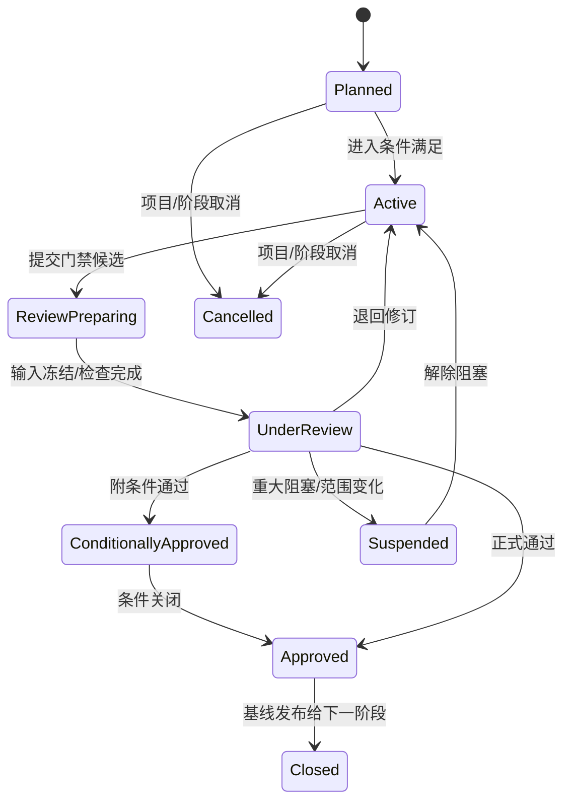

# D05 全流程阶段与阶段门

> 来源：@design/INDEX.md | 创建：2026-07-22 | 更新：2026-07-22
> 原始行范围：2409–2749
> 引用约定：同文件内引用使用 §编号，跨文件引用使用 @design/文件名.md

## D05 全流程阶段与阶段门

### D05.1 任务定义

| 项目 | 内容 |
|---|---|
| 任务目标 | 把 P0–P8 定义为可执行、可裁剪、可审计的全流程阶段与阶段门，明确每阶段输入、活动、成果、检查、责任、放行和退回 |
| 直接产出 | 阶段门元模型、状态机、P0–P8 详细规格、并行/回退/变更/例外规则、版本裁剪及追踪矩阵 |
| 成功对齐物 | 项目团队能明确“当前在哪个阶段、使用哪个基线、还缺什么、谁能放行、失败回到哪里” |
| 本任务不做 | 不细化需求字段、CDE 表结构、流程引擎实现、具体规则表达式和界面布局 |
| 上游约束 | D01 P0–P8；D02 V0–V4；D03 CAP ID；D04 角色、RACI、ABAC 和 SoD |

### D05.2 阶段门设计原则

1. 阶段门是业务质量与责任控制点，不只是计划日期或工作流节点。
2. 每次门禁评审固定输入基线；评审过程中新增版本不自动替换评审对象。
3. 阶段允许受控并行，但下游只能消费标记为 Shared 且声明用途的上游成果。
4. AI 可准备资料、运行检查和生成摘要，不得代表有责角色作放行决定。
5. 项目可合并阶段名称或门禁会议，但不能删除需求基线、专业签审、正式发布和变更控制的证据。
6. 门禁结论必须是明确状态，不使用“基本通过”“原则上没问题”等不可执行表述。

### D05.3 阶段门元模型

每个 `StageGateDefinition` 包含：

| 维度 | 必填内容 |
|---|---|
| 身份 | gateId、阶段 ID、名称、版本、适用地区/建筑类型/专业/项目级别 |
| 进入条件 | 前序门禁、需求/合同状态、必需输入、角色任命和环境条件 |
| 工作范围 | 允许活动、禁止活动、专业工作包和自动化等级 |
| 交付要求 | 必交成果类型、信息深度、格式、命名、状态和用途 |
| 质量要求 | 自动检查、人工检查、规则包、抽样、严重度和容差 |
| 决策责任 | 准备人、会签人、专业签审人、最终放行人和外部确认方 |
| 决策规则 | 通过、附条件通过、退回、暂停、取消的判定条件 |
| 退出基线 | 获批资产版本集、未关闭条件、风险、决定和下一阶段用途 |
| 退回路径 | 责任工作包、修订范围、重检要求和再次评审方式 |
| 证据 | 输入清单、检查结果、Issue、签审、会议决定、时间和策略版本 |

### D05.4 阶段与门禁状态

#### D05.4.1 阶段状态

#### D05.4.2 门禁结论

| 结论 | 含义 | 下游可否启动 | 必须记录 |
|---|---|---|---|
| Approved | 所有阻断条件满足，基线正式批准 | 是 | 批准版本集、用途、签审和风险 |
| Conditionally Approved | 无安全/关键阻断，存在有期限且不影响当前用途的条件 | 受限启动 | 条件、责任人、截止、影响和自动阻断点 |
| Rework Required | 未满足门禁，需修订后重审 | 否；仅允许退回任务 | 问题、责任、修订范围和重检要求 |
| Suspended | 外部决策、重大风险或范围不稳定 | 否 | 阻塞原因、责任方、恢复条件 |
| Cancelled | 阶段或项目终止 | 否 | 授权、资产处置、通知和归档策略 |

关键安全、法规、结构稳定和正式签审问题不允许“附条件通过”。

### D05.5 P0 前期策划与需求门（G0）

| 维度 | 设计内容 |
|---|---|
| 目的 | 把合同/机会、主创意图和基础资料转化为可执行需求基线、信息要求和项目执行约束 |
| 主能力 | CAP-02、CAP-03、CAP-04、CAP-12、CAP-15 |
| 进入条件 | 项目授权来源明确；客户/主创和内部负责人已识别；具备最小任务描述 |
| 核心活动 | 资料接收与安全检查、任务书解析、缺项/冲突澄清、地区/法规/单位/语言确认、建筑类型和专业范围确认、交付与修改规则确认、团队和工具链策划 |
| 必交成果 | 项目章程、需求基线、资料清单、RegionProfile、信息要求、阶段/专业范围、项目团队与任命、初始风险/假设/决策、交付与变更原则 |
| 自动检查 | 文件完整/可读、病毒/MIME、必填项、单位/坐标冲突、重复资料、权限和数据策略 |
| 人工检查 | 合同与设计范围一致、需求可理解、法规适用路径、资源/工具可行、敏感数据策略 |
| 责任 | PR-02 准备；PR-03/DR-01/BR-01/QR-02 会签；PR-01 最终批准；客户/主创确认业务意图 |
| 退出条件 | 需求与信息要求批准；P1 输入资产进入 Shared；未决项具责任人和最迟决策门 |
| 退回路径 | 缺资料回客户/主创；范围冲突回合同/项目管理；工具/数据不可行进入替代方案评估 |

G0 不得以“先做起来再说”绕过地区、单位、成果和责任范围；可未知的设计参数须登记为 P1/P2 决策，不得静默假设。

### D05.6 P1 概念设计门（G1）

| 维度 | 设计内容 |
|---|---|
| 目的 | 在已批准需求和场地约束下确认可深化的概念方向、功能框架、体量和核心指标 |
| 主能力 | CAP-05、CAP-06、CAP-10、CAP-11、CAP-13、CAP-15 |
| 进入条件 | G0 Approved；场地/红线/基础法规约束可用；概念设计责任和评价指标已确认 |
| 核心活动 | 草图/参考理解、场地与体量生成、功能布局、风格方向、方案候选、面积/流线/日照等快评、小样与主创确认 |
| 必交成果 | 概念说明、候选与比选、选定概念模型/草图、功能与面积表、主要分析图、关键风险/假设、客户/主创意见闭环 |
| 自动检查 | 输入版本、面积/高度/退界基础约束、候选完整性、AI 运行证据、图文引用和格式 |
| 人工检查 | 设计意图、功能逻辑、场地关系、可深化性、重大法规/结构/机电风险和表达一致性 |
| 责任 | PR-03 主责；DR-02 执行；DR-01/QR-02/结构和 MEP 代表咨询；PR-01 放行；客户/主创确认方向 |
| 退出条件 | 单一概念基线或明确保留的候选集获批；指标和未决风险进入 P2；资产进入 Shared |
| 退回路径 | 方向不符回候选生成；需求变化回 G0 变更评估；不可行风险转专项论证或暂停 |

V0 的 5–10 分钟小样是 G1 内部“方向检查点”，不是 G1 正式通过；正式通过仍需需求、比例、风格、图层/表达方向和主创确认记录。

### D05.7 P2 方案设计门（G2）

| 维度 | 设计内容 |
|---|---|
| 目的 | 将概念方向发展为平立剖、空间、立面、材料和主要技术策略一致的方案基线 |
| 主能力 | CAP-03、CAP-06、CAP-07、CAP-08、CAP-10、CAP-12、CAP-15 |
| 进入条件 | G1 Approved；概念基线、评价指标和主要风险明确；专业顾问输入责任确定 |
| 核心活动 | 平立剖深化、空间/流线、立面/材料、主要结构体系、机电系统预留、性能分析、面积指标、方案汇报和意见修订 |
| 必交成果 | 方案 BIM/几何模型、平立剖图、设计说明、面积/指标、材料/立面策略、结构/MEP 初步条件、分析报告、汇报材料、问题与决定 |
| 自动检查 | 图模基础一致、面积、楼层/轴网/坐标、命名/图层、信息要求、关键空间/疏散预检查 |
| 人工检查 | 功能与体验、造型、结构/机电可行性、法规路线、成本风险、客户意见和方案完整性 |
| 责任 | PR-03/建筑 DR-01 主责；各专业 DR-01 会签；BR-01 协调；QR-01/02 复核；PR-01 放行；客户确认方案 |
| 退出条件 | 方案模型/图纸/说明基线批准；结构与 MEP 输入条件可进入 P3；重大未决项具关闭计划 |
| 退回路径 | 专业不可行回方案深化；重大概念变化回 G1；需求/合同变化回 G0/G7 变更流程 |

### D05.8 P3 扩初设计门（G3）

| 维度 | 设计内容 |
|---|---|
| 目的 | 冻结主要构造、结构和机电系统及跨专业条件，为施工图生产建立稳定技术基线 |
| 主能力 | CAP-07、CAP-08、CAP-09、CAP-10、CAP-12、CAP-15 |
| 进入条件 | G2 Approved；各专业工作包、模型拆分、坐标、信息深度和工具链确认 |
| 核心活动 | 构件/系统深化、主要节点、机房/竖井/设备、结构体系、管综预协调、洞口/荷载/净高条件、主要材料与做法、性能验证 |
| 必交成果 | 各专业扩初模型/图纸、主要计算/仿真结果、系统说明、主要节点、专业条件清单、联邦模型、碰撞/风险报告、施工图执行计划 |
| 自动检查 | 坐标/单位/模型版本、IDS/信息深度、主要碰撞、净高/净距、构件分类、专业条件完整性 |
| 人工检查 | 技术系统可实施性、主要计算合理性、专业接口、构造可施工性、成本和关键规范风险 |
| 责任 | 各 DR-01 对本专业负责；BR-01 联邦协调；DR-03/04 校审；QR-01/02 复核；PR-01 综合放行 |
| 退出条件 | 主要技术系统和条件批准；阻断级综合冲突关闭；P4 图纸/模型任务和输入基线冻结 |
| 退回路径 | 单专业问题回对应工作包；跨专业冲突回协调；系统级方案变化回 G2；需求变化进入 G7 |

### D05.9 P4 施工图设计门（G4）

| 维度 | 设计内容 |
|---|---|
| 目的 | 完成各专业可校审的施工图模型、图纸、说明、计算和明细候选集 |
| 主能力 | CAP-05、CAP-07、CAP-08、CAP-10、CAP-12、CAP-13、CAP-15 |
| 进入条件 | G3 Approved；专业输入、图纸目录、模板、规则、工作包、校审人和交付深度已冻结 |
| 核心活动 | 专业建模/计算/出图、详图/节点、标注/明细/说明、工具自动化、AI 候选复核、自校、校对和专业间持续条件交换 |
| 必交成果 | 建筑/结构/给排水/暖通/电气及专项模型、图纸、计算书、说明、设备/材料/构件明细、自校/校对记录、AI/工具运行证据 |
| 自动检查 | 图层/图签/字体/外参、图号/目录、模型信息、图模/明细一致性、专业规则、文件可打开和出图预览 |
| 人工检查 | 专业正确性、计算与模型一致、构造/系统可施工、详图索引、说明完整、AI 结果接受和修改 |
| 责任 | DR-02 生产与自校；DR-03 校对；DR-01 负责专业提交；BR-01/CAD 经理支撑标准；AI/平台仅辅助 |
| 退出条件 | 各专业候选集完成自校/校对；输入版本和专业提交声明固定；可进入 P5 综合校审 |
| 退回路径 | 生产缺陷回原任务；输入条件变化进入受控影响；系统级问题回 G3；重大方案变化回 G2/G7 |

G4 通过表示“可进入综合审核”，不表示可发布。设计者不得是高风险成果的唯一审核/审定人。

### D05.10 P5 综合校审门（G5）

| 维度 | 设计内容 |
|---|---|
| 目的 | 对固定多专业候选集完成联邦协调、专业审核/审定、规范/标准和图模一致性检查 |
| 主能力 | CAP-09、CAP-10、CAP-13、CAP-14、CAP-15 |
| 进入条件 | 各专业 G4 提交完成；联邦输入版本、坐标、容差、规则包和签审角色固定 |
| 核心活动 | 模型联邦、硬/软碰撞、专业条件核验、企业/规范规则、图模/计算/明细一致性、审核/审定、问题修订和复核 |
| 必交成果 | 联邦快照、碰撞报告、规则报告、校审记录、Issue/BCF 闭环、例外/豁免、各专业签审、发布候选集 |
| 自动检查 | 输入哈希、规则版本、阻断问题、签审完整性、图纸目录、跨专业一致性和历史问题回归 |
| 人工检查 | 误报判断、专业审核/审定、法规适用解释、例外合理性、综合可施工性和剩余风险 |
| 责任 | DR-04/05 负责专业审核/审定；BR-01 协调；QR-01/02 质量/法规复核；PR-01 最终综合决定 |
| 退出条件 | 阻断问题为 0；高风险例外已批准；签审齐全；候选集冻结并具发布用途 |
| 退回路径 | 问题按专业/工作包退回 P4；系统级冲突回 P3；需求/方案变化进入 G7 并重开受影响门禁 |

### D05.11 P6 发布与交付门（G6）

| 维度 | 设计内容 |
|---|---|
| 目的 | 将已批准候选集转化为不可变 Published 发布集和可证明的正式交付 |
| 主能力 | CAP-04、CAP-10、CAP-11、CAP-14、CAP-15 |
| 进入条件 | G5 Approved；发布候选集冻结；接收方、用途、格式、命名、传输和签收要求明确 |
| 核心活动 | 最终目录/版本/签审检查、批量出图、格式转换、清单/校验和、打包、Published 状态、Transmittal、发送、签收和失败补偿 |
| 必交成果 | 不可变发布集、图纸/模型/说明/计算/报告清单、校验和、Transmittal、发送/访问日志、签收/拒收记录 |
| 自动检查 | 资产版本、文件可读、命名、清单、签审、阻断问题、权限、病毒、链接时效和校验和 |
| 人工检查 | 发布用途、合同完整性、敏感信息、例外条件、接收方和最终预览 |
| 责任 | PR-02 准备/发送；DR-01/05 专业确认；BR-01/CAD 经理出图条件确认；QR-01 门禁；PR-01 批准；外部方签收 |
| 退出条件 | 发布和 Transmittal 成功；接收方确认或形成可证明送达；交付基线可进入反馈/关闭 |
| 退回路径 | 技术/打包失败留在 G6 修复；成果内容问题回 G5/P4；接收方范围异议回项目管理/变更评估 |

正式交付链接撤销不删除发布证据；错误发布需执行“撤销声明+替代发布”，不得静默覆盖 Published 资产。

### D05.12 P7 反馈与变更门（G7）

| 维度 | 设计内容 |
|---|---|
| 目的 | 将客户、审查、现场或内部反馈转化为经评估批准的设计变更并建立新基线 |
| 主能力 | CAP-02、CAP-03、CAP-05、CAP-09、CAP-10、CAP-11、CAP-14 |
| 进入条件 | 反馈锚定明确发布/共享版本；提出方、来源、用途和时限可识别 |
| 核心活动 | 意见归并、分类、免费修改/重大变更判定、影响分析、费用/周期/风险评估、批准、任务分派、修订、重检、重签审和重发 |
| 必交成果 | 反馈集、变更申请、影响矩阵、批准/拒绝、修订任务、差异、重检/签审、新发布集和关闭证据 |
| 自动检查 | 重复意见、来源版本、受影响需求/资产/专业/问题/规则/交付、免费轮次和状态完整性 |
| 人工检查 | 设计意图、合同范围、技术影响、费用/周期、专业责任和是否重开 G1–G6 |
| 责任 | PR-02 组织评估；PR-01 批准；DR-01 评估专业影响；客户确认商务/意图；校审角色复核修订 |
| 退出条件 | 变更已批准执行并完成受影响门禁，或有理由拒绝/取消；新旧发布基线关联；反馈方收到结果 |
| 退回路径 | 信息不足回提出方；商务未批准暂停；重大范围变化重开 G0；技术影响按矩阵回 G1–G6 |

反馈分为两条互斥路径：

- **Shared Review Feedback：** 锚定 Shared 小样/概念/方案基线，形成 `DesignFeedback` 和阶段内 Revision；按 G1/G2 评审规则重新确认，不创建正式发布后 DesignChange。
- **Published Change：** 锚定 Published/Transmittal，形成 `DesignChange`，执行影响分析、商务批准、重检、重签审和替代发布。

“两轮免费修改”可覆盖合同声明的 Shared Review 或 Published Change 意见批次，但必须在 PricePolicy 中分别配置；同一批次补充说明不重复计次，新增需求或重大布局/系统变化进入正式变更评估。具体合同规则在 D08 细化。

正式外部送审使用 `AuthoritySubmission/ExternalReviewCase`，不退化为普通 Transmittal/评论：状态为 Draft→Submitted→Accepted/CorrectionRequested→UnderReview→CommentsIssued→Responded→Resubmitted→Approved/Rejected/Withdrawn。每个 Case 固定主管机构、用途、送审清单/版本、受理回执、意见批次、逐条回复、复审结论和外部证据；Comments 映射到 Issue/DesignChange，外部批准不替代内部专业责任与签审。

### D05.13 P8 项目关闭与归档门（G8）

| 维度 | 设计内容 |
|---|---|
| 目的 | 完成合同/项目关闭、资产归档、权限回收、经验沉淀和长期保留 |
| 主能力 | CAP-01、CAP-02、CAP-04、CAP-11、CAP-12、CAP-14 |
| 进入条件 | 最终交付完成；未关闭变更、索赔、问题和交付例外已处理或正式接受 |
| 核心活动 | 最终清单、归档包、保留/删除策略、权限/链接/设备撤销、审计冻结、指标结算、经验/资产授权与脱敏、复盘 |
| 必交成果 | 最终归档清单、发布/变更索引、权限回收记录、保留计划、项目指标、复盘和经批准的知识资产 |
| 自动检查 | 未关闭任务/Issue/变更、外链、临时权限、保留标签、备份/归档完整和哈希 |
| 人工检查 | 合同义务、法律保留、知识复用授权、敏感信息、经验和剩余风险 |
| 责任 | PR-02 准备；PR-01 批准；各 DR-01/BR-01/QR-01 会签；SR-02/03 执行权限与保留；审计只读核验 |
| 退出条件 | 项目 Archived；普通权限撤销/只读；审计和发布证据可检索；知识资产独立批准后发布 |
| 退回路径 | 未关闭交付/变更回 G6/G7；归档不完整留在 G8；法律保留冲突由合规决定 |

### D05.14 阶段输入输出基线链

| 门禁 | 批准输入基线 | 形成的输出基线 | 主要 CDE 状态 |
|---|---|---|---|
| G0 | 原始合同/任务/资料 | Requirement Baseline | WIP→Shared |
| G1 | Requirement Baseline | Concept Baseline | WIP→Shared |
| G2 | Concept Baseline | Schematic Baseline | WIP→Shared |
| G3 | Schematic Baseline | Developed Design Baseline | WIP→Shared |
| G4 | Developed Design Baseline | Discipline Submission Baseline | WIP→Shared |
| G5 | Discipline Submission Baseline | Release Candidate Baseline | Shared（冻结候选） |
| G6 | Release Candidate Baseline | Published/Transmittal Baseline | Shared→Published |
| G7 | Published/Shared Feedback Baseline | Change Baseline/New Published Baseline | WIP→Shared→Published |
| G8 | Final Published Baseline | Archive Baseline | Published→Archived |

后续阶段引用基线 ID 和资产版本，不复制“最新文件”。基线一旦批准不可原地修改；变更创建新基线并保持前后关系。

### D05.15 并行与渐进深化规则

| 情况 | 允许条件 | 禁止条件 | 控制方式 |
|---|---|---|---|
| P2/P3 专业提前介入 | 使用已声明用途的 Shared 概念/方案版本 | 把未批准候选当正式输入 | 标记临时条件、到期和重验任务 |
| P3/P4 局部施工图先行 | 局部范围稳定且项目总负责批准 | 关键系统/法规风险未解决 | 局部基线、范围边界、下游风险声明 |
| 多专业并行生产 | 坐标、拆分、条件和交换节奏已定 | 各自使用不一致基线 | 联邦快照和条件版本 |
| 校审与生产滚动 | 图纸包边界独立、签审链完整 | 同一资产在评审中被覆盖 | 固定候选版本、修改建新版本 |
| 发布包分批交付 | 合同用途和批次边界明确 | 批次间关键依赖未声明 | 每批独立 Transmittal 和依赖清单 |

并行提高效率但不能打破信息使用状态；“提前开始”产生的返工风险必须由批准人接受并可量化。

### D05.16 回退与重开规则

| 变化级别 | 示例 | 最小重开范围 |
|---|---|---|
| L1 表达/非技术修订 | 拼写、版式、非技术说明 | 当前工作包检查，不重开阶段门 |
| L2 单专业局部技术修订 | 局部门窗、设备位置、非系统节点 | P4 专业校审+受影响 P5 检查 |
| L3 跨专业技术变更 | 洞口、机房、结构构件、主干管线 | P3/P4/P5 受影响专业和联邦检查 |
| L4 方案/系统级变化 | 布局、核心筒、结构体系、主要机电系统 | 重开 G2/G3 及全部下游受影响门禁 |
| L5 需求/合同/法规根本变化 | 用途、规模、地区法规、合同交付范围 | 重开 G0 并执行完整影响分析 |

重开不抹除原审批；原门禁记录转为 Superseded，并关联新评审。影响分析不足时取更高等级处理。

### D05.17 条件通过与例外管理

附条件通过项必须具备：唯一 ID、非关键分类、影响说明、责任人、完成期限、验证人、阻断的后续动作和超期升级。满足以下任一条件禁止附条件通过：

- 涉及结构安全、消防疏散、关键法规和法定签审缺失。
- 影响当前阶段成果的基本可用性或下游专业关键输入。
- 无明确解决方案、责任人或可验证关闭条件。
- 依赖未获授权的数据、工具或 AI 输出。

例外/豁免遵循 D04 SOD-04；豁免规则结论不等于修改规则本身，必须绑定项目、资产版本、适用范围和期限。

### D05.18 V0–V4 阶段裁剪

| 版本 | 阶段使用方式 | 不可裁剪证据 |
|---|---|---|
| V0 | G0、G1、轻量 G2、G5、G6、G7；G3/G4 以初步模型/CAD 生产工作包嵌入 G2 | 需求基线、主创方向确认、双级审校、发布清单、修改/变更记录 |
| V1 | 完整 G0–G8，建筑专业为主；结构/MEP 以条件会签参与 G2/G3/G5 | 建筑签审、施工图候选/发布基线、变更重开链 |
| V2 | 完整 G0–G8 和多专业 G3–G5 | 各专业提交、模型联邦、碰撞闭环和综合签审 |
| V3 | G0–G8 增加规范、图模一致性、工程量和 AI 评测门禁 | 规则来源、例外、评测和量化证据 |
| V4 | G0–G8 支持多组织、多地区、专项专业和生态交付 | 跨组织授权、驻留、专项签审和外部系统证据 |

项目规模裁剪只能减少成果数量和参与专业，不能改变同类成果的质量、责任和发布控制。

### D05.19 阶段—能力—角色追踪

| 阶段 | 主 CAP | 主负责角色 | 必须会签 | 最终放行 |
|---|---|---|---|---|
| P0/G0 | CAP-02/03/04 | PR-02 | PR-03、相关 DR-01、BR-01、QR-02 | PR-01+客户意图确认 |
| P1/G1 | CAP-06 | PR-03 | 建筑 DR-01、顾问专业、QR-02 | PR-01+客户/主创 |
| P2/G2 | CAP-06/07/08 | PR-03/建筑 DR-01 | 结构/MEP DR-01、BR-01、QR | PR-01+客户 |
| P3/G3 | CAP-07/08/09 | 各 DR-01 | BR-01、DR-03/04、QR | PR-01 |
| P4/G4 | CAP-07/08 | 各 DR-01 | DR-03、BIM/CAD | 各 DR-01 提交 |
| P5/G5 | CAP-09/10 | DR-04/05、BR-01 | QR-01/02、各 DR-01 | PR-01 |
| P6/G6 | CAP-11 | PR-02 | DR-01/05、BR/CAD、QR | PR-01；外部签收 |
| P7/G7 | CAP-03/09/11 | PR-02、受影响 DR-01 | 校审、BIM、QR、客户 | PR-01/合同授权方 |
| P8/G8 | CAP-01/04/11/12/14 | PR-02 | DR、BR、QR、管理员 | PR-01 |

### D05.20 门禁指标

| 指标 | 定义 | 用途 |
|---|---|---|
| Gate First-pass Rate | 首次评审通过数/评审总数 | 识别上游质量和准备度 |
| Gate Rework Time | 退回到重新提交的有效时间 | 衡量返工损耗 |
| Conditional Aging | 附条件项从批准到关闭时间 | 防止条件长期悬挂 |
| Baseline Volatility | 阶段批准后重开/变更次数 | 识别需求和决策稳定性 |
| Downstream Escape | 后续阶段发现的上游应发现问题数 | 质量护栏 |
| Evidence Completeness | 门禁必需证据完整项/总项 | 审计和责任护栏，目标 100% |

指标按地区、建筑类型、专业、阶段和版本分组，不以降低检查范围提升通过率。

### D05.21 D05 验收条件（EARS）

- When 阶段门评审开始, the 平台 shall 固定输入基线和资产版本，评审中新增版本不得静默替换。
- When 门禁结论产生, the 平台 shall 只允许 Approved、Conditionally Approved、Rework Required、Suspended 或 Cancelled。
- While 存在安全、关键法规、结构稳定或签审缺失问题, when 门禁评审, the 平台 shall 禁止附条件通过。
- When 下游阶段提前启动, the 平台 shall 记录使用的 Shared 版本、批准用途、风险接受人和强制重验点。
- When G4 通过, the 平台 shall 仅将成果标记为可进入综合校审，不得直接发布。
- When G5 放行, the 平台 shall 验证阻断问题为零、例外获批、专业签审齐全且发布候选集已冻结。
- When G6 发布, the 平台 shall 创建不可变 Published 版本和 Transmittal，不覆盖既有发布集。
- When 已发布成果发生内容错误, the 平台 shall 使用撤销声明和替代发布，不删除原发布证据。
- When 反馈或变更达到 L3–L5, the 平台 shall 按影响级别重开相应阶段门并将原审批标记为被替代。
- When 项目采用 V0 裁剪, the 流程 shall 仍保留需求、主创确认、双级审校、发布和变更证据。
- When 项目进入 G8, the 平台 shall 检查未关闭任务、问题、变更、外链、临时权限和保留策略。

### D05.22 D05 完成检查与下游约束

| 检查项 | 结果 |
|---|---|
| 是否完整定义 P0–P8/G0–G8 | 是 |
| 是否为每阶段定义输入、活动、成果、检查、责任、退出和退回 | 是 |
| 是否支持并行但保护基线和 CDE 状态 | 是 |
| 是否定义条件通过、重开、例外和取消 | 是 |
| 是否支持 V0–V4 裁剪且不删除关键证据 | 是 |
| 是否落实 D04 专业任命和 SoD | 是 |
| 是否进入流程引擎、数据库或界面实现 | 否，符合 D05 边界 |

D05 对下游的强制约束：D06 的需求基线对应 G0；D07 为每个门禁提供不可变 Baseline 和 CDE 状态；D08 将门禁、任务、SLA、重试和补偿编排为可执行流程；D09–D17 的阶段成果必须满足对应 G1–G5；D35 事件中必须包含 GateSubmitted/Approved/Reopened；D37 界面必须呈现门禁缺项、条件、退回和重开状态。

