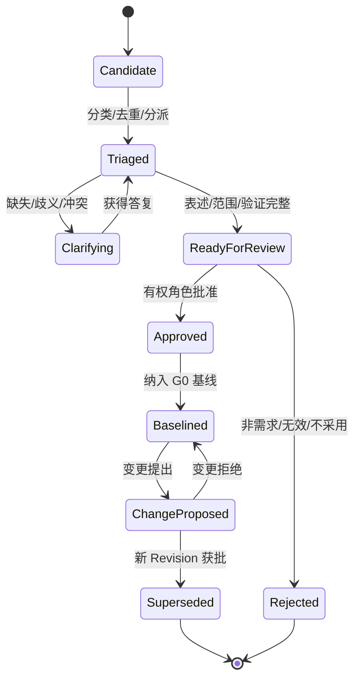

# D06 需求与信息要求模块

> 来源：@design/INDEX.md | 创建：2026-07-22 | 更新：2026-07-22
> 原始行范围：2750–3027
> 引用约定：同文件内引用使用 §编号，跨文件引用使用 @design/文件名.md

## D06 需求与信息要求模块

### D06.1 任务定义

| 项目 | 内容 |
|---|---|
| 任务目标 | 将多格式、跨语言、持续变化的客户/合同/法规/专业输入转化为可澄清、可批准、可追踪、可变更的需求与信息要求基线 |
| 直接产出 | 模块边界、分类法、领域对象、状态机、采集/提取/澄清/基线/变更流程、信息要求模型、追踪规则、校验、指标和验收 |
| 成功对齐物 | 每条正式需求能回答来源、含义、适用范围、责任、交付阶段、验证方式、当前版本和实现证据 |
| 本任务不做 | 不定义物理表、API 字段、OCR/LLM 模型实现和页面线框；分别由 D25、D34、D35、D37 完成 |
| 主能力 | CAP-03，依赖 CAP-02/04/05/10/12/13，向 CAP-06–11 输出基线 |

### D06.2 模块职责边界

**负责：** 原始输入登记、候选需求提取、需求分类、澄清、冲突/重复处理、信息要求、审批基线、追踪、变更和状态统计。

**不负责：** 存储文件二进制（CAP-04）、执行设计任务（CAP-05–08）、运行正式规则检查（CAP-10）、管理规范全文生命周期（CAP-12）、决定 AI 模型路由（CAP-13）。

### D06.3 需求分类体系

| 分类代码 | 类别 | 示例 | 默认验证方式 |
|---|---|---|---|
| REQ-BIZ | 业务/合同 | 交付范围、轮次、时限、费用边界 | 合同/客户批准与流程记录 |
| REQ-FUN | 功能空间 | 房间、面积、邻接、流线、容量 | 模型/空间表/图纸/人工评审 |
| REQ-DES | 设计意图 | 风格、形态、材料、体验和表达 | 主创/客户评审和方案证据 |
| REQ-SITE | 场地环境 | 红线、地形、朝向、景观、气候 | GIS/测绘/分析与人工核验 |
| REQ-REG | 法规规范 | 高度、退界、疏散、无障碍、节能 | 规则/计算/专家复核 |
| REQ-TEC | 专业技术 | 结构体系、机电系统、设备和构造 | 专业模型、计算、图纸和签审 |
| REQ-INF | 信息要求 | 对象、属性、格式、深度、阶段和责任 | IDS/数据检查/交付清单 |
| REQ-STD | 企业/客户标准 | 图层、图签、字体、命名、族/块 | 标准规则检查 |
| REQ-DLV | 成果交付 | DWG/RVT/IFC/PDF/PPT、页数、语言 | Transmittal 完整性检查 |
| REQ-DAT | 数据安全 | 驻留、跨境、保密、训练限制、保留 | 策略/审计/供应商路由检查 |
| REQ-NFR | 平台非功能 | 性能、容量、可用性、恢复、兼容 | 测试/监控/演练 |
| REQ-ASM | 假设/约束 | 暂定人数、待测标高、未知设备参数 | 决策关闭或风险接受 |

每条需求只能有一个主分类，可添加多个标签；分类用于责任和验证路由，标签用于检索，避免同一需求在多个类别复制。

### D06.4 输入来源与可信度

| 来源等级 | 来源 | 权威性 | 处理规则 |
|---|---|---|---|
| S1 法定/合同 | 法规原文、批准文件、签署合同、正式变更 | 最高 | 需验证版本、签署/发布日期和适用范围 |
| S2 正式客户 | 任务书、正式邮件/会议决定、客户门户确认 | 高 | 需关联确认人和项目基线 |
| S3 专业决定 | 已批准会议纪要、专业条件、负责人决定 | 中高 | 需有权限主体和适用专业/阶段 |
| S4 参考资料 | 历史项目、参考案例、风格图、未批准说明 | 中低 | 只能形成候选/参考，不自动成为约束 |
| S5 AI 推断 | OCR/LLM/视觉识别出的候选含义 | 未确认 | 必须引用原文/图像位置并经人确认 |

冲突优先级默认 S1>S2>S3>S4>S5；同级冲突不自动合并，进入澄清。法规适用冲突由 QR-02 解释，合同与客户指令冲突由 PR-02/PR-01 组织决策。

### D06.5 领域对象

| 对象 | 核心职责 | 关键字段语义 |
|---|---|---|
| RequirementSource | 记录原始依据及位置 | sourceAssetVersion、页/段/坐标/时间、来源等级、语言、权威主体 |
| RequirementCandidate | AI/人工提取的未确认候选 | 原文、规范化表述、置信度、提取器版本、来源引用、建议分类 |
| Requirement | 经确认的原子需求 | reqId、标题、陈述、主分类、优先级、适用范围、责任、验证方式 |
| Clarification | 针对缺失/歧义/冲突的问题闭环 | 问题、选项、回答者、截止、答复、影响和关闭证据 |
| InformationRequirement | 对交付信息的结构化约束 | 目的、对象、属性、阶段、责任、格式、深度、质量和验证 |
| RequirementRelation | 需求间关系 | derivesFrom、dependsOn、conflictsWith、duplicates、supersedes、refines |
| TraceLink | 需求与实现证据的关联 | 目标类型/ID、关系类型、版本、创建者和验证状态 |
| RequirementBaseline | 某次批准的不可变需求集合 | baselineId、范围、需求版本集、批准、用途、生效时间 |
| RequirementChange | 对基线需求的受控修改 | 来源、变化前后、原因、影响、批准、实施和关闭 |
| DecisionRecord | 关闭歧义/冲突的决定 | 决策、选项、理由、批准人、影响和有效范围 |

Requirement 采用原子性原则：一个条目只表达一个可独立验证的义务；“平面合理、符合规范并按时交付”必须拆成多条。

### D06.6 标识与版本规则

- 需求稳定标识格式：`REQ-{项目代码}-{分类}-{序号}`，例如 `REQ-A01-FUN-0042`；序号不因排序或阶段变化重用。
- Requirement 每次实质修改创建新 Revision；标题纠错也保留审计，但可标记为非实质变更。
- Baseline 固定需求 Revision 集，不引用“当前最新需求”。
- 被 Superseded 的需求保留历史追踪，不从已发布基线删除。
- 来源文件更新不自动改需求；系统生成“来源变化待评估”任务。

### D06.7 需求状态机

AI 只能创建 Candidate 或对现有条目提出 ChangeProposed，不得直接进入 Approved/Baselined。

### D06.8 端到端处理流程

1. **登记来源：** 上传/关联文件、会议、邮件或外部系统记录，完成安全、权限、语言和版本检查。
2. **预处理：** OCR/版面/语言识别，保留原文位置和转换派生版本。
3. **候选提取：** AI/人工生成原子候选、分类、实体、数值、单位、条件和置信度。
4. **分诊：** 去重、冲突检测、责任专业和验证方式建议；低置信或无引用候选不得自动进入评审。
5. **澄清：** 生成问题、建议选项、影响和最迟决策阶段，分派给有权答复人。
6. **规范化：** 使用 EARS 或领域模板形成无歧义陈述，保留原始语义和来源引用。
7. **评审批准：** 按分类路由项目、主创、专业、法规、数据安全角色；检查 SoD 和授权。
8. **建立基线：** 固定批准 Revision 集、未决假设、适用范围和 G0 证据。
9. **追踪验证：** 关联工作包、资产、规则、检查、Issue、阶段门和交付证据。
10. **变更控制：** 来源更新或指令触发差异与影响分析，按 D05 L1–L5 重开相应门禁。

### D06.9 AI 提取与人工复核规则

| 置信区间 | 系统处理 | 人工要求 |
|---|---|---|
| ≥0.90 且有精确引用 | 自动进入 Triaged 待评审队列 | 批量确认允许，但逐项可查看引用 |
| 0.70–0.89 | 保持 Candidate 并高亮不确定字段 | 逐项确认/修正 |
| <0.70 或引用缺失 | 标记低置信，不参与基线候选统计 | 回看原文或人工重新录入 |
| 数值/单位/法规/安全/合同条款 | 无论置信度均标记高风险字段 | 对应责任角色逐项确认 |

阈值是初始设计值，D25 用金样评测后调整。系统必须并列展示原文、规范化表述和差异；人工修改不能覆盖原始候选和提取证据。

### D06.10 澄清类型与关闭规则

| 类型 | 触发 | 关闭要求 |
|---|---|---|
| Missing | 必需信息缺失 | 获得明确值或批准假设/不适用 |
| Ambiguous | 存在多种解释 | 选择一种解释并说明适用范围 |
| Conflict | 两个权威来源矛盾 | 有权角色决定优先项并处理受影响需求 |
| Infeasible | 技术/成本/时间不可行 | 形成替代方案、风险和批准决定 |
| Non-verifiable | 无法客观验证 | 增加验收方法或明确主观评审角色 |
| Out-of-scope | 超出合同/版本范围 | 确认拒绝、进入变更或后续版本 |
| Source-invalid | 来源过期、无权或不完整 | 替换合法来源或拒绝候选 |

澄清答复必须来自具备对应权限的主体；聊天评论不能自动关闭正式 Clarification。

### D06.11 信息要求层级

| 层级 | 定义 | 本平台处理 |
|---|---|---|
| OIR | 企业运营与治理所需信息 | 企业模板、指标、项目组合和归档要求 |
| AIR | 资产使用/运维所需信息 | 若合同涉及资产交付，映射到交付属性和格式 |
| PIR | 项目决策和管理所需信息 | 阶段、风险、成本、设计与审查信息 |
| EIR | 委托方对项目交换信息的要求 | 形成项目交付、格式、时间、责任和质量基线 |
| Exchange Requirement | 某次阶段/专业交换的具体要求 | 映射到工作包、资产类型、属性、规则和门禁 |
| IDS | IFC 场景下机器可读的信息交付规范 | 作为 Exchange Requirement 的可执行派生物，不替代业务原文 |

### D06.12 InformationRequirement 结构

每条信息要求必须回答：

- **Why：** 信息目的和支持的业务决策。
- **What：** 对象/分类/属性/关系/文档或成果。
- **When：** P0–P8 阶段、交换事件和截止条件。
- **Who：** 生产、校核、批准和接收角色/专业。
- **How：** 原生/开放格式、坐标、单位、语言、命名和交换方式。
- **How much：** 信息深度、几何精度、属性完整性、允许值和容差。
- **How verified：** IDS/规则/脚本/人工检查、严重度和验收证据。
- **For what use：** 参考、协调、审查、施工、报价、运维等批准用途。

### D06.13 原始境外场景需求模板

| 分组 | 必填项 |
|---|---|
| 项目 | 项目名、国家/城市、建筑类型、规模、时区、主创/客户、保密级别 |
| 输入 | 草图/照片/PDF/白板/参考风格清单、来源、比例/尺寸依据、清晰度 |
| 标准 | 语言、单位、图层、字体、图例、图签、命名、目标工具版本 |
| CAD | 平面范围、墙/门窗/楼梯/轴线/尺寸/面积要求、DWG/PDF 版本 |
| 模型 | SKP/3DM/RVT/IFC 目标、标高、场地、体块、材质和精度 |
| 分析图 | 功能、流线、消防、服务、景观、朝向、日照、通风、表达风格 |
| 汇报 | PPT 页数、结构、版式、语言、封面/目录、PPTX/PDF/INDD |
| 交付 | 截止、阶段、清单、源文件、传输、接收人、签收和用途 |
| 修改 | 免费轮次定义、意见批次、响应窗口、重大变更判定和费用规则 |
| 质量 | AI 检查、人工精修、中级校核、高级终审和阻断项 |

### D06.14 需求质量规则

| 规则 | 合格标准 | 失败处置 |
|---|---|---|
| 原子性 | 一条需求只含一个可独立验证义务 | 拆分并建立 derivesFrom |
| 明确性 | 主体、动作、对象和条件明确 | 进入 Ambiguous 澄清 |
| 可验证性 | 存在检查方法和期望证据 | 增加验证或指定主观评审人 |
| 可追踪性 | 至少一个合法来源引用 | 无来源则保持 Candidate |
| 一致性 | 与基线需求无未决冲突 | 建立 Conflict 并阻断基线 |
| 可行性 | 有实现路径或已批准风险 | 进入 Infeasible 评估 |
| 范围完整 | 地区、建筑、专业、阶段和成果范围明确 | 补充适用范围 |
| 单位明确 | 数值含单位、精度和容差 | 高风险字段逐项确认 |
| 责任明确 | 生产/批准/验证角色可识别 | 阻断 ReadyForReview |
| 有效性 | 来源版本有效且有权 | 替换来源或拒绝 |

### D06.15 重复、冲突与派生规则

- 重复候选不删除，标记 `duplicates` 并选择主 Requirement；保留各来源引用。
- 更具体的需求通过 `refines` 细化上位需求，不静默覆盖。
- 新法规/客户指令替代旧需求使用 `supersedes`；旧条目保留历史基线关系。
- 冲突必须记录双方来源、影响和决策，不允许按 AI 置信度决定权威来源。
- 同一数值经单位换算后比较，保留原单位和规范化单位，禁止浮点隐式舍入。

### D06.16 追踪关系

| Trace 类型 | 来源→目标 | 含义 |
|---|---|---|
| satisfies | Requirement→Asset/WorkPackage | 成果/工作实现需求 |
| verifies | Check/Approval→Requirement | 检查/审批验证需求 |
| constrains | Requirement→Stage/Capability/Tool | 需求约束阶段、能力或工具 |
| derivedAs | InformationRequirement→IDS/Rule | 业务要求派生为可执行规范 |
| affectedBy | Requirement→Issue/Change | 问题/变更影响需求 |
| deliveredBy | Requirement→Transmittal Item | 交付项证明需求交付 |

基线前要求每条 Approved 需求至少有关联责任和验证方式；G1 以后要求关联阶段/工作包；G5 要求关联实现和验证证据；G6 要求交付需求关联 Transmittal 项。

### D06.17 基线与变更流程

#### 建立基线

1. 选择 ReadyForReview/Approved 需求 Revision。
2. 执行质量、冲突、权限和未决澄清检查。
3. 生成基线候选清单和与前一基线差异。
4. 按分类完成客户/项目/专业/法规/数据角色会签。
5. PR-01 批准，生成不可变 Baseline ID、用途和生效时间。

#### 变更影响

RequirementChange 至少分析：受影响阶段门、工作包、模型/图纸/计算、专业条件、规则/IDS、Issue、已发布集、费用、周期、数据策略和 AI 评测。根据 D05 L1–L5 确定重开范围。

### D06.18 异常与降级

| 异常 | 处理 |
|---|---|
| OCR/LLM 不可用 | 进入人工录入队列，保留来源和任务 SLA |
| 无法解析文件 | 标记 Source-invalid，要求可读格式或人工核验 |
| 翻译不确定 | 并列原文/译文，专业术语进入人工确认 |
| 来源更新 | 生成差异和影响任务，不自动更新基线 |
| 客户未按时答复 | 提醒/升级；可批准假设但记录最迟关闭门禁 |
| 冲突长期未决 | 阻断对应需求基线或暂停受影响工作包 |
| 外部系统重复推送 | 使用来源事件幂等键，关联同一 Source/Change |

### D06.19 指标

| 指标 | 定义 |
|---|---|
| Requirement Coverage | 关联实现和验证证据的有效需求/有效需求总数 |
| Clarification Cycle Time | 澄清创建到有权主体关闭的有效时间 |
| Ambiguity Escape | 后续阶段发现的 G0 应澄清歧义数 |
| Source Trace Completeness | 具合法精确来源的正式需求/正式需求总数 |
| AI Extraction Precision/Recall | 在金样集上按需求条目和关键字段评测 |
| Baseline Volatility | 基线后实质变更数/基线需求数 |
| Change Impact Completeness | 关闭前已核验影响维度/适用影响维度 |

Source Trace Completeness 和 Requirement Coverage 在正式发布前目标为 100%；AI 指标不替代人工基线质量。

### D06.20 D06 验收条件（EARS）

- When 原始资料进入需求模块, the 平台 shall 保存来源资产版本和页/段/坐标/时间引用。
- When AI 提取需求, the 平台 shall 仅创建 Candidate，并记录模型/提示版本、置信度和原文引用。
- While 候选缺少合法来源, when 用户尝试批准, the 平台 shall 阻止操作。
- When 数值、单位、法规、安全或合同字段被提取, the 平台 shall 无论置信度要求有权角色逐项确认。
- When 同级权威来源冲突, the 平台 shall 创建 Conflict 澄清，不按 AI 置信度自动选择。
- When Requirement 进入 ReadyForReview, the 平台 shall 验证原子性、明确性、可验证性、范围、责任和来源。
- When G0 建立需求基线, the 平台 shall 固定 Requirement Revision 集、批准链、用途和生效时间。
- When 来源文件更新, the 平台 shall 创建差异评估任务，不自动修改已批准需求。
- When 信息要求派生为 IDS 或规则, the 平台 shall 保留 derivedAs 关系和业务原文。
- When G5 评审开始, the 平台 shall 检查适用需求均具实现与验证证据或已批准例外。
- When G6 交付, the 平台 shall 将交付类需求关联到具体 Transmittal Item。
- When 需求变更获批, the 平台 shall 创建新 Revision/Baseline 并按 D05 影响级别重开门禁。

### D06.21 D06 完成检查与下游约束

| 检查项 | 结果 |
|---|---|
| 是否区分来源、候选、正式需求、信息要求、基线和变更 | 是 |
| 是否定义分类、可信度、状态和原子性 | 是 |
| 是否防止 AI 静默改写或批准需求 | 是 |
| 是否覆盖 OIR/AIR/PIR/EIR/Exchange Requirement/IDS | 是 |
| 是否覆盖原始境外场景必填需求 | 是 |
| 是否建立实现、验证和交付追踪 | 是 |
| 是否与 G0/G1/G5/G6/G7 对齐 | 是 |
| 是否进入物理数据、API 或页面实现 | 否，符合 D06 边界 |

D06 对下游的强制约束：D07 存储来源资产、Baseline 和 Trace 目标版本；D08 编排提取、澄清、审批和变更 SLA；D09–D17 的模块以 Requirement Baseline 为输入；D20/21 将规范知识和规则通过 derivedAs 关联业务要求；D25 评测候选提取；D34/35 实现稳定 ID、Revision、关系和事件；D37 呈现原文—候选—正式需求差异。

