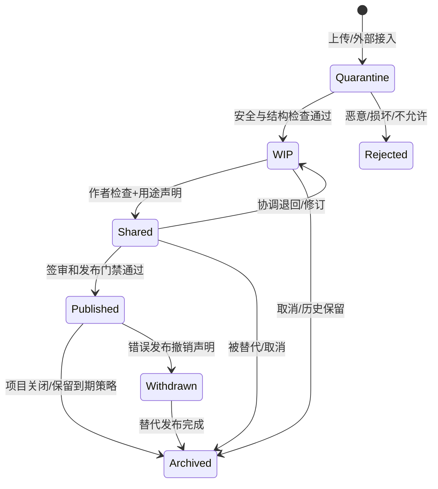

# D07 CDE领域与版本模型

> 来源：@design/INDEX.md | 创建：2026-07-22 | 更新：2026-07-22
> 原始行范围：3028–3271
> 引用约定：同文件内引用使用 §编号，跨文件引用使用 @design/文件名.md

## D07 CDE 领域与版本模型

### D07.1 任务定义

| 项目 | 内容 |
|---|---|
| 任务目标 | 建立统一管理模型、图纸、文档、计算、报告和结构化数据的 CDE 领域模型，保证版本、状态、用途、权限和证据可靠 |
| 直接产出 | 聚合边界、资产/版本/容器/基线模型、CDE 状态、并发、派生、联邦、发布、保留、异常和验收规则 |
| 成功对齐物 | 任一阶段或交付成果都能精确定位不可变输入版本、来源关系、批准用途、当前状态和责任证据 |
| 本任务不做 | 不定义物理对象键、数据库表、S3 参数、API 字段和具体预览转换器 |
| 主能力 | CAP-04，承接 D05 Baseline 链与 D06 Source/Baseline/Trace，支撑 CAP-05–13 |

### D07.2 CDE 核心原则

1. CDE 是信息生产与使用的业务框架，不等同于对象存储、网盘或 Autodesk 产品。
2. `Asset` 是稳定业务身份，`AssetVersion` 是不可变内容快照，二者不得混用。
3. CDE 状态描述“允许如何使用”，版本号描述“内容发生了什么变化”。
4. Published 不可覆盖；错误发布使用撤销声明和替代发布。
5. 原生格式负责生产保真，IFC/PDF/glTF 等派生格式负责交换、检查或预览；派生物必须关联源版本。
6. 文件名是展示属性，不是唯一标识、版本控制或权限依据。

### D07.3 聚合与对象模型

| 对象 | 聚合归属 | 业务职责 |
|---|---|---|
| ProjectSpace | CDE 根聚合 | 隔离项目资产、策略、分类、状态和成员作用域 |
| InformationContainer | 容器聚合根 | 表示一项持续演进的模型、图纸、文档、数据集或成果集合 |
| Asset | 容器成员/可独立根 | 稳定标识具体受管成果，如一张图、一份模型、一本说明 |
| AssetVersion | Asset 不可变实体 | 保存内容哈希、格式、大小、创建工具、来源和元数据快照 |
| Representation | AssetVersion 派生物 | PDF、缩略图、SVF2、glTF、IFC、OCR 文本等用途表示 |
| ContainerRevision | 容器版本 | 固定某次容器内资产版本组合及元数据 |
| Baseline | 独立聚合根 | 固定跨容器/专业的批准版本集及用途 |
| ModelFederation | Baseline 特化 | 固定专业模型版本、坐标、单位和联邦配置 |
| DrawingSet | Baseline 特化 | 固定图纸目录、图号、版本、顺序和发布配置 |
| ReleasePackage | Baseline 特化 | 固定发布候选/Published 资产和交付清单 |
| Transmittal | 交付聚合根 | 记录发布集接收方、用途、发送和签收证据 |
| AssetRelation | 关系实体 | derivedFrom、references、replaces、contains、renders、exports |
| CDEStateTransition | 状态证据 | 记录前后状态、用途、操作者、审批和策略版本 |
| RetentionDisposition | 保留处置 | 法律保留、保留期、归档、删除批准和执行证明 |

### D07.4 稳定标识与内容寻址

- ProjectSpace、Container、Asset、AssetVersion、Baseline、Transmittal 使用全局不可重复 ID。
- AssetVersion 同时保存内容哈希；相同哈希可用于去重检测，但不同业务 Asset 不自动合并。
- 原生文件、外部参照、字体、链接模型和依赖清单共同形成 `DependencyManifest`；主文件哈希相同但依赖变化时仍创建新版本。
- 专业对象引用优先使用原生稳定 ID+IFC GUID+版本上下文的组合，不假设跨工具转换后 ID 永久稳定。
- 用户可读编号（图号、文件名、修订号）允许变化并受唯一性规则约束，但不替代系统 ID。

### D07.5 AssetVersion 元数据快照

每个版本至少记录：Asset/Container/Project ID、内容哈希、文件名与真实 MIME、大小、格式版本、创建时间/主体、创建工具及版本、插件/脚本/AI Run、来源版本、依赖清单、专业、阶段、坐标/单位、语言、保密级别、预览状态、安全扫描、校验状态和替代关系。

金额/工程量等结构化数据还需记录精度、单位、舍入和口径；模型需记录 schema/MVD；图纸需记录图号、比例、图幅和修订。

### D07.6 CDE 状态机

| 状态 | 允许用途 | 主要访问者 | 禁止行为 |
|---|---|---|---|
| Quarantine | 安全/格式处理 | 系统安全服务、受控管理员 | 用户下载、预览执行宏、进入设计流程 |
| WIP | 作者/专业组内部生产 | 授权内部项目/专业成员 | 外部共享、正式协调、发布 |
| Shared | 跨专业协调、阶段评审、授权外部审阅 | 项目成员及明确外部接收者 | 宣称正式交付、原地覆盖版本 |
| Published | 指定合同/审查/施工/交付用途 | 授权接收方 | 修改内容、删除发布证据 |
| Withdrawn | 告知该发布不可继续使用 | 原接收方、项目/审计 | 隐藏撤销原因、把撤销当删除 |
| Archived | 长期只读、审计、恢复 | 授权档案/审计/项目角色 | 普通编辑、重新作为当前输入而不恢复 |
| Rejected | 隔离失败证据 | 安全管理员/上传者受限信息 | 进入 CDE 正式空间 |

### D07.7 状态转换门禁

| 转换 | 最低条件 | 决策角色 |
|---|---|---|
| Quarantine→WIP | 病毒/MIME/结构检查通过，项目与分类有效 | 系统策略；异常由安全管理员 |
| WIP→Shared | 作者自检、版本/依赖完整、共享用途/接收范围明确 | DR-01/授权工作包负责人 |
| Shared→Published | G5/G6 门禁、签审、阻断问题、发布候选和强认证通过 | PR-01，专业 DR-01/05 会签 |
| Published→Withdrawn | 证实错误/误发并完成影响与通知计划 | PR-01+PR-02；高风险含质量/法规 |
| 任意可归档状态→Archived | 被替代/关闭/取消，保留策略和未完成引用检查通过 | 项目/档案责任角色 |

### D07.8 版本创建与修订规则

| 变化 | 是否新版本 | 是否新 Asset | 示例 |
|---|---|---|---|
| 内容字节变化 | 是 | 否 | 修改 DWG、RVT、说明 |
| 依赖变化 | 是 | 否 | Xref、链接模型、字体包变化 |
| 仅标签/描述纠错 | 元数据 Revision | 否 | 修正检索标签 |
| 业务身份变化 | 是 | 是 | 一张图拆成两张独立图纸 |
| 格式导出 | 新 Representation | 否 | RVT→IFC、DWG→PDF |
| 发布后内容修订 | 新版本+新发布基线 | 否 | V1.0→V1.1，不覆盖原 Published |

版本号由项目修订规则生成，但系统以 Version ID 排序；并发提交采用父版本检查，父版本落后时进入冲突处理，不执行最后写入覆盖。

### D07.9 锁、签出与并发

| 模式 | 适用资产 | 控制 |
|---|---|---|
| 悲观签出 | 不支持安全合并的 RVT/DWG/SKP/PLN | 签出人、设备、期限、心跳、强制释放审批 |
| 乐观并发 | 文本、表单、结构化元数据 | Revision/ETag 比较，冲突需合并 |
| 分区协同 | Worksharing/专业模型/工作集 | 外部工具锁+平台同步状态，不伪造工具内锁 |
| 分支方案 | 概念候选、替代方案 | 显式分支和共同父版本，批准后建立新基线而非覆盖 |

离线编辑在重新连接时验证签出、父版本、项目状态和权限；权限已撤销或父版本变化时只能上传为隔离候选，不可直接写入当前 WIP。

### D07.10 派生与转换血缘

派生运行记录必须关联源 AssetVersion、转换器/工具/插件版本、参数、运行主体、开始结束、日志摘要、输出哈希、警告、验证和成本。

| 派生类型 | 典型输入→输出 | 用途 | 是否可替代源文件 |
|---|---|---|---|
| Preview | DWG/RVT/PDF→缩略图/瓦片 | Web 浏览 | 否 |
| Exchange | RVT/PLN→IFC | openBIM 协调/归档 | 否，除非合同指定 IFC 主交付 |
| Review | DWG/PPTX→PDF | 审阅/签审 | 否 |
| Visualization | BIM→SVF2/glTF | 3D Web 审阅 | 否 |
| Extraction | 图纸/模型→OCR/属性/清单 | 搜索/检查/AI | 否 |
| Publication | 源文件→受控交付格式 | 正式交付 | 与源版本共同形成发布集 |

源版本失效不会删除派生物；系统标记血缘状态并决定是否重生。转换损失和不支持对象必须作为警告/报告资产保存。

### D07.11 ContainerRevision 与 Baseline

- ContainerRevision 固定一个信息容器内部的 AssetVersion 组合，例如一本图册或一个专业模型包。
- Baseline 固定跨容器的批准组合，具有类型、用途、阶段门、创建者、批准链和不可变成员清单。
- Baseline 成员只能引用 Version ID，不能引用“最新版本”。
- Baseline 更正创建新 Baseline，并通过 supersedes 关联旧基线。
- D05 G0–G8 的每次批准均生成对应 Baseline；附条件项作为 Baseline 条件清单的一部分。

### D07.12 ModelFederation

每个联邦快照包含：专业模型 Version ID、坐标参考、共享坐标/变换、单位、IFC schema/MVD、可见性/过滤、容差规则、联邦工具版本和生成日志。任一成员版本变化创建新 Federation，不原地更新。

联邦不取得各专业模型所有权；Issue 锚定 Federation ID+成员版本+对象引用+视点，防止后续模型更新后问题位置失真。

### D07.13 DrawingSet 与发布修订

DrawingSet 固定图纸 ID、AssetVersion、图号、图名、专业、比例、图幅、顺序、修订、签审状态和出图配置。检查包括图号唯一、目录一致、版本一致、缺图、重复图、字体/外参和预览可读。

修订号是业务显示值；发布后修订必须创建新 DrawingSet/ReleasePackage。跨批次同图号允许不同修订，但 Transmittal 必须精确列出。

### D07.14 ReleasePackage 与 Transmittal

1. 从 G5 Release Candidate Baseline 选择发布成员。
2. 固定源文件和交付表示、清单、校验和、用途、接收方和保密级别。
3. G6 门禁通过后转换为 Published ReleasePackage。
4. Transmittal 引用不可变 Package，记录发送、访问、下载、签收、拒收和到期。
5. 错误发布创建 WithdrawalNotice 并通知所有已知接收方；替代包显式引用被撤销包。

### D07.15 分类与命名

系统分类维度至少包括阶段、专业、资产类型、建筑/楼层/区域、状态、用途、保密级别和项目自定义分类。文件命名规则由模板生成/验证，但解析失败不能导致资产失去系统身份。

命名冲突时以 Asset ID 区分并创建质量问题；禁止自动覆盖同名文件。用户重命名不改变 Version ID 和历史引用。

### D07.16 权限与分享

- 所有访问先执行 D04 RBAC+ABAC；状态、专业、用途、接收组织和数据策略是必需属性。
- 外部身份不能访问 WIP；Shared 分享绑定固定版本/基线、用途、有效期和允许动作。
- Published 交付优先通过 Transmittal，不使用永久公开链接。
- 服务账号只读取任务显式输入版本；转换/AI Worker 不具备项目遍历权限。
- 分享撤销停止后续访问，不删除已发生的下载/签收审计。

### D07.17 保留、归档与删除

| 处置 | 适用 | 控制 |
|---|---|---|
| Soft Delete | WIP 误上传且无基线/任务/审计引用 | 标记删除、可恢复、权限控制 |
| Archive | 阶段/项目关闭或版本被替代 | 只读、索引、保留、可授权恢复 |
| Legal Hold | 合同、争议、监管或调查 | 阻止删除/到期，记录依据和解除人 |
| Secure Erasure | 保留期满且无 Hold/引用 | 双重批准、对象/副本/索引处置证明 |
| Anonymize/Extract | 经授权用于知识/评测 | 独立资产、脱敏验证、用途和许可 |

Published、签审、变更和审计证据不得用普通 Soft Delete 删除。删除前检查 Baseline、Trace、Issue、Check、AIInvocationRun、Transmittal 和审计引用。

### D07.18 异常与恢复

| 异常 | 处理 |
|---|---|
| 上传中断 | 分片断点续传；完成前保持临时状态 |
| 哈希不一致 | 隔离并拒绝创建 AssetVersion |
| 病毒/结构异常 | 保持 Quarantine/Rejected，通知并保全安全证据 |
| 预览失败 | 原资产仍可进入 WIP；标记预览失败并提供原生工具路径 |
| 转换部分成功 | 输出标记 Warning，不自动进入 Shared/Published |
| 锁超时/设备离线 | 进入待确认，不立即释放；检查外部工具状态后受控解锁 |
| 存储暂时不可用 | 保留工作流状态、禁止重复提交覆盖、恢复后校验哈希 |
| 外部 CDE 不一致 | 进入对账队列，明确主记录系统和冲突决定 |

### D07.19 CDE 事件

核心领域事件：`AssetRegistered`、`AssetVersionCreated`、`AssetSecurityRejected`、`RepresentationGenerated/Failed`、`ContainerShared`、`BaselineCreated/Approved/Superseded`、`AssetPublished`、`PublicationWithdrawn`、`TransmittalSent/Acknowledged/Rejected`、`AssetArchived`、`RetentionHoldApplied/Released`、`SecureErasureCompleted`。

事件只描述已发生事实并含 Project/Asset/Version/Baseline/Actor/Policy/Trace ID；具体 Schema 在 D35 定义。

### D07.20 指标

| 指标 | 定义 |
|---|---|
| Version Trace Completeness | 具来源、工具、主体和哈希的版本/全部版本，目标 100% |
| Baseline Integrity | 成员可解析且哈希一致的基线/全部基线，目标 100% |
| Version Misuse Incidents | 使用过期/未批准版本导致的事件数，目标趋近 0 |
| Preview/Conversion Success | 按格式/工具分组的派生成功率和警告率 |
| External Share Exposure | 过期未撤销、范围过宽或访问异常的分享数 |
| Restore Verification Rate | 归档/备份恢复演练成功对象/抽样对象 |
| Storage per Deliverable | 每标准成果的原生、派生、历史和归档存储成本 |

### D07.21 D07 验收条件（EARS）

- When 文件进入平台, the CDE shall 在安全检查通过前保持 Quarantine，禁止普通用户访问。
- When 内容或依赖发生变化, the CDE shall 创建新的 AssetVersion 并保留父版本关系。
- When 同名文件上传, the CDE shall 不覆盖既有版本，并依据业务身份决定新版本或新 Asset。
- When 用户提交基线, the CDE shall 固定成员 Version ID，不引用“最新版本”。
- While 资产处于 WIP, when 外部身份请求访问, the CDE shall 拒绝并记录授权事件。
- When Shared 资产用于下游提前工作, the CDE shall 记录固定版本、批准用途、接收方和到期/重验条件。
- When 发布门禁通过, the CDE shall 创建不可变 Published ReleasePackage 和状态转换证据。
- When Published 内容被证实错误, the CDE shall 创建 WithdrawalNotice 和替代关系，不删除或覆盖原发布。
- When 派生格式生成, the CDE shall 记录源版本、转换器版本、参数、输出哈希和警告。
- When 模型联邦创建, the CDE shall 固定成员模型版本、坐标、单位、规则和工具版本。
- When 离线客户端回传, the CDE shall 验证父版本、签出、权限和项目状态后才接受为当前 WIP。
- When 删除被请求, the CDE shall 检查法律保留和所有业务引用；Published/审计证据不得普通删除。

### D07.22 D07 完成检查与下游约束

| 检查项 | 结果 |
|---|---|
| 是否区分 Container、Asset、Version、Representation 和 Baseline | 是 |
| 是否定义 Quarantine/WIP/Shared/Published/Withdrawn/Archived | 是 |
| 是否定义锁、并发、派生、联邦、图纸集和交付 | 是 |
| 是否保护发布证据并支持撤销/替代 | 是 |
| 是否落实 D04 权限和 D05 基线链 | 是 |
| 是否定义保留、Hold、归档和安全删除 | 是 |
| 是否进入物理存储、表或 API 实现 | 否，符合 D07 边界 |

D07 对下游的强制约束：D08 所有任务输入输出引用 Version ID/Baseline ID；D09–D23 不得直接覆盖资产；D18/19 使用 Federation+版本上下文锚定问题；D30–D33 连接器必须提交依赖清单和工具版本；D34 实现聚合与不可变约束；D35 实现 CDE 事件；D37 的审阅器明确状态、版本和用途。

