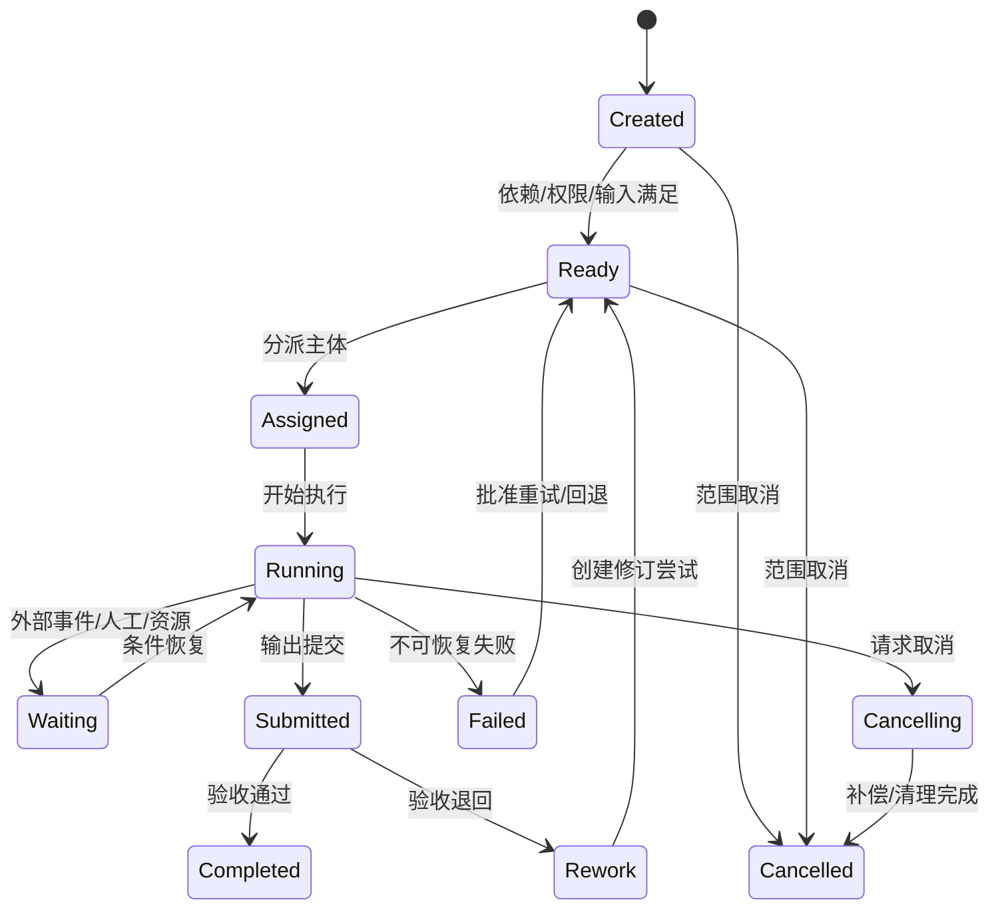

# D08 项目、计划与任务编排

> 来源：@design/INDEX.md | 创建：2026-07-22 | 更新：2026-07-22
> 原始行范围：3272–3547
> 引用约定：同文件内引用使用 §编号，跨文件引用使用 @design/文件名.md

## D08 项目、计划与任务编排

### D08.1 任务定义

| 项目 | 内容 |
|---|---|
| 任务目标 | 将项目阶段、WBS、工作包、人工工作、AI/规则/工具任务和长时流程统一成可计划、可恢复、可度量的执行模型 |
| 直接产出 | 计划分层、领域对象、任务类型/状态、依赖、SLA、调度、重试、补偿、人工接力、成本和验收规则 |
| 成功对齐物 | 任一设计工作都能明确输入基线、负责人、依赖、输出版本、验收、截止、失败路径和实际成本 |
| 本任务不做 | 不选择 Temporal/Camunda 的部署参数，不定义物理队列表、API 字段、甘特图界面和各专业工作包内容 |
| 主能力 | CAP-02.03–06、CAP-05，消费 D05 Gate/D07 Version，服务 D09–D33 |

### D08.2 分层模型

| 层级 | 时间/管理尺度 | 核心对象 | 业务问题 |
|---|---|---|---|
| 项目路线 | 项目全周期 | ProjectPlan | 做哪些阶段、何时交付、关键约束是什么 |
| 阶段计划 | P0–P8 | StagePlan/Milestone | 阶段门前必须完成什么 |
| WBS | 周/月 | WBSNode | 如何分解范围且不遗漏成果 |
| 工作包 | 天/周 | WorkPackage | 谁基于什么输入交付什么成果 |
| 工作流运行 | 分钟至跨月 | WorkflowRun | 多步骤如何可靠执行、等待和恢复 |
| 任务 | 分钟/小时/天 | Task | 当前由谁/什么执行哪个原子动作 |
| 尝试 | 秒/分钟/小时 | TaskAttempt | 一次具体执行发生了什么 |

上层计划表达业务承诺，下层运行表达执行机制；调整 Workflow 模板不能静默改变 WorkPackage 范围和交付承诺。

### D08.3 领域对象

| 对象 | 职责 | 关键语义 |
|---|---|---|
| ProjectPlan | 项目阶段、里程碑、日历和基线 | planRevision、timezone、calendar、baseline、status |
| WBSNode | 层级范围分解 | parent、scope、stage、discipline、deliverableRefs |
| Milestone | 零工期控制点 | target/forecast/actual、gateId、owner、condition |
| WorkPackage | 可验收设计工作承诺 | scope、inputBaseline、outputs、owner、acceptance、budget |
| WorkflowDefinition | 版本化执行模板 | steps、dependencies、conditions、timeouts、compensations |
| WorkflowRun | 一次持久化流程实例 | definitionVersion、businessKey、state、context、history |
| Task | 人工/自动原子工作 | type、assignee/executor、inputs、outputs、SLA、acceptance |
| TaskAttempt | 一次执行尝试 | attemptNo、worker/tool、start/end、result、error、cost |
| Dependency | 计划/任务关系 | type、predecessor、successor、lag、condition |
| Assignment | 人员/团队/设备/服务分派 | subject、role、validity、capacity、delegation |
| SLA | 响应/处理/截止/升级规则 | calendar、thresholds、pauseRules、escalations |
| WorkCalendar | 时区、工作日、节假日和班次 | region/team、effectiveRange、exceptions |
| ExecutionPolicy | 重试、超时、限流、并发、预算和回退 | capability/tool/project scoped policy |
| ManualHandoff | 人工接力操作包 | instructions、inputs、expectedOutputs、doubleCheck |
| CostRecord | 人工/工具/API/算力实际成本 | quantity、unit、rateSource、Decimal amount、currency |

### D08.4 WorkPackage 契约

每个工作包必须包含：

- 唯一 ID、名称、所属阶段/专业/CAP/需求。
- 范围说明和明确不做项。
- 固定输入 Baseline/AssetVersion，不使用“最新版”。
- 必交输出类型、状态、信息深度、格式和数量。
- 责任角色、执行团队、校审角色和委托限制。
- 开始条件、前置/外部依赖、目标里程碑和日历。
- EARS/规则/人工验收、质量门禁和证据。
- 计划工时、自动化预算、软件/API/算力预算。
- 风险、假设、变更路径和关闭条件。

工作包范围变化创建新 Revision；已开始工作包需执行影响分析，不原地改写承诺。

### D08.5 WBS 规则

1. 一级按 P0–P8 阶段，二级优先按成果/专业工作包，而非软件工具。
2. 同一成果只能有一个主工作包；支撑任务通过依赖关联，避免重复计量。
3. WBS 叶节点必须对应可验收 WorkPackage 或 Milestone。
4. “协调”“支持”“优化”等泛化工作包必须声明具体输出和关闭证据。
5. AI、规则和转换作为任务或支撑工作包，不独立替代专业成果工作包。

### D08.6 依赖模型

| 类型 | 含义 | 示例 |
|---|---|---|
| Finish-to-Start | 前项完成后后项开始 | 需求基线→概念生成 |
| Start-to-Start | 前项开始后允许并行 | 建筑扩初→结构方案介入 |
| Finish-to-Finish | 后项完成依赖前项完成 | 各专业提交→联邦候选完成 |
| External | 依赖客户/审批/外部数据/供应商 | 等待客户确认或测绘资料 |
| Data | 依赖固定 Version/Baseline | 碰撞任务依赖联邦成员版本 |
| Conditional | 满足业务表达式才生效 | 低置信 OCR 触发人工复核 |
| Resource | 依赖资格人员/设备/许可证/GPU | Revit Worker 或专业审核人可用 |

循环依赖在计划发布前阻断；允许业务迭代使用显式 Loop/Revision，不用依赖环模拟。

### D08.7 任务类型

| 类型 | 执行主体 | 示例 | 完成证据 |
|---|---|---|---|
| HUMAN_DESIGN | 设计师 | 平面精修、节点设计 | 新 AssetVersion+自校提交 |
| HUMAN_REVIEW | 校审/主创/客户 | 方向确认、专业审核 | 结论、意见、签审记录 |
| AI_INFERENCE | AI Provider | OCR、生成、分类、说明草稿 | AIInvocationRun+候选版本+评价 |
| RULE_CHECK | 规则引擎 | IDS、图层、净高检查 | CheckRun+报告 |
| FILE_CONVERSION | 转换 Worker | DWG→PDF、RVT→IFC | Representation+血缘 |
| DESKTOP_AUTOMATION | 插件/Windows Worker | 批量标注、出图、族处理 | TaskAttempt+版本+工具日志 |
| SIMULATION | 专业求解器 | 能耗、日照、结构分析 | 输入假设+求解器结果+验证 |
| INTEGRATION | 外部系统 | 拉取/推送 ACC、ERP、审查系统 | 外部 ID+回执+对账状态 |
| MANUAL_HANDOFF | 受控人员 | 无 API 工具操作 | 操作包、双检、回传版本 |
| TIMER/EVENT | 工作流系统 | 超时、到期、Webhook 等待 | 触发事件/时间证据 |

### D08.8 Task 状态机

`Completed` 表示任务验收完成，不代表成果已 Shared/Published；资产状态由 D07 转换门禁决定。

### D08.9 WorkflowRun 状态与持久化

WorkflowRun 状态：Pending、Running、Waiting、Suspended、Compensating、Completed、Failed、Cancelled、Terminated。暂停/等待不占 Worker；外部回调、人工任务和定时器通过稳定 businessKey/runId 恢复。

工作流历史记录定义版本、输入引用、决策、活动计划/结果、信号、定时器、重试和补偿。流程代码升级不得改变在途历史语义；采用版本分支或迁移策略。

### D08.10 调度与优先级

机器枚举使用 `PRI-0`–`PRI-3`，不使用与阶段 `STG-P0`–`STG-P8` 相同的裸 `P*` 值。

`EffectivePriority = ContractPriority + GateCriticality + SLAUrgency + RiskSeverity - ResourceCostPenalty`

| 优先级 | 使用 | 抢占/控制 |
|---|---|---|
| PRI-0 Emergency | 安全、错误发布撤销、关键恢复 | 需授权；可暂停低优先队列，不绕过专业门禁 |
| PRI-1 Gate Critical | 阶段门、正式交付、阻断问题 | 保留容量和升级通知 |
| PRI-2 Normal | 常规设计与检查 | 按依赖、截止和公平性调度 |
| PRI-3 Batch | 预览、索引、历史回归、非紧急转换 | 低峰/配额内运行，可延迟 |

防止单项目占满公共资源：按租户/项目/能力设置并发、队列、速率和预算；高优先级必须有过期时间和原因。

### D08.11 分派与容量

- 人工任务按角色、专业、项目任命、技能、时区、可用容量和 SoD 过滤候选人。
- 自动任务按 capability、工具版本、操作系统、GPU/CPU、许可证、数据驻留和保密策略路由 Worker。
- 分派不等于授权；运行时再次执行 D04 授权。
- 人员转派保留原分派历史；专业审批委托须满足同等资格。
- 资源超载时调整 forecast、拆分工作包或升级，不静默延长 SLA。

### D08.12 SLA 与时间

SLA 分为响应、开始、处理、等待外部、验收和总截止。每项绑定 WorkCalendar 与时区；暂停条件仅包括批准的外部等待/系统故障，不包括内部遗忘或资源不足。

原始场景 5–10 分钟小样和 10–30 分钟修改先作为 `Target` 而非无条件 SLA。V0 使用版本化 `RapidRevisionProfile` 冻结适用边界：IQ-A/B 输入、单项目已存在批准基线、单次≤10 张 2D 页面或一个 S 级模型、只允许文字/标注/配色/版式/局部门窗或非拓扑几何调整、不触发专业计算/跨专业条件/模型重建、批准工具可用且人工值守。计时从完整意见批次 Accepted 到 ReviewCandidate Ready，等待客户补充/批准的依赖暂停但单独计时；目标为 p50≤10 分钟、p95≤30 分钟。超出任一边界自动转普通 DesignFeedback/DesignChange，不继续承诺快速通道。

升级层级：提醒执行人→工作包负责人→项目经理/专业负责人→项目总负责；阻断 G6 的逾期同时通知质量/交付角色。

### D08.13 幂等、重试与超时

| 场景 | 策略 |
|---|---|
| 任务提交 | 调用方生成稳定 `idempotencyKey`；服务端另算项目+能力+输入版本+参数的 requestFingerprint，同键不同指纹冲突 |
| 4xx/业务校验错误 | 不自动重试，转人工修正输入/权限 |
| 429/可恢复 5xx | 指数退避+抖动，受次数/总时长/预算限制 |
| 网络超时且结果未知 | 先按外部 runId 查询，不重复创建计费任务 |
| Worker 崩溃 | 使用租约/心跳恢复；输出入库前检查幂等和哈希 |
| 非幂等桌面操作 | 先创建检查点/副本，重试前验证工具内状态 |
| 人工任务超时 | 提醒/升级/转派，不自动视为批准 |

### D08.14 补偿与取消

补偿恢复业务一致性，不试图删除已发生的审计：撤销临时分享、释放锁/配额、标记部分输出废弃、回滚外部暂存、取消下游任务、通知责任人。已创建 AssetVersion 不删除，标记 Failed/Abandoned 或 Archived。

取消分为 Graceful（等待安全点并补偿）、Immediate（紧急终止并保全状态）、Scope Cancel（工作包取消及影响分析）。Published/签审/外部发送不能通过普通取消撤回，必须走 D07 Withdrawal/D11 变更。

### D08.15 人工接力

ManualHandoff 操作包包含固定输入版本、工具/版本、账号/许可要求、逐步操作、参数、预期输出、命名、上传位置、禁止事项、验证和截止。回传后由另一主体或自动规则核验哈希/格式/清单；禁止共享账号或未经许可的 UI 自动化。

### D08.16 人工—AI 协作模式

| 模式 | 流程 | 适用 |
|---|---|---|
| AI Suggests | AI 候选→人工选择/修改→提交 | 设计意图、文本、节点推荐 |
| AI Executes Under Rules | 人工批准输入/参数→自动执行→门禁检查 | 批量标注、转换、出图 |
| Human Exception | 自动任务→低置信/异常→人工接管→回传 | OCR/识图/分类 |
| Dual Review | AI/规则结果+人工专业复核+独立校审 | 高风险施工图/规范风险 |
| No AI | 直接人工/求解器任务 | 不允许外发或 AI 不适用项目 |

### D08.17 计划基线与进度

ProjectPlan 发布生成不可变 PlanBaseline；进度更新改变 actual/forecast，不改 baseline。范围/关键日期/资源承诺实质变化通过 PlanChange 批准并生成新基线。

进度基于可验收成果和任务状态，不以“完成百分比”主观填报替代。工作包进度建议使用：未开始、已开始、成果已提交、验收完成；如需百分比，由加权任务完成证据计算。

### D08.18 变更影响

变更分析覆盖：需求、阶段门、工作包、依赖、固定输入版本、人员/设备、自动化运行、预算、已提交成果、下游任务和 Transmittal。受影响的 Ready/Running 任务进入 Suspended 或继续执行由批准策略决定；不得让其静默基于过期输入完成。

### D08.19 成本与预算

| 成本 | 计量 |
|---|---|
| 人工 | 角色、有效工时、费率版本；金额 Decimal |
| AI/LLM | Provider、模型、Token/图片/秒、请求和重试 |
| GPU/CPU | 实例/Worker 时间、资源规格 |
| Autodesk/专业工具 | Automation CPU、许可证、作业次数 |
| 存储/转换 | 输入输出字节、保留层级、转换次数 |
| 返工 | Rework 尝试及原因、人工和工具成本 |

预算可设项目/工作包/能力/运行上限；预计超限时暂停新运行并请求批准，已开始的安全操作可到检查点。成本告警不允许中断正在写原生文件而造成损坏。

### D08.20 异常与恢复矩阵

| 异常 | 业务状态 | 恢复 |
|---|---|---|
| 输入版本被撤回 | Suspended | 影响分析并绑定替代 Baseline |
| 执行人权限撤销 | Suspended/Ready | 保全工作，重新分派 |
| 工具版本不可用 | Waiting/Failed | 路由兼容 Worker、人工接力或批准升级 |
| 外部回调丢失 | Waiting | 主动轮询 runId，对账后恢复 |
| 部分输出生成 | Running/Failed | 验证清单，保留部分版本并重跑缺项或废弃 |
| 计划依赖循环 | 阻断计划发布 | 修正依赖，不在运行期猜测顺序 |
| 重试耗尽 | Failed | 人工诊断、替代能力、范围变更或接受失败 |
| 工作流定义升级 | 旧 Run 原版本继续 | 显式迁移/版本分支，不热替换历史语义 |

### D08.21 事件

核心事件：`PlanBaselined/Changed`、`WorkPackageCreated/Revised/Accepted/Cancelled`、`WorkflowStarted/Waiting/Suspended/Completed/Failed`、`TaskReady/Assigned/Started/Submitted/Completed/Rework/Failed/Cancelled`、`SLABreached/Escalated`、`BudgetThresholdReached`、`ManualHandoffRequested/Completed`。

事件包含项目、阶段、CAP、工作包/任务、输入 Version/Baseline、主体、时间、策略版本和 Trace ID。

### D08.22 指标

| 指标 | 定义 |
|---|---|
| Work Package Acceptance Rate | 首次提交验收通过包/提交包 |
| Flow Efficiency | 有效执行时间/总历时，区分等待客户/资源/系统 |
| Rework Ratio | 返工人工+工具成本/总成本 |
| SLA Attainment | 在目标内完成任务/适用任务 |
| Automation Straight-through | 无人工接管完成的自动任务/自动任务 |
| Retry Cost | 重试产生的增量成本和时间 |
| Queue Aging | Ready/Waiting 任务年龄分布 |
| Baseline Adherence | 基于批准输入完成且无过期事件的任务比例 |

### D08.23 D08 验收条件（EARS）

- When 工作包创建, the 平台 shall 要求范围、固定输入基线、输出、责任、验收、依赖、截止和预算。
- When ProjectPlan 发布, the 平台 shall 创建不可变 PlanBaseline，forecast 更新不得改写 baseline。
- When 任务进入 Ready, the 平台 shall 验证依赖、输入版本、权限、资源和数据策略。
- When 自动任务重复提交相同幂等键, the 平台 shall 返回原运行或明确续跑，不创建重复计费任务。
- When 外部调用超时且结果未知, the 工作流 shall 先查询外部 runId 状态再决定重试。
- When 人工任务超时, the 平台 shall 提醒/升级/受控转派，不自动批准。
- When 输入版本被撤回或替代, the 平台 shall 暂停受影响任务并执行影响分析。
- When AI/自动任务输出, the 平台 shall 创建新 AssetVersion/AIInvocationRun/CheckRun，不覆盖输入版本。
- When 任务取消, the 工作流 shall 执行适用补偿并保留尝试、部分输出和审计。
- When 无正式 API 的工具被使用, the 平台 shall 创建 ManualHandoff 操作包和独立验证证据。
- When 预计成本超过批准预算, the 平台 shall 阻止新计费运行并请求授权，不损坏在途文件。
- When WorkflowDefinition 升级, the 平台 shall 保持在途运行历史语义或执行显式迁移。

### D08.24 D08 完成检查与下游约束

| 检查项 | 结果 |
|---|---|
| 是否分离项目计划、工作包、工作流、任务和尝试 | 是 |
| 是否固定输入 Version/Baseline 和验收输出 | 是 |
| 是否覆盖人工、AI、规则、转换、桌面、仿真和集成任务 | 是 |
| 是否定义依赖、SLA、调度、重试、补偿和取消 | 是 |
| 是否支持人工接力和人机协作 | 是 |
| 是否包含计划基线、变更、成本和恢复 | 是 |
| 是否进入引擎、队列、表、API 或界面实现 | 否，符合 D08 边界 |

D08 对下游的强制约束：D09–D17 以 WorkPackage 契约定义专业工作；D18/19 协调与 Issue 任务引用固定 Federation；D24/27 使用统一 Task/AIInvocationRun 和预算策略；D29–D33 桌面/工程连接器实现租约、心跳、幂等和人工接力；D35 定义事件 Schema；D42 量化吞吐/容量/SLA；D43 关联 Plan/Workflow/Task/Attempt 指标。

