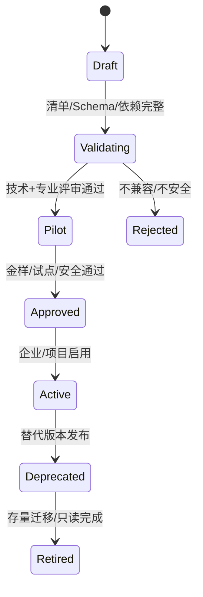

# D17 景观室内与专项专业扩展模型

> 来源：@design/INDEX.md | 创建：2026-07-22 | 更新：2026-07-22
> 原始行范围：5324–5505
> 引用约定：同文件内引用使用 §编号，跨文件引用使用 @design/文件名.md

## D17 景观、室内与专项专业扩展模型

### D17.1 任务定义

| 项目 | 内容 |
|---|---|
| 任务目标 | 定义新专业在不修改核心项目/CDE/任务/问题/审批语义的前提下接入全流程平台的统一扩展契约 |
| 直接产出 | 专业包清单、扩展点、对象/成果/流程/规则/工具/权限模型、生命周期、认证、示例和验收 |
| 成功对齐物 | 景观、室内、幕墙、消防、人防、绿色建筑、智能化等可按同一方式接入、升级、退役和审计 |
| 本任务不做 | 不完成每个专项的全部专业设计，不复制 CAP-02/04/05/09/10/11 公共能力，不允许插件绕过权限/门禁 |
| 主能力 | CAP-08.01/08.06、CAP-15，复用 D03 专业能力包和 D04–D08 公共模型 |

### D17.2 DisciplineCapabilityPack 清单

| 清单域 | 必填内容 |
|---|---|
| Identity | packId、专业代码/名称、版本、供应者、签名、许可、兼容平台版本 |
| Applicability | 地区、建筑类型、P0–P8、V0–V4、项目复杂度和排除条件 |
| Domain | 专业对象类型、属性、关系、分类、单位和稳定 ID 规则 |
| Requirements | 需求分类扩展、信息要求、输入条件和追踪规则 |
| Deliverables | 模型、图纸、计算、说明、明细、报告和提交集 |
| Workflow | 工作包模板、任务类型、依赖、SLA、阶段门和变更路径 |
| Roles | 专业角色、资格/任命、RACI、SoD 和外部协作 |
| Rules | 企业/地区规则、严重度、例外、金样和批准人 |
| Tools | 桌面/云/求解器连接器、格式、版本、许可和人工接力 |
| Coordination | 坐标、联邦、条件类型、碰撞组、Issue/BCF 和上下游专业 |
| Automation | A0–A4 任务、AI/规则/求解器边界、评测和人工门禁 |
| Security | 数据分类、跨境、第三方 Provider、敏感字段和保留 |
| Observability | 事件、指标、成本、诊断和审计要求 |

### D17.3 可扩展与不可扩展边界

**允许扩展：** 专业对象/属性、成果类型、工作包/任务模板、专业条件、规则/IDS、工具适配器、视图/表单 Schema、指标和报告。

**禁止重定义：** Project/Stage、Asset/AssetVersion、Baseline、Task/WorkflowRun、Issue、Approval、AIInvocationRun、Transmittal、CDE 状态、RBAC/ABAC 决策和审计事件基本语义。

若新专业需求无法用核心对象表达，先提出平台能力变更并分析所有专业影响；禁止在插件私有字段中复制核心事实。

### D17.4 专业对象扩展

专业对象使用 `DisciplineObjectType` 注册：typeId、schemaVersion、父分类、属性 Schema、几何/非几何表示、关系、单位、验证、IFC/bSDD/企业分类映射、生命周期和迁移。

对象实例仍是 D07 AssetVersion/BIM 对象的一部分；扩展包不建立不可见私有文件仓库。跨专业引用通过稳定 ObjectRef+Version/Federation 上下文。

### D17.5 成果与提交集扩展

每个 `DisciplineDeliverableType` 定义成果 ID、格式、主事实源、信息成熟度、图纸/计算/说明组成、检查、签审、CDE 状态和交付用途。专业 G4 提交统一使用 `DisciplineSubmission`：固定模型、图纸、计算、说明、条件、检查和签审版本。

### D17.6 流程与阶段门扩展

- 专业包将任务映射到 P0–P8/G0–G8，不可新增绕过 G5/G6 的发布路径。
- 工作包继承 D08 契约；专业任务可增加输入/输出和验证，不可删除固定 Version/Baseline、责任、验收和预算。
- 专业门禁可增加检查，但减少核心安全/发布门禁需平台级设计决策。
- 专项专业晚介入时必须声明最迟进入门、上游假设和下游重开规则。

### D17.7 条件与协调扩展

`ConditionTypeDefinition` 定义提出/接收专业、对象/几何、属性、状态、严重度、最迟门禁和关闭证据。专项条件示例：

| 专业 | 条件示例 |
|---|---|
| 景观 | 场地标高、覆土、排水、荷载、树池/结构、照明/灌溉和市政接口 |
| 室内 | 隔墙/吊顶、材料、设备末端、机电点位、荷载、防火/声学和样板 |
| 幕墙 | 分格、锚固/荷载、层间位移、热工/水密、检修、机电穿越 |
| 消防 | 防火分区、消防策略、设备/阀门/联动、消防电源和审查意见 |
| 人防 | 防护单元、口部、结构荷载、设备/管线和战平转换 |
| 绿色建筑 | 性能目标、模型参数、材料/碳、计量和认证证据 |
| 智能化 | 点位、网络、机房、供电、控制/BMS/消防接口和数据责任 |

每个项目在 G0 必须批准版本化 `DisciplineResponsibilityMatrix`。矩阵按“系统/成果/计算/模型/图纸”逐项指定唯一 `AuthoritativeOwner`，并列出 Contributor、Coordinator、Checker、Approver、外部责任方和最迟 Gate；Architecture、Structure、Plumbing、HVAC、Electrical 与 Specialty Pack 的范围必须排他，同一系统不得被两个 DisciplineSubmission 同时声明为权威。消防给水、防排烟、消防电源/联动、智能化、幕墙、室内等跨界项未分配唯一 Owner 时，D12–D17 对应工作包不得启动或提交。

| 跨界系统示例 | 必须唯一确定的权威责任 | 必需会签 |
|---|---|---|
| 消防给水 | Plumbing 或 Fire Specialty 二选一 AuthoritativeOwner | 建筑消防、结构、Electrical/联动 |
| 防排烟 | HVAC 或 Fire Specialty 二选一 AuthoritativeOwner | 建筑消防、Electrical/控制 |
| 消防电源与联动 | Electrical 或 Fire/Intelligent Specialty 二选一 AuthoritativeOwner | 给排水、HVAC、建筑消防 |
| 幕墙系统 | Architecture 或 Facade Specialty 二选一 AuthoritativeOwner | 结构、节能、机电穿越、消防 |
| 室内综合 | Interior Specialty 为装修成果 Owner；基础建筑/MEP 事实仍归原专业 | 建筑、结构、各 MEP、消防 |

### D17.8 专业包生命周期

升级采用语义版本；破坏性 Schema/事件/映射变化必须提供迁移、兼容期、回滚和历史只读能力。在途 WorkflowRun 默认继续旧包版本，除非显式迁移。

### D17.9 验证与认证门禁

| 门禁 | 验证 |
|---|---|
| Manifest | 标识、版本、签名、许可、依赖和兼容完整 |
| Schema | 对象/字段/单位/迁移向前后兼容 |
| Security | 权限最小化、数据外发、依赖/插件供应链和秘密处理 |
| Workflow | 无死循环/越权/绕过门禁，取消/重试/补偿有效 |
| Professional | 成果、计算、规则、签审和责任边界由专家批准 |
| Interoperability | IFC/原生/坐标/对象 ID/BCF 交换金样通过 |
| Regression | 样例项目、规则、图纸/模型和指标无不可接受退化 |
| Operations | 日志/指标/错误/成本/卸载和恢复可用 |

### D17.10 专业包模板示例

#### 景观包

对象：场地分区、铺装、地形、植物、构筑物、灌溉、景观给排水/电气；成果：总平、竖向、种植、铺装、节点、明细和工程量；工具：GIS、Civil/景观 BIM、CAD、参数化工具；主要协调：建筑总图、结构荷载、给排水雨水、电气照明。

#### 室内包

对象：房间方案、隔墙、吊顶、地面/墙面、固定家具、门/五金、材料、设备点位；成果：平面、顶棚、立面、节点、材料/门表和说明；主要协调：建筑边界、消防、MEP 末端、净高、声学和材料性能。

#### 幕墙包

对象：幕墙系统、单元/构件、连接、玻璃/面板、锚固、性能；成果：分格、立面、剖面、节点、计算/性能报告和条件；主要协调：建筑 Envelope、结构荷载/位移、机电穿越、检修和防火封堵。

### D17.11 扩展技术栈

| 层 | 技术 | 作用 |
|---|---|---|
| Manifest/Schema | JSON Schema、OpenAPI/AsyncAPI、语义版本 | 专业对象/接口/事件契约 |
| 插件 SDK | .NET/Java/Python/TypeScript SDK+gRPC/REST | 服务/桌面连接器统一接入 |
| 规则 | IDS、DSL/Drools、专业规则包 | 信息/几何/业务检查 |
| UI 扩展 | 受控表单/表格/面板 Schema | 专业字段和工作台扩展 |
| 运行隔离 | 容器/Worker/签名桌面插件 | 计算/转换/工具任务 |
| 映射 | IFC/bSDD/企业字典映射 | 跨工具和专业语义 |

扩展代码不可在核心进程内获得无限权限；采用受控 SDK、权限 Scope、资源/时间/网络限制和审计。

### D17.12 异常与恢复

| 异常 | 处理 |
|---|---|
| 包版本不兼容 | 阻止新项目启用；在途使用原版本或显式迁移 |
| Schema 迁移失败 | 回滚包版本，保留只读对象和迁移日志 |
| 工具/许可缺失 | 启用人工接力/替代适配器，能力状态降级 |
| 专业规则冲突 | 按来源/地区/项目决定并生成 Conflict，不静默覆盖 |
| 包被撤销/安全事件 | 停止新任务、隔离运行、评估存量和回滚 |
| 对象映射丢失 | 阻断对应交换/联邦/图纸，不删除原数据 |

### D17.13 指标

| 指标 | 定义 |
|---|---|
| Pack Activation Success | 启用并完成健康检查/启用次数 |
| Schema Migration Success | 成功迁移对象/适用对象 |
| Professional Regression Pass | 通过金样/适用金样 |
| Cross-discipline Condition Closure | 按期关闭专项条件/必需条件 |
| Extension Incident Rate | 包导致的越权、数据、质量或运行事件 |
| Time to Onboard Discipline | 从 Defined 到 Approved 的有效时间 |

### D17.14 D17 验收条件（EARS）

- When 新专业包注册, the 平台 shall 要求完整 Identity、Applicability、Domain、Deliverables、Workflow、Roles、Rules、Tools、Coordination、Security 和 Observability 清单。
- When 专业对象定义, the 包 shall 提供稳定 typeId、版本、属性/单位、关系和 IFC/企业映射。
- When 专业成果提交, the 包 shall 使用统一 DisciplineSubmission 并固定模型、图纸、计算、条件、检查和签审版本。
- When 专业流程扩展, the 包 shall 映射 P0–P8/G0–G8，禁止新增绕过 G5/G6 的发布路径。
- When 专业包请求访问项目数据, the 平台 shall 按声明 Scope 和 D04 ABAC 决策，不授予核心数据库直接权限。
- When 包发生破坏性升级, the 平台 shall 要求迁移、兼容期、回滚和历史只读方案。
- When 在途工作流使用旧包版本, the 平台 shall 保持其历史语义，除非显式批准迁移。
- When 专业包进入 Active, the 平台 shall 已通过 Manifest、Schema、安全、流程、专业、互操作、回归和运营门禁。
- When 包被撤销, the 平台 shall 停止新任务、隔离风险、保留历史证据并评估存量迁移。
- When 新专业无法使用核心对象表达, the 设计 shall 先做平台级影响决策，不在私有字段复制核心事实。

### D17.15 D17 完成检查与下游约束

| 检查项 | 结果 |
|---|---|
| 是否定义统一专业包清单和扩展边界 | 是 |
| 是否覆盖对象、成果、流程、角色、规则、工具和协调 | 是 |
| 是否禁止复制核心能力和绕过门禁 | 是 |
| 是否定义版本、认证、迁移、撤销和恢复 | 是 |
| 是否给出景观/室内/幕墙等实例 | 是 |

D17 对下游的强制约束：D18 联邦按专业包声明模型/坐标/对象映射；D19 使用扩展 Condition/Issue 类型；D21 加载专业规则包；D29 提供连接器 SDK；D35/37 支持受控事件/UI Schema 扩展；D40 评审插件供应链和数据 Scope。

