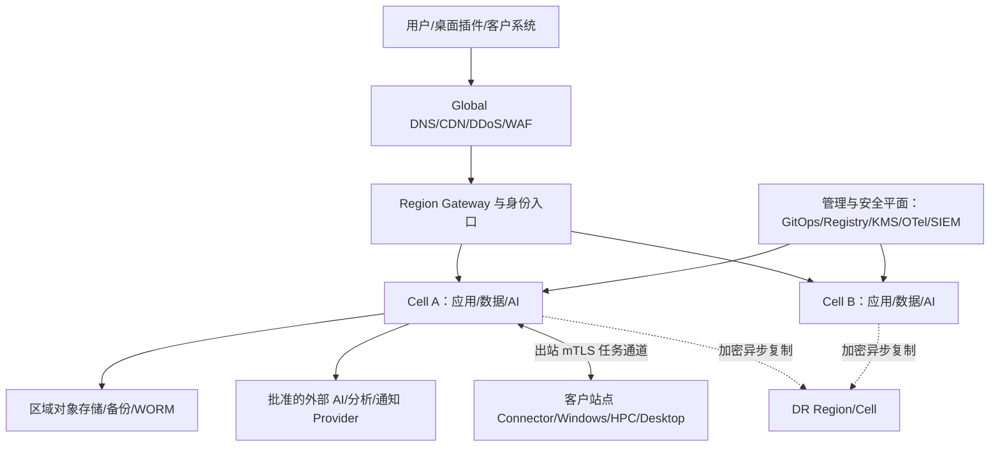

# D44 部署网络与环境拓扑详细设计

> 来源：@design/INDEX.md | 创建：2026-07-22 | 更新：2026-07-22
> 原始行范围：14530–15020
> 引用约定：同文件内引用使用 §编号，跨文件引用使用 @design/文件名.md

## D44 部署、网络与环境拓扑详细设计

### D44.1 任务定义与设计结论

D44 将 D01–D43 的逻辑组件落实为可部署、可隔离、可伸缩、可升级、可恢复的物理拓扑。设计同时支持 SaaS 公有云、客户私有云/本地化、混合部署和受控离线画像，但不维护四套产品分支：业务契约、镜像、Helm Chart、策略和测试基线共用，基础设施模块、组件实现和数据驻留按批准的 DeploymentProfile 选择。

核心结论：

1. 生产控制面采用 Region→Cell 架构；Cell 是租户、故障、容量、发布和数据驻留的主要隔离单元，单 Cell 不跨 Region 写事实。
2. 无状态服务、Linux Worker、AI 推理和通用平台组件优先部署 Kubernetes；Windows CAD/BIM、桌面插件和部分商业求解器部署在版本认证的 Windows VM/终端/HPC 池，不强行容器化。
3. SaaS 优先使用经批准的云托管 PostgreSQL、对象存储、Kafka 和 KMS；私有化使用同契约的可移植实现，不能宣称二者运维 SLO 天然相同。
4. 生产 Cell 至少跨三个故障域；Region 级灾备异步复制。PDB 只保护计划性驱逐，不作为节点、可用区或区域故障的恢复机制。
5. 默认拒绝网络、短期工作负载身份、外发代理、密钥不落 Git/镜像、GitOps 声明式交付、镜像签名和策略门禁为统一基线。
6. 混合部署的站点连接器只建立出站 mTLS 通道；任务凭证按 Job/Lease 限定，云端不能获得客户内网的通用交互式登录能力。

### D44.2 标杆依据与平台取舍

| 标杆 | 关键机制 | 本平台取舍 |
|---|---|---|
| [Kubernetes Topology Spread Constraints](https://kubernetes.io/docs/concepts/scheduling-eviction/topology-spread-constraints/) | 按 zone/node 等拓扑域分布 Pod，`maxSkew` 与不可调度策略显式 | 所有关键副本使用 zone+hostname 双层 spread；容量规划保证每个域可承载故障后的重调度 |
| [Kubernetes Pod Disruption Budgets](https://kubernetes.io/docs/concepts/workloads/pods/disruptions/) | 限制自愿中断期间同时不可用副本，不覆盖全部非自愿故障 | PDB 与副本、反亲和、滚动升级、优雅终止和 DR 联合设计，禁止把 `minAvailable` 当 HA |
| [Kubernetes NetworkPolicy](https://kubernetes.io/docs/concepts/services-networking/network-policies/) | 基于 Pod/Namespace/端口控制东西向流量，需 CNI 真正执行 | 生产默认拒绝 ingress/egress，按服务清单放行；DNS、OTel、KMS、对象存储和外发均显式 |
| [Kubernetes Windows](https://kubernetes.io/docs/concepts/windows/) | Windows 节点与 Linux 控制面并存，但 OS、网络、特权能力有差异 | 仅无 GUI、厂商明确支持的 Windows Worker 可进入 K8s；桌面 CAD/BIM 使用专用 VM/设备池 |
| [NVIDIA GPU Operator](https://docs.nvidia.com/datacenter/cloud-native/gpu-operator/latest/) | 自动管理驱动、Container Toolkit、Device Plugin、GFD、DCGM | 每个 GPU 池冻结 Operator/driver/CUDA/模型兼容矩阵；升级只走已验证路径，DCGM 指标进入 D43 |
| [Argo CD](https://argo-cd.readthedocs.io/en/stable/) | Git 为期望状态、持续对账、健康与同步策略 | 工作负载与策略使用 Argo CD GitOps；紧急变更仍需提交受审计的回补变更，禁止长期手工漂移 |
| [SPIFFE/SPIRE](https://spiffe.io/docs/latest/spiffe-about/spiffe-concepts/) | 可验证 Workload Identity、短期 X.509-SVID 和信任域 | Kubernetes/跨 Cell 服务使用 SPIFFE 身份和 mTLS；人、设备、桌面代理沿用 D39 独立身份链 |

版本号不写死为“永远最新”。平台维护季度验证的 Support Matrix，记录 Kubernetes、OS、CNI、CSI、Ingress/Gateway、GPU Operator、driver/CUDA、数据库、消息、CAD/BIM 和插件版本；处于 EOL 或未通过金样的组合不得进入生产。

设计审计时的版本基线只冻结“契约标准或开发基线”，不冒充客户部署组合已完成资格验证：

| 组件/标准 | 设计基线 | 状态与进入实施前的门禁 |
|---|---|---|
| Java / Spring Boot | Java 21 LTS；Spring Boot 4.1.0 | `DesignBaseline`；验证构建插件、驱动、OTel Agent 和企业镜像后转 `Qualified` |
| HTTP / Event Contract | OpenAPI 3.2.0；AsyncAPI 3.1.0；CloudEvents 1.0 | `DesignBaseline`；不兼容生成器可按 D35 使用 OpenAPI 3.1.2 兼容画像 |
| Telemetry Semantics | OpenTelemetry Semantic Conventions 1.43.0 | `DesignBaseline`；冻结自定义属性、基数预算和 Collector 兼容后转 `Qualified` |
| Identity Broker | Keycloak Community 26.7.0 参考基线；独立 Delegation STS | `ReferenceOnly`；Community 版不声明 LTS，生产须选受支持生命周期或商业发行版并完成 OIDC/SCIM/撤权/灾备资格 |
| Desktop Agent | 独立 Agent 使用 .NET 10 LTS；宿主插件使用厂商要求运行时 | `ProfileDependent`；按每个 CAD/BIM 年版、补丁、OS、运行时和许可执行金样 |
| Kubernetes / CNI / Data / GPU | Kubernetes 受支持三小版本之一；Cilium、PostgreSQL、Kafka、Valkey、GPU Operator 精确版本待画像选择 | `PendingQualification`；必须由 Platform Owner 在首个 DeploymentProfile 中冻结精确版本、EOL、回滚路径和证据，未冻结不得采购定型或投产 |
| CAD/BIM/HPC 工具链 | D29–D33 声明的厂商 API 与 Adapter | `PendingCustomerInput`；OD-04、许可和客户模板确认后逐组合冻结，不以平台版本统一升级宿主 |

状态只允许 `DesignBaseline / ReferenceOnly / ProfileDependent / PendingQualification / Qualified / Deprecated / Disqualified`。本表明确当前已知事实与未完成资格项；不存在“所有精确版本已冻结”的推断。

### D44.3 部署原则与设计边界

- **可移植契约，不追求最低公分母：** Domain/API/Event/File 契约统一；SaaS 可使用托管服务能力，私有化通过 Adapter 实现同语义和验收门槛。
- **Cell 限爆：** 租户映射到一个 Home Cell；共享控制目录只保存路由/状态摘要，不跨 Cell 执行业务事务。
- **状态外置：** API/Workflow/AI Gateway 不依赖本地磁盘；大文件、Checkpoint 和结果写对象存储，状态写事实源，缓存可重建。
- **不可变交付：** 镜像按 digest、SBOM、签名和 provenance 部署；配置/策略/Chart 按 Git commit 固定，运行时禁止在线改镜像。
- **故障优先：** 单 Pod、节点、故障域、Region、Provider、客户站点和许可证服务均有检测、降级、恢复和演练方案。
- **专业工具现实边界：** UI 自动化仅作为最后降级且需客户授权；能用原生 API/Design Automation/Compute/HPC Adapter 时不模拟桌面点击。
- **KISS/YAGNI：** 初期每 Region 一个生产 Cell 可起步，但接口和数据边界按 Cell 就绪；不提前建设全球双活写、多 CNI 并存或全组件自建。

### D44.4 支持的部署画像

| Profile | 控制面/数据面 | 适用场景 | 关键约束 |
|---|---|---|---|
| SaaS-Managed | 平台云 Region/Cell；客户通过公网受保护入口或专线访问 | 标准租户、最快迭代 | 驻留/跨境、共享责任、托管服务版本和外部 AI 条款需明确 |
| Private-Cloud | 客户 VPC/VNet/私有云内完整 Cell，平台远程运维按 JIT | 强隔离、客户云合同 | 客户提供网络/KMS/域名/容量；平台声明依赖和 SLO 前提 |
| On-Prem | 客户数据中心 Kubernetes+存储+VM/HPC，离线包可选 | 监管、内网、低外联 | 硬件/虚拟化/时间/DNS/PKI/备份由验收清单确认；升级窗口较长 |
| Hybrid-Site | 云控制面+客户站点 Connector/Windows/HPC/Desktop | 大文件、本地许可证、CAD/BIM 自动化 | 仅出站 mTLS；站点离线队列、数据最小化、设备撤权和版本资格 |
| Air-Gapped | 完整 On-Prem，离线 Registry/制品/模型/规则/吊销包 | 物理隔离环境 | 不调用外部 AI；离线签名链、时间源、漏洞情报和升级介质双人复核 |

每个租户/项目绑定 `deploymentProfileId`、Home Region/Cell、允许 Provider、存储/备份地点、外发策略、RPO/RTO 等级和功能差异。销售或管理员不得用普通 Feature Flag 绕过部署画像的安全边界。

DeploymentProfile 决策框架：首个画像选择按以下决策树确定，不预设默认值。决策输入包括：数据驻留要求（客户合同/法规是否强制数据不出境）、网络隔离要求（是否允许公网访问或要求专线/VPN）、外部 AI 依赖（业务场景是否必须调用云 AI Provider）、CAD/BIM 自动化需求（是否需要本地 Revit/AutoCAD Worker）、恢复目标（RPO/RTO 等级）和预算约束（云资源费用 vs 自建基础设施 TCO）。决策路径：数据驻留强制本地且不允许外联 → Air-Gapped 或 On-Prem；数据可上云但需专线/VPN 隔离 → Private-Cloud；数据可上公有云且需快速迭代 → SaaS-Managed；需本地 CAD/BIM 自动化但控制面可上云 → Hybrid-Site。当多个输入冲突时（如"数据可上云但需本地许可证"），优先采用 Hybrid-Site 并明确标注冲突项及其 Owner，不因冲突搁置整体决策。首个画像冻结后写入 `DeploymentProfile.mode` 并触发 D44.3 逐项校验；后续画像按相同决策树追加，不因"客户要求"跳过安全/合规校验。

### D44.5 环境生命周期与隔离

| 环境 | 数据 | 变更来源 | 允许集成 | 退出门槛 |
|---|---|---|---|---|
| Local/Dev | 合成/脱敏小样 | 开发分支、临时 Namespace | Mock/沙箱 | 单元、静态、安全扫描 |
| Integration | 版本化合成与连接器金样 | 合并候选 | 沙箱 Provider、虚拟 Worker | 契约/迁移/兼容测试 |
| Test | 固定 TestDataRelease | Release Candidate | Mock+受控测试账号 | 全链路、故障、性能冒烟 |
| Staging/Preprod | 生产等价拓扑；匿名/合成规模数据 | 已签名候选 | 受控真实依赖或仿真 | D45 发布门禁、回滚演练 |
| Production | 授权生产数据 | 受批准 Git Tag/digest | 生产 Adapter | Canary/健康/SLO/证据 |
| DR | 加密复制的必要数据/配置 | 生产同版本或已验证 N-1 | 隔离 Provider/域名 | 定期 Failover/Failback 演练 |

环境使用独立账号/订阅、Cluster、KMS Root、数据库、Bucket、Topic、域名和身份信任域；禁止把生产数据复制到非生产。Preprod 需要生产规模时使用合成生成器和已批准脱敏快照，导入、到期和销毁均由 D41 留证。

### D44.6 Region→Cell 总体拓扑

Global 层只做 DNS、流量防护、区域路由和静态资源，不保存业务事实。Region Gateway 根据经验证的 tenant→Home Cell 路由转发；无法确定租户时拒绝敏感请求，不广播查询所有 Cell。Cell 内数据库、Broker、Cache 和服务属于同一故障/驻留边界。

### D44.7 网络信任区与控制

| 信任区 | 主要组件 | 允许方向 | 禁止/限制 |
|---|---|---|---|
| Edge/DMZ | CDN、DDoS、WAF、Gateway、Upload ingress | Internet→受控 HTTP(S)/WebSocket | 不直达 DB/Worker/K8s API；文件先隔离 |
| Application | BFF、Domain、Workflow、Notification | Edge/内部服务→批准端口 | 默认拒绝跨 Namespace/Cell；无任意外发 |
| Data | PostgreSQL、Valkey、Kafka、Object、Search | 仅批准服务/备份/运维身份 | 无公网端点；管理员不共享数据库账号 |
| AI/GPU | AI Gateway、模型服务、GPU Worker | Workflow→内部 endpoint；外部 Provider 经 Egress | 模型不可任意下载；Prompt/文件按策略最小化 |
| Worker/Sandbox | Parser、Converter、Linux/Windows Job | Pull lease、对象分块、结果回传 | 不接收用户入站；Job 间无网络/磁盘继承 |
| Integration/Egress | Egress Proxy、Webhook、邮件、Provider Adapter | 白名单域名/IP/协议 | 阻断 RFC1918/metadata/DNS rebinding/任意 redirect |
| Management/Security | GitOps、Registry、KMS/Vault、Bastion、OTel/SIEM | 管理身份/JIT→受控 API | 与用户流量分离；无永久共享管理员 |
| Backup/DR | Backup Vault、WORM、DR replication | 数据面单向写/受控恢复 | 生产删除权限不能删除隔离备份 |
| Customer Site | Site Connector、Windows/HPC/Desktop | 站点主动出站 mTLS | 云端无通用入站、RDP/SMB；本地网段不可横向扫描 |

NetworkPolicy 采用 Cilium 为参考实现（客户环境可用经认证的 Calico Profile），每 Namespace 先部署 DNS/OTel/KMS 等基础 allow-list 再启用 default-deny。Service Mesh 仅用于需要跨服务身份、mTLS 和策略的路径，优先 Cilium Service Mesh 或 Istio 单一实现；不同时叠加两套数据面。

### D44.8 关键流量矩阵

| Source→Destination | 协议/身份 | 数据 | 控制 |
|---|---|---|---|
| Client→Edge/Gateway | TLS1.2+、OIDC/Passkey、设备风险 | UI/API/分块上传 | WAF、rate limit、CSRF/CORS、请求大小/类型 |
| Gateway→Service | mTLS/SPIFFE、HTTP/gRPC | 已验证请求/tenant context | audience/method policy，不信任客户端 tenant header |
| Service→PostgreSQL | TLS、短期 DB 身份/池 | 结构化事实 | tenant RLS/事务/statement timeout/审计 |
| Workflow→Kafka | mTLS/SASL、producer ACL | Event/Command ref | schema、幂等、配额；大文件只传 URI/hash |
| Worker→Object/KMS | Job SVID/短期预签名 | 输入/输出分块 | object prefix、size/hash、TTL、一次性写 |
| AI Gateway→Provider | Egress Proxy+mTLS/API credential | 最小 Context | Provider/Region/Model allow-list、DLP、预算 |
| Site Connector→Cloud | 出站 mTLS、设备+workload attestation | Lease/Manifest/chunk/status | 长轮询/stream、断线续传、撤权、无入站 |
| OTel→Regional Backend | OTLP mTLS | 脱敏 Telemetry | drop/queue/驻留/基数策略 |
| Data→Backup/DR | 服务身份+独立加密 | WAL/snapshot/object version | 单向、不可变、校验、带宽/延迟监控 |

Reference Profile 的 L3/L4 施工矩阵如下；实际 CIDR 由 SiteProfile 分配，要求环境/Region/Cell/客户站点不重叠，VPC/VNet/Cluster Pod/Service CIDR 经双侧 real route 检查后冻结。除下列显式流量外默认拒绝。

| 源区→目标区 | 协议/端口 | DNS/路径 | 身份/数据 | Owner/验证 |
|---|---|---|---|---|
| Internet/Client→Edge | TCP 443 | Public DNS→CDN/WAF/LB | OIDC Session、UI/API/Upload control | Edge Owner；TLS/WAF/route negative tests |
| Edge→Envoy Gateway | TCP 443 | Private LB DNS | mTLS、已清理 Header | Platform；无直达 Service/DB |
| Gateway→BFF/Domain | TCP 8443/批准 service port | Cluster DNS | SPIFFE mTLS、tenant context | Service Owner；NetworkPolicy+audience test |
| Domain→PostgreSQL/PgBouncer | TCP 5432/6432 | Private service DNS | 动态 DB identity、结构化事实 | Data Owner；RLS/连接/egress test |
| Producer/Consumer→Kafka | TCP 9093 | Private broker DNS | mTLS/SASL、Event/Command ref | Event Owner；ACL/schema/order test |
| Service→Valkey | TCP 6379 over mTLS tunnel/service mesh | Private DNS | Cache/短锁/限流，无唯一事实 | Platform；cache loss/fencing test |
| Workload→Object | TCP 443 | Private Endpoint DNS | Job/Service credential、分块对象 | CDE Owner；prefix/TTL/hash/SSRF test |
| Workload→KMS/Vault | TCP 443/8200 | Private Endpoint/Internal DNS | Workload identity、key/secret request | Security；audience/rotation/fail-close test |
| Workload→OTel Gateway | TCP 4317、4318 | Cluster/Region DNS | OTLP mTLS、脱敏 Telemetry | Observability；drop/lag/deny test |
| Pod→DNS/NTP | UDP/TCP 53；UDP 123 仅节点/批准代理 | 企业 Resolver/Time Proxy | DNS query/time，不携业务内容 | Platform；rebinding/time-skew test |
| Egress Adapter→Provider | TCP 443 | Egress proxy→批准 FQDN/IP | 最小 payload、Provider credential | Integration/Security；DNS/redirect/region test |
| Site Connector→Cloud | TCP 443 出站 | 固定 Gateway FQDN，经客户 Proxy 可选 | device/workload mTLS、Lease/Manifest/chunk | 双方 Owner；无入站/RDP/SMB 测试 |
| Windows/HPC→License | 厂商登记 TCP/UDP 端口 | Site DNS，禁止公网 | license checkout/lease | Tool Admin；端口/双扣/故障对账 |
| Data→Backup/DR | TCP 443/数据库复制批准端口 | Private inter-region endpoint | 加密 WAL/snapshot/object | Data/SRE；单向策略、RPO/restore test |

客户代理、Private Endpoint、NAT Egress IP、DNS resolver、Windows/HPC 厂商端口和双方法防火墙责任在 SiteProfile 中实例化；任一项缺 Owner/验证 TestCase 时 DeploymentProfile 状态为 Incomplete。

### D44.9 Kubernetes Cluster 与调度设计

生产 SaaS 每 Cell 独立 Cluster 或一组严格限定的 Cell Cluster；高监管 Profile 不共享 Cluster。控制面使用托管 HA 或三节点独立故障域。节点池至少分为 `system`、`general`、`high-memory`、`gpu`、`sandbox`，Windows 仅在厂商支持且无 GUI 的任务下增加 `windows` 池。

| 机制 | 强制规则 |
|---|---|
| Requests/Limits | 所有容器声明；CPU 可超配按画像，内存/GPU/ephemeral storage 不无界超配 |
| Topology | 关键服务 3+ 副本，zone+hostname spread/anti-affinity；单域容量故障后仍满足最低副本 |
| PDB/Termination | 关键服务声明 PDB、`preStop`、连接排空、grace period；Stateful 维护顺序单独定义 |
| Taint/Toleration | GPU、sandbox、system、Windows、敏感池专用 taint；业务 Pod 不容忍未声明池 |
| Priority/Quota | system/ingress/DNS/OTel/PEP 高优先；Namespace ResourceQuota/LimitRange/对象数配额 |
| Autoscaling | HPA 按 RPS/并发/延迟；KEDA 按 backlog/age；VPA 默认 Recommendation；节点扩容预留冷启动 |
| Availability | Readiness 代表可接流量，Liveness 仅处理死锁，Startup 覆盖大模型/解析器冷启 |
| Admission | Kyverno 单一策略引擎：签名、digest、非 root、seccomp、capability、host access、镜像源、标签 |
| Runtime | containerd、只读 rootfs、临时目录限额；不允许 Docker socket、privileged、hostPath，批准的 GPU/CSI/安全 Agent 例外留证 |

### D44.10 Namespace、租户与故障隔离

- Namespace 按环境/平台域划分，如 `edge`、`identity`、`domain`、`workflow`、`ai`、`workers`、`data-operators`、`observability`；默认不为每租户创建 Namespace，以免控制面对象和策略爆炸。
- 租户隔离主要由 Cell、D39 tenant context/授权、D34 RLS/对象前缀/Topic ACL/Cache prefix 和 D40 加密实现；高隔离租户可使用 Dedicated Cell/Profile。
- Sandbox Job 使用临时 Namespace 或受控 Job pool，Pod Security `restricted`、禁外联、只挂 Job 输入、结束后加密擦除临时卷。
- `platform-system` 与租户工作负载分离 NodePool/ServiceAccount；GitOps Controller 不持有跨环境无限权限。
- noisy neighbor 以 API/队列/存储/AI/许可证多层配额控制，不能只依赖 CPU quota。

### D44.11 组件部署落位矩阵

| 组件 | 部署位置/形态 | 关键依赖 | 伸缩策略 | HA/恢复 |
|---|---|---|---|---|
| Global DNS/CDN/DDoS/WAF | 云 Edge/私有 ADC | DNS、证书、Gateway | Anycast/边缘自动 | 多 PoP；绕过入口受控 |
| Envoy Gateway | Cell edge NodePool，3+ Pod | WAF、OIDC、PEP | RPS/连接 HPA | 跨 zone，配置 Git 回滚 |
| Web/BFF | Application Namespace | Gateway、IAM、Domain API | RPS/延迟 HPA | 无状态重建，静态资源 CDN |
| IAM Broker | 独立 Identity Namespace/外部 IdP | OIDC/SAML/SCIM、KMS | 会话/登录峰值 | 多 zone；break-glass 与配置备份 |
| OPA/PEP | Sidecar/daemon/service 按路径 | Policy Bundle、PIP | 请求并发 | 本地缓存最后有效策略；fail closed |
| Domain Services | Application Namespace | PostgreSQL、Kafka、Object | RPS/CPU/延迟 | 3+ 副本；事务重试/幂等 |
| Workflow/Scheduler | Workflow Namespace | PostgreSQL/Kafka、Worker Registry | command/backlog | 多副本选主/分片；事件回放/补偿 |
| Temporal Cluster | Workflow/Data zone；SaaS 托管或私有化认证部署 | PostgreSQL、KMS、DNS | history/task queue/namespace 分片 | 多 zone、visibility 重建、history/DB 一致恢复 |
| Notification/Webhook | Integration Namespace | Kafka、Egress、D38 policy | backlog/age KEDA | Outbox/retry/DLQ/渠道降级 |
| PostgreSQL/PostGIS | SaaS 托管 HA；私有化 CloudNativePG | KMS、Backup、DNS | 纵向+只读副本/分区 | 同区同步、PITR、跨区异步 |
| PgBouncer | Data access 层 | PostgreSQL/IAM | 连接数 | 多副本；旁路受控 |
| Valkey | 托管/Operator Cluster | KMS、监控 | shard/replica | Cache 可重建；锁/限流按故障语义 |
| Kafka | SaaS 托管；私有化 Strimzi Kafka | KMS、Schema Registry | partition/broker | 跨 zone RF=3；重放/DLQ |
| Apicurio Schema Registry | Data/Application zone | Kafka/PostgreSQL、KMS | request/cache | 多副本；Schema artifact/export+DB 恢复，兼容门禁 fail closed |
| Object Store | Region S3；私有化 MinIO/兼容存储 | KMS、WORM、replication | 容量/吞吐分层 | versioning/immutability/跨区复制 |
| OpenSearch | Data/Search 池 | Object snapshot、KMS | shard/replica/tier | 跨 zone；从事实源/快照重建 |
| Vector Store | pgvector 起步；达阈值独立引擎 | Embedding、Object、KMS | collection/shard | 可由版本化语料重建；索引快照 |
| AI Gateway/Guardrail | AI Namespace | Model Registry、OPA、Egress | token/concurrency/latency | 多 Provider 路由、熔断、预算降级 |
| MLflow/AI Asset Registry | AI governance zone | PostgreSQL、Object、KMS | tracking/artifact read | 多副本；DB/Object 一致备份，Alias 不作业务资格事实 |
| Local Model/Embedding | GPU/CPU 推理池 | Registry、GPU Operator | queue/concurrency/显存 | 多副本/模型预热；回退批准版本 |
| General Linux Worker | Worker NodePool/K8s Job | Lease、Object、KMS | backlog/age KEDA | Job checkpoint/重试/隔离清理 |
| Parser Sandbox | Sandbox NodePool/微 VM 可选 | AV/CDR、Object | 队列+上限 | 一 Job 一隔离域；失败检疫/重建 |
| GPU Worker | 专用 GPU NodePool | GPU Operator/DCGM、Registry | queue/GPU utilization | zone capacity/检查点；CPU/Provider 降级 |
| Windows Worker | 专用 Windows VMSS/VM 池 | Site Connector、许可、CAD/BIM | warm pool+queue | 镜像重建、任务检查点、隔离池 |
| Desktop Agent/Plugin | 用户设备/VDI | D29 device identity、Site Connector | 不自动扩 | 离线队列、safe mode、版本回退/撤权 |
| HPC/Solver | Slurm/PBS/云 Batch/厂商平台 | Workflow Adapter、Object、License | queue/partition | checkpoint、重排、结果对账 |
| License Broker/Adapter | Customer Site/Integration zone | Vendor license server、Worker/HPC、Vault | checkout queue/seat pool | 双节点按厂商支持；lease/双扣/孤儿回收和人工对账 |
| KMS/Vault/HSM/TSA | 管理安全区/云服务 | PKI、IAM、审计 | 请求/密钥容量 | 多 zone、独立备份/恢复仪式 |
| Audit/WORM | 独立安全账号/Bucket/Vault | D41 pipeline、TSA | ingest/retention | Object Lock、复制、验证/导出 |
| OTel/Grafana Stack | Agent→Cell Gateway→Region Backend | Prometheus/Tempo/Loki/SIEM | ingest/series/query | buffer/drop 可见；跨区聚合摘要 |
| GitOps/Registry | 管理区，环境独立 Project | Git、CI signer、KMS | controller/registry throughput | 镜像复制、Git/Registry 备份、bootstrap 包 |
| CI Signer/Provenance | 独立 CI trust zone | OIDC workload identity、KMS/HSM、Registry、Transparency log | build/sign queue | 无长期 key；双区 Runner/签名验证，受损 key 撤销重签 |
| Backup/DR Orchestrator | Backup/DR 区 | DB/Object/KMS/DNS | schedule/bandwidth | 不可变副本、恢复编排、演练证据 |

### D44.12 GPU、模型与加速器拓扑

- GPU 节点池按 GPU 型号/显存/互联/安全等级分开，使用 taint、RuntimeClass 和 ResourceQuota；通用 Pod 不进入 GPU 池。
- GPU Operator、driver、CUDA、container runtime、MIG、模型服务和模型精度形成原子 Support Matrix。MIG 只用于已验证可分片工作负载；训练、超大上下文或需要 P2P 的任务不可盲目混部。
- Model Registry 镜像/权重按 digest 和许可进入区域缓存；启动前验证签名、SBOM/模型清单、显存包络，禁止 Pod 从公网临时拉未知权重。
- DCGM、GPU Operator、节点健康、ECC/XID、温度、功耗、显存、排队和 OOM 进入 D43；坏卡自动 cordon/drain 但需遵守 PDB/任务 checkpoint。
- GPU 不可用时按 D24 Policy 选择排队、批准的外部 Provider、低配模型或人工流程；不得静默换模型导致质量等级变化。

### D44.13 Windows Worker、桌面与混合站点

Windows Worker Image 以 OS build+补丁、Revit/AutoCAD/ArchiCAD 等精确版本、插件、字体、模板、Object Enabler、语言包、许可证模式和金样 hash 标识。每类工具独立池，不能在同一“万能镜像”持续叠加全部版本。

Site Connector 位于客户集成区，主动连接云端 Broker/Gateway，执行：设备证明→领取 Job Lease→校验 Manifest/策略→下载最小输入→调用版本匹配 Worker/桌面 Agent→上传 hash/结果/日志摘要→清理缓存。断线时不领取新任务，已领取任务按 lease/offline policy 完成或暂停；撤权列表和时间偏差超过阈值时 fail closed。

云平台不得主动 RDP、SMB 或扫描客户网络。需要人工接力时由客户用户在本地界面接管，平台只交换受审计的状态和结果。CAD/BIM 浮动许可证、文件服务器和 Teamwork/BIMcloud 等依赖由 SiteProfile 显式登记健康、并发和责任边界。

### D44.14 HPC、分析求解器与许可证

- Workflow 通过 D33 Adapter 提交 Slurm/PBS/云 Batch/厂商作业，不把 Scheduler 数据库当平台事实源。
- 输入先写 staging prefix，Manifest 含版本/hash/单位/CRS/solver profile；节点使用 Job 身份下载，输出写新版本后再由平台 Commit。
- Partition/queue 按 CPU/high-memory/GPU/商业许可证/数据敏感级别隔离；许可证 Token 同时是容量约束和故障依赖，进入 D42/D43。
- 支持 checkpoint 的 Solver 在 preemption/维护前保存；不支持时只在可重试/预算允许的队列调度。
- 作业状态未知时先向 Scheduler/Provider 对账，不直接重复提交可能产生双扣费或冲突结果的任务。

Worker/Solver 的恢复能力必须按精确工具版本登记，未声明即视为“不支持安全自动重试”：

| Recovery Class | 典型工具 | Checkpoint/事务 | 崩溃/取消与幂等边界 |
|---|---|---|---|
| RC-0 Stateless | 只读解析、确定性转换 | 输入 Manifest 固定，可从头重跑 | 输出写临时 prefix，hash 验证后一次 Commit；最多 2 次自动重试 |
| RC-1 Transactional Document | Revit/AutoCAD 原生事务操作 | 操作前副本/undo group，事务提交为安全点 | `businessCommandId+document fingerprint+target revision` 去重；未知先查询/打开副本对账 |
| RC-2 External Job | APS/云 Solver/渲染 | 外部 job id/receipt；可能无 checkpoint | timeout 先查 Provider；禁止换 key 重提，取消后保存实际计费/输出状态 |
| RC-3 Checkpointable HPC | 支持 checkpoint 的求解器 | 登记 checkpoint format/version/interval | 从最后验证点恢复；最大重排次数/许可证 lease 显式 |
| RC-4 Non-checkpointable HPC/CAD | 不支持安全点的商业工具 | 无 | 仅人工/策略批准重跑；清理临时目录、回收 license、半成品标 Abandoned，不覆盖人工文件 |
| RC-5 Interactive Desktop | 用户桌面插件 | 用户确认前只生成 Preview/Draft | 断线转 UnattachedDraft；人工接管/合并，平台不远程继续操作 |

Support Matrix 保存 RecoveryClass、checkpoint/cancel/undo、最大重试、临时目录清理、license 回收、人工接管和 Golden Test；Worker 回池前重置 VM/缓存并验证没有上一 Job 内容。

### D44.15 数据与存储拓扑

| 数据层 | 写入事实 | 分区/驻留 | 备份恢复 |
|---|---|---|---|
| PostgreSQL/PostGIS | 聚合、版本、权限关系、工作流、Outbox | Cell 内 tenant/project/time 分区 | WAL+全量、PITR、跨 Region 异步 |
| Object Store | 原始/派生文件、模型、图纸、证据、Checkpoint | Region Bucket+tenant/project/version prefix | Versioning、Object Lock、复制、Inventory/hash |
| Kafka | Event/Command/CDC 引用 | Cell Topic/ACL/partition | RF3、保留/归档；可从 Outbox/事实源恢复 |
| Valkey | Cache、短锁、rate/quota state | Cell/tenant key namespace | 缓存重建；不可存唯一事实 |
| OpenSearch | 搜索/日志投影 | Cell/Region index、字段脱敏 | Snapshot；由 PostgreSQL/Object/Event 重建 |
| Vector | Chunk/embedding/index metadata | 按 corpus/data residency | 由固定语料+embedding release 重建 |
| Telemetry/Analytics | 指标/Trace/Log/Facts | 原始信号驻留 Cell/Region，中央只聚合 | 各后端 retention/snapshot；非业务恢复源 |

数据库 schema 变更采用 expand→双写/回填→切读→contract；大表回填有速率、暂停和校验。对象复制完成以目标端 hash/Inventory 为准，不以 API 接受为准。跨 Region 灾备默认异步，因此 UI/合同必须展示 RPO 而非承诺零数据损失。

### D44.16 密钥、证书与 Secret 拓扑

- 每环境/Region 独立 KMS Root/信任域；高等级租户可用 Customer Managed Key/HSM。业务 DEK 信封加密，密钥版本、用途、Region、Owner 和轮换可追踪。
- Vault 管理动态 DB/Provider/Legacy secret；Kubernetes 通过 External Secrets Operator 或 Secrets Store CSI 单一批准模式获取，Secret 不写 Git、Chart、镜像、日志或环境导出包。
- SPIRE 签发短期 Workload SVID；cert-manager 管理入口/内部批准证书。人类登录 Token、设备证书、工作负载身份和代码签名证书不得复用根/用途。
- KMS/Vault/PKI/TSA 失效时：缓存 SVID 只在短 TTL 内维持已建立任务；新敏感操作、发布、签章和密钥解封 fail closed。恢复包括撤销、轮换、重签和审计缺口评估。
- DR 恢复密钥材料采用双人控制、分权备份和定期恢复仪式；只有数据副本没有可恢复密钥不算成功备份。

### D44.17 Ingress、Egress、DNS 与时间

Ingress 参考 Envoy Gateway+Kubernetes Gateway API；外部和内部 GatewayClass 分离。证书自动轮换但续期失败在到期前多窗口告警。上传使用隔离域名/路径、分块会话、AV/CDR/格式沙箱，未通过扫描对象不可进入 CDE。

Egress 全部经代理/Private Endpoint/NAT 固定出口，策略按 Provider+Region+Model/API+域名/IP+端口；解析后再次校验目标，阻断 metadata、loopback、link-local、私网和 DNS rebinding。Webhook 接收方与 AI/通知 Provider 使用独立 credential/pool/rate limit。

内部 DNS 不向公网泄漏服务名；关键域名变更支持低 TTL 演练和回滚。所有节点使用批准 NTP/企业时间源，时间偏差进入健康门禁；D41 签名时间戳使用独立可信 TSA，不能只信工作节点时钟。

### D44.18 IaC、GitOps 与制品供应链

| 层 | 参考技术 | 受控产物 |
|---|---|---|
| 云/网络/账号 | OpenTofu；已采购 Terraform 仅作 Profile 替代 | module version、plan、policy result、state backend、provider lock |
| Cluster/NodePool | 云模块/Cluster API（私有化按资格） | Kubernetes/CNI/CSI/OS/GPU profile |
| Workload | Helm+Kustomize overlay | Chart、values schema、resource/policy/health |
| GitOps | Argo CD | ApplicationSet、sync wave、health、approved revision |
| Registry | OCI Registry | image/model/chart digest、SBOM、signature、provenance |
| Policy | Kyverno | admission policy/test/exemption/expiry |
| Secret | Vault+KMS+External Secrets/CSI | reference/template，不含 secret value |

CI 仅构建、测试、签名和提出 Promotion；生产由 Argo CD 拉取批准 revision。同步顺序为 CRD/Operator→策略/Secret reference→数据依赖→服务→Gateway→Job；Prune 对数据库、PVC、WORM 和命名空间默认禁用或需独立批准。Console hotfix 必须先限时授权、D41 审计，随后以 Git 变更消除 drift。

### D44.19 发布、升级与兼容

1. Release Bundle 固定应用、Schema、Event、Rule、Model、Plugin、Worker Image、Chart、Policy 和 Support Matrix。
2. 先 Integration/Test，再 Preprod 等价拓扑；数据库采用 expand-contract，Event/API 遵循 D35 兼容窗口。
3. Stateless 服务 canary 1%→10%→50%→100%，按 Journey SLO、错误、质量、成本和安全门禁；有状态组件使用厂商验证的滚动/蓝绿路径。
4. Model/Rule/Plugin/Worker 分别灰度且保留关联；禁止同时升级平台、模型、CAD 版本和数据库而无法归因。
5. 回滚优先回应用/配置；若已产生新格式事实则走 forward fix/兼容读取，不做破坏性数据库倒退。
6. Kubernetes/GPU/数据库/Kafka 等基础升级先建新池/副本验证，再 drain/切换；PDB、容量和任务 checkpoint 预检。
7. 私有化/离线包包含镜像、Chart、SBOM、签名、漏洞例外、迁移/回滚脚本、Support Matrix 和离线验签工具。

Reference Promotion Policy（业务流量不足时以合成+Shadow 补足，但不得跳过最短观察期）：

| 阶段 | 最短观察/样本 | Promotion 条件 | 自动中止/回滚 |
|---|---|---|---|
| Preprod | ≥24h soak；全部 Critical Journey synthetic≥500 次 | D45 回归/恢复/安全通过，0 Critical/High 未决 | 数据/权限/迁移差异、签名/SBOM 失败 |
| Canary 1% | ≥2h 且每关键 route ≥1,000 good-eligible events | 1h burn<2、错误/延迟不劣于基线 5%、专业/AI critical slice 无回归 | fast burn≥14.4、Critical Security/Integrity、错误率+20% |
| Canary 10% | ≥6h 且跨至少一个业务峰值 | 6h burn<1、质量差异在批准 CI 内、单位成本≤基线+10% | 任一关键 SLO/质量/成本连续两窗口超阈 |
| Canary 50% | ≥24h | 28d 预测预算不耗尽、队列/容量/租户公平正常、Owner 批准 | burn>1、数据对账/回滚能力异常 |
| 100% | ≥24h 后关闭 canary | Post-release Acceptance、无 ReconciliationRequired 老化项 | 继续保留自动回滚窗口；Schema/数据不可逆时 forward-fix+流量回退 |

样本不足返回 `InsufficientEvidence`，不得快速连续 Promotion。Model/Rule/Plugin/Worker 分别执行其质量指标，不能用 API SLO 通过替代专业金样。

### D44.20 故障与恢复矩阵

| 故障 | 检测/影响 | 自动处置 | 人工恢复/验证 |
|---|---|---|---|
| Pod/进程 | readiness/trace/error | 重启/重调度 | 查 crash loop/版本/数据一致性 |
| 节点 | heartbeat/NotReady | 跨节点重调度、cordon | 替换节点、检查本地任务/卷 |
| 故障域 | zone SLI/依赖失败 | Gateway/副本切换 | 扩容剩余域、验证 PDB/容量 |
| Region | journey/控制面/数据不可用 | DNS/DR 流程按批准触发 | 宣布灾难、数据点选择、Failover/Failback |
| PostgreSQL 主库 | replication/connection | 同区 failover | fencing、PITR/一致性/Outbox 对账 |
| Object Store | API/hash/replication lag | retry/备用 endpoint | Inventory/hash、未完成 multipart/版本核对 |
| Kafka | ISR/lag/controller | leader/replica 切换 | partition/offset/Outbox/DLQ 对账 |
| Valkey | node/latency | replica failover/cache bypass | 锁/限流语义、缓存重建 |
| OpenSearch/Vector | shard/query/lag | replica/降级精确查询 | snapshot/reindex、水位与结果标识 |
| IAM/OPA | login/policy health | 已有短会话/最后有效 bundle（按风险） | break-glass、撤权同步、访问复核 |
| KMS/Vault/TSA | decrypt/sign/issue failure | 停止新敏感操作 | 双人恢复、轮换、补证/缺口披露 |
| AI Provider/模型 | timeout/quality/budget | circuit breaker、批准替代/排队 | 质量切片复核、恢复原路由 |
| GPU 池 | XID/ECC/OOM/queue | cordon、重排/Provider fallback | 卡/driver/模型兼容验证 |
| Windows Worker | agent/tool/license crash | 隔离 VM、warm pool 重试 | 镜像重建、CAD 金样/文件完整性 |
| 客户站点断线 | heartbeat/lease expiry | 停发任务、离线 checkpoint | 重新证明、状态/输出/hash 对账 |
| 许可证服务 | checkout latency/fail | 队列/不占用 Worker | 厂商恢复、lease 回收、双扣核对 |
| Telemetry 管道 | lag/drop/health | buffer/保核心信号 | 恢复缺口标记，不能伪造历史 |
| GitOps/Registry | sync/pull/sign failure | 使用已缓存批准 digest | 恢复 Git/Registry、drift/签名核验 |
| Backup 损坏 | restore/hash drill | 选择上一合格恢复点 | 根因、RPO 影响、备份链重建 |

### D44.21 DR、Failover 与 Failback

- 服务等级映射 D42：平台元数据/工作流状态、CDE 对象、审计证据、搜索/缓存/Telemetry 分别定义 RPO/RTO；不能用一个 RPO 覆盖全部数据层。
- DR Region 预置网络、KMS 恢复能力、Registry mirror、GitOps bootstrap、最小节点池和 DNS 权限；Warm/Cold 由租户等级和成本决定。
- Failover 顺序：事件声明→冻结写/确认最后一致点→恢复 KMS/DB/Object→启动 Broker/服务→校验 tenant route/权限/审计→恢复 Worker/Provider→受控开放流量。
- 数据丢失窗口内的 Operation/Job/File 以 D35 idempotency 和 Manifest 对账，标记 `Unknown/ReconciliationRequired`，不假设成功或失败。
- Failback 需要新主端 fencing、双向差异清单、重新复制、短暂停写/切路由和业务验收；禁止在双主不一致状态直接合流。
- 每季度做组件恢复，每半年做 Cell/Region 演练；私有化按合同至少年度全链路。演练报告记录实际 RPO/RTO、数据/hash、权限、审计、专业成果和遗留行动。

### D44.22 私有化与离线交付清单

交付前运行 Discovery，确认虚拟化/裸金属、CPU/GPU、存储 IOPS/吞吐/容量、Load Balancer、DNS/NTP/PKI、AD/IdP、Registry、备份、网络区、代理、漏洞扫描、CAD/BIM/许可证和运维责任。输出经双方签字的 SiteProfile 和差距，不把未知基础设施风险转化为无条件平台 SLO。

离线升级介质采用双签名、hash 清单、SBOM、漏洞库/吊销信息、镜像/模型/规则/插件依赖闭包；在隔离 staging 验签/扫描/演练后再导入生产。遥测不能外传时部署本地 Grafana/SIEM/支持包导出，导出前脱敏并由用户批准。

存量项目/CDE 迁移采用版本化 `MigrationWave`，不是普通数据库 migration：Inventory/许可与分类→字段/ID/坐标/版本映射→清洗与拒绝队列→全量预迁/hash→增量 CDC/文件追平→冻结窗口→最终 delta→业务/专业/权限/审计核对→切换→旧系统只读观察→退役。每 Wave 声明源/目标、范围、双跑时长、最大 delta、回切阈值和 Owner；若对象/hash、权限、版本链、外部 ID 或发布证据不一致，必须在旧系统仍可写的回切窗口内撤回路由。旧系统退役需保留合法只读/证据出口并撤销写凭证。

Operational Readiness Gate 至少要求以下 Runbook Catalog 均有 Owner、On-call L1/L2/L3、覆盖时段、触发信号、诊断、止损、恢复、验证、升级时限和最后演练：Release/rollback、PostgreSQL/PITR、Temporal、Kafka/Schema Registry、Object/WORM、IAM/Delegation STS、KMS/Vault/TSA、AI Provider/GPU、Windows Worker、HPC/license、Site disconnect、Network/Egress、Telemetry blind spot、Backup/Region DR、Security/Privacy Incident。维护窗口、客户通知和供应商升级链一并冻结；缺任一 Critical Runbook 时不得 Production Promotion。

### D44.23 配置与资格注册表

| Registry | 必需字段 |
|---|---|
| DeploymentProfile | mode/env/region/cell/trust zone/provider/data residency/RPO-RTO/features/owner |
| ClusterProfile | K8s/CNI/CSI/Gateway/runtime/OS/node pools/add-ons/policy/baseline |
| WorkerImageProfile | OS/tool/plugin/font/template/object enabler/license/hash/golden tests |
| GPUProfile | GPU/MIG/driver/CUDA/operator/runtime/model/precision/capacity |
| StorageProfile | engine/version/encryption/replication/backup/retention/restore evidence |
| NetworkProfile | CIDR/DNS/NTP/ingress/egress/private endpoint/proxy/firewall/owner |
| SiteProfile | connector/device/tool/HPC/license/cache/offline/network/responsibility |
| DRProfile | source/target/data sets/RPO/RTO/DNS/KMS/capacity/runbook/last drill |
| SupportMatrix | component versions/status/EOL/known issues/qualification evidence/expiry |

任何 Registry 变更均做影响分析，关联租户/Cell/Worker/成果；Support Matrix 过期自动阻断新部署并创建升级任务，但不得自动升级专业工具。

### D44.24 部署与运维界面

| 页面 | 核心信息/动作 | 安全与状态 |
|---|---|---|
| Fleet/Cell 总览 | Region/Cell/Cluster/版本/容量/SLO/租户/事件 | 只显示授权范围；Degraded/Draining/DR 明确 |
| Deployment Profile | 模式、驻留、Provider、功能、RPO/RTO、责任 | diff/审批/生效窗口；禁止普通开关绕过 |
| Topology & Traffic | Trust zone、service/dependency/flow/NetworkPolicy | 实际/期望差异、blocked flow、敏感端点隐藏 |
| Release & GitOps | Bundle/digest/sync wave/canary/health/drift/rollback | 签名/审批/证据；高风险需双人 |
| Node/Worker Fleet | pool/image/tool/GPU/license/queue/health/quarantine | cordon/drain/隔离/回池有预检和审计 |
| Storage & Backup | DB/Object/Kafka/Search、replication/backup/restore point | 恢复演练、KMS 可用性、RPO 水位 |
| DR Control | source/target/readiness/last consistent point/runbook/timeline | declare/failover/failback 分权，不提供单击无确认切换 |
| Secrets & Certificates | inventory/owner/expiry/rotation/dependency（不显示值） | JIT rotate/revoke；break-glass 独立 |
| Support Matrix | 版本组合/EOL/证据/租户影响/例外 | compare/qualify/deprecate；过期醒目标识 |
| Site Connector | 在线/版本/设备/工具/license/cache/lease/last sync | revoke/pause/diagnostic bundle；无远程桌面入口 |

### D44.25 接口与事件

| 契约 | 用途 |
|---|---|
| `GET/POST/PATCH /deployment-profiles` | 部署模式、驻留、Provider、RPO/RTO 和责任基线 |
| `GET /fleet/regions\|cells\|clusters\|node-pools` | 受控拓扑/容量/版本/健康视图 |
| `GET/POST /release-bundles`、`POST /promotions` | digest/SBOM/签名/兼容/门禁与环境 Promotion |
| `GET /gitops/status`、`POST /gitops/sync-requests` | 期望/实际/drift、受审批同步请求 |
| `GET/POST/PATCH /support-matrices` | 组件/专业工具/GPU/OS 资格生命周期 |
| `GET/POST /site-connectors`、`POST /leases:claim\|renew\|complete` | 站点注册、证明、Job Lease 和结果提交 |
| `GET/POST /backup-policies`、`POST /restore-tests` | 数据集备份、恢复点和验证证据 |
| `POST /dr-events`、`POST /failover-plans:execute` | 灾难声明、步骤化 Failover/Failback；需高风险授权 |
| `GET /network-flows`、`POST /egress-requests` | 实际流量、blocked flow、外发白名单申请 |
| `GET /secret-inventory`、`POST /rotations\|revocations` | 仅元数据的 Secret/证书治理 |
| `DeploymentProfileChanged/CellProvisioned` | 拓扑生命周期 |
| `ReleasePromoted/CanaryAborted/DriftDetected` | 交付与回滚 |
| `NodePoolDegraded/WorkerQuarantined/SiteDisconnected` | 执行资源故障 |
| `ReplicationLagged/BackupFailed/RestoreVerified` | 数据保护水位 |
| `DisasterDeclared/FailoverStarted/Completed/FailbackCompleted` | DR 时间线与 D41 证据 |
| `SupportMatrixExpiring/CombinationDisqualified` | 版本风险和阻断 |

### D44.26 技术栈定案

| 层 | 参考技术栈 | 选择约束 |
|---|---|---|
| 编排 | Kubernetes；托管 K8s/SaaS，认证发行版/私有化 | 生产多 zone；Windows 仅支持型任务 |
| 网络 | Cilium+CNI/NetworkPolicy；Envoy Gateway+Gateway API | 客户可认证 Calico；每 Profile 只选一个 CNI/mesh |
| 身份/Secret | Keycloak/企业 IdP Federation、独立 Delegation STS、SPIFFE/SPIRE、Vault、Cloud KMS/HSM、cert-manager、External Secrets/CSI | IdP 不承担资源级委托；独立 trust domain/root；短期身份 |
| IaC/GitOps | OpenTofu、Helm、Kustomize、Argo CD | Git 为期望状态，State/Secret 分离；已采购 Terraform 仅作 Profile 替代并验证 state/module 迁移 |
| 策略/供应链 | Kyverno（Kubernetes admission）、Cosign/Sigstore、Syft/Trivy | 业务授权继续用 OPA；不在同 Cluster 并行 Gatekeeper |
| 数据 | PostgreSQL/PostGIS+PgBouncer、Valkey、Kafka/Strimzi、S3/MinIO、OpenSearch、pgvector | SaaS 托管优先；Redis 替代需许可/法务和 Profile 资格 |
| AI/GPU | NVIDIA GPU Operator+DCGM、KServe；模型 Server 按 ModelProfile 适配 | 固定 driver/CUDA/model 矩阵；模型签名 |
| Worker | Kubernetes Jobs/KEDA、Kata Containers 不可信沙箱、Windows VMSS/VM、Desktop Agent | Firecracker 仅作云 Profile 等价替代；不强行容器化 GUI 工具 |
| HPC | Slurm/PBS/云 Batch/厂商 Adapter | 平台保存事实与 Manifest，不侵入 Scheduler 内核 |
| 可观测性 | OpenTelemetry、Prometheus/Mimir、Tempo、Loki/OpenSearch、Grafana、Alertmanager、SIEM | 复用 D43 语义/驻留/基数/隐私 |
| Backup/DR | PostgreSQL PITR、对象 Versioning/Object Lock、Kafka/搜索快照、Velero 仅集群资源 | Velero 不替代应用一致性/数据库备份 |

### D44.27 指标与部署门禁

| 指标 | 定义/阈值用途 |
|---|---|
| Cell Availability/Headroom | zone/节点/CPU/内存/GPU/连接/IO/队列，故障后最低余量 |
| Topology Compliance | 副本、spread、PDB、Priority、Quota、zone 分布违规 |
| Network Policy Coverage | default-deny、批准 flow、blocked/anomalous egress、公开端点 |
| Workload Identity | 长期/共享凭证、SVID 发行/轮换/失败、未授权 ServiceAccount |
| Supply Chain | digest/签名/SBOM/provenance/漏洞/例外覆盖 |
| GitOps Drift | desired/live 差异、手工变更时长、回补完成率 |
| Release Health | canary Journey SLO/错误/质量/成本/安全与回滚时间 |
| Data Protection | backup success/age、replication lag、restore verification、KMS recoverability |
| DR Readiness | 依赖/容量/runbook/权限/last drill、实际 RPO/RTO |
| Worker Qualification | image/tool/plugin/license/golden test/expiry、quarantine/retry |
| GPU Health/Efficiency | alloc/utilization/memory/ECC/XID/OOM/queue/cold start |
| Site Connectivity | heartbeat/lease/offline queue/version/time skew/revoke latency |
| Secret/Certificate | expiry/rotation/failure/orphan/dependency coverage |
| Support Lifecycle | EOL/即将过期/不合格组合及受影响租户 |
| Infrastructure Cost | Cell/tenant tier/resource/idle/warm pool/DR/GPU/egress 单位成本 |
| Recovery Integrity | DB/Object/Event/权限/审计/专业成果对账通过率 |

发布门禁要求：Support Matrix 有效；IaC plan/policy、安全/许可扫描通过；镜像/模型/Chart 签名和 SBOM 完整；Topology/Network/Identity/Secret/Backup/OTel 合规；schema expand-contract；Preprod restore/rollback/canary；Windows/GPU/连接器金样；容量/故障域余量；DR 依赖和 runbook 有效。

### D44.28 D44 验收条件（EARS）

- When 新租户开通, the 平台 shall 将其绑定到唯一 Home Region/Cell 和 DeploymentProfile，并保存驻留、Provider、RPO/RTO 与责任边界。
- When Gateway 接收 tenant 路由, the 平台 shall 从受信目录解析 Home Cell，不信任客户端提交的 tenant/cell header。
- When 生产关键服务部署, the Scheduler shall 将最低副本分散到 zone 和 hostname，并验证单域故障后容量。
- When 计划驱逐节点, the 编排系统 shall 同时满足 PDB、优雅排空、任务 checkpoint 和剩余容量，不以 PDB 代替故障恢复。
- When Pod 未声明 requests/limits、非 root、seccomp、镜像 digest 或批准身份, the Admission Policy shall 拒绝部署并给出策略证据。
- When 新 Namespace 创建, the 网络控制 shall 先启用 default-deny，再按登记 Flow 放行 DNS、OTel、KMS 和服务依赖。
- When Service 调用另一个 Service, the 平台 shall 使用短期 Workload Identity 和 mTLS，并校验 audience/method/tenant obligations。
- When Workload 请求 Internet, the 网络 shall 只允许经 Egress Proxy 的批准 Provider/域名/IP/端口，并阻断 metadata、私网和 DNS rebinding。
- When 文件上传, the Edge shall 将对象置于隔离区并完成 hash、AV/CDR/格式沙箱后才允许进入 CDE。
- When Secret/证书被工作负载使用, the 平台 shall 通过 Vault/KMS 和短期挂载/动态凭证提供，不把值写入 Git、镜像或日志。
- When KMS/Vault/TSA 不可用, the 平台 shall 阻断新敏感操作/签章/发布，明确已有短期会话的到期边界。
- When GPU Job 调度, the Scheduler shall 匹配已验证的 GPU/driver/CUDA/Operator/model Profile，并记录实际组合。
- When GPU 健康异常, the 平台 shall 隔离节点、保护 checkpoint 并按批准策略重排/降级，不静默切换质量等级。
- When Windows CAD/BIM Job 调度, the Worker Registry shall 匹配 OS/tool/plugin/font/template/license 的合格镜像和金样有效期。
- When 客户 Site Connector 建链, the Connector shall 仅建立出站 mTLS、完成设备/时间/版本证明且无云端通用 RDP/SMB 入站。
- When 站点断线或 Lease 过期, the 平台 shall 停发新任务并对已运行任务进入 checkpoint/暂停/对账状态，不盲目重复执行。
- When HPC Job 状态未知, the Workflow shall 先与 Scheduler/Provider 对账，再决定恢复、取消或重提。
- When Stateful Schema 升级, the Release shall 使用 expand-contract 和兼容窗口，不执行不可回滚的同步破坏变更。
- When Release 灰度, the 平台 shall 按 Journey SLO、错误、质量、成本和安全门禁逐级 Promotion，超阈自动暂停/回滚。
- When Console 紧急修改生产, the 运维流程 shall 要求 JIT/审批/审计/TTL，并在事件后以 Git 回补消除 Drift。
- When 备份完成, the 系统 shall 验证可读性、hash、加密密钥和恢复目录，不以“上传成功”认定可恢复。
- When 跨 Region 复制, the 平台 shall 展示每数据集实际 lag/RPO，不承诺异步复制零数据损失。
- When Region 灾难声明, the DR 流程 shall fencing 原写端、选择一致恢复点、恢复 KMS/DB/Object/Broker/服务并逐项验证权限、审计和成果。
- When Failback, the 平台 shall 生成双端差异清单并在受控停写/复制/验证后切换，不直接合并双主事实。
- When 私有化安装, the 验收 shall 核对 SiteProfile 的计算、存储、网络、DNS/NTP/PKI、备份、身份、GPU、专业工具和责任缺口。
- When Air-Gapped 包导入, the 客户 shall 在隔离 staging 验证双签名、hash、SBOM、漏洞/吊销和依赖闭包后才 Promotion。
- When Support Matrix 过期或组合不合格, the 平台 shall 阻断新部署并列出受影响 Cell/Worker/租户，不自动升级专业工具。
- When D44 准备发布, the 门禁 shall 通过节点/zone/Region、DB/Object/Kafka、KMS、Provider、GPU、Windows 和 Site 断线恢复演练。

### D44.29 D44 完成检查与下游约束

| 检查项 | 结果 |
|---|---|
| 是否覆盖 SaaS、私有化、本地化、混合与离线部署画像 | 是 |
| 是否给出 Region/Cell、信任区、流量、Kubernetes、GPU、Windows/HPC 和数据拓扑 | 是 |
| 是否为所有关键组件明确部署位置、依赖、伸缩、HA/恢复方案 | 是 |
| 是否明确 IaC/GitOps、供应链、升级、DR、界面、接口、技术栈和 EARS | 是 |

D44 对下游的强制约束：D45 必须按 DeploymentProfile 覆盖 IaC/Policy、拓扑/网络、身份/Secret、供应链、升级/回滚、备份恢复、节点/zone/Region 故障、GPU/Windows/HPC/Site 断线和私有化/离线验收；D46 必须核对每个 D01–D43 组件均有唯一部署落位、依赖、伸缩、恢复、Telemetry、Owner 和资格矩阵追踪。

