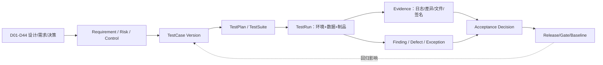

# D45 测试与验收体系详细设计

> 来源：@design/INDEX.md | 创建：2026-07-22 | 更新：2026-07-22
> 原始行范围：15021–15477
> 引用约定：同文件内引用使用 §编号，跨文件引用使用 @design/文件名.md

## D45 测试与验收体系详细设计

### D45.1 任务定义与质量结论

D45 定义“设计要求如何被证明满足”，不是开发排期。测试体系覆盖需求、专业成果、规则、AI、接口、数据、界面、安全、性能、可靠性、部署和用户验收；所有需求、风险、控制、设计决策和发布物必须映射到版本化 TestCase、责任人、环境、数据、期望、证据和结论。不存在“功能演示通过即整体验收”，也不以代码覆盖率替代业务与专业正确性。

质量结论：

1. 使用 Risk-Based Verification：风险越高，独立性、数据代表性、人工专业复核、故障测试和证据强度越高。
2. 使用双向追踪：Requirement/Risk/Control→TestCase→TestRun/Evidence→Finding/Exception→Release，同时 TestCase 必须反向指向设计来源 Dxx。
3. 测试分为 Verification（是否按设计构建）、Validation（是否在真实用途/人机流程中有效）和 Professional Acceptance（专业责任人是否确认成果适用），三者不可互相替代。
4. AI 采用 NIST TEVV 思路：在目标部署上下文中测量准确性、可靠性、安全、鲁棒性、安全与隐私，并公开不确定性、切片、局限和人机监督效果。
5. 专业金样不是单个“完美文件”，而是包含正常、边界、缺失、冲突、恶意和多工具往返的版本化 GoldenDatasetRelease。
6. 发布必须以可重放证据为依据；Flaky、Skipped、Unknown、环境偏差和未关闭高风险例外均不能被“总通过率”掩盖。

### D45.2 标杆依据与平台取舍

| 标杆 | 关键机制 | 本平台应用 |
|---|---|---|
| [NIST AI TEVV](https://www.nist.gov/ai-test-evaluation-validation-and-verification-tevv) / [AI RMF Measure](https://airc.nist.gov/airmf-resources/airmf/5-sec-core/) | 指标与方法可重复、记录不确定性，贴近部署条件，覆盖有效可靠、安全、韧性、隐私、公平和持续监测 | AI Release 必须有上下文/切片/基准/不确定性/局限/独立复核与上线后监测；单一平均准确率不得放行 |
| [OWASP ASVS 5.0.0](https://owasp.org/www-project-application-security-verification-standard/) | 以带版本的细粒度要求标识建立应用安全验证基线 | SecurityControl/TestCase 保存 `v5.0.0-x.y.z` 映射；高风险能力按目标 Level 加项目威胁用例，不只跑扫描器 |
| [OWASP LLMSVS](https://owasp.org/www-project-llm-verification-standard/LLMSVS-v2.0-en.html) | LLM 专项验证补充 ASVS，不替代 SSDLC/风险评估 | Prompt Injection、数据泄漏、工具滥用、过度代理、模型/向量供应链和不安全输出进入 D24/D27/D40 专项测试 |
| [Pact Consumer-Driven Contract Testing](https://docs.pact.io/implementation_guides/go/docs/consumer) | Consumer 声明预期，Provider 回放验证，防止破坏现有消费者 | HTTP/gRPC Adapter 使用 Consumer/Provider 双向验证；OpenAPI/Proto/AsyncAPI 静态兼容检查仍保留 |
| [WCAG 2.2](https://www.w3.org/TR/WCAG22/) / [ACT 说明](https://www.w3.org/WAI/WCAG22/Understanding/understanding-act-rules.html) | AA 成功准则需全页满足；自动规则只做部分检查，仍需人工评价 | P01–P12 做 axe 自动检查+键盘/读屏/缩放/颜色/焦点人工矩阵；不能以“自动扫描零问题”声明合规 |
| [buildingSMART IFC Validation Service](https://info.buildingsmart.org/users/services/validation-service/) | 对 IFC schema/specification 做标准化一致性判断 | IFC 金样同时过 schema/spec 校验、IDS/BCF 语义、几何与目标工具往返；平台测试不冒充软件认证 |

### D45.3 测试对象与唯一追踪模型

| 实体 | 必需字段 |
|---|---|
| VerificationItem | `itemId/type/statement/sourceDxx/risk/control/owner/criticality/applicability/version` |
| TestCaseVersion | `caseId/objective/preconditions/steps/oracle/data/env/automation/negative/boundary/owner/reviewer/version` |
| TestSuite/Plan | scope/release/profile/entry-exit/cases/order/resources/schedule owner（仅执行编排，不是开发计划） |
| TestDataRelease | dataset/schema/license/privacy/slices/gold labels/hash/generator/split/expiry/owner |
| TestEnvironment | DeploymentProfile/config/support matrix/dependencies/time window/deviation |
| TestRun | case version/artifact digest/model-rule-plugin versions/env/data/seed/start-end/outcome/retry/actor |
| TestEvidence | type/object URI/hash/tool/version/raw-summary/retention/classification/signature |
| Finding | severity/category/repro/affected requirement/artifact/root state/owner/SLA/fix/verification |
| TestException | scope/reason/risk/compensation/approvers/expiry/retest trigger/residual risk |
| AcceptanceDecision | gate/scope/pass-fail-conditional/basis/open risk/signatories/time/signature |

唯一结果枚举为 `Pass / Fail / Blocked / NotApplicable / Inconclusive`。`Skipped` 是未执行状态，不可计 Pass；`Flaky` 是 TestCase 属性，重复成功不能自动清除。NotApplicable 需要适用性理由和审批；Inconclusive 必须说明 oracle、数据或环境为何不足。

### D45.4 双向追踪与覆盖规则

每个 VerificationItem 至少映射一个正向和一个适用的负向/边界测试；High/Critical Risk 至少包含控制有效性、控制旁路、故障恢复和人工处置验证。每个 TestCase 必须映射一个需求/风险/控制，禁止积累无用途测试。

覆盖不是单一百分比，至少同时报告：

- Requirement Coverage：有合格 TestCase / 适用 Requirement；
- Risk-Control Coverage：风险的预防/检测/响应/恢复控制均有测试；
- Execution Coverage：目标 Release/Profile 上已执行且证据有效；
- Outcome Coverage：Pass/Fail/Blocked/Inconclusive 分布，不用“已运行”冒充通过；
- Slice Coverage：建筑类型/阶段/专业/地区/语言/单位/工具版本/数据质量/规模/风险切片；
- Change Coverage：变更影响集中的 TestCase 已重跑；
- Evidence Freshness：证据来自当前或兼容制品、环境、数据和依赖版本。

追踪门禁按 `Critical=100% requirement/control execution+pass，无例外`；`High=100% 执行，例外需风险 Owner+专业/安全责任人且有期限`；Medium/Low 可按变更影响抽样，但核心旅程和回归集不得抽掉。

### D45.5 D01–D44 设计覆盖矩阵

| 设计域 | 必测对象 | 主测试类型 | 验收责任 |
|---|---|---|---|
| D01–D03 产品/范围/能力 | 北极星场景、能力清单、自动化等级、范围裁剪 | 场景走查、Trace 审计、能力契约 | Product Owner+业务 Owner |
| D04/D39 身份权限 | RBAC+ABAC+关系、SoD、外部/撤权/Workload | Policy 单元、组合、越权、JIT、撤权时延 | IAM Owner+Security |
| D05–D08 阶段/CDE/流程 | Gate/Baseline/版本/发布/回退/任务/补偿 | 状态模型、并发、幂等、故障、E2E | Domain Owner+项目管理代表 |
| D09–D17 各阶段/专业 | 输入、计算/生成、图纸/模型、校审、专业提交 | 专业金样、边界、比较、人工 Validation | 对应注册/授权专业责任人 |
| D18/D22 联邦与跨表示 | 坐标、版本成员、2D/3D Link、差异/证据 | 多工具往返、几何/语义、缺失冲突 | BIM/CAD Lead |
| D19–D21 规则/规范 | Candidate→Issue、Edition/Clause、规则语义/例外 | 规则单元、mutation、差分、规范金样 | Rule Owner+专业责任人 |
| D23 数量与造价 | 分类、计量、Decimal、量价、FX/税/差异 | 算例、舍入、属性测试、对账 | 造价责任人 |
| D24/D27/D28 AI/Agent | 路由、Guardrail、工具授权、记忆、评测/Release/漂移 | TEVV、红队、工具仿真、Shadow/Canary | AI Risk Owner+独立 Evaluator |
| D25 感知解析 | OCR/图元/拓扑/坐标/置信/纠错 | 分层 Golden Set、扰动、人工标注一致性 | CV Owner+专业标注 Reviewer |
| D26 生成优化 | 变量/约束/目标/Pareto/鲁棒/可编辑写回 | 约束 oracle、可行性、seed、稳定/编辑性 | Optimization Owner+专业责任人 |
| D29–D33 连接器/工具/分析 | Revit/CAD/Rhino/SketchUp/ArchiCAD/GIS/Solver | Support Matrix 金样、事务/崩溃/离线/往返 | Connector Owner+工具管理员 |
| D34 数据 | 聚合/事务/RLS/对象/投影/保留/恢复 | schema/迁移、并发、属性、隔离、PITR | Data Owner+DBA |
| D35 接口 | HTTP/LRO/gRPC/Event/Webhook/File | schema/consumer-provider、幂等/乱序/兼容 | API/Event Owner+Consumer |
| D36/D37 界面 | IA、P01–P12、Grid/Viewer/AI/校审/全状态 | 组件、E2E、视觉、可访问性、可用性 | UX Owner+业务用户+Accessibility Reviewer |
| D38 协作通知 | Intent/偏好/Digest/升级/Webhook | 状态/时间/去重/渠道故障/偏好 | Collaboration Owner |
| D40 安全隐私 | STRIDE/LINDDUN、文件/AI/供应链、隐私权利 | ASVS/LLMSVS、SAST/DAST/IAST、渗透/红队 | Security/Privacy 独立 Reviewer |
| D41 审计证据 | Schema/Merkle/签名/TSA/WORM/证据包 | tamper/完整性/长期验证/权限/导出 | Audit Owner+Legal/Compliance Reviewer |
| D42 容量非功能 | Journey SLO、Cell 包络、过载、成本 | load/stress/soak/spike/容量/成本 | SRE+Capacity Owner |
| D43 可观测性 | 语义/Context/基数/采样/SLO/告警/Incident | telemetry contract、丢失、synthetic、告警演练 | Observability Owner+On-call |
| D44 部署拓扑 | Profile/Cell/网络/GPU/Windows/GitOps/备份/DR | IaC/policy/conformance/chaos/restore/failover | Platform/SRE+Security |

### D45.6 测试分层与反馈时限

| 层级 | 主要对象 | 触发/反馈目标 | 不能替代 |
|---|---|---|---|
| Static/Design | schema、类型、依赖、IaC、Policy、规则 DSL、设计 Trace | 每次变更，分钟级 | 运行时/专业正确性 |
| Unit/Property | Domain invariant、Decimal、状态机、算法、Policy、Parser | 每次提交，分钟级 | 数据库/外部契约 |
| Component | Service+真实 DB/Cache/Object emulator、UI component、Worker | PR/合并，十分钟级 | 跨服务/真实工具 |
| Contract | HTTP/gRPC/Event/Webhook/File/Provider/Plugin | Consumer/Provider 变更，分钟至小时 | 业务旅程 |
| Integration | 多组件、数据库迁移、消息、对象、身份、工具沙箱 | 合并/每日 | 用户意图/规模 |
| E2E/Journey | P01–P12→Gate/CDE/AI/校审/发布 | 每日/Release | 专业 Validation |
| Professional Golden | 图纸/模型/规则/数量/分析/多工具往返 | Release/规则模型工具变化 | 真实项目 Pilot |
| Nonfunctional | 性能、可靠性、安全、隐私、可访问性、恢复 | Release/基础设施变化 | 功能覆盖 |
| UAT/Pilot | 真实角色、项目过程、人机责任、运维支持 | 版本/阶段 Gate | 自动回归 |

测试金字塔不按固定比例机械分配：专业工具 E2E 昂贵，应把解析/转换核心下沉到 Unit/Golden Component，但必须保留版本认证的真实工具往返；AI 评测以批量离线 TEVV 为主体，少量确定性 Journey 验证编排和人工复核。

### D45.7 测试环境与依赖仿真

测试环境沿用 D44 六级环境。每个 TestRun 固定 DeploymentProfile、Release Bundle、Feature/Policy、Support Matrix、Region/locale/timezone、Provider stub/real、网络故障和容量画像。

- 外部 AI、通知、TSA、许可证和收费 API 默认使用契约 Stub/Mock，禁止单元/常规 CI 调用真实付费或生产 API。
- Integration 提供 WireMock/MockServer、Kafka Testcontainers、S3 兼容 emulator、OIDC/SCIM 测试 IdP、虚拟 Site Connector、Solver simulator。
- 真实 Revit/AutoCAD/Rhino/SketchUp/ArchiCAD/Windows/HPC 只在隔离认证池运行；账号、许可证、字体/模板和输出按 TestRun 清理。
- Preprod 与生产拓扑等价并记录差异；无法等价的 GPU、存储、Provider 或网络差异必须进入 AcceptanceDecision，不允许隐式外推。
- 合成租户与测试事件带 `testRunId`，D43 SLO/运营报表明确排除或单独计量；测试不得污染业务通知、审计或账单。

### D45.8 测试数据与 GoldenDatasetRelease

| 数据集 | 主要内容 | 关键切片/反例 |
|---|---|---|
| Requirement/Standard | Brief、规范条文、IDS、变更/冲突/引用 | 版本差、地区/语言、过期条文、否定/例外、OCR 噪声 |
| Sketch/Drawing | 手绘、扫描/PDF/DWG、图层/文字/尺寸/符号 | 倾斜、低分辨率、遮挡、多比例、字体缺失、恶意文件 |
| BIM/Federation | RVT/IFC/BCF、专业模型、坐标/阶段/LOD | IFC edition、错轴/单位、缺构件、重复 GUID、大模型、代理对象 |
| Professional | 建筑/结构/给排水/HVAC/电气图纸与计算 | 正常/边界/违规/Unknown、多系统、多建筑类型/地区 |
| Quantity/Cost | 分类/计量/Rate/FX/税/舍入 | 负值、极值、币种/日期缺失、不同计量规则、对账差异 |
| AI/Agent | Prompt/Context/Tool/expected rubric | 注入/越权/泄漏、含糊、知识边界、多语言、长上下文、拒答 |
| Security/Privacy | 文件、请求、身份、租户、数据权利 | OWASP payload、跨租户、撤权、SSRF、zip bomb、PII/secret |
| Performance | 项目/文件/并发/队列/事件生成器 | P50/P95/max 包络、突发、长稳、故障后积压 |
| UI/Accessibility | 角色/语言/主题/分辨率/状态 | 键盘、读屏、200%/400%、错误/空/部分/离线、RTL（若适用） |

GoldenDatasetRelease 保存原始/派生文件 hash、许可/隐私、来源、标注指南、双人/专家仲裁、切片统计、train/dev/test 隔离、已知不确定性、oracle 类型和适用 DeploymentProfile。生产问题可提炼为最小脱敏回归样本，未经授权不得把客户文件加入企业训练/测试集。

多工具交换金样矩阵：为每对受支持的工具间数据交换建立 ExchangeRoundTripSample，覆盖 IFC/原生/BCF/坐标/属性/对象 ID 六维信息保真度。矩阵按工具对（Revit↔IFC、AutoCAD↔IFC、ArchiCAD↔IFC、Rhino↔IFC、Solibri↔IFC、Navisworks↔IFC 等）和交换方向（导出/导入/往返）组织。每个样本定义允许损失清单（如导出时丢失渲染材质、非几何元数据）和禁止损失清单（如结构构件 ID、几何坐标精度、系统连接关系、专业属性）。Round-trip 测试流程：源工具导出→IFC 中间件→目标工具导入→目标工具导出→与源文件按 Oracle 类型（Exact/Tolerance/Invariant/Differential）逐维比对。损失超出禁止清单阈值的工具对标记 `ExchangeLossExceeded`，D29 Connector 在该工具对组合的 Support Matrix 中降级为 `Conditional` 或 `NotSupported`，不静默接受信息丢失。ExchangeRoundTripSample 在工具版本升级、IFC schema 变更或新工具接入时必须重跑，结果写入 ConnectorDefinition.qualificationEvidence。

### D45.9 Oracle 与专业正确性判定

| Oracle 类型 | 适用对象 | 判定方式 |
|---|---|---|
| Exact | ID、状态、金额、hash、权限、Event | 精确值/集合/顺序或明确无序比较 |
| Tolerance | 几何、坐标、能耗/水力/结构数值 | 单位/精度/绝对+相对容差，来源规范/工具资格 |
| Invariant/Property | 拓扑、守恒、状态机、幂等、权限 | 属性测试/模型检查，随机 seed 可重放 |
| Differential | 新旧版本/双引擎/专业工具 | 差异分类，不能自动假设旧版正确 |
| Metamorphic | 无唯一答案的 AI/优化/视觉 | 输入受控变换后应保持/单调/等变的关系 |
| Rubric/Expert | 方案质量、可读性、适用性、人机协作 | 盲评/双评+仲裁，Rubric、资质、分歧和置信区间 |
| Compliance | ASVS/WCAG/IFC/IDS/项目规则 | 固定版本要求、工具输出+人工补充 |

专业验收必须区分“计算器与基准一致”“结果满足输入假设”“结果可用于当前阶段”和“成果已由法定责任人签审”。平台只能证明前三类技术/流程证据，不替代第四类专业与监管责任。

### D45.10 单元、属性与模型测试

- Domain 聚合：状态转移、并发 ETag、幂等、补偿、版本不可变、基线/发布约束。
- Decimal/单位/坐标：舍入、换算、极值、NaN/Infinity 拒绝、CRS/轴序/高程基准属性。
- Policy：principal/resource/environment 组合、deny/obligation、继承/关系、撤权和不可用 fail strategy。
- Rule DSL：语法、类型、单位、Unknown、例外、证据、mutation testing；删除/反转比较符应被金样发现。
- Geometry/Graph：平移/旋转/缩放等变、拓扑守恒、容差边界、退化几何、随机 seed 固定。
- Parser：fuzz/property-based 输入、资源上限、超时和 crash isolation；任何文件不能使宿主长驻进程失控。
- UI reducer/form：状态机、Dirty/Conflict、Undo、键盘命令和权限裁剪。

代码覆盖门槛按仓库规范单元测试行/分支基线不低于 75%，但 Critical invariant 要求分支/条件和 mutation 覆盖；覆盖率下降或新增未覆盖高风险分支阻断。覆盖排除必须版本化并经 Reviewer 批准。

### D45.11 API、Event、File 与 Provider 契约测试

| 契约 | 必测项 |
|---|---|
| HTTP/OpenAPI | schema/example、状态/Problem Details、auth、pagination、ETag、idempotency、rate/size、N/N-1 compatibility |
| gRPC/Proto | 字段编号保留、deadline/cancel、status detail、stream backpressure、mTLS audience |
| AsyncAPI/Event | schema、key/partition、ordering、duplicate、late/out-of-order、retry/DLQ、consumer lag、upcaster |
| Webhook | signature/timestamp/replay、redirect/SSRF、retry/dedup、receiver 4xx/5xx/timeout、secret rotation |
| File/Manifest | MIME+magic、size/chunk/hash、path、zip bomb、malware、schema/edition、partial upload、round-trip |
| AI/通知/分析 Provider | capability/model/region、timeout/429/5xx、partial/malformed、billing、request id、policy fallback |
| Plugin/Desktop | protocol/version/feature negotiation、lease、offline、cancel、partial output、upgrade/downgrade |

Consumer Pact 与 Provider Verification 只覆盖使用中的交互；规范静态兼容、未消费但公开的 API、错误模型、性能和安全另测。契约变更在 Broker/Registry 计算“可否部署”，不能只检查编译通过。

### D45.12 数据库、迁移与一致性测试

- 每次 migration 从当前 N、受支持 N-1 和接近规模的数据快照升级；验证 expand、回填 checkpoint/暂停/恢复、双写对账、切读和 contract。
- PostgreSQL 使用事务/隔离/锁/死锁/statement timeout、RLS 跨租户、连接池耗尽、主从切换和 PITR 测试。
- Outbox→Kafka 注入 crash，验证无事实丢失、允许重复且 Consumer 幂等；乱序/迟到/重放按 D35 语义。
- Object Manifest 验证 multipart 中断、重复完成、hash 错、复制 lag、版本删除/WORM、生命周期和跨区恢复。
- Search/Vector/Analytics 从事实源/版本化语料重建，检查 watermark、缺口、删除/撤权传播和结果陈旧标识。
- Cache 清空/过期/故障后系统仍正确，仅性能下降；分布式锁丢失不能产生双发布/双签审。

### D45.13 UI、视觉与可访问性测试

P01–P12 每页覆盖 Normal/Empty/Filtered Empty/Loading/Partial/Error/Unauthorized/Conflict/Offline/Stale，以及只读、Disabled、长文本、多语言、时区/单位和大数据量。组件测试覆盖 Form/Grid/Tree/Viewer/Diff/Timeline/AI Review/Gate/Notification。

自动化使用 Playwright Component/E2E、axe-core、视觉截图差异；人工矩阵至少包含：仅键盘、焦点顺序/可见性、快捷键冲突、VoiceOver+Safari、NVDA+Chrome/Edge、200% 文本和 400% zoom、对比度/非颜色提示、动态状态宣告、Grid/Tree/Viewer 替代路径、错误恢复和触控目标。

视觉差异按 Design Token/Viewport/主题/locale 固定；抗锯齿噪声使用小阈值，但关键状态、文字溢出、遮挡和像素级图纸标注不可被大范围 mask。WCAG 结论以成功准则和人工证据为准，axe/ACT 仅提供部分检查。

### D45.14 专业文件、模型与工具往返测试

| 链路 | 核心判定 |
|---|---|
| Revit↔平台 | 文档/事务、元素 UniqueId、参数/单位、Worksharing、Family、视图/Sheet、失败回滚 |
| AutoCAD↔平台 | DWG 版本、handle、layer/block/xref/font/proxy、layout/plot、锁与事务 |
| Rhino/GH/Compute | geometry tolerance、unit、layer/user text、GH definition/version/plugin、determinism |
| SketchUp | entity persistent id、component/material/tag/scene、unit/geo、extension compatibility |
| Archicad/Teamwork | element GUID/classification/property/hotlink/teamwork reserve、GDL、安全脚本 |
| IFC/IDS/BCF | schema/spec、MVD/edition、GUID/geometry/property/classification、IDS pass/fail、BCF viewpoint/topic |
| GIS/Analysis | CRS/vertical datum、mesh/node mapping、unit/assumption、solver convergence、result write-back |

每个 Support Matrix 组合至少运行 smoke+关键 Golden Suite；新增/升级工具运行完整回归和双向往返。比较结果按 `NoLoss / ExpectedRepresentationalLoss / Defect / Inconclusive` 分类，预期损失必须在 D32/D33 Exchange Contract 中声明并向用户展示。

### D45.15 规则、规范与合规测试

- Clause→Rule 映射保存 Edition/Clause/适用域、解释、边界值、正反例、Unknown 和证据；条文更新触发受影响规则集重跑。
- 每条 Critical Rule 至少有 Pass、Fail、边界等于、输入缺失、单位/地区错、豁免和证据定位样本。
- 用 mutation testing 检查金样是否能捕获比较符、阈值、逻辑连接、单位和适用条件错误。
- 多引擎差异先形成 Differential Finding，由 Rule Owner/专业责任人仲裁，不用多数投票自动认定真值。
- 规则测试通过只证明实现与批准解释一致，不证明项目已获监管批准；法规责任与项目审查仍由授权主体承担。

### D45.16 AI、Agent 与感知 TEVV

| 维度 | 指标/方法 | 放行原则 |
|---|---|---|
| Task Quality | precision/recall/F1、IoU、数值误差、Rubric、constraint satisfaction | 按用途/切片阈值，不只平均值 |
| Calibration | confidence bin、ECE/Brier、coverage-risk | 置信度能指导复核/拒答，过度自信阻断 |
| Robustness | 扫描噪声、旋转、遮挡、语言、Prompt 改写、工具/Provider 故障 | 关键切片退化在风险容忍内并安全失败 |
| Safety/Security | injection、jailbreak、数据外泄、越权工具、恶意文件/模型、资源耗尽 | Critical exploit 零容忍；防护旁路独立红队 |
| Grounding | Citation/Clause/Asset/Version 可验证、unsupported claim | 高风险答案无证据即拒答/Questionable |
| Human Oversight | 发现率、纠正率、复核时间、automation bias、handoff | 人能理解限制、编辑/拒绝/停止/追责 |
| Fairness/Language | 地区、语言、建筑类型、图纸风格和质量切片差异 | 差异披露并在用途容忍内；无数据不宣称公平 |
| Privacy | memorization/extraction、PII/secret、retention/deletion、Provider usage | 不越用途/驻留/训练条款，删除传播可验证 |
| Efficiency | latency/token/GPU/energy/cost per accepted outcome | 与质量联合门禁，不以最低成本牺牲安全 |
| Drift | input/output/acceptance/error/slice/provider/model shift | 超阈 Shadow/回滚/再评测，生产标签延迟显式 |

Agent 测试使用 Tool Simulator 和真实低风险沙箱，覆盖计划生成、参数约束、PEP allow/deny/obligation、预算、递归/死循环、记忆污染、跨任务泄漏、用户撤回、工具 partial/timeout、Handoff 和 emergency stop。不得让测试 Agent 对生产项目或外部人员产生真实写入/通知。

AI TestData 必须与训练/微调/Prompt 优化数据去重隔离；模型/Prompt/Embedding/Guardrail/Tool Schema 任一变化均产生新 EvaluationRun。随机性测试保存 seed/temperature/provider revision；外部黑盒模型无法固定时报告重复分布和置信区间，而非伪造确定性。

### D45.17 安全、隐私与供应链验证

| 测试面 | 必测内容 |
|---|---|
| ASVS | 架构/编码、认证、会话、授权、输入、密码学、API、文件、日志、配置；引用固定 `v5.0.0-*` |
| IAM/Multitenancy | IDOR、角色/属性/关系组合、跨租户推测、缓存、分享、SCIM、撤权、break-glass |
| File/Sandbox | polyglot、zip bomb、path traversal、macro/script、parser crash、资源耗尽、CDR bypass |
| API/Egress | injection、SSRF、redirect/DNS rebinding、request smuggling、rate/size、replay、webhook forgery |
| AI/Agent | LLMSVS/Threat Model、Prompt/indirect injection、tool/data exfiltration、model/vector poisoning |
| Privacy | Inventory/目的/最小化、DSAR、删除/保留、日志/Telemetry、跨境/Provider、重识别 |
| Supply Chain | SAST/SCA/license/secret/IaC/image/model/SBOM/signature/provenance、dependency confusion |
| Runtime | DAST/IAST、K8s policy、NetworkPolicy、container escape 前提、KMS/Vault、JIT/Bastion |
| Human Red Team | 业务逻辑、组合攻击、社会工程边界、专业成果篡改、证据链破坏 |

自动扫描结果先去重/验证，不以“无工具发现”证明安全。Critical/High 发现发布前关闭并独立复测；无法修复时 Critical 不允许例外，High 需 Security+Risk Owner+业务/专业 Owner 接受、补偿控制和短期限。渗透/红队测试生产前需 Rules of Engagement、数据/人员/时窗/停止条件和应急联络。

### D45.18 性能、容量与成本测试

性能场景直接引用 D42 Journey/Resource/Cell 包络：

| 类型 | 目标 |
|---|---|
| Baseline | 单组件/旅程在固定资源下建立版本对比 |
| Load | P50/P95 业务并发、文件/模型尺寸、队列和 Provider 配额满足 SLO |
| Stress | 找到吞吐拐点、过载保护和恢复，不要求超包络维持正常 |
| Spike | 登录/上传/发布/AI 突发时限流、队列和优先级有效 |
| Soak | 8/24/72h 按风险发现连接、内存、临时盘、句柄、许可证泄漏和成本漂移 |
| Scalability | HPA/KEDA/node/GPU/Windows warm pool 扩缩斜率、冷启动和稳定窗口 |
| Volume | 最大项目、对象、版本、Event、审计、搜索/向量、备份/恢复规模 |
| Degradation | DB/Provider/网络/许可证变慢时 deadline、熔断、降级和队列边界 |
| Cost | 每旅程/成果/AI accepted outcome/GPU hour/egress/DR 成本包络 |

报告同时给 workload model、生成器位置、资源/版本、warm-up、样本数、分位数/置信区间、错误、队列、质量和成本。客户端与 Generator 资源不足、缓存预热、第三方限流必须分离，禁止只报平均响应时间。

### D45.19 可靠性、Chaos、备份与 DR 测试

- Fault Injection 依次从 dependency stub、非生产 Pod/node 开始，再到 zone/Region 演练；每次有 blast radius、停止条件、观察项和回滚。
- 覆盖 D44 故障矩阵：Pod/node/zone、PostgreSQL/Object/Kafka/Valkey/Search、IAM/OPA、KMS/Vault/TSA、Provider/GPU/Windows/Site/license、Telemetry/GitOps/Backup。
- 验证的不只是服务恢复，还包括 Operation/Job/File/Event 对账、tenant/权限/撤权、审计连续性、专业成果 hash、通知和实际 RPO/RTO。
- Backup Restore Test 使用隔离目标和独立 KMS 恢复，按抽样+季度全链恢复；只校验备份文件存在不算通过。
- Region Failover/Failback 至少半年演练，记录 last consistent point、fencing、Unknown operation、DNS、容量和用户沟通。
- Chaos 工具不得接触未授权客户租户；生产实验需 SRE+业务 Owner 批准并受 Error Budget 限制。

### D45.20 可观测性与告警验收

每个关键旅程运行 Synthetic/故障用例并验证：Trace/Baggage 清理、HTTP/gRPC/Event/Workflow/Worker/Provider Context 连续；RED/USE/Queue/AI/质量/成本指标；结构化脱敏日志；tail sampling；Collector buffer/drop；Dashboard watermark；多窗口 burn alert；Pager 去重/路由/ack/escalation；Runbook 定位和 Incident 时间线。

Telemetry Contract Test 校验 Semantic Registry、单位、低基数、禁止 user/tenant/project/file/prompt 进入 metric label。故意断开 Collector/backend，确认盲区自身告警；测试数据在 SLO 和运营报表中按规则隔离。

### D45.21 UAT、专业验收与首场景 Pilot

UAT 不是自由探索演示，而是按真实角色、真实阶段 Gate 和批准数据执行的 Scenario Script：前置/输入→动作→期望业务/专业结果→人工判断点→证据→残余问题。至少包含建筑师、各专业工程师、BIM/CAD、校审/审定、项目经理、外部协作者、平台/安全运维和可访问性用户。

首个“境外主创草图→CAD/BIM/分析/PPT”Pilot 作为 V0/V1 纵向切片，至少验证：

1. 草图/PDF 摄取、尺度/坐标/需求澄清和版本基线；
2. 候选方案生成/比选、AI 局限和建筑师可编辑性；
3. Rhino/SketchUp/ArchiCAD/Revit/AutoCAD 中实际启用工具的往返损失；
4. 场地/气候/能耗等启用分析的假设、映射和结果证据；
5. 图纸/模型/PPT 发布集、需求追踪、校审签批和 Transmittal；
6. 多语言/单位/地区规范、外部协作、数据驻留和 Provider 条款；
7. 时间/返工/质量/成本对照基线，以及未覆盖专业/阶段的明确边界。

Pilot 成功不等于平台全专业/全阶段验收；结果只对通过的场景、数据、工具版本、地区和自动化等级有效。扩展到结构/MEP/施工图时必须执行对应 D13–D17 专业资格集。

### D45.22 缺陷、Flaky 与例外治理

| 等级 | 定义 | 发布规则 |
|---|---|---|
| Critical | 跨租户/不可逆成果或证据破坏/安全责任失控/核心事实丢失 | 必须修复并独立复测，无例外 |
| High | 核心旅程不可用、专业高风险错误、重大 SLO/隐私/恢复失效 | 默认阻断；仅限明确非适用范围的短期风险接受 |
| Medium | 有可靠 workaround、非核心质量/性能偏差 | Owner/SLA/回归，可条件放行 |
| Low | 轻微体验/文案/不影响结论 | 纳入 Backlog，不计为测试通过证据 |

Flaky Case 连续重复不稳定即隔离，但对应 Requirement 变为 Coverage Gap；先保留替代确定性 TestCase 才可不阻断。修复必须有最小回归样本和根因分类。Exception 保存补偿控制、适用 Release/Profile、风险签署、到期和撤销条件；版本升级不自动继承。

### D45.23 质量门禁与验收签署

| Gate | 必要证据 | 签署角色 |
|---|---|---|
| PR/Merge | static/unit/property/component、覆盖/质量、安全快速扫描 | Developer+Reviewer（实施期） |
| Integration | contract/integration/migration、关键 Golden smoke | Component Owner+QA |
| Release Candidate | 全回归、专业金样、AI TEVV、安全/性能/可靠性、兼容 | QA Lead+各域 Owner |
| Preprod | 生产等价 E2E、升级/回滚、restore、canary、运维演练 | Release/SRE/Security |
| Pilot/UAT | 场景脚本、用户/专业结论、培训支持、残余风险 | Product/业务/专业 Owner |
| Production Promotion | `Critical Verification Trace Coverage=100%`（每项 Critical Requirement/Risk/Control 均有已执行 TestRun、有效 Evidence 与通过决定）、High 规则、签名 Bundle、Go/No-Go | Release Authority；AI 不代签 |
| Post-release | Canary/SLO/质量/成本/安全、无未知数据差异 | SRE+Product+Domain Owner |

AcceptanceDecision 可为 Pass、Fail、Conditional Pass；Conditional 只能用于非 Critical、范围明确、补偿有效且到期的项。任何签署均是责任人的决定，平台/AI 只聚合证据、检查完整性和记录签名。

### D45.24 测试执行与证据界面

| 页面 | 核心组件/信息 | 关键动作 |
|---|---|---|
| Quality Cockpit | Release/Profile/Gate、coverage、pass/fail/blocked/inconclusive、risk、freshness | 下钻差距/阻断/Owner，不只显示总绿灯 |
| Trace Matrix | Requirement/Risk/Control↔Case↔Run/Evidence↔Finding↔Decision | 双向筛选、影响分析、孤儿检测、导出 |
| Test Case Studio | objective/steps/oracle/data/env/negative/boundary/version/reviewer | compare/approve/deprecate；高风险变更双人复核 |
| Dataset & Golden | 来源/许可/隐私、切片、标注/仲裁、hash、split、适用域 | 创建 Release、泄漏检查、到期/撤销 |
| Test Run | 实时步骤、制品/配置、环境偏差、日志/Trace、产物 diff | pause/cancel/retry；原 Run 不覆写 |
| Professional Review | 2D/3D/数值/Clause/Rubric side-by-side、盲评/仲裁 | Pass/Fail/Inconclusive、Comment/Issue/签名 |
| AI Evaluation | slice/metric/CI/baseline、failure cluster、red-team、human oversight | compare Release、门槛模拟、批准/拒绝 |
| Security Validation | ASVS/LLMSVS/Threat/scan/pentest/control/evidence | dedup/verify/exception/retest，敏感详情限权 |
| Performance Lab | workload/resource/timeline/percentile/queue/quality/cost | baseline compare、瓶颈/包络、报告 |
| UAT/Pilot | scenario/role/session/evidence/feedback/training/residual risk | session、签署、范围声明 |
| Defect/Exception | severity/repro/root/fix/retest/risk/compensation/expiry | triage/assign/accept/revoke/close |
| Acceptance Package | scope/versions/coverage/results/open risks/signatures/hash | 预览、完整性检查、签署、WORM 封存 |

### D45.25 测试接口与事件

| 契约 | 用途 |
|---|---|
| `GET/POST/PATCH /verification-items` | Requirement/Risk/Control 与 Dxx 来源登记 |
| `GET/POST/PATCH /test-cases`、`POST /test-cases/{id}:approve` | 版本化 Case/Oracle/Owner/Reviewer |
| `GET/POST /test-data-releases` | GoldenDataset、切片、许可/隐私、hash/split |
| `GET/POST /test-plans`、`POST /test-runs` | Scope/Profile/Release 执行与不可变 Run |
| `POST /test-runs/{id}/evidence`、`/complete` | 证据 Manifest/hash 和结果提交 |
| `GET /trace-matrix`、`GET /coverage` | 双向追踪和多维覆盖/孤儿/新鲜度 |
| `GET/POST/PATCH /findings`、`POST /findings/{id}:retest` | 缺陷/安全发现/专业问题闭环 |
| `GET/POST /test-exceptions`、`POST /test-exceptions/{id}:revoke` | 风险接受、补偿、期限和撤销 |
| `GET/POST /evaluation-runs`、`GET /evaluation-comparisons` | AI/Rule/Professional 指标、切片、CI、基准 |
| `GET/POST /acceptance-decisions`、`POST /acceptance-packages` | Gate 决策和证据包/签名 |
| `VerificationGapDetected/TestCaseApproved` | 追踪治理 |
| `TestRunStarted/Completed/Blocked` | 执行生命周期 |
| `GoldenDatasetReleased/Revoked/LeakageDetected` | 数据集治理 |
| `FindingOpened/SeverityChanged/Verified/Regressed` | 问题闭环 |
| `EvaluationThresholdBreached/DriftReevaluationRequired` | AI/规则质量门禁 |
| `AcceptanceRequested/Granted/Rejected/Expired` | 验收与例外状态 |

### D45.26 技术栈与工具边界

| 测试域 | 参考技术栈 | 边界 |
|---|---|---|
| Unit/Property | pytest+Hypothesis；Vitest/Jest+fast-check；语言原生框架 | 具体实现期按仓库语言定一种，不重复引入 |
| Component/Integration | Testcontainers、Docker/K8s ephemeral environment、MockServer/WireMock | 外部付费 API 默认 Mock；状态每 Run 隔离 |
| API Contract | OpenAPI/Proto/AsyncAPI lint+compat、Pact/Pact Broker、Schemathesis | Pact 不替代规范/安全/性能 |
| UI/E2E | Playwright、Testing Library、axe-core、截图基线 | 可访问性仍需人工；不依赖脆弱 CSS selector |
| Performance | k6、Prometheus/Grafana、OpenTelemetry | 与 D42 workload/资源/质量/成本联合 |
| Security | Semgrep 基线、Trivy、OWASP ZAP、Nuclei（受控）、Burp 专业测试；GitHub Profile 可追加 CodeQL | 扫描器发现需验证；渗透有授权范围，追加工具不改变主门禁 |
| AI/ML TEVV | pytest/eval harness、MLflow 或现有 D28 Registry、Ragas/DeepEval 类库经资格、人工标注工具 | 框架指标需校准，LLM-as-Judge 不作唯一高风险 oracle |
| Data Quality | Great Expectations、SQL assertions、hash/manifest tools | 业务 invariant 仍在 Domain Test |
| Chaos/DR | Chaos Mesh + Toxiproxy、云故障工具、restore scripts | 生产实验需批准/停止条件，不并行引入第二 Chaos 控制面 |
| CAD/BIM/IFC | 官方 API test harness、buildingSMART validation、IfcOpenShell、工具金样 Runner | 标准校验不替代厂商认证/专业签审 |
| Test Management | 平台内 Verification/Test/Evidence 模型；可通过 Adapter 对接 Jira/Xray/Zephyr | 外部系统不成为唯一证据事实源 |

测试代码、数据和环境配置均版本化；Test Evidence 进入对象存储，摘要/关系进入 PostgreSQL，关键 Acceptance Package 沿 D41 WORM/签名/TSA 封存。测试框架只是执行器，验收语义由本设计统一模型控制。

### D45.27 质量指标

| 指标 | 定义/防误用 |
|---|---|
| Requirement/Risk Coverage | 按 criticality 的 Case/Run/Pass，不只总百分比 |
| Trace Orphan Rate | 无来源 Case、无 Case Requirement、无证据 Run |
| Evidence Freshness | 与当前 Release/Profile/Data/Support Matrix 匹配 |
| First-pass/Regression | 首次通过、回归失败、逃逸缺陷；不用于人员排名 |
| Defect Escape | 生产/后阶段发现按严重度、来源和可预防测试缺口 |
| Flaky/Blocked/Inconclusive | 分开统计及老化，不能并入 Pass |
| Test Duration/Feedback | P50/P95、关键路径、排队/环境准备/执行分解 |
| Golden Slice Coverage | 专业/阶段/地区/工具/质量/规模/风险代表性 |
| AI Quality/Calibration | 切片指标、CI、coverage-risk、基准/漂移 |
| Human Review Quality | Reviewer agreement、仲裁率、automation bias、纠正/漏检 |
| Contract Compatibility | Consumer/Provider、N/N-1、Event/File 组合通过 |
| Security Verification | ASVS/LLMSVS/Threat Control 通过、发现/复测/例外老化 |
| Accessibility | WCAG AA success criteria 自动+人工证据和未覆盖项 |
| Performance/Capacity | Journey SLO、吞吐/资源/队列/扩缩/恢复/成本包络 |
| Resilience/Recovery | 故障检测/缓解/恢复、实际 RPO/RTO、数据/权限/审计对账 |
| Environment Fidelity | Preprod/Prod 拓扑、配置、数据规模、Provider 差异 |
| UAT/Pilot | 场景通过、任务成功/返工/时间/信任、残余风险与范围 |
| Test Cost/Efficiency | 每 Gate/Case/发现/accepted outcome 成本，不能以砍高风险覆盖降本 |

### D45.28 D45 验收条件（EARS）

- When Requirement、Risk、Control 或设计决策登记, the 质量系统 shall 要求 Owner、criticality、适用域和至少一个可追踪 TestCase。
- When TestCase 创建, the 系统 shall 保存 objective、前置、步骤、oracle、数据、环境、正反/边界、Owner、Reviewer 和版本。
- When TestCase 不映射任何 VerificationItem, the Trace Audit shall 标记孤儿并阻断其作为发布覆盖证据。
- When Critical Requirement 准备验收, the 门禁 shall 要求 100% 适用控制已执行且 Pass，不接受例外或 Skipped。
- When TestRun 启动, the Runner shall 固定 Release digest、DeploymentProfile、Support Matrix、数据版本、配置、seed 和依赖版本。
- When Run 重试, the 系统 shall 创建独立 Attempt 并保留原结果，不以最后一次成功覆写 Flaky/Fail 历史。
- When 测试未执行、被阻断或无法判定, the 报表 shall 分别显示 Skipped/Blocked/Inconclusive，不计为 Pass。
- When TestDataRelease 发布, the 数据治理 shall 验证来源/许可/隐私、切片、标注/仲裁、hash、train-test 泄漏和适用域。
- When 生产问题加入回归集, the 团队 shall 使用最小化脱敏样本和授权，不直接复制客户文件到企业测试集。
- When Oracle 使用数值容差, the TestCase shall 声明单位、绝对/相对容差、依据和边界等于行为。
- When 专业结果无唯一答案, the 验收 shall 使用批准 Rubric、合格双评/仲裁并记录分歧与不确定性。
- When API Consumer 或 Provider 契约变化, the CI shall 同时验证规范兼容和 Consumer/Provider 交互后才允许 Promotion。
- When Event Consumer 测试, the Runner shall 注入 duplicate、late、out-of-order、retry、DLQ 和 schema upcast 场景。
- When 文件解析测试, the Sandbox shall 覆盖 magic/MIME、chunk/hash、zip bomb、恶意脚本、资源耗尽和 crash isolation。
- When 数据库 migration 变化, the 测试 shall 从当前与受支持旧版本升级并验证回填暂停/恢复、双写对账和回滚/forward fix。
- When Cache/Search/Vector 丢失, the 测试 shall 证明业务事实仍正确且投影可按水位重建。
- When P01–P12 页面验收, the UI Suite shall 覆盖 Normal/Empty/Loading/Partial/Error/Unauthorized/Conflict/Offline/Stale。
- When WCAG AA 结论形成, the 验收 shall 联合自动检查和键盘/读屏/缩放/焦点/对比度人工证据，不只引用扫描器。
- When CAD/BIM 工具或插件版本升级, the Support Matrix shall 运行该组合的完整 Golden Round-trip 并分类交换损失。
- When IFC 成果验收, the 测试 shall 联合 schema/spec、IDS/BCF、几何/属性和目标工具往返，不以单一 validator 代替全部质量。
- When Critical Rule 变更, the Suite shall 包含 Pass/Fail/边界/缺失/单位/豁免样本和 mutation 检测。
- When AI Release 评估, the TEVV shall 报告目标用途、切片、基准、指标/CI、calibration、鲁棒/安全/隐私、人机监督和局限。
- When AI 平均指标达标但关键切片失败, the 门禁 shall 阻断该适用域或限制用途，不用总体均值放行。
- When LLM/Agent 测试, the Runner shall 验证 Prompt Injection、数据泄漏、工具越权、预算/循环、记忆隔离、撤回和停止恢复。
- When 外部黑盒模型不可固定, the Evaluation shall 报告重复分布、Provider revision 和置信区间，不伪造确定性结果。
- When 安全扫描无发现, the 验收 shall 仍按 ASVS/LLMSVS/Threat Model 执行控制验证和授权人工测试。
- When Critical/High 安全或专业缺陷存在, the Gate shall 按严重度规则阻断，并要求独立复测后关闭。
- When 性能测试报告, the 证据 shall 同时包含 workload、版本/资源、分位数、错误、队列、质量、成本和置信信息。
- When Chaos/DR 演练, the 验收 shall 核对服务、数据、Operation、权限、审计、专业成果、通知和实际 RPO/RTO。
- When Telemetry 管道故障注入, the 平台 shall 暴露 lag/drop/盲区告警并保留核心信号，不静默形成绿色 Dashboard。
- When UAT/Pilot 执行, the 团队 shall 使用批准角色/场景/数据/期望/人工判断点和范围声明，不以自由演示替代验收。
- When AcceptanceDecision 签署, the 平台 shall 汇总当前证据、覆盖差距、失败/例外和残余风险，由授权责任人而非 AI 决定。
- When Conditional Pass 到期或适用范围变化, the 系统 shall 自动撤销其放行效力并要求重测/重新签署。
- When D45 准备完成, the Trace Audit shall 证明 D01–D44 每个适用 Requirement/Risk/Control 均有 Owner、TestCase、环境/数据、证据和 Gate 映射。

### D45.29 D45 完成检查与 D46 输入

| 检查项 | 结果 |
|---|---|
| 是否建立需求/风险/控制→测试→证据→缺陷/例外→验收的双向追踪 | 是 |
| 是否覆盖单元、契约、集成、E2E、专业金样、AI、安全、性能、可靠性和 UAT | 是 |
| 是否明确数据/Oracle、环境、责任人、界面、接口、技术栈、指标和 EARS | 是 |
| 是否给出 D01–D44 全设计域的测试与验收责任矩阵 | 是 |

D45 为 D46 提供最终审计模型：D46 必须检查每个 Dxx 的 Requirement/Risk/Control 是否有测试类型、Owner、证据和 Gate；检查唯一设计正文无第二套冲突架构/术语/技术栈；检查所有接口、事件、实体、界面、组件和流程具备实现输入与验收标准；对仍依赖业务确认的项明确为 Open Decision，不伪造已确认结论。

