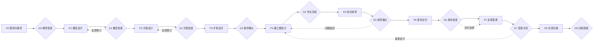
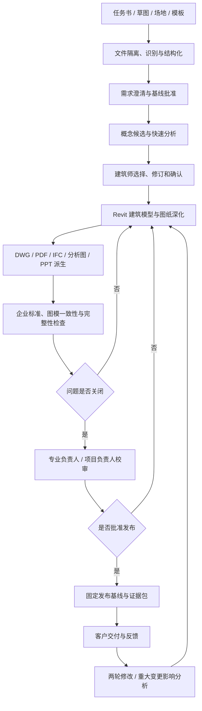
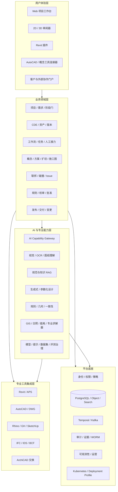

# 施工图全流程 AI 平台综合建设方案

> 文档类型：面向管理、产品、专业、架构与实施团队的人读版综合方案
> 文档状态：条件性方案基线，尚未达到 Implementation Ready
> 提炼日期：2026-07-19
> 权威来源：`deep-research-report.md`（唯一详细设计事实源）

## 文档说明

本方案把完整设计正文及已确认决策转化为可独立阅读、评审和沟通的综合建设方案。它回答产品为什么建设、总体建设什么、首个技术试点验证什么、平台如何工作、采用什么技术、关键风险如何控制，以及正式实施前还必须完成哪些准入任务。

本文件不是第二套详细设计事实源，不复制 D01–D46 的全部实体、状态、接口和测试契约。发生不一致时，以 `deep-research-report.md` 为准；关键决策发生变化时，应先更新权威设计正文，再同步本方案。

## 1. 执行摘要

### 1.1 建设结论

本项目建设方向是**施工图全流程 AI 平台**，不是单一 AI 绘图工具，也不是只解决“草图转效果图”的局部应用。平台覆盖：

`前期策划 → 概念设计 → 方案设计 → 扩初设计 → 施工图设计 → 多专业综合校审 → 发布交付 → 反馈变更 → 关闭归档`。

平台以 CDE（公共数据环境）统一管理模型、图纸、文档和证据；以持久化工作流串联跨天、跨工具、跨专业任务；以 Revit 为建筑生产主链；以 AutoCAD 承担 DWG 交换、二维补充和出图兼容；以 Rhino/Grasshopper、SketchUp 承担概念与几何输入；以 IFC、IDS、BCF 支撑 openBIM 交换、信息要求和问题协同；以统一 AI 能力网关接入识别、生成、检索、规则、分析和外部 AI 服务。

AI 的定位是辅助生成、识别、校核、推荐和编排。AI 不替代注册建筑师、工程师、校审人、项目负责人和监管责任主体，不直接批准专业结论，也不能绕过阶段门发布成果。

### 1.2 当前状态

完整平台总体设计和 D01–D46 条件性详细设计已经形成，产品方向、能力边界、模块、数据、接口、流程、界面、技术栈、安全和测试框架基本完整，但尚未达到 Implementation Ready。

当前已冻结的首期方向为：

- 版本目标：V1 技术试点，不定义为商业 V1。
- 地区范围：通用英文境外交付配置，不绑定具体司法辖区。
- 建筑类型：中小型办公建筑。
- 专业范围：建筑专业纵向闭环；结构、给排水、暖通、电气保留输入、交换、条件和协调契约。
- 生产主链：Revit。
- 质量范围：企业 CAD/BIM 标准和项目约定校核，不宣称法定规范合规。
- 外部 AI：EVAI、小库 AI、建筑学长在正式接口和商用授权通过前均采用人工接力。

### 1.3 首期价值验证

V1 技术试点需要证明四件事：

1. 境外主创草图、任务书和场地资料可以形成受控的需求、CAD/BIM、分析图和汇报成果。
2. Revit 建筑生产链能围绕统一版本、任务、AI 建议、人工复核和发布证据闭环运行。
3. 客户反馈和两轮修改能被准确追踪，重大变化能够触发影响分析和重新校审。
4. 平台技术栈、连接器、数据安全和运行方式具备进入商业版本验证的基础。

## 2. 建设背景与核心问题

建筑设计生产不是单文件、单工具或单模型问题，而是需求、专业知识、模型、图纸、人员责任和交付证据跨阶段流动的问题。当前常见痛点包括：

- 需求分散在任务书、邮件、批注、会议纪要和主创草图中，缺少结构化追踪。
- Rhino、SketchUp、Revit、AutoCAD、ArchiCAD 和分析工具间反复转换，版本和信息损失难以发现。
- AI 工具形成局部能力孤岛，输入、模型版本、参数、输出和人工采用过程不可追溯。
- BIM 模型与二维施工图同时存在，修改后容易出现图模不一致。
- 多专业条件、碰撞、问题和签审依赖人工协调，容易发生版本误用和责任断点。
- 规范、企业标准、节点、族库和历史经验未形成可治理资产。
- 对外交付通常关注“文件是否发出”，但难以还原成果由谁、基于什么版本、经过哪些检查和批准形成。

本平台要解决的根本问题，是建立从需求到发布成果的统一信息链、生产链、质量链和责任证据链。

## 3. 产品定位与边界

### 3.1 产品定位

施工图全流程 AI 平台面向建筑设计企业、境内外设计协作团队、建筑师、专业工程师、BIM/CAD 管理人员和项目管理人员。它由四个核心部分构成：

1. **CDE 与设计资产底座：** 管理图纸、模型、文档、版本、状态、派生关系和发布基线。
2. **项目工作流与阶段门：** 管理需求、任务、专业协作、校审、批准、发布和变更。
3. **AI 与专业计算能力平台：** 提供识别、生成、检索、规则检查、分析、优化和 Agent 编排。
4. **专业工具连接器：** 连接 Revit、AutoCAD、Rhino/Grasshopper、SketchUp、ArchiCAD、GIS 和专业求解器。

### 3.2 平台做什么

- 接收任务书、草图、场地、模型、图纸、规范和企业标准。
- 结构化需求并追踪到成果、检查、变更和验收。
- 支持概念、方案、扩初和施工图阶段的设计生产协同。
- 管理建筑、结构、给排水、暖通、电气和专项专业能力包。
- 辅助生成模型、图纸、标注、说明、分析图和汇报材料。
- 执行图模一致性、碰撞、企业标准、信息要求和规则检查。
- 管理问题、校审、批准、发布、交付、反馈和设计变更。
- 沉淀规范、规则、构件、模板、提示词、数据集和评测资产。
- 保留从输入、工具、AI、人工修改到发布的完整证据。

### 3.3 平台不做什么

- 不把 AI 生成结果直接定义为专业审查通过。
- 不代替注册建筑师、注册工程师或监管审批主体。
- 不承诺不同 CAD/BIM 工具之间完全无损双向同步。
- 不在 V1 技术试点中宣称满足具体国家、州、市或地区的法定报审要求。
- 不把未经授权的外部 AI 网页、Cookie 或个人账号包装为平台 API。
- 不在首期同时建设全部专业、全部地区、全部部署形态和全部候选技术。

## 4. 建设目标与衡量方式

| 建设目标 | 用户可见结果 | 试点衡量方向 |
|---|---|---|
| 缩短设计周期 | 项目负责人可快速建立、分派、审查和交付工作包 | 阶段周期、等待时间、返工时间 |
| 提高重复工作自动化率 | 设计师把识别、转换、标注、排版和检查交给系统辅助 | 自动完成工时、人工接受率、撤销率 |
| 提升图纸和模型质量 | 发布前发现图模、标准、碰撞和完整性问题 | 严重问题逃逸率、一次校审通过率 |
| 强化多专业协同 | 各专业围绕固定版本和 Issue 闭环工作 | 冲突关闭周期、版本误用事件 |
| 沉淀企业知识资产 | 标准、族、节点、模板和案例可以受控复用 | 资产复用率、检索命中率 |
| 建立责任证据链 | 任一发布成果可还原来源、版本、AI、工具、人员和审批 | 发布证据覆盖率、证据验证结果 |

具体数字阈值必须由历史项目和技术试点数据校准，不在设计阶段虚构生产指标。

## 5. 已确认的 V1 技术试点范围

### 5.1 试点范围基线

| 维度 | 已确认决策 |
|---|---|
| 版本性质 | V1 技术试点；验证通过后再定义商业版本 |
| 地区 | 通用英文境外交付配置，不绑定具体司法辖区 |
| 建筑类型 | 中小型办公建筑 |
| 主专业 | 建筑专业完成纵向闭环 |
| 协同专业 | 结构、给排水、暖通、电气仅提供输入、交换、条件和协调契约 |
| 主生产工具 | Revit |
| 辅助工具 | AutoCAD 负责 DWG 交换、二维补充和出图兼容 |
| 概念输入 | Rhino/Grasshopper、SketchUp；ArchiCAD 仅 IFC/BCF 互操作 |
| 质量标准 | 企业 CAD/BIM 标准、项目交付约定、图模一致性和内部校审 |
| 合规声明 | 不用于法定报审、盖章或商业合规承诺 |
| 外部 AI | 未完成资格的工具使用 `ManualHandoff` |

### 5.2 试点输入

- 英文设计任务书、主创说明和项目交付约定。
- 手绘草图、扫描图、参考图片和场地资料。
- SketchUp、Rhino、DXF、DWG、PNG、PDF 等已有资料。
- 企业图层、命名、字体、图签、Revit 模板和族库。
- 必要的结构和 MEP 条件资料，但不要求首期完成其生产闭环。

### 5.3 试点输出

- 结构化需求、澄清项和需求基线。
- 建筑 CAD/BIM 成果，包括 RVT、DWG、IFC 和 PDF。
- 方案图、分析图、效果表达和汇报材料。
- PPTX/PDF；需要时保留 INDD 人工交接路径。
- 企业标准检查、图模一致性检查、问题清单和校审记录。
- 发布包、交付清单、版本说明、变更记录和证据包。
- 两轮客户修改闭环及重大变更影响分析。

### 5.4 试点明确不包含

- 结构、给排水、暖通、电气完整施工图生产。
- 指定司法辖区的完整规范规则包和法定合规结论。
- 大型综合体、超大模型联邦和多地区同时验收。
- 完整工程量、计价和商业成本承诺。
- 高风险 AI 自动写回后直接发布。
- 未取得授权的第三方 API 或 UI 自动化。

## 6. P0–P8 全流程业务方案

| 阶段 | 核心活动 | 主要成果 | 阶段门关注点 |
|---|---|---|---|
| P0 策划与需求 | 解析任务书、场地、交付和标准；建立计划 | 需求、信息要求、场地和标准基线 | 来源完整、适用范围、责任与数据边界 |
| P1 概念设计 | 草图理解、体量、功能、风格和快速分析 | 概念候选、草图、模型、分析和比选 | 约束明确、候选可编辑、建筑师确认 |
| P2 方案设计 | 平立剖、空间、立面和系统预留深化 | 方案模型、图纸和分析报告 | 多专业预留、分析有效、评审基线 |
| P3 扩初设计 | 构造、系统、专业条件和关键节点深化 | 扩初模型、主要节点和协调基线 | 信息成熟度、条件闭环和系统协调 |
| P4 施工图设计 | 模型、图纸、标注、说明、明细和专业计算 | 施工图模型、图纸、说明和明细 | 图纸体系、图模一致、专业校审 |
| P5 综合校审 | 碰撞、规则、图模、版本和交付完整性检查 | Finding、Issue、审查和批准记录 | Critical/High 闭环、例外和责任签署 |
| P6 发布交付 | 固定基线、生成发布包、移交和签收 | Release、Transmittal、Evidence Package | 不可变版本、hash、签名和用途 |
| P7 反馈变更 | 接收意见、分析影响、执行修订和重新校审 | Change、Revision、Issue 和通知 | 影响完整、重新批准、版本不混用 |
| P8 关闭归档 | 验收、保留、归档、删除和经验回流 | 归档包、保留策略和验收证据 | 可恢复、可验证、合法保留或删除 |

阶段门不是形式审批。每个 Gate 都必须明确输入基线、交付物、检查结果、签审角色、批准用途、阻塞项和退回路径。未经批准的 AI 输出只存在于 WIP。

## 7. 端到端试点业务流程

快速小样目标可保留 5–10 分钟级结果反馈；快速修改目标可保留 10–30 分钟级反馈。但这些是试点目标，不等同于完整 Revit 模型、施工图或专业签审在相同时限内完成。

## 8. 总体架构

### 8.1 架构总览

### 8.2 四个核心架构原则

1. **CDE 是资产和版本事实源：** 桌面副本、搜索索引、Kafka 消息和 Viewer 派生物都不能替代受管资产版本。
2. **领域服务拥有业务状态：** 工作流、插件、AI 网关和供应商平台不能建立平行项目、任务、批准或发布事实。
3. **专业工具负责专业生产：** 平台负责组织、连接、追踪和校验，不自称替代 Revit、AutoCAD 或专业求解器。
4. **AI 依赖能力契约：** 领域模块调用统一 Capability，而不是绑定模型厂商字段，便于资格、替换、降级和退出。

## 9. 核心业务模块

| 模块 | 主要职责 | 关键对象/成果 |
|---|---|---|
| 项目与需求 | 项目范围、任务书、需求、澄清、信息要求 | Project、Requirement、InformationRequirement |
| CDE 与版本 | 文件、模型、图纸、状态、派生、基线 | InformationContainer、AssetVersion、Baseline |
| 计划与任务 | 工作包、依赖、任务、人工接力、超时和补偿 | WorkPackage、Task、WorkflowRun、HandoffPackage |
| 概念与方案 | 草图、场地、功能、候选、比选和方案深化 | ConceptBrief、Variant、Space、AnalysisRun |
| 扩初与施工图 | 专业条件、构造、视图、图纸、标注、明细 | DisciplineModel、Drawing、Sheet、Schedule |
| 多专业协调 | 联邦、碰撞、条件、问题、复核和关闭 | ModelFederation、ClashRun、Issue、BCF Topic |
| 规范与质量 | 规范知识、规则、图模一致性和审查 | Standard、RuleSet、CheckRun、Finding、Review |
| 数量与成本辅助 | 数量、材料、价格版本和差异归因 | QuantitySet、RateVersion、CostScenario |
| 发布交付与变更 | 发布基线、交付、签收、反馈和影响分析 | ReleasePackage、Transmittal、Change、Evidence |
| AI 治理 | 能力、模型、提示、数据集、评测和发布资格 | Capability、AIRun、AIRelease、DatasetVersion |
| 平台治理 | 身份、授权、安全、审计、SLO、部署和测试 | Policy、AuditEvent、DeploymentProfile、TestRun |

## 10. CDE、版本与证据链

### 10.1 统一资产模型

平台同时把 RVT、DWG、IFC、PDF、PNG、PPTX、计算书和结构化数据作为一等资产。稳定关系为：

`项目 → 需求 → 信息容器 → 资产 → 资产版本 → 派生/转换 → 检查/问题 → 校审/批准 → 发布包 → 交付 → 变更 → 证据`。

核心状态采用 ISO 19650 思路：

- `WIP`：专业在制，仅限授权团队。
- `Shared`：用于协调和评审，不等于正式发布。
- `Published`：经阶段门批准，可按指定用途使用。
- `Archived`：关闭后的受控归档。

状态和版本分离。文件名中的 `V1.0`、`FINAL` 或日期不能代替系统版本、批准用途和证据。

### 10.2 发布证据

每个发布包至少记录：

- 输入需求和批准基线。
- 成果文件及不可变 hash。
- Revit、AutoCAD、连接器、AI、规则和模板版本。
- 关键参数、转换和派生关系。
- Finding、Issue、例外及其关闭状态。
- 校审人、批准人、签审范围和时间。
- 接收方、交付用途、签收和保留策略。

## 11. AI 能力与责任边界

### 11.1 AI 能力分层

| 能力层 | 典型能力 | 试点应用 | 控制要求 |
|---|---|---|---|
| 感知 | OCR、草图/图纸识别、对象检测 | 任务书、草图、图纸和标注识别 | 置信度、坐标、人工纠错 |
| 知识 | RAG、规范/标准检索、案例推荐 | 企业标准问答、节点和案例检索 | 权限、来源、版本、引用和有效期 |
| 生成 | 文本、图像、几何、参数和图纸辅助 | 概念候选、说明、分析图和标注草案 | 可编辑、差异预览、人工接受 |
| 计算 | 规则、几何、碰撞、优化和仿真 | 企业标准、图模一致性和快速分析 | 确定性优先、参数版本和复现 |
| 编排 | Agent、工具调用和长流程 | 准备输入、执行检查、整理报告 | 工具白名单、预算、超时和审批 |
| 治理 | 模型、提示、数据集、评测和监控 | 发布资格、回归、漂移和成本 | Golden Dataset、门禁、回滚 |

### 11.2 自动化等级

| 等级 | 含义 | 允许行为 |
|---|---|---|
| A0 | 人工执行 | 平台只记录任务和成果 |
| A1 | AI 建议 | 提供建议、检索或解释，不写回专业成果 |
| A2 | 人工触发自动执行 | 用户明确发起，系统生成候选或执行检查 |
| A3 | 自动执行后人工批准 | 系统运行并形成 Draft，合格人员复核后采用 |
| A4 | 受控低风险自动化 | 仅限已资格、低风险、可回滚且持续监控的动作 |

V1 技术试点以 A1–A3 为主。施工图修改、法规、消防、结构安全和发布行为不能因为模型准确率较高而自动升级为无人批准。

### 11.3 AI 责任红线

- AI 输出必须显示来源、置信、限制和适用范围。
- LLM 可以解释规则结果，但不能改写确定性规则的结论。
- AI 生成的专业成果先进入 Draft/Proposal，不直接进入 Published。
- V1 默认禁止使用客户项目、用户反馈和专业纠正训练或微调模型。
- 只有独立、明确、可撤回的 Opt-in 数据才可进入受治理数据集。
- Agent 的工具调用受权限、范围、预算、循环停止、审批和审计控制。

## 12. 专业工具链决策

### 12.1 工具职责

| 工具 | V1 技术试点角色 | 主要能力 | 不承担的职责 |
|---|---|---|---|
| Revit | **唯一建筑生产主链** | 建筑模型、视图、图纸、族、参数、明细和发布源 | 不由其他工具建立平行建筑事实源 |
| AutoCAD | DWG 交换、二维补充、出图兼容 | 图层、块、标注、Xref、打印和降版 | 不作为 V1 主模型生产链 |
| Rhino/Grasshopper | 概念和参数化几何输入 | 体量、曲面、参数、优化和分析接口 | 不直接成为发布施工图事实源 |
| SketchUp | 快速体块和概念输入 | 场景、材质、体块和参考模型 | 不承担完整建筑生产闭环 |
| ArchiCAD | IFC/BCF 互操作 | 开放模型和问题交换 | V1 不建设 ArchiCAD 原生生产主链 |
| GIS/求解器 | 最小必要接口 | 场地、坐标、日照、能耗和专业分析 | 不在平台内重写成熟专业求解器 |

### 12.2 Revit 主链执行方式

Revit 集成采用三条受控路径：

- Revit Add-in：处理交互式模型读取、预览、用户确认和受控写回。
- Windows Worker：处理客户环境或本地许可约束下的批处理。
- Autodesk APS：用于经过许可、版本和数据驻留资格的云自动化与 Viewer 链路。

所有写回必须经过 Preview、事务、失败处理、回滚/撤销、版本校验和权限检查。插件不能长期保存项目业务状态，也不能绕过 CDE 和阶段门直接发布。

### 12.3 openBIM 边界

- IFC：模型和属性交换。
- IDS：机器可读信息要求和验证。
- BCF：跨工具问题、构件引用和视点协同。
- 原生 RVT/DWG：保真生产和交付。

平台必须记录交换损失，不能把格式可导出描述为语义完全一致。

## 13. 外部建筑 AI 工具决策

截至 2026-07-19，对 EVAI、小库 AI（XKool）和建筑学长公开资料的核验结论如下：

| 工具 | 已确认能力 | 公开 API 状态 | V1 决策 |
|---|---|---|---|
| EVAI | 建筑/室内/景观 AI、桌面端、本地/云端 ComfyUI、企业定制 | 未发现公开开发者门户、API 文档或自助 Key 控制台 | `ManualHandoff` |
| 小库 AI | 规划、单体、彩总和云设计 | 未发现公开自助 API；协议限制未经授权自动化访问 | `ManualHandoff` |
| 建筑学长 | 建筑/室内/规划/景观 AI 和企业服务 | 未发现公开开发者门户、API/SDK 或自助 Key 控制台 | `ManualHandoff` |

“未发现”是公开检索时点结论，不代表供应商绝对没有企业私有 API。自动接入必须取得：

- 书面系统到系统调用和嵌入授权。
- 正式 API/SDK、沙箱和生产环境资料。
- 商用、生成物、数据处理和训练政策。
- 认证、幂等、限流、异步作业、回调、错误和版本契约。
- 数据驻留、保留、删除、子处理方和跨境说明。
- SLA、价格、配额、支持、弃用和退出机制。

不得使用用户密码、浏览器 Cookie、个人 Token、抓包 Token、逆向接口或未经授权的 UI 自动化。人工接力仍须由平台登记输入版本、操作者、参数、输出 hash、检查结论和使用限制。

## 14. 关键界面方案

平台采用“全局—项目—对象”三级信息架构，统一入口如下：

| 页面 | 用户任务 | 关键内容 |
|---|---|---|
| P01 我的工作 | 处理待办、审批和人工接力 | 优先级、SLA、依赖、租约、操作和证据 |
| P02 项目与阶段门 | 查看项目、阶段和 Readiness | 阻塞项、完成度、Owner、批准和退回 |
| P03 需求追踪 | 澄清并追踪需求 | 来源、需求、成果、规则、测试和变更 |
| P04 资产与版本 | 管理模型、图纸和文档 | WIP/Shared/Published、版本、派生和基线 |
| P05 2D 图纸审阅 | 审阅 PDF/DWG 派生图纸 | 缩放、批注、坐标、版本差异和 Issue |
| P06 3D/BIM 审阅 | 查看模型和联邦 | 构件、属性、剖切、版本、碰撞和 BCF |
| P07 AI 结果复核 | 查看并接受/拒绝 AI 建议 | 输入、模型、参数、置信、差异和限制 |
| P08 分析与规则 | 查看分析、规则和图模检查 | 假设、版本、结果、证据和有效期 |
| P09 Issue 中心 | 处理碰撞、问题和复开 | 责任、严重度、SLA、视点、修复和验证 |
| P10 校审与批准 | 完成专业和项目校审 | 对象版本、意见、条件、职责分离和签审 |
| P11 发布与交付 | 生成发布包和交付清单 | 成果、证据、用途、接收方和签收 |
| P12 变更影响 | 分析并执行反馈和变更 | 基线差异、受影响需求/成果/测试和重批 |

界面必须区分 AI 建议、专业计算、规则结果、人工校审和正式发布状态。所有关键页面覆盖加载、空、部分失败、无权限、冲突、离线和过期状态，并按 WCAG 2.2 AA 进行自动与人工验收。

## 15. 技术栈方案

### 15.1 权威技术栈基线

| 层级 | 默认技术栈 | 主要职责 | 关键约束 |
|---|---|---|---|
| Web 工作台 | Next.js、React、TypeScript、Ant Design、TanStack Query | 项目、任务、复杂表单和治理界面 | 不使用 `any`；大文件不穿过 BFF |
| BFF/API Gateway | NestJS BFF、Envoy Gateway、Gateway API | 前端聚合、TLS、WAF、限流和路由 | 业务授权仍由 PDP/PEP 和领域服务负责 |
| 2D Viewer | PDF.js、OpenSeadragon、Konva | PDF、超大图像、批注和坐标锚点 | 固定资产版本和坐标变换 |
| 3D/BIM Viewer | Autodesk Viewer、xeokit | Autodesk 派生和 IFC 审阅 | 授权、转换成本和构件 ID 稳定性 |
| 核心领域服务 | Java 21、Spring Boot 4.1 | 事务、聚合、领域规则和 API | 单一领域不混栈；金额/数量用 Decimal |
| AI/几何服务 | Python 3.12、FastAPI、Pydantic、gRPC | AI、OCR、几何和数据科学能力 | 不直接共享领域数据库 |
| 持久化工作流 | Temporal | 长任务、等待、重试、补偿和恢复 | 外部调用放 Activity，保持确定性 |
| 事件与 Schema | Kafka、CloudEvents、AsyncAPI、Apicurio | 跨域事件、回放和契约治理 | 幂等、顺序、死信和兼容策略 |
| 数据库 | PostgreSQL、PostGIS、Flyway | 业务和空间数据事实 | 服务拥有数据，禁止跨服务写表 |
| 缓存 | Valkey | 缓存、限流、会话辅助和短期锁 | 不作为业务事实源 |
| 对象存储 | S3 API/MinIO | 大文件、版本、分片、WORM 和生命周期 | 加密、驻留、隔离扫描和 hash |
| 搜索与向量 | OpenSearch、pgvector 起步 | 元数据、OCR 和知识检索 | 索引可重建；ACL 进入检索过滤 |
| IFC/openBIM | IfcOpenShell、IfcConvert、IfcTester、IDS、BCF API | IFC 处理、校验和问题交换 | 维护格式/版本/损失矩阵 |
| Revit | C#/.NET、Revit API、WebView2、APS | 模型、图纸、族、参数和自动化 | 严格遵守宿主版本、线程和事务模型 |
| AutoCAD | C#/.NET、AutoCAD API、AutoLISP、APS | DWG、图层、块、标注和出图 | 版本、字体、Xref、许可和降版 |
| Rhino/GH | RhinoCommon C#、Python 3、Rhino.Compute | 参数化几何和分析连接 | 插件版本、单位和坐标一致性 |
| SketchUp | Ruby API Extension、本地代理 | 快速体块、场景和材质 | 扩展签名和模型精度 |
| ArchiCAD | C++ Add-On、Python API、IFC/BCF | openBIM 互操作 | V1 不建设原生生产主链 |
| AI Runtime | KServe、Triton/vLLM 适配 | 模型部署、扩缩和推理 | 按模型资格选择，不形成第二业务审批源 |
| AI 治理 | MLflow + 平台 AI Release | 实验、评测、发布和回滚 | MLflow Alias 不等于业务资格 |
| 身份与策略 | 企业 IdP/Keycloak、OIDC/SAML/SCIM、OPA、SPIFFE/SPIRE | 用户、服务和工作负载身份及授权 | RBAC+ABAC+关系；短期凭据 |
| Secret/证书 | Vault、KMS/HSM、cert-manager | Key、证书、轮换和运行时注入 | 不在前端、日志和文档保存 Secret |
| 容器与平台 | Kubernetes、Cilium、Helm/Kustomize、OpenTofu、Argo CD | 部署、网络、IaC 和 GitOps | 一个 Profile 不并行建设多 CNI/mesh |
| 可观测性 | OpenTelemetry、Prometheus/Mimir、Tempo、Loki、Grafana | Trace、Metric、Log、SLO 和告警 | 统一关联 ID，控制隐私和高基数字段 |
| 测试与安全 | pytest、Vitest、Pact、Playwright、k6、Semgrep、Trivy、ZAP、Chaos Mesh | 单元、契约、UI、性能、安全和恢复 | 外部付费 API 默认 Stub/Mock |

### 15.2 版本策略

技术名称不是“永远使用最新版”的授权。平台维护 Support Matrix，逐项记录：

- 产品、年版、补丁、OS、运行时和插件组合。
- EOL 日期、厂商支持状态和许可证。
- 安装、升级、回滚和恢复方式。
- Golden Dataset、往返、性能、安全和故障测试证据。
- 适用客户、部署画像、数据等级和已知交换损失。

未进入 Support Matrix 或证据过期的组合不能进入生产。Revit、AutoCAD 等宿主插件必须跟随厂商运行时，不能为了统一 .NET 版本破坏兼容性。

## 16. 数据与接口设计原则

### 16.1 数据事实源

| 数据类别 | 事实源 | 非事实源 |
|---|---|---|
| 项目、需求、任务、批准 | PostgreSQL 领域聚合 | Kafka、缓存、通知、插件副本 |
| 文件和模型内容 | 对象存储不可变版本 | 本地临时文件、Viewer 派生物 |
| 资产元数据和版本 | CDE Metadata | 文件名、搜索索引、共享盘目录 |
| 外部工具对象 | 平台 ID + 带系统/版本的映射 | 直接覆盖平台 ID |
| 审计和证据 | 审计管道、WORM、签名/hash | 普通应用日志 |

### 16.2 接口基线

- HTTP API：OpenAPI 3.2.0；工具兼容画像可暂用 3.1.2。
- 内部高性能调用：gRPC/Protobuf。
- 事件：AsyncAPI 3.1、CloudEvents；事件使用过去式事实名称。
- Webhook：签名、时间戳、重放窗口和来源校验。
- 大文件：Upload Session、分块直传、Manifest、hash、隔离扫描和 Commit。
- 长任务：返回 Operation/LRO，由工作流和事件跟踪，不保持长 HTTP 连接。

写命令要求权限、幂等键和期望版本；事件不包含大文件、Secret、完整 Prompt 或不必要个人数据。Gateway 负责流量控制，策略引擎负责授权，领域服务负责业务不变量。

## 17. 安全、隐私与专业责任

### 17.1 安全控制

| 风险 | 主要控制 |
|---|---|
| 跨租户或越权 | Home Region/Cell、RBAC+ABAC+关系授权、RLS/ACL、短期身份、IDOR 测试 |
| 恶意文件和插件 | 隔离上传、AV/CDR、沙箱、签名、SBOM、allow-list 和回滚金样 |
| Prompt/Agent 攻击 | 最小 Context、DLP、工具白名单、PEP、预算、循环停止和间接注入测试 |
| 客户数据泄露 | 加密、驻留、Provider allow-list、训练禁用、保留和可验证删除 |
| 审计篡改 | 服务端采集、hash chain/Merkle、签名、时间戳和 WORM |
| 灾难和数据丢失 | 多故障域、PITR、对象版本、备份恢复、KMS 恢复和 DR 演练 |

### 17.2 专业责任

- 设计师负责专业设计正确性。
- 专业负责人负责本专业校核和签审。
- 项目总负责人负责跨专业协调和阶段放行。
- 法规专家负责规范适用性和解释。
- 平台和 AI 管理员只负责能力、配置和运行，不拥有专业批准权。
- AI 不承担监管、盖章、合同或生产发布责任。

职责分离要求准备人不能无条件批准自己的发布；平台管理员不能代替专业人员批准成果；Break-glass 必须有时间限制、理由、审计和事后复核。

## 18. 部署方案与待冻结决策

详细设计支持 SaaS、客户私有化、混合部署、本地化和受控离线画像，但 V1 技术试点只能选择一个主画像，避免同时建设多套部署分支。

### 18.1 候选部署方案

| 方案 | 架构 | 优点 | 主要限制 |
|---|---|---|---|
| SaaS 云端 | 控制面、数据、AI 和 Worker 主要在云端 | 运维简单、能力集中、迭代快 | Revit/许可、敏感图纸和跨境约束较强 |
| 混合站点 | 云端控制面/CDE/AI，客户侧 Windows/Revit Worker 出站连接 | 兼顾平台能力、专业工具和数据控制 | 现场网络、身份、版本、Worker 和故障恢复更复杂 |
| 客户私有化 | 平台与数据部署在客户云或本地 | 数据控制强、适合高敏感项目 | 交付、升级、GPU、PaaS 和运维成本高 |

基于 Revit 主链和技术试点目标，当前推荐优先讨论**混合站点画像**：云端承载项目、CDE、工作流、AI 网关和治理，客户侧运行受控 Windows/Revit Worker，并采用出站连接、短期凭据和任务租约。最终选择仍需在 IR-03 确认数据是否允许进入云端、Region、网络、许可证、RPO/RTO 和责任边界后冻结。

### 18.2 部署必须实例化的内容

- 部署模式、环境、Region、Cell 和客户 Site。
- 数据驻留、跨区复制和 Provider 可用范围。
- Windows/Revit Worker、GPU、HPC 和许可证位置。
- Ingress、Egress、固定出口 IP、DNS、代理和防火墙责任。
- 数据库、对象、Kafka、KMS 和审计的 HA、RPO、RTO。
- Kubernetes、CNI、CSI、GPU、OS 和专业工具精确版本。
- 备份、恢复、升级、回滚、监控、On-call 和供应链签名。

## 19. 测试、质量与验收

### 19.1 验收证据链

每项关键要求必须形成：

`Requirement/Risk/Control → VerificationItem → TestCaseVersion → TestData + TestEnvironment → TestRun → Evidence → Finding/Exception → AcceptanceDecision`。

设计章节和 EARS 条款只是测试输入，不等于测试已经通过。

### 19.2 测试体系

| 测试域 | 重点 |
|---|---|
| 领域和数据 | 状态、权限、不变量、幂等、并发、迁移和删除 |
| API 和事件 | Schema、兼容、Consumer/Provider、乱序、重复、重放和错误 |
| CAD/BIM | 版本组合、事务、崩溃、离线、双向往返和交换损失 |
| 专业正确性 | 建筑 Golden Dataset、专家 Oracle、图模一致和校审复开 |
| AI TEVV | 准确性、稳定性、切片、公平性、幻觉、拒答、红队和漂移 |
| UI/可访问性 | 关键旅程、状态、键盘、读屏和 WCAG 2.2 AA |
| 安全与隐私 | ASVS、LLMSVS、IDOR、SSRF、Prompt Injection、Secret 和删除传播 |
| 性能与容量 | API、上传、Viewer、队列、Worker、AI、文件尺寸和成本 |
| 可靠性与 DR | 节点、Zone、Region、数据库、对象、KMS、Worker 和站点断线 |
| UAT/Pilot | 真实角色、真实样本、首场景闭环和责任人签署 |

Critical Requirement 在生产准入时必须 100% 建立追踪、执行并通过，不能以风险例外放行。High 必须 100% 有 Owner 和执行证据；短期例外需要多方风险签署。

## 20. 关键决策清单

| ID | 关键决策 | 状态 | 影响 |
|---|---|---|---|
| KD-01 | 产品方向保持施工图全流程 AI 平台 | 已冻结 | 不因首场景收缩总体能力 |
| KD-02 | 总体能力完整设计、实施分阶段推进 | 已冻结 | 平衡长期架构与 KISS/YAGNI |
| KD-03 | CDE + 工作流 + AI 能力平台 + 专业连接器 | 已冻结 | 形成统一资产、任务、智能和工具架构 |
| KD-04 | IFC、IDS、BCF 分别承担模型、信息要求和问题交换 | 已冻结 | 避免混用 openBIM 标准 |
| KD-05 | 所有 AI 结果按风险等级进入人工复核 | 已冻结 | 保留专业和发布责任 |
| KD-06 | V1 定义为技术试点，商业版本后续确定 | 已冻结 | 当前不承诺商业 SLA 和法规范围 |
| KD-07 | 首期地区采用通用英文境外交付配置 | 已冻结 | 不绑定具体司法辖区 |
| KD-08 | 首期建筑类型为中小型办公 | 已冻结 | 决定 Golden Dataset、模板和样本 |
| KD-09 | 建筑纵向闭环，结构/MEP 先做交换与协调 | 已冻结 | 控制专业实施范围 |
| KD-10 | Revit 是唯一建筑生产主链 | 已冻结 | 连接器、模板、Worker 和金样围绕 Revit |
| KD-11 | AutoCAD 负责 DWG 交换、二维补充和出图兼容 | 已冻结 | 不建立第二生产主链 |
| KD-12 | Rhino/GH、SketchUp 为概念输入，ArchiCAD 为 IFC/BCF 互操作 | 已冻结 | 控制多工具集成复杂度 |
| KD-13 | 外部 AI 统一经 Capability Gateway | 已冻结 | 供应商字段不进入领域服务 |
| KD-14 | EVAI、小库 AI、建筑学长默认人工接力 | 已冻结 | 正式 API 需资格和书面授权 |
| KD-15 | 当前仅校核企业 CAD/BIM 标准，不作法定合规承诺 | 已冻结 | 试点不能用于报审、盖章或监管声明 |
| KD-16 | 当前设计为条件性基线，不称 Implementation Ready | 已冻结 | 必须完成八个准入任务包 |

## 21. Implementation Ready 八个准入任务包

| 任务包 | 目标 | 当前状态 | 完成标准 |
|---|---|---|---|
| IR-01 首个业务切片冻结 | 明确版本、地区、类型、专业、输入输出和不实施范围 | **已讨论确认，待同步权威正文** | Scope、Owner、Acceptance 和不实施范围正式记录 |
| IR-02 工具与外部服务边界 | 冻结主工具、辅助工具和供应商接入方式 | **已讨论确认** | 工具职责、人工接力和 Provider Qualification 规则完整 |
| IR-03 首个部署画像 | 冻结 SaaS/混合/私有、Region/Cell/Site/Network/DR | 待讨论 | DeploymentProfile 可用于环境和网络设计 |
| IR-04 精确 Support Matrix | 冻结 OS、Revit/AutoCAD、插件、K8s、CNI、GPU 和许可证版本 | 待执行 | 每个组合有 Owner、EOL、回滚和 Golden 证据计划 |
| IR-05 Critical/High 追踪实例 | 把关键要求和风险物化为 VerificationItem | 待执行 | Critical 100% 追踪，High 无 Owner 孤项 |
| IR-06 实施契约 | 物化 API、事件、文件、数据和迁移契约 | 待执行 | Contract Catalog 有稳定 ID、Schema、兼容和 Consumer Test |
| IR-07 NFR 与运维基线 | 实例化 SLO、容量、备份、监控、Runbook 和 On-call | 待执行 | 完成桌面演练和关键恢复验证计划 |
| IR-08 Go/No-Go | 产品、架构、安全、专业、测试、运维共同签署 | 待执行 | 残余风险、不实施范围和责任得到正式确认 |

只有八个任务包中影响首切片开工的条件全部满足，才能把设计状态更新为 Implementation Ready。Implementation Ready 仍不等于 Production Ready。

## 22. 主要风险与控制

| 风险 | 影响 | 控制策略 |
|---|---|---|
| 专业自动成图能力被高估 | 质量不达标、返工和责任风险 | 按图纸类型定义自动化等级；Golden Dataset；人工校审 |
| 地区和规范未具体化 | 不能形成法规结论 | V1 只做企业标准；商业版本再冻结司法辖区 |
| Revit/AutoCAD 版本和许可不确定 | 连接器不可运行或采购受阻 | IR-04 Support Matrix、许可证核验和金样回归 |
| 多工具交换损失 | 构件、属性、坐标和图纸失真 | Exchange Contract、差异报告和往返测试 |
| 外部 AI 无正式 API | 自动流程中断或违反条款 | ManualHandoff、供应商资格和禁用未授权自动化 |
| 客户图纸进入外部模型 | 保密、跨境和训练风险 | 数据分类、Provider allow-list、最小 Context、训练禁用 |
| AI 输出误导专业人员 | 错误采用和自动化偏见 | 置信/限制、可编辑 Draft、双评、拒答和高风险审批 |
| 部署画像同时展开 | 架构复杂、成本失控 | 首期只冻结一个主 Profile，其他保留适配契约 |
| 容量和成本缺少真实数据 | 无法采购或承诺 SLA | 使用试点测量校准 D42 假设和单位成本 |
| 设计完整但实施契约未物化 | 团队无法直接开工 | 完成 IR-05–IR-07，不把章节当执行证据 |

## 23. KISS、YAGNI、SOLID、DRY 落地

| 原则 | 本方案的落实方式 |
|---|---|
| KISS | 一条 Revit 主生产链、一个 CDE、一个工作流事实源、一个 AI Gateway；首个部署画像只选一种 |
| YAGNI | 首期不建设完整多专业、法定规则、全部地区、多向量库和多套部署分支 |
| SOLID | Domain、Adapter、Policy、Worker、Provider 分离；专业工具和外部 AI 通过契约接入 |
| DRY | 统一 ID、版本、Manifest、错误、事件、权限、审计、Telemetry、测试和 Support Matrix |

总体蓝图完整不等于首期全部开发。反过来，首期暂不实施也不等于从产品方向中删除相应能力。

## 24. 组织与责任建议

| 角色 | 主要责任 |
|---|---|
| 产品 Owner | 产品方向、试点范围、价值指标和不实施边界 |
| 总体架构 Owner | 领域边界、技术栈、契约、部署和架构一致性 |
| 建筑专业 Owner | 中小型办公样本、Revit 标准、专业 Oracle 和验收 |
| BIM/CAD Owner | 模板、族、图层、图签、交换和 Support Matrix |
| AI/数据 Owner | Capability、数据集、评测、模型资格和 Provider |
| 安全与隐私 Owner | 身份、数据分类、跨境、供应商和事件响应 |
| 测试 Owner | VerificationItem、Golden、TestRun、Evidence 和 Gate |
| 平台运维 Owner | DeploymentProfile、SLO、容量、备份、监控和 On-call |
| 项目负责人 | 阶段门、跨专业协调、发布和残余风险接受 |

开发团队规模、工期和预算应在 IR-01–IR-07 形成可实施输入后另行制定，不沿用初稿中的粗略估算直接立项。

## 25. 下一步推进顺序

1. 将已确认的 IR-01 和 IR-02 决策同步回权威设计正文和 BEACON。
2. 讨论并冻结 IR-03 首个 DeploymentProfile，重点确认客户图纸是否允许进入云端。
3. 根据部署画像冻结 IR-04 精确 Revit/AutoCAD/Windows/Kubernetes/数据/GPU Support Matrix 和许可证。
4. 为 V1 技术试点建立 Critical/High VerificationItem 和 Golden Dataset 清单。
5. 物化首切片 Contract Catalog：API、事件、文件、数据、权限、幂等和错误契约。
6. 实例化 SLO、容量、备份恢复、监控、Runbook、On-call 和安全响应责任。
7. 组织产品、建筑专业、架构、安全、测试和运维联合 Go/No-Go。
8. 通过 Pre-Implementation Start Gate 后，再形成开发实施规划、里程碑、人力和成本预算。

## 26. 方案验收标准

- While 本方案用于管理层和跨团队评审, when 读者查询产品方向, the 文档 shall 明确施工图全流程是产品边界，首场景只是技术验证切片。
- When 读者查询 V1 范围, the 文档 shall 明确通用英文境外、中小型办公、建筑闭环、Revit 主链和不作法定合规承诺。
- When 读者查询 AI 责任, the 文档 shall 明确 AI 只生成 Draft/Proposal，高风险专业结论和发布必须由合格人员批准。
- When 读者查询技术实现, the 文档 shall 给出 Web、领域、数据、工作流、AI、连接器、部署、观测和测试的默认技术栈及替代条件。
- When 读者查询外部 AI, the 文档 shall 明确 EVAI、小库 AI、建筑学长当前采用人工接力，未获书面授权不得自动调用。
- When 读者查询是否可以开发, the 文档 shall 明确当前不是 Implementation Ready，并列出八个准入任务包和状态。
- When 本方案与详细设计存在冲突, the 团队 shall 以 `deep-research-report.md` 为准，并先修订权威正文再同步本方案。

## 附录：术语速查

| 术语 | 含义 |
|---|---|
| CDE | Common Data Environment，统一管理设计信息、版本、状态和批准用途的公共数据环境 |
| WIP/Shared/Published/Archived | 在制、共享、发布、归档四类信息状态 |
| IFC | openBIM 模型和属性交换标准 |
| IDS | Information Delivery Specification，机器可读信息要求 |
| BCF | BIM Collaboration Format，跨工具问题和视点交换 |
| Capability Gateway | 屏蔽 AI/供应商差异并执行路由、权限、数据和成本策略的统一能力入口 |
| ManualHandoff | 无正式 API 时，由平台生成受控人工操作包并回收证据的接力方式 |
| DeploymentProfile | 对部署模式、Region、Cell、网络、数据驻留、RPO/RTO 和组件组合的冻结配置 |
| Support Matrix | 对工具、OS、运行时、插件、基础设施和许可证组合的正式支持与证据矩阵 |
| Golden Dataset | 具有来源、许可、标注、Oracle 和适用范围的专业测试基准集 |
| Implementation Ready | 首切片范围、部署、版本、契约、验证和运维责任已经物化，可进入实施 |
| Production Ready | 在 Implementation Ready 基础上，完成构建、测试、试点、运营和生产准入 |
